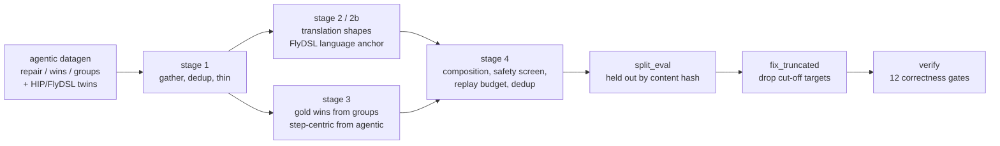

# How KORE Builds the v5 Training Set

`data/v5_sft.jsonl` and `data/v5_eval.jsonl` (specified in `docs/DATASET_SPEC.md`)
are assembled, not generated fresh. Every row traces back to a kernel that was
already compiled, executed on an MI355X, and checked against an independent fp32
oracle by an earlier agentic datagen pass. This document explains the five-stage
build that turns that already-verified material into the shipped mixture, and
the two post-build passes that hold out an evaluation split and remove a class
of defective row the build itself could not see.

## 1. Where a row starts: agentic datagen

Nothing in v5 is written by asking a model for a kernel and trusting it. Every
task carries an oracle and a harness (`kore/env/kore_env.py`), and a teacher's
proposal is compiled, run, and timed before it can become a record. Three
generators produce the raw material stage 1 reads:

- **`kore/data/gen_repair.py`**, using **`kore/data/mutate.py`**'s 17 injected
  bug families (precision, masking, tiling, parallelism, layout, low-precision
  encoding) plus naturally-failed teacher samples, produces a `RepairRecord`
  only when the teacher's fix passes the same validation the break failed.
- **`kore/data/gen_wins.py`** runs a short greedy evolve loop and reconstructs a
  clean, convergent `WinRecord` from the raw search log: it keeps only the
  strictly-improving path to the kept kernel, drops any turn whose stated change
  is not actually present in its diff, and regenerates every feedback string
  from the kept measurements so the footer multiplies out exactly. A win is
  admitted only when it beats the task's declared production baseline, not
  merely the seed.
- **`kore/data/gen_groups.py`** samples several candidate rewrites of one
  parent, verifies each, and ranks them into a `RankedGroupRecord` with the
  implied preference pairs (`faster-correct > slower-correct > incorrect >
  non-compiling`). These feed DPO in the legacy v3/v4 recipe; stage 3 (below)
  is what makes them useful to v5.

A separate materializer (`kore/data/twins.py`) asks a teacher to re-express a
task's Triton kernel in HIP or FlyDSL against the *same* oracle and harness,
and keeps the result only if it verifies. A verified twin is what stage 2
re-poses into the `torch2kernel`, `port`, and `instruction` shapes.

## 2. Stage 1: gather, dedup, thin (`scripts/v5_stage1_gather.py`)

Stage 1 reads every `repair` / `wins` / `groups` shard across 13 data roots:
236,425 raw records. Two properties of that raw corpus decide what happens
next.

**Cross-root duplication.** A root's resume ledger is scoped to itself, so a
task finished under one data root looks untouched to a job pointed at another,
and gets independently regenerated. `dedup_by_source_hash` collapses every
record to its representative kernel source and keeps one copy; this removes
81,550 duplicate rows.

**Repair redundancy.** The repair shards carry far more answers than distinct
problems: 9.24 answers per distinct `(task, broken-kernel)` problem, with over
half the rows sitting on the 12.7% of problems answered 25 or more times,
because the generator's quota counts accepted fixes, not distinct problems, and
keeps re-answering a bug already in the shard once a task's mutators are
exhausted. Two or three distinct fixes to one bug is real signal; dozens is a
memorization risk at this scale, so `thin_repairs` caps how many distinct fixes
per problem survive (four for most dialects, six for FlyDSL, where coverage
still outranks redundancy), preferring distinct fixes over repeats and the
higher-accuracy fix within a tie. This removes 53,923 further rows, taking
repair from 9.24 to 1.95 answers per problem.

Stage 1 also drops any win whose speedup exceeds a 10x credibility ceiling (a
kernel reported three orders of magnitude faster than its reference is a
statement about a broken or non-kernel baseline, not a kernel achievement),
and caches the *superset* of what the strict and audited admission policies
would keep, since stage 4's screen is authoritative and is the only stage that
sees the benchmark contamination index.

## 3. Stage 2 and 2b: shapes that already exist, re-posed

**`scripts/v5_stage2_translate.py`** reads verified HIP and FlyDSL twin
directories directly. A twin holds `reference.py` (the PyTorch that defines the
operation, and what the oracle executes) beside a kernel that already passed
the correctness gate on real gfx950; that pair *is* the `torch2kernel` shape,
not an approximation of it, and the twin's Triton original gives the `port`
shape. Nothing is generated and nothing is re-run: the build cost is zero,
because the verified work already exists and only the question is rewritten.

Every twin contributes `torch2kernel`, since that is the shape v5 needs most; a
second shape (`port` or `instruction`, chosen deterministically by a hash of
the kernel so the choice is stable across rebuilds) alternates so both stay
populated without stacking three near-identical answers on one kernel. The
completion is byte-identical across shapes for the same kernel, so a third copy
would not add a third lesson, only a third copy of the same target tokens.

**`scripts/v5_stage2b_flydsl.py`** builds the FlyDSL language anchor described
in `docs/SOURCE_PROVENANCE.md`: it mines the DSL's own test suite, examples, and
docs, plus the wider FlyDSL ecosystem, while excluding AMD's own production
kernel library (the corpus the benchmark's FlyDSL tasks are drawn from) and
screening every remaining kernel by filename and by normalized body against the
benchmark's own FlyDSL sources.

## 4. Stage 3: recovering signal the SFT path never read

Two large, already-verified artifacts reached zero training rows before this
stage existed.

**Ranked groups.** `build_sft` (the legacy v3/v4 path) consumes repair and win
records and silently drops every `RankedGroupRecord`, so tens of thousands of
measured candidate kernels taught ranking, through DPO, and never generation.
Each group's rank-0 candidate is its robustly-best correct kernel; framing a
slower correct sibling as the parent turns the group into an ordinary
optimization demonstration. `kore/data/gold_wins.py` mints one only when the
gain over that sibling clears 1.05x by roughly two standard deviations of the
paired-ratio measurement noise, not merely ties it, capped at 40 gold wins per
task so no single task dominates.

**Agentic trajectories.** 108,822 multi-turn episodes hold the only records
carrying per-turn correctness and speedup, and stage 1 never opens them because
it reads only `repair`, `wins`, and `groups`. Half of what the evaluation
benchmark asks is "here is a working kernel, make it faster under execution
feedback," which is exactly an agentic episode. `kore/data/step_centric.py`
decomposes each into up to N-1 examples, keeping only the correctness-preserving,
high-gain revisions; an episode that produced no such revision (a first-turn win
has no parent to improve on) is instead emitted whole, truncated at its winning
turn. A trajectory contributes one or the other, never both, because a step
row's messages are a strict prefix of the full one and exact-content dedup does
not catch a prefix.

Both recovered shapes, and every step-centric row, pass through the same
history-flattening rule: the trainer puts full loss on every assistant turn
with no per-turn opt-out, so an earlier assistant turn in a multi-turn record is
by construction a rejected revision. `flatten_history` folds prior turns into
the user turn as quoted context, so the model still sees the search history but
is asked to produce only the revision worth imitating.

## 5. Stage 4: assembling the mixture (`scripts/v5_stage4_mixture.py`)

This is where composition becomes a target to solve for rather than whatever
volume happened to survive stages 1-3.

**Final safety screen.** Every row, regardless of which stage produced it, is
re-checked against `kore.data.v5_policy.admits` and the AgentKernelArena
contamination index (`docs/SOURCE_PROVENANCE.md`). Upstream stages filter too,
but they were written at different times against different rules, and stage
1's cache predates the benchmark screen entirely; re-asking here means one place
decides what is trainable and nothing that slipped an earlier stage can reach
the mixture.

**Sanitize.** Every row is reduced to exactly one assistant turn, `_provenance`
is coerced to an object, and a target is dropped if it delegates to a torch
operator for the computation the kernel exists to do (`kore.data.v5_emit.cheats`,
`docs/SOURCE_PROVENANCE.md`) or is degenerate: too short, or a bare
`revert`/`no-op` tool call. The first build before this rule shipped a single
`revert` target 543 times.

**Composition solve.** `kore/data/v5_plan.py` targets a fixed skill mixture
(optimize 25%, torch2kernel 22%, repair 18%, port 13%, instruction 13%, language
9%) rather than the benchmark's own task proportions, because matching a
benchmark's distribution is how a model overfits to it: MultiPL-T's OCaml model
gained 13 points on the benchmark whose format it trained on and lost 7.7 points
on a differently-formatted benchmark testing the same language. The solver
keeps every distinct row (downsampling only throws away verified examples for
no benefit) and upsamples a short shape toward its target, capped at 2x its
distinct-row count; an earlier pass capped at 4x and pushed overall repetition
in the mixture to 45%, so the cap was tightened rather than the target.

**FlyDSL rebalancing.** Two corrections apply after the shape plan, because
FlyDSL's problem is shape *and* format, not only volume. Repair-shaped
(`ANALYSIS:`-preamble) FlyDSL rows are held to at most half of FlyDSL's tokens;
they measured 81.8% before this fix, which meant the dominant FlyDSL training
signal was a repair preamble on a benchmark whose FlyDSL tasks ask for a direct
port. Separately, a dialect floor tops FlyDSL up toward 5% of the kernel body
by repeating its distinct rows, capped at 4x their distinct count so the anchor
cannot compound into memorization.

**Length gate.** Rows are measured with the real tokenizer
(`Qwen/Qwen3-Coder-30B-A3B-Instruct`, revision
`b2cff646eb4bb1d68355c01b18ae02e7cf42d120`) against a 16,896-token cap, not a
character estimate. This runs once on the kernel side (so replay is budgeted
against the kernel side's true size) and again on the final mixture.

**Replay, budgeted by tokens.** Kernel rows average roughly 3,500 tokens against
roughly 730 for a replay row, so matching a row-share target undershoots the
token share by about five times: an earlier build hit 42% of rows but only
13.5% of tokens, well under the range where replay reliably protects retained
capability. Replay is therefore selected by tokens against a 14%-of-tokens
target (`docs/DATASET_SPEC.md` reports the realized figure, which is lower).

**Target-repeat cap.** No single kernel body, identified by its extracted code
rather than its whole message (a kernel can recur under different prompts and
still look distinct if the whole message is hashed), may appear more than 12
times across kernel and replay combined. The build this caught: one target
shipped 543 times, and the replay side separately shipped the single word
"arnold" 304 times.

The result is written to `data/v5_sft.jsonl` alongside a receipt
(`data/v5_sft.receipt.json`) recording every count above.

## 6. Holding out an evaluation slice (`scripts/v5_split_eval.py`)

The run's stated top risk is instruction-following collapse, and until this
script existed there was no signal on it until the run finished, tens of hours
later. `v5_split_eval.py` reservoir-samples a stratified slice (the eight
groups in `docs/DATASET_SPEC.md`) in one streaming pass and **removes** the
sampled rows from the training file; it does not merely copy them out, because
a row left in both files measures memorization, not generalization.

Rows are held out by content hash, not by line number. The mixture's own
upsampling means a line-number split leaves a row's twin behind in training: a
first attempt did exactly that, and 296 of 900 held-out rows still had a
surviving copy in `data/v5_sft.jsonl`. Hashing the full message list and
removing every matching hash from the training file closes that gap; the
verified result is zero message-hash overlap between the two files.

## 7. Fixing a defect the build could not see (`scripts/v5_fix_truncated.py`)

The length gate in stage 4 asks whether a row is *under* the token cap, and a
truncated row passes that check by construction, since truncation is how it
got under the cap in the first place. `docs/DATASET_SPEC.md` describes the
defect this uncovered (chain-of-thought math rows cut off mid-token) and the
heuristic that catches it. The script runs against both files: it drops
truncated rows from training, drops truncated rows from eval, and backfills
eval's math group from clean training rows so no group shrinks, removing those
backfilled rows from training in turn to keep the two files disjoint.

## 8. Verification (`scripts/v5_verify.py`, `scripts/v5_verify_all.sh`)

`v5_verify.py` runs the correctness gates in `docs/DATASET_SPEC.md` against a
file and reports composition, duplication, and token statistics alongside them.
`v5_verify_all.sh` is the full pre-launch check: it reassembles the shipped
gzip parts and confirms they reproduce the working files byte-for-byte, confirms
the two files share no message hash, and runs the gate battery against both.
Every gate exists because an earlier draft of this exact pipeline failed it;
none of them are hypothetical.

## What this build does not need to do again

The dataset is complete for this cycle. The next step is reinforcement
learning, and it needs no new data collection: every task in the registry
already ships an oracle, a correctness gate, and a baseline to beat, which is
the reward signal RL requires. What was verified here is a task library, not
only a training set, and the same infrastructure that gated every row above
can score a policy's live attempts the same way.
