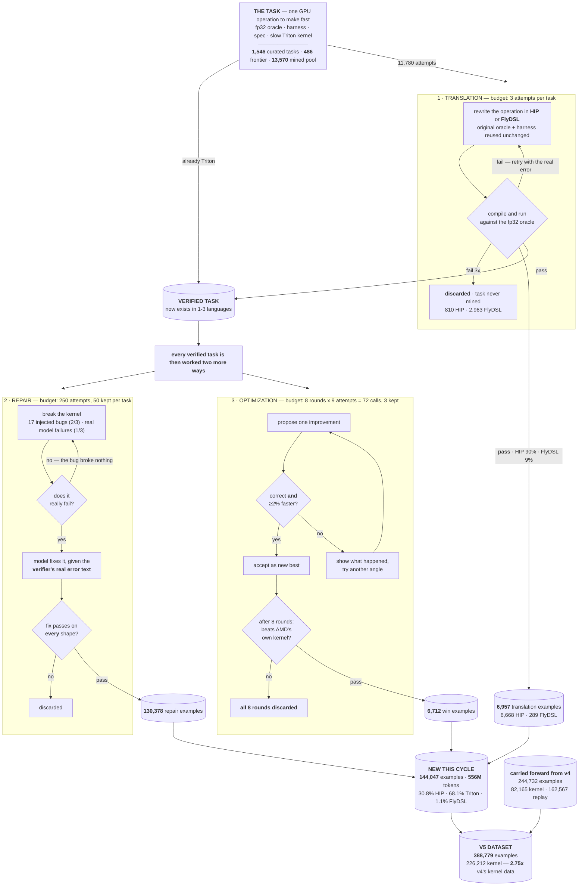
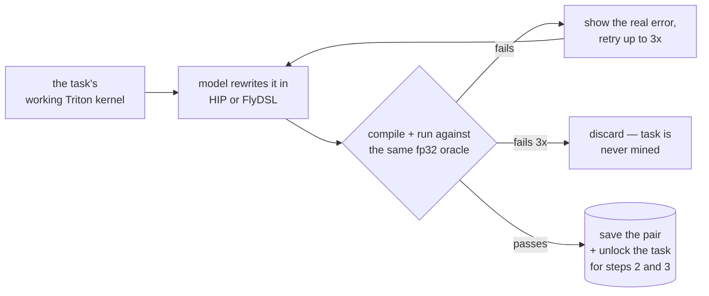
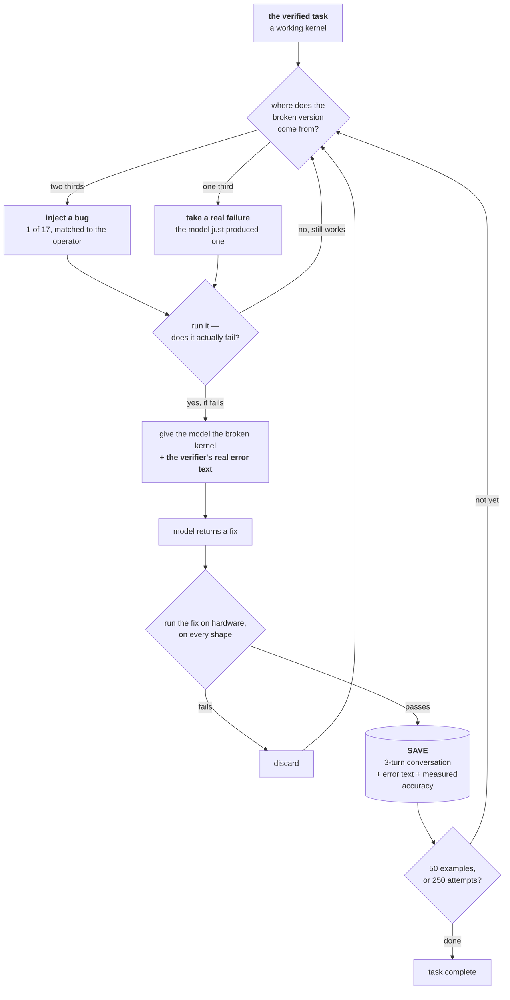
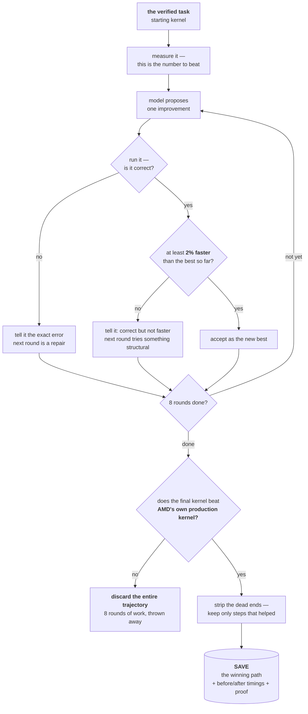

# How KORE Builds Its Training Data

KORE trains a model to write fast GPU kernels for AMD MI355X, in the three languages AMD ships: **Triton, HIP, and FlyDSL**. The v5 dataset is built from three kinds of example — **translation, repair, and optimization** — and every one of them was proven on hardware before it was kept.

**The principle everything follows from: an example exists only if it was verified on a real GPU.** Nothing is kept because a model produced it. Every kernel is compiled, executed on an MI355X, and checked against an independent fp32 oracle. Anything that fails is discarded. We generate far more than we keep — the discarding *is* the method.

---

## 1. The method, end to end




Every arrow reaching a saved example has passed a hardware check. Translation rejects whole tasks — 3,773 of 11,780 attempts were thrown away. Repair and optimization reject individual answers, and optimization is harshest: a trajectory that fails the final gate loses all 8 rounds.

---

## 2. Where tasks come from

A **task** is one GPU operation — flash attention, a fused MoE layer, an fp8 GEMM. Every task carries its own grader, which is why we never have to ask a model whether an answer is good:


| File             | What it is                                                                   |
| ---------------- | ---------------------------------------------------------------------------- |
| `reference.py`   | a slow, obviously-correct fp32 implementation — **the mathematical truth**   |
| `driver.py`      | the harness that runs a candidate and reports accuracy and speed             |
| `task.yaml`      | shapes, data type, the accuracy bar, and **which production kernel to beat** |
| `seed_triton.py` | a working but slow starting kernel                                           |


| Source           | Count      | Origin                                                                |
| ---------------- | ---------- | --------------------------------------------------------------------- |
| Curated registry | **1,546**  | 267 hand-written by us, 1,279 generated from operator specifications  |
| Mined pool       | **13,570** | **GPUMODE/KernelBook** (9,527) — real PyTorch modules mined from permissively-licensed GitHub, pinned at commit `b76504d8` · **operator composition** (4,043) — chains of real PyTorch operators assembled programmatically from a fixed seed |


*The 4,043 composed tasks are not model-written code: a program samples a chain of real `torch.nn` operators — for example AvgPool → Softmax → Conv2d 3×3 — and emits a module that is valid by construction and reproducible from a seed. Every one still passed the same execution check, deduplication and benchmark-contamination screen as a mined module; 9,000 were generated and 4,043 survived.*

Of the curated set, **486 are "frontier"** — a hard filter on operator family, keeping only what dominates LLM serving cost:


| attention | MoE | quantization | GEMM | norm-fusion |
| --------- | --- | ------------ | ---- | ----------- |
| 214       | 115 | 94           | 52   | 11          |


**The baseline is what separates a strong task from a weak one.** Frontier tasks are raced against **AITER and hipBLASLt — the kernels AMD actually ships** — at real model scales (16.7M to 68.7B elements). Beating those by 1.2× is a genuine engineering result. The mined pool is raced against unoptimized PyTorch at roughly 1M elements with a 17µs median, where a "3,000× speedup" describes a weak baseline rather than a good kernel. That is why frontier tasks are worked first.

**Provenance is pinned and decontaminated.** External corpora are fixed at specific commit hashes, so the dataset is reproducible. Every mined module is screened against our held-out evaluation tasks *and* the public KernelBench benchmark: 13,592 of 27,162 candidates were rejected as duplicates, nondeterministic oracles, unsafe code, or benchmark overlap. Two whole operator families and 45 named tasks are permanently withheld so evaluation stays honest.

---

## 3. Translation → 6,957 examples




**Starts from:** the task's working Triton kernel.

**The loop:**

1. **Ask for the same operation in the target language**, giving the model the source and the exact call signature it must expose.
2. **Compile and run it** against the *original* task's oracle and harness — only the kernel is new, so both versions are graded by the identical yardstick.
3. **On failure, retry** with the verifier's real error, up to 3 attempts.
4. **On success**, the pair becomes a training example *and* the task becomes available in that language for steps 2 and 3.

**Stops when:** it passes, or 3 attempts are spent.

**Saves:** the Triton kernel as the question, the verified HIP or FlyDSL kernel as the answer, plus the target language, the accuracy it achieved, and the operation it implements.


| Target              | Attempted | Verified    | In the dataset | Why the gap                                                                    |
| ------------------- | --------- | ----------- | -------------- | ------------------------------------------------------------------------------ |
| **Triton → HIP**    | 8,525     | 7,715 (90%) | **6,668**      | C++ from the PyTorch source — close to what the model already knows            |
| **Triton → FlyDSL** | 3,255     | 292 (9%)    | **289**        | AMD's MLIR builder: unfamiliar API, manual tiling, no automatic bounds masking |


*(The dataset column is the promoted set — verified twins that also belong to a task family we mine.)*

**Why these examples are unusually strong.** A translation pair is not two kernels that resemble each other; it is a **proven semantic equivalence**. Both sides were executed on the same hardware against the same oracle and agreed. That is exactly the supervision a translation task needs, and it is what the benchmark tests directly in its `torch2hip` and `triton2flydsl` categories.

This step also explains the shape of the dataset: we did not choose 68% Triton. We attempted FlyDSL 3,255 times and 289 survived.

---

## 4. Repair → 130,378 examples




**Starts from:** a working kernel for the task.

**The loop, one example at a time:**

1. **Break it.** Two thirds by injecting one of 17 bugs chosen to suit the operator; one third by capturing a kernel the model genuinely got wrong.
2. **Prove it is broken.** Run it. If the injected bug did not actually break anything, discard and try another — we never train on a "fix" for something that was never broken.
3. **Ask for a fix**, handing over the broken kernel and the verifier's error text verbatim, not a summary.
4. **Check the fix** on hardware, across every shape the task declares.
5. **Keep or discard.** Stored only if it passes. A fix that crashes, or that works on one shape but not the rest, is dropped.

**Stops when:** 50 examples accepted, or 250 attempts spent — whichever comes first.

**Saves:** the three-turn conversation (broken code + error → fix + reasoning), the failure class, the verbatim error, and the measured accuracy of the accepted fix.

### The 17 injected bugs

These are real failure modes taken from how GPU kernels actually break:


| What it attacks         | Example bug                                             | What goes wrong                             |
| ----------------------- | ------------------------------------------------------- | ------------------------------------------- |
| **Numerical precision** | accumulate in bf16 instead of fp32                      | answers drift, silently                     |
|                         | drop the `+ eps` guard inside `rsqrt`                   | divide-by-zero on a zero-variance row → NaN |
|                         | drop `abs()` from the max used for a quantization scale | wrong scale, whole tensor mis-scaled        |
| **Memory safety**       | drop the bounds mask on the final partial tile          | reads past the end of the tensor            |
|                         | invert a comparison — `<` becomes `>=`                  | selects exactly the wrong elements          |
|                         | off-by-one in a load index                              | every value shifted by one                  |
| **Tiling / compile**    | tile size 128 → 96 (not a power of two)                 | fails to compile                            |
|                         | K tile not a multiple of 32                             | illegal for fp8 scale groups                |
| **Parallelism**         | remove a synchronization barrier                        | race between wavefronts                     |
|                         | turn an atomic add into a plain store                   | cross-workgroup reduction is lost           |
| **Layout**              | swap two stride multipliers                             | operand is silently transposed              |
| **Low precision**       | swap fp8 `e4m3` for `e5m2`                              | wrong encoding for this chip                |
|                         | swap the high and low int4 nibbles                      | garbage dequantization                      |


Each is a **one-line change that looks entirely plausible in code review and is definitively wrong on hardware**. Three real examples, from a live run against the fused RMSNorm + fp8 quantization kernel:

```diff
- y = x * rsqrt(mean(x^2) + eps) * w      # drop the epsilon guard
+ y = x * rsqrt(mean(x^2)) * w

-     ss += tl.sum(x * x, axis=0)          # reduce over the wrong axis
+     ss += tl.sum(x * x, axis=1)

-     mask = offs < N                      # invert the bounds check
+     mask = offs >= N
```

The bug is always chosen to suit the operator — an attention kernel gets attention bugs, a quantization kernel gets quantization bugs — so the model is never asked to debug something implausible. And because the change is a single token, the model cannot find it by pattern-matching a diff; it has to reason from the error message back to the cause, which is exactly the skill we want.

---

## 5. Optimization → 6,712 examples




**Starts from:** a working kernel, and its measured time — the number to beat.

**The loop, 8 rounds:**

1. **The model proposes one improvement**, seeing the current kernel and how the last attempt went.
2. **Run it on hardware.** Three outcomes, each steering the next round:
  - *wrong answer* → it is shown the exact error, and the next round is a repair
  - *correct but under 2% faster* → it is told the change did not pay, and the next round tries something structural rather than another tweak
  - *correct and at least 2% faster* → accepted as the new best, and the next round builds on it
3. **After 8 rounds, the final check:** is the result faster than AMD's production kernel? If not, **the whole trajectory is discarded** — all 8 rounds.
4. **Clean up what survives.** Real optimization wanders, so we strip the dead ends and keep only the steps that actually helped, and we drop any step whose explanation does not match what its code actually changed.

**Stops when:** 3 distinct verified wins for the task, or 9 attempts spent — up to 72 model calls to keep at most 3 examples.

**Saves:** the cleaned-up path, the winning kernel, before-and-after timings, what it was raced against, and the statistical evidence that the speedup was real rather than measurement noise.

**Why so few?** 6,712 wins against 130,378 repairs is not an accident of effort — it is the bar. Beating a tuned vendor kernel is genuinely hard, and most trajectories end with nothing to keep. These are the most valuable examples in the dataset precisely because they are the hardest to earn.

---

## 6. When we stop

Every stage has an explicit budget. Nothing runs open-ended.


| Stage        | Budget                                 | Stops when                                |
| ------------ | -------------------------------------- | ----------------------------------------- |
| Translation  | 3 attempts, error fed back each time   | it passes, or attempts run out            |
| Repair       | 250 attempts per task                  | 50 examples accepted, or budget spent     |
| Optimization | 8 rounds per attempt, up to 9 attempts | **3 verified wins**, or 72 attempts spent |


The optimization budget is the strictest: roughly **72 model calls per task to keep at most 3 examples**, because the bar is beating a tuned vendor kernel. That ratio is what "verified" costs.

A task is finished once its examples are written, and finished tasks are skipped on every later pass, so no work is ever repeated.

---

## 7. Exactly what we store

Each record keeps not just the text but **the measurements that justified keeping it**, so any example can be audited or re-filtered later without re-running anything.

**Translation example** — a proven equivalence:


| Stored                       | Example                                                      |
| ---------------------------- | ------------------------------------------------------------ |
| the question                 | the original Triton kernel, with the required call signature |
| the answer                   | the verified HIP or FlyDSL kernel                            |
| `target_language`            | `hip` or `flydsl`                                            |
| `snr_db`                     | measured agreement with the fp32 oracle                      |
| `operation`, `arch`, `dtype` | e.g. `flash_attn_prefill`, `gfx950`, `bf16`                  |


**Repair example** — one three-turn conversation:


| Stored                       | Example                                                                   |
| ---------------------------- | ------------------------------------------------------------------------- |
| the conversation             | system prompt, the broken kernel + real error, the fix with its reasoning |
| `failure_class`              | `compile_fail` or `snr_fail`                                              |
| `error_text`                 | the verifier's actual output, verbatim                                    |
| `parent_hash`                | fingerprint of the broken kernel                                          |
| `child_snr_db`               | measured accuracy of the accepted fix, e.g. `31.29`                       |
| `operation`, `arch`, `dtype` | e.g. `fused_rmsnorm_quant`, `gfx950`, `fp8`                               |


**Win example** — the optimization path plus full timing evidence:


| Stored                               | Example                                                                   |
| ------------------------------------ | ------------------------------------------------------------------------- |
| `trajectory`                         | the multi-round conversation, reconstructed to only the steps that helped |
| `final_source`                       | the winning kernel                                                        |
| `initial_wall_us` → `final_wall_us`  | e.g. `412.6` → `171.4`                                                    |
| `speedup`                            | e.g. `1.58×` (median across the dataset; p90 is 6.58×)                    |
| `snr_db`                             | accuracy of the winning kernel                                            |
| `baseline_wall_us`, `baseline_type`  | what it was raced against, and what that baseline actually was            |
| `timing_classification`              | `faster` — the statistical verdict, not just a ratio                      |
| four CV / confidence-interval fields | proof the measurement was stable, not noise                               |


---

## 8. The v5 dataset

v5 is this cycle's new data **plus** everything v4 already held. New this cycle:

**144,047 verified examples — 556M tokens — from roughly 2,600 distinct tasks.**


|                  | HIP        | Triton     | FlyDSL    | Total       |
| ---------------- | ---------- | ---------- | --------- | ----------- |
| **translation**  | 6,668      | —          | 289       | **6,957**   |
| **repair**       | 37,549     | 91,580     | 1,249     | **130,378** |
| **optimization** | 150        | 6,562      | 0         | **6,712**   |
| **Total**        | **44,367** | **98,142** | **1,538** | **144,047** |
| *share*          | *30.8%*    | *68.1%*    | *1.1%*    |             |
| *tokens*         | *200M*     | *349M*     | *8M*      | ***556M***  |


**Language coverage is the headline.** HIP is **30.8%** of the new data, against a benchmark that is 22% HIP and carries its two hardest bars there. That was our weakest area before this cycle.

### v5 in full

The new examples are added to everything v4 already held, giving:

|                                        | Examples    |
| -------------------------------------- | ----------: |
| new this cycle — translation, repair, optimization | **144,047** |
| carried from v4 — kernel work          | 82,165      |
| carried from v4 — replay (chat, code, maths) | 162,567 |
| **v5 total**                           | **388,779** |

Of that, **226,212 are kernel examples — 2.75× the 82,165 v4 trained on.** The 162,567 replay rows are general chat, code and maths, carried forward deliberately: without them a model trained this hard on kernels stops being a usable general assistant.

**How correctness is judged.** Not a single check. Each kernel runs at least **5 times with fresh random inputs** and we keep the **worst** result. It must clear a per-task signal-to-noise threshold (22–40 dB, set individually per operation) *and* a per-element precision bound, and its handling of NaN and infinity must match the oracle exactly. Timing alternates with the baseline, flushing the cache between runs, and the harness is hardened against a kernel that tries to detect that it is being benchmarked.

*The optimization search also produced 99,335 ranked comparisons of six kernels each, held in reserve. They are 94% Triton, so training on them would deepen the language we already have most of.*

---

## 9. What is next

**The dataset is complete.** Two steps follow.

**1 — Supervised fine-tuning** on the full v5 mixture of 388,779 examples.

**2 — Reinforcement learning.** This is where the real leverage is, and it needs no new data collection: **the task library is already a reward function.** Every one of the 486 frontier tasks ships an fp32 oracle, a correctness gate, and a vendor baseline to beat — which is exactly the signal RL requires. The same infrastructure that verified this dataset can score a model's attempts live, with a reward that is measured on hardware rather than predicted by another model.

That is the strategic point worth holding onto: what was built here is not only a dataset. It is a verified environment, and the dataset is its first output.