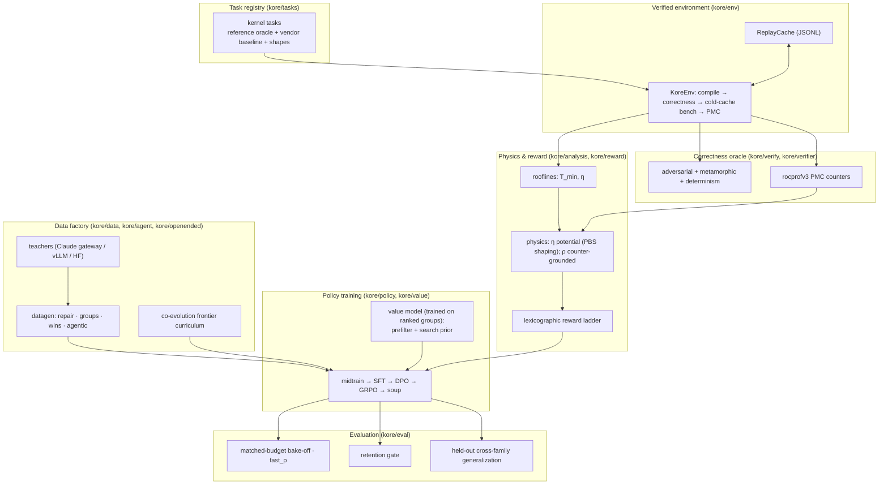
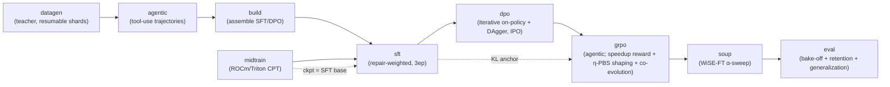

# KORE

**Kernel-Optimization Reinforcement Learning for AMD GPUs.**

KORE trains a language model to write fast, provably-correct ROCm/Triton GPU kernels for AMD Instinct MI350X silicon (gfx950 / CDNA4). Every kernel the model proposes is compiled, checked against an adversarial + metamorphic correctness oracle, and timed cold-cache against production vendor libraries (AITER / hipBLASLt). The training signal is a high-contrast, vendor-relative speedup that is only awarded once correctness is proven, and the hardware's physical performance limit — each operator's Speed-of-Light roofline — enters credit assignment as a shaping potential that densifies per-turn progress toward that limit.

The result is a training pipeline in which correctness is non-negotiable and speed is physically meaningful: the reward cannot be farmed with a weak baseline, a timing hack, or a lucky pass on random inputs, and the model learns to optimize kernels the way an expert does — propose, measure on real hardware, and refine.

---

## Table of contents

- [Design principles](#design-principles)
- [Method](#method)
- [System architecture](#system-architecture)
- [The training pipeline](#the-training-pipeline)
- [Quick start](#quick-start)
- [Installation](#installation)
- [Release prerequisites](#release-prerequisites)
- [Secrets (`.env.local`)](#secrets-envlocal)
- [Running the full 14B campaign](#running-the-full-14b-campaign)
- [Resume & recovery](#resume--recovery)
- [Repository layout](#repository-layout)
- [Environment variables](#environment-variables)
- [Testing](#testing)
- [Documentation index](#documentation-index)
- [Troubleshooting](#troubleshooting)

---

## Design principles

Kernel-generation systems typically reward relative speedup against a reference and verify correctness with a handful of random inputs. Both signals are exploitable: relative speedup depends on the baseline and can be inflated with timing artifacts, and random-input checks admit kernels that are wrong only on edge regimes (zeros, denormals, activation kinks, all-equal rows). KORE is built on three grounding signals that close these gaps.

- **Correctness is proven, not sampled.** Each kernel passes a four-pronged oracle — random, adversarial (deterministic edge regimes), metamorphic (algebraic self-consistency), and determinism — so a kernel that is wrong on any enumerated regime is rejected with certainty.
- **Speed is measured against production baselines.** Timing is cold-cache (L2-flushed) against the vendor kernels a practitioner would actually use (AITER / hipBLASLt), compiled and warmed identically, so a reported speedup reflects a real win over the state of practice.
- **Progress is anchored to physics.** Every operator has a roofline lower bound set by compute peak and memory bandwidth. KORE measures attainment against that bound and uses it to shape credit, giving the policy a dense, hardware-grounded gradient across the wide "correct-but-slow" region where raw speedup differences are flat.

KORE targets gfx950 / MI350X / CDNA4 end to end — the roofline peaks, PMC counter sets, vendor baselines, and compiler paths are all specific to CDNA4 — and holds out structurally distinct operator families to measure genuine cross-family generalization rather than in-distribution recall.

---

## Method

### Roofline lower bound

Every operator has a physical floor set by the more binding of its compute and memory costs (`kore/analysis/rooflines.py`):

```
T_min = max( W_flops / P_peak ,  Q_bytes / B_peak )
η     = T_min / T_measured        ∈ (0, 1]     (Speed-of-Light attainment)
```

`η` is the fraction of the hardware limit a kernel attains. It is bounded, dimensionless, and comparable across operators, which makes it a natural potential for shaping.

### Residual decomposition

The removable runtime above the floor decomposes into *named* hardware inefficiencies read from rocprofv3 performance counters (`kore/reward/physics.py`, `kore/reward/whitebox.py`):

```
T_measured = T_min + R                          R = removable residual
named residual   N = (stall_frac + occupancy_deficit) · T_measured
ρ = T_min / (T_min + N)                          counter-grounded attainment (rocprofv3 PMC)
η = T_min / T_measured                           online potential;  η ≤ ρ ≤ 1
```

The named residual `ρ` is the counter-grounded refinement of attainment and reconstructs the runtime residual with R² ≈ 0.98 on gfx950 (see [`docs/P0_RESULTS.md`](docs/P0_RESULTS.md)); `η` is the PMC-free potential used online. Because the residual is dense within an operator family, KORE trains on the per-family signal rather than assuming a single residual latent transfers across families.

### Reward ladder

The reward is strictly lexicographic, so a faster wrong kernel can never outscore a correct one (`kore/reward/`):

```
hack  <  compile_fail  <  incorrect  <  correct

correct tier      : correctness + vendor-relative speedup + format
cross-turn credit : + potential-based shaping  F = γ·Φ′ − Φ,  Φ = η
incorrect turns   : bounded shaped progress toward the roofline (always < correctness)
```

The high-contrast vendor-relative speedup keeps intra-group advantages sharp where a pure attainment reward would be flat, while the shaping potential adds a dense per-turn signal toward the roofline. The correctness gate plus the bounded action space — not the shaping term — are what make the reward hack-resistant; a roofline Speed-of-Light ceiling additionally rejects physically impossible (super-roofline) timings.

### Correctness oracle

Four prongs run per candidate (`kore/verify/`): random (statistical coverage), **adversarial** (deterministic edge regimes enumerated per operator), **metamorphic** (algebraic self-consistency identities), and **determinism** (repeated runs must agree). A kernel wrong on any enumerated regime is rejected — no lucky pass.

### Credit assignment

Multi-turn credit uses potential-based shaping (`F = γ·Φ′ − Φ`, Ng–Harada–Russell) with `Φ = η`, densifying per-turn progress toward the roofline while preserving the ordering of returns. Incorrect turns retain a bounded shaped-progress reward rather than a hard zero, so the policy still receives gradient on partial progress, always ranked below any correct kernel. The potential is wired identically through the single-process and distributed paths, so both assign the same credit.

### Generalization

Core attention (flash prefill / decode / sliding-window / varlen / fp8) is trained so the product model is strong at attention, while two structurally distinct variants — MLA (latent attention) and paged-KV decode — are reserved entirely and evaluated zero-shot (`kore/eval/generalization.py`). Reservation is by *family* (`kore/tasks/registry.py`), so any generated or minted variant of a held-out family stays out of training, and the evaluation measures true cross-family transfer.

---

## System architecture



Each box is a Python subpackage under `kore/` with its own README:

| Subpackage | Role | README |
| --- | --- | --- |
| `kore/tasks` | Kernel task registry, operators, shapes, train/held-out split, op-class generators | [→](kore/tasks/README.md) |
| `kore/env` | `KoreEnv` verified compile/correctness/bench + replay cache | [→](kore/env/README.md) |
| `kore/analysis` | Roofline `T_min`, physics validation harness, transfer analysis | [→](kore/analysis/README.md) |
| `kore/reward` | Lexicographic ladder + physics residual reward + roofline shaping potential | [→](kore/reward/README.md) |
| `kore/verify` | Adversarial + metamorphic + determinism correctness oracle | [→](kore/verify/README.md) |
| `kore/verifier` | rocprofv3 PMC counter sets + CSV/compiler parsers | [→](kore/verifier/README.md) |
| `kore/data` | Teachers + datagen (repair/groups/wins/agentic) + dataset assembly | [→](kore/data/README.md) |
| `kore/agent` | Multi-turn tool-use agent harness (build/test/bench/profile) | [→](kore/agent/README.md) |
| `kore/openended` | Co-evolution task-frontier curriculum + verifiable task minter/materializer | [→](kore/openended/README.md) |
| `kore/search` | AlphaKernel value-guided test-time search over the transform space | [→](kore/search/README.md) |
| `kore/transform` | ε-typed, budget-constrained rewrite action space with downstream verification | [→](kore/transform/README.md) |
| `kore/policy` | midtrain / SFT / DPO / GRPO / soup training stages | [→](kore/policy/README.md) |
| `kore/value` | Surrogate value model for bench prefiltering + search prior | [→](kore/value/README.md) |
| `kore/eval` | Bake-off, fast_p, retention gate, generalization, champion re-eval | [→](kore/eval/README.md) |

---

## The training pipeline

A single command (`scripts/run_campaign.py`) orchestrates the campaign. The default run is nine stages; two more are opt-in — `reverify` (re-grade existing data under the current oracle before training) and `evolve` (co-evolution task-frontier expansion). The full ordered set (`ALL_STAGES`) is `reverify, datagen, evolve, agentic, build, midtrain, sft, dpo, grpo, soup, eval`. The campaign is **manifest-resumable**: any completed stage whose on-disk artifact is present is skipped on restart, and datagen resumes at shard granularity.



| Stage | What it does | Key module |
| --- | --- | --- |
| `reverify` *(opt-in)* | Re-grade existing repair / win / group shards under the current oracle (compiled + vendor baseline, cold-cache timing, adversarial correctness) so earlier data earns current-standard numbers without regeneration | `kore/data/reverify.py` |
| `datagen` | Teacher generates verified repair / ranked-group / win kernels (parallel, shard-resumable) | `kore/data` |
| `evolve` *(opt-in)* | Evolutionary datagen: a D-MAB bandit + MAP-Elites islands + value-model prefilter mine extra verified win / group records per task | `kore/data/evolve.py` |
| `agentic` | Multi-turn tool-use trajectories (build / test / bench / profile) | `kore/agent` |
| `build` | Assemble the multi-capability SFT mix + DPO pairs (with hard negatives), leakage-split | `kore/data` |
| `midtrain` | Continued pretraining on the ROCm/HIP/Triton corpus → SFT base | `kore/policy/midtrain.py` |
| `sft` | Repair-weighted multi-capability SFT (full-parameter FSDP) | `kore/policy/sft.py` |
| `dpo` | Iterative on-policy DPO + DAgger, IPO loss, refreshed reference | `kore/policy/dpo.py` |
| `grpo` | Multi-turn agentic GRPO: vendor-relative speedup reward + roofline PBS shaping + incorrect-turn credit, value-model prefilter, StarPO-S and anti-collapse stack, co-evolution + off-policy search-then-distill, task minting, and ε-typed transform tools | `kore/policy/grpo.py` |
| `soup` | WiSE-FT interpolation α-sweep gated on retention | `kore/policy/soup.py` |
| `eval` | Matched-budget bake-off + fast_p + retention + held-out generalization | `kore/eval` |

The GRPO stage runs true agentic tool-use RL: the policy drives its own build / test / bench / profile / keep / revert loop through the agent harness, and per-turn measured speedup (best-so-far frontier and delta-vs-best) is fed back into the trajectory as context while the reward remains the verified compute reward. Verified vendor-beating kernels discovered during RL are distilled back into a rejection-fine-tuning set, forming a self-improving loop. Full CLI, stage dispatch, and the resume mechanism are documented in [`scripts/README.md`](scripts/README.md).

---

## Quick start

**Preflight (no GPU)** — imports every stage and prints the resolved plan:

```bash
PYTHONPATH=. python scripts/run_campaign.py --dry-run --tasks rmsnorm_aiter,gemm_bf16
```

**Single-GPU LoRA bring-up** — a small end-to-end campaign:

```bash
PYTHONPATH=. python scripts/run_campaign.py \
  --model Qwen/Qwen3-14B --teacher claude \
  --tasks rmsnorm_aiter,gemm_bf16,flash_attn_decode_bf16 \
  --stages datagen,agentic,build,sft,dpo,grpo,soup,eval
```

**Production datagen (SPUR, resumable)** — see
[`scripts/README.md`](scripts/README.md#production-datagen):

```bash
python scripts/spur_supervise_datagen.py --repo "$PWD" --python "$VIRTUAL_ENV/bin/python"
```

---

## Installation

KORE targets **Python 3.10 + ROCm 7.x** on gfx950 (AMD Instinct MI350X / CDNA4). The verified, reproducible set is pinned in [`requirements-conductor.txt`](requirements-conductor.txt).

> **Order matters.** Install the ROCm build of torch **first** from the ROCm index. A bare `pip install torch transformers trl` pulls a **CUDA** wheel that silently disables the GPU (`torch.cuda.is_available() → False`).

```bash
python3.10 -m venv ~/kore-venv && source ~/kore-venv/bin/activate

# 1) ROCm torch FIRST, from the ROCm index
pip install torch==2.10.0+rocm7.0 pytorch-triton-rocm==3.5.1 \
    --index-url https://download.pytorch.org/whl/rocm7.0

# 2) everything else WITH torch pinned so nothing upgrades it to a CUDA wheel
printf 'torch==2.10.0+rocm7.0\n' > /tmp/torch.txt
pip install -c /tmp/torch.txt -r requirements-conductor.txt \
    --extra-index-url https://download.pytorch.org/whl/rocm7.0

# 3) editable campaign install (optional; pulls extras)
pip install -e ".[train,teacher,value,dev]"
```

Version caps (`transformers<5`, `trl<1`) keep the training APIs this code targets and avoid a torch upgrade to CUDA; do not `pip install -U`. `pyproject.toml` extras: `train` (torch/transformers/trl/peft/datasets/accelerate), `value` (xgboost/scikit-learn/numpy), `teacher` (anthropic/openai), `test` (the reproducible CPU test stack), and `dev` (pytest/build tooling). In a CPU-only virtual environment, install the test stack with `pip install -e ".[test]"`; on ROCm, install the ROCm torch wheel first as shown above.

---

## Release prerequisites

This repository does not yet contain owner-approved licensing, third-party attribution, or corresponding package metadata. Do not publish a wheel, sdist, container, dataset, or source release until an authorized owner has selected the license and supplied the required `LICENSE`/`COPYING`, attribution (`NOTICE`/`THIRD_PARTY`), and `[project]` metadata. The release workflow enforces this without guessing legal terms:

```bash
python -m pytest -o "addopts=-q --strict-markers --import-mode=importlib" -m release tests
```

That command also regenerates the breadth task tree and reports all generated-artifact and seed-scanner violations. A release is blocked until the complete report is clean.

---

## Secrets (`.env.local`)

The Claude teacher runs through AMD's internal LLM gateway. Put credentials in `.env.local` at the repo root (gitignored, loaded by `kore.data.teacher.load_env_local()`):

```bash
AMD_LLM_API_KEY=<your-gateway-subscription-key>
AMD_NTID=<your-ntid>
# optional overrides:
# AMD_LLM_GATEWAY_URL=https://llm-api.amd.com/Anthropic
# KORE_TEACHER_MODEL=claude-opus-4.8
```

Without a key, the launcher skips `datagen`/`agentic` (which need the teacher) and trains on the data already on disk.

---

## Production operations

The active production datagen path is the SPUR supervisor, submitter, and array
worker. Training should be submitted through the site's scheduler with an
explicit allocation; `scripts/launch_distributed.sh` remains the active
single-stage FSDP launcher inside that allocation.

```bash
python scripts/spur_supervise_datagen.py --repo "$PWD" --python "$VIRTUAL_ENV/bin/python"
bash scripts/launch_distributed.sh sft configs/sft_14b_full.json --dry-run
```

The old b05/SSH/dynamic-GPU/tmux/direct-14B wrappers are quarantined
development compatibility tools. They refuse production execution unless
`KORE_ALLOW_DEPRECATED_DEV=1` is explicitly set. Their classification and
replacement are recorded in
[`scripts/operations_registry.json`](scripts/operations_registry.json).

---

## Resume & recovery

The campaign writes `data/<root>/campaign_manifest.json` recording `done_stages` and real checkpoint paths. On restart, a stage is skipped only if it is in `done_stages` **and** its on-disk artifact exists (`_artifact_ok`). Datagen additionally resumes at **shard** granularity (`shard_done` skips any non-empty `{kind}/{task}.jsonl`).

This makes the run robust to ephemeral nodes. The scheduler should relaunch from
the manifest and immutable shard state; wrapper-level completion additionally
requires strict artifact verification.

```bash
# Inspect wiring without side effects:
PYTHONPATH=. python scripts/run_campaign.py --dry-run
# Force a specific stage only inside an allocated development job:
PYTHONPATH=. python scripts/run_campaign.py --force --stages sft ...
```

---

## Repository layout

```
KORE/
├── kore/                       # the package (see per-subpackage READMEs)
│   ├── tasks/   env/   analysis/  reward/   verify/  verifier/
│   ├── data/    agent/ openended/ search/   transform/
│   ├── policy/  value/ eval/
│   ├── config.py               # central CONFIG dataclass (reward/bench knobs + env overrides)
│   ├── obs.py                  # structured JSONL logging + heartbeats
│   └── cli.py                  # `kore` CLI (tasks / eval / ...)
├── scripts/                    # run_campaign.py + conductor/tmux launchers + smokes
├── configs/                    # accelerate FSDP config + per-stage full-FT JSON
├── tests/                      # pytest suite (CPU-safe unit tests)
├── docs/                       # DISTRIBUTED, DATASET_SPEC, KORE_BENCH_BLUEPRINT, P0_RESULTS
├── data/                       # datagen shards + campaign manifest (gitignored churn)
├── runs/                       # checkpoints + logs (gitignored)
├── pyproject.toml              # package + optional extras
└── requirements-conductor.txt  # pinned, verified ROCm runtime
```

---

## Environment variables

Consolidated catalog (see subpackage READMEs for specifics):

| Variable | Default | Effect |
| --- | --- | --- |
| `AMD_LLM_API_KEY` | – | Claude gateway subscription key (in `.env.local`) |
| `KORE_REWARD_MODE` | `speedup` | `residual` selects the physics roofline reward |
| `KORE_VERIFIED_CORRECTNESS` | off | enable the enumerated adversarial correctness battery |
| `KORE_COMPILE_BASELINE` | off | grade vs. the compiler-fused baseline (anti speedup-inflation) |
| `KORE_BENCH_COLD` | `1` | cold-cache (L2-flushed) timing |
| `KORE_PROFILE_REWARD_WEIGHT` | `0` | enable the rocprofv3 PMC dense reward bonus |
| `KORE_EVAL_FULL` / `KORE_EVAL_N` | – / `300` | pull real HF retention splits, capped per bench |
| `KORE_GENERAL_REPLAY_HF` | off | use real HF datasets for anti-forgetting replay |
| `KORE_PEAK_BF16` / `KORE_PEAK_FP8` / `KORE_PEAK_HBM_BW` | datasheet | override roofline peaks with calibrated values |
| `KORE_DATAGEN_WORKERS` | `64` (conductor) | teacher-bound datagen concurrency |
| `HIP_VISIBLE_DEVICES` | – | GPU pinning (ROCm: use HIP only, not ROCR) |

> The GRPO credit / search / mint / transform levers (`credit_incorrect_turns`, `physics_shaping_weight`, `use_search`, `search_budget`, `search_every`, `coevolve_mint`, `coevolve_mint_batch`, `agentic_transform_tools`) are JSON config fields in [`configs/grpo_14b_full.json`](configs/README.md), not environment variables.

---

## Testing

```bash
# install once in a CPU-only test environment
pip install -e ".[test]"

# default CPU suite: top-level + every package-local test module
python -m pytest

# useful splits (the CI runs these independently)
python -m pytest tests
python -m pytest kore

# inspect the live collection instead of relying on a checked-in count
python -m pytest --collect-only -q

# opt-in groups when their resources are provisioned
python -m pytest -m gpu
python -m pytest -m model
python -m pytest -m network
python -m pytest -m dependency
```

The default marker expression excludes GPU, model, network, optional-dependency, and release-only contracts. Release checks are deliberately separate because missing legal metadata and any generated seed-scanner finding must block publication. See [`tests/README.md`](tests/README.md).

---

## Documentation index

| Doc | Contents |
| --- | --- |
| [`docs/DISTRIBUTED.md`](docs/DISTRIBUTED.md) | FSDP sizing, one-command full-FT launch, manual sharded launch |
| [`docs/DATASET_SPEC.md`](docs/DATASET_SPEC.md) | Corpus design + datagen record schemas |
| [`docs/KORE_BENCH_BLUEPRINT.md`](docs/KORE_BENCH_BLUEPRINT.md) | Task taxonomy + benchmark release plan |
| [`docs/P0_RESULTS.md`](docs/P0_RESULTS.md) | Roofline validation, physics reward, cross-family transfer |

---

## Troubleshooting

| Symptom | Cause | Fix |
| --- | --- | --- |
| NCCL "Duplicate GPU detected" | stale `HIP_VISIBLE_DEVICES` pins all FSDP ranks to one GPU | launchers `unset` device masks; don't export GPU pins before `--full-ft` |
| `torch.cuda.is_available() == False` | a CUDA torch wheel got installed, or ROCR+HIP double-remap | reinstall ROCm torch (see [Installation](#installation)); use HIP-only pinning |
| datagen stalls / empty shards | missing `AMD_LLM_API_KEY` | add it to `.env.local` |
| every candidate `compiled=False` under load | `RLIMIT_NPROC` (per-UID) too low → OpenBLAS/numpy can't start threads in the driver | `_preexec` raises soft→hard + `_env` caps BLAS threads (see `kore/env`) |
| GRPO η looks ~2× too optimistic | roofline using datasheet peaks | set on-node `KORE_PEAK_BF16` / `KORE_PEAK_HBM_BW` (the conductor launcher does this) |
| retention gate "NOT enforced" | serving backend (vLLM/torch) unavailable | provision serving; the gate warns loudly rather than silently passing |
| stage skipped unexpectedly on resume | in `done_stages` and artifact present | `--force --stages <stage>`, or delete the artifact/shard |
| SFT uses base instead of midtrain | `midtrain_ckpt` null (stage incomplete) | check the manifest; re-run midtrain |
