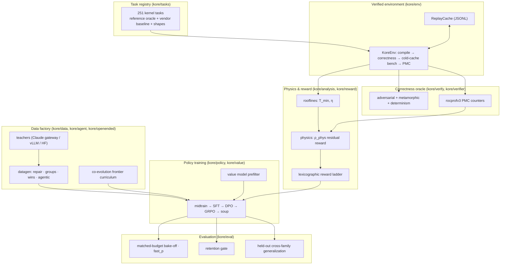
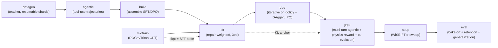

# KORE

**Kernel-Optimization Reinforcement Learning for AMD GPUs.** KORE trains a language model to write fast, provably-correct ROCm/Triton GPU kernels by descending a **physics-grounded roofline residual** - the measured distance to each kernel's Speed-of-Light lower bound - under a **verifiable correctness oracle**, on real AMD Instinct MI350X silicon (gfx950 / CDNA4).

> The thesis: don't reward *relative speedup vs. an arbitrary baseline* (which is gameable and operator-specific). Reward *absolute attainment of the hardware's physical limit* (`η = T_min / T_measured`), gate every reward behind an adversarial + metamorphic correctness oracle, and hold out two structurally-distinct attention variants (MLA latent attention and paged-KV decode) to measure zero-shot cross-family generalization while still training core attention for product capability.

---

## Table of contents

- [Why KORE](#why-kore)
- [The science in one screen](#the-science-in-one-screen)
- [System architecture](#system-architecture)
- [The training pipeline](#the-training-pipeline)
- [Quick start](#quick-start)
- [Installation](#installation)
- [Secrets (`.env.local`)](#secrets-envlocal)
- [Running the full 14B campaign](#running-the-full-14b-campaign)
- [Resume & recovery](#resume--recovery)
- [Repository layout](#repository-layout)
- [Environment variables](#environment-variables)
- [Testing](#testing)
- [Documentation index](#documentation-index)
- [Troubleshooting](#troubleshooting)

---

## Why KORE

Prior LLM-for-kernels work (Kevin, Dr.Kernel, KernelBench, GEAK) rewards **relative speedup** against a reference and checks correctness with a handful of random inputs. Both are fragile:

- **Relative speedup is not transferable and is gameable.** "2× faster than torch-eager" means nothing physical; it depends on the baseline, and a policy can farm it with timing hacks.
- **Random-input correctness has lucky passes.** A kernel that is wrong only on zeros / denormals / activation kinks / all-equal rows sails through `torch.randn` checks - a correctness reward hack.

KORE replaces both with hardware truth:

| Problem | Prior art | KORE |
| --- | --- | --- |
| Reward signal | relative speedup vs. baseline | **roofline attainment** `η = T_min/T_measured` (absolute, physics-grounded) |
| Correctness | ~5 random trials | **provable adversarial + metamorphic oracle** (no lucky pass on enumerated regimes) |
| Baseline honesty | torch-eager | **production vendor kernels** (AITER / hipBLASLt), cold-cache (L2-flushed) timing |
| Generalization claim | in-distribution | **held-out families** (MLA latent attention + paged-KV decode) for zero-shot cross-family eval |
| Capability retention | not measured | **retention gate** after every stage (MMLU/HumanEval/IFEval/BFCL/LiveCodeBench/MT-Bench) |

The physical premise was pre-registered and falsification-tested before any training - see [`Kore-prelim-analysis`](../Kore-prelim-analysis/) and [`docs/P0_RESULTS.md`](docs/P0_RESULTS.md). Headline P0 result: the runtime residual `T_measured − T_min` reconstructs from named PMC terms (memory-stall + occupancy-deficit) with **R² = 0.978** on gfx950 - the "named gradient" a residual-descent reward would exploit is real in the hardware.

---

## The science in one screen

**Roofline lower bound** (`kore/analysis/rooflines.py`). Every operator has a physical floor set by compute peak and memory bandwidth:

```
T_min = max( W_flops / P_peak ,  Q_bytes / B_peak )
η     = T_min / T_measured        ∈ (0, 1]     (Speed-of-Light attainment)
```

**Residual decomposition** (`kore/reward/physics.py`). The removable runtime splits into *named* hardware inefficiencies via rocprofv3 performance counters:

```
T_measured = T_min + R                       R = removable residual
named residual   N = (stall_frac + occupancy_deficit) · T_measured
ρ_phys = T_min / (T_min + N)                 residual-descent credit  (PMC available)
η      = T_min / T_measured                  PMC-free fallback (flagged no_pmc);  η ≤ ρ_phys ≤ 1
```

**Reward ladder** (`kore/reward/`). Strictly lexicographic and anti-hackable - a faster wrong kernel can never outscore a correct one:

```
hack  <  compile_fail  <  incorrect  <  correct
                                         └─ correct tier: correctness_weight + physics_weight·ρ_phys (+ format)
```

**Correctness oracle** (`kore/verify/`). Four prongs - random (statistical), **adversarial** (deterministic edge regimes), **metamorphic** (algebraic self-consistency), and **determinism** - so a kernel wrong on any enumerated regime is rejected with certainty ("no lucky pass").

**Generalization** (`kore/eval/generalization.py`). Core attention (flash prefill / decode / sliding-window / varlen / fp8) is trained so the product model is strong at attention, but two structurally-distinct variants are **reserved** whole: MLA (DeepSeek latent attention) and paged-KV decode. They are trained never and evaluated zero-shot, so the eval measures genuine cross-family transfer rather than in-distribution recall. The reservation is by *family* (`kore/tasks/registry.py`), so any generated or mined variant of a held-out family stays out of training, not just the two seed task ids.

> **A note on scope, stated honestly.** A follow-up "crux" experiment (`kore/analysis/residual_transfer.py`) showed the residual *value* does **not** transfer across operator families out-of-the-box (leave-one-family-out median R² ≈ 0.11 raw / negative normalized). KORE therefore trains on the dense per-family residual signal (validated at R²≈0.98 pooled) rather than claiming a universal residual latent. See [`docs/P0_RESULTS.md`](docs/P0_RESULTS.md).

---

## System architecture



Each box is a Python subpackage under `kore/` with its own README:

| Subpackage | Role | README |
| --- | --- | --- |
| `kore/tasks` | Kernel task registry, operators, shapes, train/held-out split | [→](kore/tasks/README.md) |
| `kore/env` | `KoreEnv` verified compile/correctness/bench + replay cache | [→](kore/env/README.md) |
| `kore/analysis` | Roofline `T_min`, P0 falsification harness, transfer crux | [→](kore/analysis/README.md) |
| `kore/reward` | Lexicographic + physics residual-descent reward | [→](kore/reward/README.md) |
| `kore/verify` | Provable adversarial + metamorphic correctness oracle | [→](kore/verify/README.md) |
| `kore/verifier` | rocprofv3 PMC counter sets + CSV/compiler parsers | [→](kore/verifier/README.md) |
| `kore/data` | Teachers + datagen (repair/groups/wins/agentic) + dataset assembly | [→](kore/data/README.md) |
| `kore/agent` | Multi-turn Hermes tool-use agent harness | [→](kore/agent/README.md) |
| `kore/openended` | Open-ended co-evolution task-frontier curriculum | [→](kore/openended/README.md) |
| `kore/policy` | midtrain / SFT / DPO / GRPO / soup training stages | [→](kore/policy/README.md) |
| `kore/value` | Cheap 3-head surrogate for bench prefiltering | [→](kore/value/README.md) |
| `kore/eval` | Bake-off, fast_p, retention gate, generalization, champion re-eval | [→](kore/eval/README.md) |

---

## The training pipeline

One command (`scripts/run_campaign.py`) orchestrates the campaign. The default run is **nine stages** (below); two more are **opt-in**: `reverify` (re-grade any existing data under the current strong oracle before training) and `evolve` (co-evolution task-frontier expansion). The full ordered set (`ALL_STAGES`) is `reverify, datagen, evolve, agentic, build, midtrain, sft, dpo, grpo, soup, eval`. The campaign is **manifest-resumable**: every completed stage whose on-disk artifact is present is skipped on restart.



| Stage | What it does | Key module |
| --- | --- | --- |
| `reverify` *(opt-in)* | Re-grade existing repair / win / group shards under the current strong oracle (compiled + vendor baseline, cold-cache timing, adversarial correctness), so data generated under a weaker oracle earns honest numbers without regenerating it | `kore/data/reverify.py` |
| `datagen` | Teacher generates verified repair / ranked-group / win kernels (parallel, shard-resumable) | `kore/data` |
| `evolve` *(opt-in)* | Evolutionary kernel datagen: a D-MAB bandit plus MAP-Elites islands plus value-model prefilter mine extra verified win / group records per train task | `kore/data/evolve.py` |
| `agentic` | Multi-turn tool-use trajectories (build/test/bench/pmc) | `kore/agent` |
| `build` | Assemble multi-capability SFT mix + DPO pairs (+ hard negatives), leakage-split | `kore/data` |
| `midtrain` | Continued pretraining on ROCm/HIP/Triton corpus → SFT base | `kore/policy/midtrain.py` |
| `sft` | Repair-weighted multi-capability SFT (full-parameter FSDP) | `kore/policy/sft.py` |
| `dpo` | Iterative on-policy DPO + DAgger, IPO loss, refreshed reference | `kore/policy/dpo.py` |
| `grpo` | Multi-turn agentic GRPO: physics reward, StarPO-S, anti-collapse ladder, co-evolution | `kore/policy/grpo.py` |
| `soup` | WiSE-FT interpolation α-sweep with retention gate | `kore/policy/soup.py` |
| `eval` | Matched-budget bake-off + fast_p + retention + held-out generalization | `kore/eval` |

Full CLI, stage dispatch, and the resume mechanism are documented in [`scripts/README.md`](scripts/README.md).

---

## Quick start

**Preflight (no GPU)** - imports every stage and prints the resolved plan:

```bash
PYTHONPATH=. python scripts/run_campaign.py --dry-run --tasks rmsnorm_aiter,gemm_bf16
```

**Single-GPU LoRA bring-up** - a real (small) end-to-end campaign:

```bash
PYTHONPATH=. python scripts/run_campaign.py \
  --model Qwen/Qwen3-14B --teacher claude \
  --tasks rmsnorm_aiter,gemm_bf16,flash_attn_decode_bf16 \
  --stages datagen,agentic,build,sft,dpo,grpo,soup,eval
```

**Full 14B campaign (8× MI350X, FSDP, durable)** - see [below](#running-the-full-14b-campaign):

```bash
bash scripts/tmux_campaign.sh
```

---

## Installation

KORE targets **Python 3.10 + ROCm 7.x** on gfx950 (AMD Instinct MI350X / CDNA4). The exact verified, reproducible set is pinned in [`requirements-conductor.txt`](requirements-conductor.txt).

> **Order matters.** Install the ROCm build of torch **first** from the ROCm index. A bare `pip install torch transformers trl` pulls a **CUDA** wheel that silently disables the GPU (`torch.cuda.is_available() → False`).

```bash
python3.10 -m venv ~/kore-venv && source ~/kore-venv/bin/activate

# 1) ROCm torch FIRST, from the ROCm index
pip install torch==2.10.0+rocm7.0 pytorch-triton-rocm==3.5.1 \
    --index-url https://download.pytorch.org/whl/rocm7.0

# 2) everything else WITH torch pinned so nothing upgrades it to a CUDA wheel
printf 'torch==2.10.0+rocm7.0\n' > /tmp/torch.txt
pip install -c /tmp/torch.txt -r requirements-conductor.txt \
    --extra-index-url https://download.pytorch.org/whl/rocm7.0

# 3) editable install (optional; pulls extras)
pip install -e ".[train,teacher,value,dev]"
```

Version caps matter: `transformers<5`, `trl<1` keep the training APIs this code targets and avoid a torch upgrade to CUDA. **Do not `pip install -U`.** `pyproject.toml` extras: `train` (torch/transformers/trl/peft/datasets/accelerate), `value` (xgboost/scikit-learn/numpy), `teacher` (anthropic/openai), `dev` (pytest).

---

## Secrets (`.env.local`)

The Claude teacher runs through AMD's internal LLM gateway. Put credentials in `.env.local` at the repo root (gitignored, never committed; loaded by `kore.data.teacher.load_env_local()`):

```bash
AMD_LLM_API_KEY=<your-gateway-subscription-key>
AMD_NTID=<your-ntid>
# optional overrides:
# AMD_LLM_GATEWAY_URL=https://llm-api.amd.com/Anthropic
# KORE_TEACHER_MODEL=claude-opus-4.8
```

Without a key, the conductor launcher skips `datagen`/`agentic` (which need the teacher) and trains on whatever data is already on disk.

---

## Running the full 14B campaign

The **conductor launcher** ([`scripts/run_conductor_14b.sh`](scripts/run_conductor_14b.sh)) is path-portable (resolves the repo root from its own location, uses the project venv) and loads `.env.local`. The **tmux wrapper** ([`scripts/tmux_campaign.sh`](scripts/tmux_campaign.sh)) runs it in a durable detached session that survives SSH drops.

```bash
bash scripts/tmux_campaign.sh              # start (or report an existing run)
tmux attach -t kore14b                     # watch live  (Ctrl-b then d to detach)
tail -f runs/full/logs/campaign_*.log      # follow the log
bash scripts/tmux_campaign.sh --status     # quick status without attaching
```

Full-parameter FSDP across 8 GPUs (no LoRA, no CPU offload, bf16), 16k sequence length, integrity levers on (verified correctness, compiled baseline, cold-cache timing, real HF replay). Datagen/agentic run at 32 teacher-bound workers. All levers documented in [`scripts/README.md`](scripts/README.md) and [`configs/README.md`](configs/README.md).

> `scripts/run_full_14b.sh` is the legacy launcher with **hardcoded** dev-node paths (`/root/Kore-rl/kore`). Use `run_conductor_14b.sh` everywhere else.

---

## Resume & recovery

The campaign writes `data/<root>/campaign_manifest.json` recording `done_stages` and real checkpoint paths. On restart, a stage is skipped only if it is in `done_stages` **and** its on-disk artifact exists (`_artifact_ok`). Datagen additionally resumes at **shard** granularity (`shard_done` skips any non-empty `{kind}/{task}.jsonl`).

This makes the run robust to **ephemeral nodes**: files persist under your account, so if a reservation ends mid-run, just re-reserve and re-launch - it continues where it stopped.

```bash
# after re-reserving the node:
bash scripts/tmux_campaign.sh              # resumes from the manifest + shards
# force a specific stage to re-run:
PYTHONPATH=. python scripts/run_campaign.py --force --stages sft ...
```

---

## Repository layout

```
KORE/
├── kore/                      # the package (see per-subpackage READMEs)
│   ├── tasks/    env/    analysis/   reward/    verify/   verifier/
│   ├── data/     agent/  openended/  policy/    value/    eval/
│   ├── config.py             # central CONFIG dataclass (reward/bench knobs + env overrides)
│   ├── obs.py                # structured JSONL logging + heartbeats
│   └── cli.py                # `kore` CLI (tasks / eval / ...)
├── scripts/                  # run_campaign.py + conductor/tmux launchers + smokes
├── configs/                  # accelerate FSDP config + per-stage full-FT JSON
├── tests/                    # pytest suite (CPU-safe unit tests)
├── docs/                     # DISTRIBUTED, DATASET_SPEC, KORE_BENCH_BLUEPRINT, P0_RESULTS
├── data/                     # datagen shards + campaign manifest (gitignored churn)
├── runs/                     # checkpoints + logs (gitignored)
├── pyproject.toml            # package + optional extras
└── requirements-conductor.txt# pinned, verified ROCm runtime
```

---

## Environment variables

Consolidated catalog (see subpackage READMEs for specifics):

| Variable | Default | Effect |
| --- | --- | --- |
| `AMD_LLM_API_KEY` | - | Claude gateway subscription key (in `.env.local`) |
| `KORE_REWARD_MODE` | `speedup` | `residual` selects the physics roofline reward |
| `KORE_VERIFIED_CORRECTNESS` | off | enable enumerated adversarial correctness battery |
| `KORE_COMPILE_BASELINE` | off | grade vs. compiler-fused baseline (anti speedup-inflation) |
| `KORE_BENCH_COLD` | `1` | cold-cache (L2-flushed) timing |
| `KORE_PROFILE_REWARD_WEIGHT` | `0` | enable rocprofv3 PMC dense reward shaping |
| `KORE_EVAL_FULL` / `KORE_EVAL_N` | - / `300` | pull real HF retention splits, capped per bench |
| `KORE_GENERAL_REPLAY_HF` | off | use real HF datasets for anti-forgetting replay |
| `KORE_PEAK_BF16` / `KORE_PEAK_FP8` / `KORE_PEAK_HBM_BW` | datasheet | override roofline peaks with calibrated values |
| `KORE_DATAGEN_WORKERS` | `32` (conductor) | teacher-bound datagen concurrency |
| `HIP_VISIBLE_DEVICES` | - | GPU pinning (ROCm: use HIP only, not ROCR) |

---

## Testing

```bash
# fast wiring/unit tests (CPU-safe)
PYTHONPATH=. python -m pytest tests/test_campaign_wiring.py tests/test_distributed.py -q

# whole suite
PYTHONPATH=. python -m pytest -q
```

Tests are CPU-safe by design (roofline formulas, reward gating, family split, campaign wiring). See [`tests/README.md`](tests/README.md).

---

## Documentation index

| Doc | Contents |
| --- | --- |
| [`docs/DISTRIBUTED.md`](docs/DISTRIBUTED.md) | FSDP sizing, one-command full-FT launch, manual sharded launch |
| [`docs/DATASET_SPEC.md`](docs/DATASET_SPEC.md) | Corpus design + datagen record schemas |
| [`docs/KORE_BENCH_BLUEPRINT.md`](docs/KORE_BENCH_BLUEPRINT.md) | Task taxonomy + benchmark release plan |
| [`docs/P0_RESULTS.md`](docs/P0_RESULTS.md) | Roofline validation, physics reward, the transfer crux |

Sibling repos: [`Kore-prelim-analysis`](../Kore-prelim-analysis/) (the P0 study) and the [`Kore-RL`](../) umbrella (setup, papers, backups).

---

## Troubleshooting

| Symptom | Cause | Fix |
| --- | --- | --- |
| NCCL "Duplicate GPU detected" | stale `HIP_VISIBLE_DEVICES` pins all FSDP ranks to one GPU | launchers `unset` device masks; don't export GPU pins before `--full-ft` |
| `torch.cuda.is_available() == False` | a CUDA torch wheel got installed, or ROCR+HIP double-remap | reinstall ROCm torch (see [Installation](#installation)); use HIP-only pinning |
| datagen stalls / empty shards | missing `AMD_LLM_API_KEY` | add to `.env.local` |
| every candidate `compiled=False` under load | `RLIMIT_NPROC` (per-UID) too low → OpenBLAS/numpy can't start threads in the driver | fixed: `_preexec` raises soft→hard + `_env` caps BLAS threads (see `kore/env`) |
| GRPO η looks ~2× too optimistic | roofline using datasheet peaks | set on-node `KORE_PEAK_BF16`/`KORE_PEAK_HBM_BW` (conductor launcher does this) |
| retention gate "NOT enforced" | serving backend (vLLM/torch) unavailable | provision serving; the gate warns loudly rather than silently passing |
| stage skipped unexpectedly on resume | in `done_stages` and artifact present | `--force --stages <stage>`, or delete the artifact/shard |
| SFT uses base instead of midtrain | `midtrain_ckpt` null (stage incomplete) | check the manifest; re-run midtrain |
