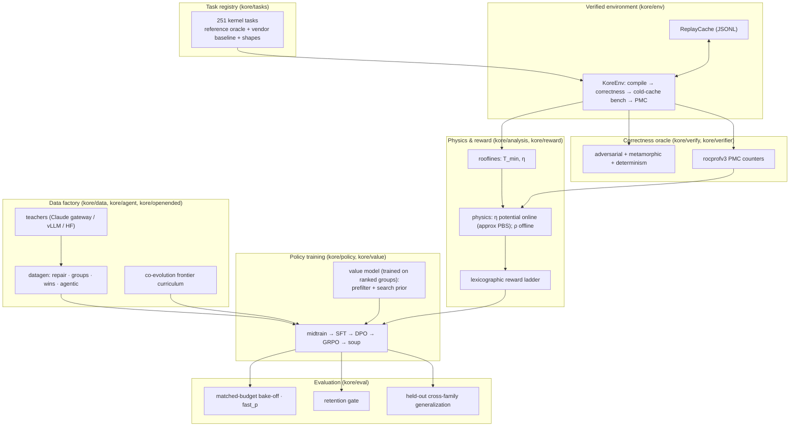
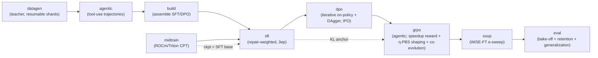

# KORE

**Kernel-Optimization Reinforcement Learning for AMD GPUs.** KORE trains a language model to write fast, provably-correct ROCm/Triton GPU kernels under a **verifiable correctness oracle**, driving each kernel toward its **Speed-of-Light roofline** on real AMD Instinct MI350X silicon (gfx950 / CDNA4). The flagship within-turn reward is a **high-contrast, vendor-relative speedup** gated behind an adversarial + metamorphic oracle and cold-cache production-vendor timing; the hardware's physical limit then enters credit assignment as an **approximately policy-invariant shaping potential** (Ng-Harada-Russell) that densifies per-turn progress toward that limit. Online, that potential is the **PMC-free attainment `η = T_min/T_measured`**; the counter-grounded **named-residual `ρ`** (R²≈0.98 offline) is the *validated target*, **not** the live gradient — bringing it online is the #1 open item ([What's new](#whats-new-paradigm-v2)).

> **Live-run status (this repo, now).** A multi-day 14B full-fine-tune campaign is running and is **currently in the `midtrain` (continued-pretraining) stage**. The chain is `midtrain → build → sft → dpo → grpo → soup → eval`, so the **GRPO stage — where every discovery lever below actually activates — is still days away**. Claims tagged *"active when the GRPO stage runs"* describe the GRPO config that will be rendered at that stage (from the template `configs/grpo_14b_full.json`), **not** a process running today. This is a **non-curriculum** run, so at GRPO start it renders a fresh `data/full14b/launch/grpo.json` from that template; the stale `data/full14b/launch/grpo_phase1_correctness.json` (a Jul-10 curriculum artifact) is **not** this run's config.

> The thesis (paradigm-v2): make correctness non-negotiable and speed *physically meaningful*. Every reward is gated behind an adversarial + metamorphic correctness oracle with cold-cache timing against **production vendor kernels** (AITER / hipBLASLt), so the high-contrast **vendor-relative speedup** terminal reward cannot be farmed with a weak baseline or a timing hack. The hardware's physical limit — online, the PMC-free `η = T_min / T_measured` (its counter-grounded refinement `ρ` is validated offline but **not** yet threaded per-rollout) — then enters as an **approximately policy-invariant shaping potential** (Ng-Harada-Russell). The real anti-hack spine is the **correctness gate + the bounded action space**, *not* the shaping term: the physics *densifies* the gradient, the oracle *grounds* correctness. Two structurally-distinct attention variants (MLA latent attention and paged-KV decode) are held out to measure zero-shot cross-family generalization while core attention still trains for product capability.
>
> *Why not reward the roofline residual directly?* You can (`reward_mode=residual`), and it does **not** degenerate: with counters absent it falls back to `η`, a sane, bounded, physics-grounded reward. But `η` is *lower-contrast* than the named-residual `ρ` and than raw vendor speedup, so per-group advantages thin out across the wide "correct-but-slow" valley. Paradigm-v2 therefore keeps the high-contrast **speedup** as the base reward and re-adds the physics as a **denser per-turn shaping potential** (still `η` online) - see [What's new](#whats-new-paradigm-v2).

---

## Table of contents

- [Why KORE](#why-kore)
- [What's new: paradigm-v2](#whats-new-paradigm-v2)
- [The science in one screen](#the-science-in-one-screen)
- [Novelty & frontier status, honestly](#novelty--frontier-status-honestly)
- [System architecture](#system-architecture)
- [The training pipeline](#the-training-pipeline)
- [Quick start](#quick-start)
- [Installation](#installation)
- [Secrets (`.env.local`)](#secrets-envlocal)
- [Running the full 14B campaign](#running-the-full-14b-campaign)
- [Resume & recovery](#resume--recovery)
- [Repository layout](#repository-layout)
- [Environment variables](#environment-variables)
- [Testing](#testing)
- [Documentation index](#documentation-index)
- [Troubleshooting](#troubleshooting)

---

## Why KORE

Prior LLM-for-kernels work (Kevin, Dr.Kernel, KernelBench, GEAK) rewards **relative speedup** against a reference and checks correctness with a handful of random inputs. Both are fragile:

- **Relative speedup is not transferable and is gameable.** "2× faster than torch-eager" means nothing physical; it depends on the baseline, and a policy can farm it with timing hacks.
- **Random-input correctness has lucky passes.** A kernel that is wrong only on zeros / denormals / activation kinks / all-equal rows sails through `torch.randn` checks - a correctness reward hack.

KORE replaces both with hardware truth:

| Problem | Prior art | KORE |
| --- | --- | --- |
| Reward signal | ungated relative speedup vs. a weak baseline | **oracle-gated vendor-relative speedup**, credit densified by an **approximately policy-invariant roofline potential** (online: PMC-free `η`; the validated `ρ` refinement is offline-only so far) |
| Correctness | ~5 random trials | **provable adversarial + metamorphic oracle** (no lucky pass on enumerated regimes) |
| Baseline honesty | torch-eager | **production vendor kernels** (AITER / hipBLASLt), cold-cache (L2-flushed) timing |
| Generalization claim | in-distribution | **held-out families** (MLA latent attention + paged-KV decode) for zero-shot cross-family eval |
| Capability retention | not measured | **retention gate** after every stage (MMLU/HumanEval/IFEval/BFCL/LiveCodeBench/MT-Bench) |

The physical premise was pre-registered and falsification-tested before any training - see [`Kore-prelim-analysis`](../Kore-prelim-analysis/) and [`docs/P0_RESULTS.md`](docs/P0_RESULTS.md). Headline P0 result: the runtime residual `T_measured − T_min` reconstructs from named PMC terms (memory-stall + occupancy-deficit) with **R² = 0.978** on gfx950 - the "named gradient" a residual-descent reward would exploit is real in the hardware. **But that validation is offline.** The rollout call sites do not (yet) thread rocprofv3 counters per turn, so `ρ` is a *validated target the online reward does not consume directly* - the live potential is the PMC-free `η`. Closing that gap is the #1 open item.

---

## What's new: paradigm-v2

Paradigm-v2 acts on an audit finding: the online residual reward had quietly become the low-contrast PMC-free `η` (`stall_frac`/`occupancy` are never populated per-rollout, so the *named* residual `ρ` is dormant online), thinning the per-group RL signal across the wide "correct-but-slow" valley. The fix repositions the physics from a weak **terminal reward** into a **denser per-turn credit signal**, and turns on a value model that was built but never trained. Framing rule, stated honestly: these levers are **configured ON in the flagship GRPO template** (`configs/grpo_14b_full.json`) and will be **active when the GRPO stage runs** — but the live run is still in `midtrain`, so nothing below is executing *today*. Each subsystem is fail-safe (degrades to prior behavior on any error).

**Configured in the flagship template — active when the GRPO stage runs:**

- **Reward - high-contrast speedup, physics-shaped** (see [`kore/reward`](kore/reward/README.md)). The within-turn terminal reward is the vendor-relative **speedup** (`reward_mode=speedup`), which keeps intra-group advantage high-contrast where the PMC-free residual is flat. The physics enters **only** as the shaping potential below. **Honest correction:** the potential is computed by `phi_potential(task, obs)` **without a counter dict** at every rollout call site, so online it is the PMC-free `η = T_min/T_measured` — **not** the validated named-residual `ρ` (R²≈0.98 offline; see [`docs/P0_RESULTS.md`](docs/P0_RESULTS.md)). Threading per-turn rocprofv3 counters to make `ρ` live (or running `reward_mode=residual` with true `ρ`) is the **#1 open item**. (`reward_mode=residual` does not degenerate — it too falls back to `η`, just lower-contrast than `ρ`.)
- **Credit - densified, approximately policy-invariant** (`kore/policy/grpo.py`, see [`kore/policy`](kore/policy/README.md)). Incorrect turns keep their bounded shaped-progress reward instead of a hard zero (`credit_incorrect_turns=true`); potential-based shaping `F = γ·Φ' − Φ` with `Φ = η` densifies per-turn credit toward the roofline (`physics_shaping_weight=0.15`). **Honest correction:** the invariance is **approximate, not a theorem here** — the shaping offset is fed into GRPO's *std-normalized group-relative per-turn advantage* (`group_advantages`), and the correct→incorrect boundary (where `Φ` becomes `None`) breaks the telescoping, leaving a small **bounded action-dependent leak (≤~0.06)**. Treat it as an expected-gradient-neutral **state-dependent baseline** that reshapes credit, not as an at-any-weight guarantee. The potential is wired identically down the single-process and distributed GRPO paths (`build_kevin_samples`), so both assign the same credit.
- **Value model - trained on the run's own data** (`kore/value/replay_train.py`, see [`kore/value`](kore/value/README.md)). A schedule-conditioned value model is fit from the run's *own* verified ranked groups at GRPO start (if group data is present, else a heuristic fallback); it feeds both the bench prefilter and the search prior (previously dormant / untrained).

**Also configured ON in the template (each fail-safe) — with honest limits:**

- `kore/search` - AlphaKernel **test-time search** via `TransformProposePolicy` (`kore/search/propose.py`) over the transform calculus. It runs as a **throttled, fail-safe, off-policy search-then-distill hook** *after* the on-policy gradient (`use_search=true`, `search_budget=16`, `search_every=50`), so it never corrupts credit assignment. **Honest limits:** the roofline branch-and-bound is **dormant** (no `roofline_ub_fn` is passed, so every node's ceiling is `+inf` → no pruning); `budget=16` is small; and over a **minted** seed the Triton-*regex* transform library is largely inapplicable. It is a genuinely throttled, fail-safe hook whose efficacy is still **limited**.
- `kore/transform` - a **typed, budget-constrained rewrite action space** (`exact ≡` / `approx ≈_ε`) exposed as the `list_transforms` / `apply_transform` agent tools (`agentic_transform_tools=true`). Correctness is enforced by the env **SNR oracle downstream**, *not* proven by the types: several transforms labeled "exact" are **not bit-preserving** — the library even redefines "exact" as *matches the fp32 reference* (e.g. `fp32_accumulator` changes numerics vs. the original kernel; `add_mask_boundary` is exact only if the kernel was already in-bounds). So it is best read as a **typed, budget-constrained rewrite space with downstream numerical verification** — the anti-hack spine is the correctness gate + the bounded action space, not the types.
- `kore/openended/minter.py` + `kore/openended/materialize.py` - **open-ended minting** of net-new, correct-by-construction tasks, **materialized** into runnable task dirs graded by the *same* trusted `_genops` driver / reference ABI. Each candidate passes an **8-check non-degeneracy construction gate** (typecheck, held-out rejection, executes, finite, deterministic, non-constant, varies on every axis, sensitive to every input) plus a materialize-time **self-check** (the on-disk oracle must reproduce the in-memory oracle or the task is rejected). Served by the `CoevolutionController` (`coevolve_mint=true`, `coevolve_mint_batch=6`).
- [`kore/eval`](kore/eval/README.md) **frontier eval** - a KernelBench-AMD adapter (with a `fast_p` track), robust-kbench correctness hardening, and paired significance statistics (paired bootstrap CI + Wilcoxon + sign-test on KORE-vs-seed speedups) - wired into the campaign eval stage (`_stage_eval`), fail-safe.

No datagen-*generation* changes.

> **Honest status.** This is a frontier-grade *recipe*, not a result. The head-to-head number is **pending the frontier eval**, and the eval stage is many stages away (the run is in `midtrain`). Everything above is *configured* in the GRPO template and will activate when GRPO runs; none of it has produced a head-to-head number yet, and the physics is online only as the PMC-free `η` (not `ρ`). No win over any frontier model is claimed here.

---

## The science in one screen

**Roofline lower bound** (`kore/analysis/rooflines.py`). Every operator has a physical floor set by compute peak and memory bandwidth:

```
T_min = max( W_flops / P_peak ,  Q_bytes / B_peak )
η     = T_min / T_measured        ∈ (0, 1]     (Speed-of-Light attainment)
```

**Residual decomposition** (`kore/reward/physics.py`, `kore/reward/whitebox.py`). The removable runtime splits into *named* hardware inefficiencies via rocprofv3 performance counters. In paradigm-v2 the physics is a **shaping potential** `Φ`, not the terminal reward — but online, with counters unthreaded, `Φ` is the PMC-free `η`, **not** the named-residual `ρ`:

```
T_measured = T_min + R                       R = removable residual
named residual   N = (stall_frac + occupancy_deficit) · T_measured
ρ = T_min / (T_min + N)                       validated target; needs PMC counters — NOT threaded per-rollout
η = T_min / T_measured                        the LIVE online potential Φ (PMC-free);  η ≤ ρ ≤ 1
```

**Reward ladder** (`kore/reward/`). Strictly lexicographic - a faster wrong kernel can never outscore a correct one (this ordering, plus the bounded action space, is the true anti-hack spine). In paradigm-v2 the physics enters the *credit* as an approximately policy-invariant cross-turn shaping potential, not as the single-turn tier value:

```
hack  <  compile_fail  <  incorrect  <  correct
   correct tier (template, reward_mode=speedup): correctness_weight + speedup (+ format)
   cross-turn credit: + approx PBS  F = γ·Φ' − Φ,  Φ = η online  (ρ would need per-rollout PMC counters)
   incorrect turns keep bounded shaped progress (credit_incorrect_turns), always < correctness_weight
   (reward_mode=residual also falls back to η per-rollout — a bounded physics reward, lower-contrast than ρ)
```

**Correctness oracle** (`kore/verify/`). Four prongs - random (statistical), **adversarial** (deterministic edge regimes), **metamorphic** (algebraic self-consistency), and **determinism** - so a kernel wrong on any enumerated regime is rejected with certainty ("no lucky pass").

**Generalization** (`kore/eval/generalization.py`). Core attention (flash prefill / decode / sliding-window / varlen / fp8) is trained so the product model is strong at attention, but two structurally-distinct variants are **reserved** whole: MLA (DeepSeek latent attention) and paged-KV decode. They are trained never and evaluated zero-shot, so the eval measures genuine cross-family transfer rather than in-distribution recall. The reservation is by *family* (`kore/tasks/registry.py`), so any generated or mined variant of a held-out family stays out of training, not just the two seed task ids.

> **A note on scope, stated honestly.** A follow-up "crux" experiment (`kore/analysis/residual_transfer.py`) showed the residual *value* does **not** transfer across operator families out-of-the-box (leave-one-family-out median R² ≈ 0.11 raw / negative normalized). KORE therefore trains on the dense per-family residual signal (validated at R²≈0.98 pooled) rather than claiming a universal residual latent. See [`docs/P0_RESULTS.md`](docs/P0_RESULTS.md).

---

## Novelty & frontier status, honestly

No sugar-coating: KORE is **not a new paradigm**. It is an unusually coherent **novel *combination*** of mostly-known parts. Roughly **70% of the mechanisms are incremental prior art** — GRPO/DAPO/GSPO (RL), Ng-Harada-Russell PBS (shaping), the roofline model, StarPO-S (stability), PLR/UED and MAP-Elites (curriculum), AlphaZero PUCT and Hyperband/successive-halving (search), Ansor (autotuning), and PET/STOKE/Exo (rewrite/superoptimization). The contribution is the *assembly*, not the ingredients.

**The top-line is crowded by concurrent/prior work**, cited honestly:

| Claim you might reach for | Who already has it |
| --- | --- |
| "14B multi-turn RL for Triton kernels" | **Dr.Kernel / KernelGYM** |
| "speed-of-light / roofline reward + anti-hack" | **NVIDIA SOL-ExecBench + MANTIS** |
| "agentic Triton generation on AMD" | **GEAK / GEAK-v2** |
| "multi-turn RL for GPU kernels" | **Kevin-32B** (CUDA), **CUDA-L1** |
| "kernel benchmark + robust correctness" | **KernelBench / robust-kbench**, **TritonForge** |

So KORE **cannot** be marketed as "RL for Triton," "roofline reward," or "hack-resistant kernel RL" — each already exists.

**What is genuinely new here (narrow, but real):**

1. **Roofline attainment as a PBS shaping potential** for kernel RL — physics as *credit*, not as the terminal reward.
2. **An ε-typed transform action space** as a provably-in-*contract* RL action space — the strongest idea. But "verified" overstates it: correctness is enforced **downstream** by the env SNR oracle, not by the types.
3. **Roofline-coordinate quality-diversity task minting** with a correct-by-construction verifiable minter (8-check non-degeneracy gate + materialize-time self-check).
4. **Roofline-admissible branch-and-bound** for kernel search — elegant, but currently **dormant** (no `roofline_ub_fn` wired, so nothing prunes).

**Where it is frontier, on two axes:**

- **Target.** gfx950 / MI350X / CDNA4 — ahead of a literature that is ~90% CUDA.
- **Principle.** Verification-first and physics-grounded — materially more principled than the "agent loop + LLM-judge" mainstream.

**Where it is unproven.** The head-to-head vs. **Opus 4.8** is **pending eval** — no result exists yet, and the eval stage is many stages downstream of the current `midtrain`.

### Data-efficiency thesis, honestly

You do **not** beat a frontier model by matching its data or scale. The bet is to **out-search a verifiable slice and distill** the wins into a small policy. The mechanism has support:

- **Coverage from repeated sampling against a verifier** lifts solved-rate (*Large Language Monkeys*); **test-time compute** can beat a ~14× larger model on tractable problems (*Snell 2024*).
- **Search + verifier** already beats human/scale SOTA in verifiable domains: *AlphaProof, AlphaEvolve, AlphaDev, FunSearch*.
- **RLVR is sample-efficient**: *One-Shot RLVR* (~1 example ≈ thousands of steps of signal), *Absolute Zero*; and *Kevin-32B* beats o3/o4-mini on KernelBench.

**Honest limits.** RLVR *sharpens* a base model but does **not expand its reachable set** (*Limit-of-RLVR*) — search/evolution is the escape hatch. And ungrounded self-play provably **collapses** (entropy decay). KORE's documented escape is its **three grounding signals**: the correctness verifier, real hardware timing, and the physics roofline. So the **defensible** claim is precise:

> **14B + KORE can beat Opus-4.8-single-shot / naive on thin-data MI350X kernels with heavy verified search** — *not* "14B beats Opus 4.8" unconditionally.

---

## System architecture



Each box is a Python subpackage under `kore/` with its own README:

| Subpackage | Role | README |
| --- | --- | --- |
| `kore/tasks` | Kernel task registry, operators, shapes, train/held-out split | [→](kore/tasks/README.md) |
| `kore/env` | `KoreEnv` verified compile/correctness/bench + replay cache | [→](kore/env/README.md) |
| `kore/analysis` | Roofline `T_min`, P0 falsification harness, transfer crux | [→](kore/analysis/README.md) |
| `kore/reward` | Lexicographic ladder + physics residual reward + **approximately** policy-invariant roofline shaping potential (online: `η`; `ρ` offline-validated) | [→](kore/reward/README.md) |
| `kore/verify` | Provable adversarial + metamorphic correctness oracle | [→](kore/verify/README.md) |
| `kore/verifier` | rocprofv3 PMC counter sets + CSV/compiler parsers | [→](kore/verifier/README.md) |
| `kore/data` | Teachers + datagen (repair/groups/wins/agentic) + dataset assembly | [→](kore/data/README.md) |
| `kore/agent` | Multi-turn Hermes tool-use agent harness | [→](kore/agent/README.md) |
| `kore/openended` | Open-ended co-evolution task-frontier curriculum + verifiable task minter/materializer (live, fail-safe) | [→](kore/openended/README.md) |
| `kore/policy` | midtrain / SFT / DPO / GRPO / soup training stages | [→](kore/policy/README.md) |
| `kore/value` | Cheap 3-head surrogate for bench prefiltering (trained on the run's ranked groups; also the search prior) | [→](kore/value/README.md) |
| `kore/eval` | Bake-off, fast_p, retention gate, generalization, champion re-eval | [→](kore/eval/README.md) |

**New in paradigm-v2** (built, unit-tested, configured ON in the GRPO template - **active when the GRPO stage runs**, each fail-safe): `kore/search` (AlphaKernel off-policy test-time search via `TransformProposePolicy`; roofline branch-and-bound currently **dormant**, `budget=16`) and `kore/transform` (a **typed, budget-constrained rewrite calculus with downstream SNR verification** - some "exact" moves are not bit-preserving - exposed as the `list_transforms` / `apply_transform` agent tools). See [What's new: paradigm-v2](#whats-new-paradigm-v2).

---

## The training pipeline

One command (`scripts/run_campaign.py`) orchestrates the campaign. The default run is **nine stages** (below); two more are **opt-in**: `reverify` (re-grade any existing data under the current strong oracle before training) and `evolve` (co-evolution task-frontier expansion). The full ordered set (`ALL_STAGES`) is `reverify, datagen, evolve, agentic, build, midtrain, sft, dpo, grpo, soup, eval`. The campaign is **manifest-resumable**: every completed stage whose on-disk artifact is present is skipped on restart.



| Stage | What it does | Key module |
| --- | --- | --- |
| `reverify` *(opt-in)* | Re-grade existing repair / win / group shards under the current strong oracle (compiled + vendor baseline, cold-cache timing, adversarial correctness), so data generated under a weaker oracle earns honest numbers without regenerating it | `kore/data/reverify.py` |
| `datagen` | Teacher generates verified repair / ranked-group / win kernels (parallel, shard-resumable) | `kore/data` |
| `evolve` *(opt-in)* | Evolutionary kernel datagen: a D-MAB bandit plus MAP-Elites islands plus value-model prefilter mine extra verified win / group records per train task | `kore/data/evolve.py` |
| `agentic` | Multi-turn tool-use trajectories (build/test/bench/pmc) | `kore/agent` |
| `build` | Assemble multi-capability SFT mix + DPO pairs (+ hard negatives), leakage-split | `kore/data` |
| `midtrain` | Continued pretraining on ROCm/HIP/Triton corpus → SFT base | `kore/policy/midtrain.py` |
| `sft` | Repair-weighted multi-capability SFT (full-parameter FSDP) | `kore/policy/sft.py` |
| `dpo` | Iterative on-policy DPO + DAgger, IPO loss, refreshed reference | `kore/policy/dpo.py` |
| `grpo` | Multi-turn agentic GRPO: high-contrast speedup reward + **approximate** roofline PBS shaping (online `η`, not `ρ`) + incorrect-turn credit, trained value-model prefilter, StarPO-S, anti-collapse ladder, co-evolution + off-policy search-then-distill (B&B dormant) + task minting/materialization + typed, downstream-verified transform tools (all configured ON in the template; reached only after midtrain/sft/dpo) | `kore/policy/grpo.py` |
| `soup` | WiSE-FT interpolation α-sweep with retention gate | `kore/policy/soup.py` |
| `eval` | Matched-budget bake-off + fast_p + retention + held-out generalization | `kore/eval` |

Full CLI, stage dispatch, and the resume mechanism are documented in [`scripts/README.md`](scripts/README.md).

---

## Quick start

**Preflight (no GPU)** - imports every stage and prints the resolved plan:

```bash
PYTHONPATH=. python scripts/run_campaign.py --dry-run --tasks rmsnorm_aiter,gemm_bf16
```

**Single-GPU LoRA bring-up** - a real (small) end-to-end campaign:

```bash
PYTHONPATH=. python scripts/run_campaign.py \
  --model Qwen/Qwen3-14B --teacher claude \
  --tasks rmsnorm_aiter,gemm_bf16,flash_attn_decode_bf16 \
  --stages datagen,agentic,build,sft,dpo,grpo,soup,eval
```

**Full 14B campaign (8× MI350X, FSDP, durable)** - see [below](#running-the-full-14b-campaign):

```bash
bash scripts/tmux_campaign.sh
```

---

## Installation

KORE targets **Python 3.10 + ROCm 7.x** on gfx950 (AMD Instinct MI350X / CDNA4). The exact verified, reproducible set is pinned in [`requirements-conductor.txt`](requirements-conductor.txt).

> **Order matters.** Install the ROCm build of torch **first** from the ROCm index. A bare `pip install torch transformers trl` pulls a **CUDA** wheel that silently disables the GPU (`torch.cuda.is_available() → False`).

```bash
python3.10 -m venv ~/kore-venv && source ~/kore-venv/bin/activate

# 1) ROCm torch FIRST, from the ROCm index
pip install torch==2.10.0+rocm7.0 pytorch-triton-rocm==3.5.1 \
    --index-url https://download.pytorch.org/whl/rocm7.0

# 2) everything else WITH torch pinned so nothing upgrades it to a CUDA wheel
printf 'torch==2.10.0+rocm7.0\n' > /tmp/torch.txt
pip install -c /tmp/torch.txt -r requirements-conductor.txt \
    --extra-index-url https://download.pytorch.org/whl/rocm7.0

# 3) editable install (optional; pulls extras)
pip install -e ".[train,teacher,value,dev]"
```

Version caps matter: `transformers<5`, `trl<1` keep the training APIs this code targets and avoid a torch upgrade to CUDA. **Do not `pip install -U`.** `pyproject.toml` extras: `train` (torch/transformers/trl/peft/datasets/accelerate), `value` (xgboost/scikit-learn/numpy), `teacher` (anthropic/openai), `dev` (pytest).

---

## Secrets (`.env.local`)

The Claude teacher runs through AMD's internal LLM gateway. Put credentials in `.env.local` at the repo root (gitignored, never committed; loaded by `kore.data.teacher.load_env_local()`):

```bash
AMD_LLM_API_KEY=<your-gateway-subscription-key>
AMD_NTID=<your-ntid>
# optional overrides:
# AMD_LLM_GATEWAY_URL=https://llm-api.amd.com/Anthropic
# KORE_TEACHER_MODEL=claude-opus-4.8
```

Without a key, the conductor launcher skips `datagen`/`agentic` (which need the teacher) and trains on whatever data is already on disk.

---

## Running the full 14B campaign

The **conductor launcher** ([`scripts/run_conductor_14b.sh`](scripts/run_conductor_14b.sh)) is path-portable (resolves the repo root from its own location, uses the project venv) and loads `.env.local`. The **tmux wrapper** ([`scripts/tmux_campaign.sh`](scripts/tmux_campaign.sh)) runs it in a durable detached session that survives SSH drops.

```bash
bash scripts/tmux_campaign.sh              # start (or report an existing run)
tmux attach -t kore14b                     # watch live  (Ctrl-b then d to detach)
tail -f runs/full/logs/campaign_*.log      # follow the log
bash scripts/tmux_campaign.sh --status     # quick status without attaching
```

Full-parameter FSDP across 8 GPUs (no LoRA, no CPU offload, bf16), 16k sequence length, integrity levers on (verified correctness, compiled baseline, cold-cache timing, real HF replay). Datagen/agentic run at 32 teacher-bound workers. All levers documented in [`scripts/README.md`](scripts/README.md) and [`configs/README.md`](configs/README.md).

> `scripts/run_full_14b.sh` is the legacy launcher with **hardcoded** dev-node paths (`/root/Kore-rl/kore`). Use `run_conductor_14b.sh` everywhere else.

---

## Resume & recovery

The campaign writes `data/<root>/campaign_manifest.json` recording `done_stages` and real checkpoint paths. On restart, a stage is skipped only if it is in `done_stages` **and** its on-disk artifact exists (`_artifact_ok`). Datagen additionally resumes at **shard** granularity (`shard_done` skips any non-empty `{kind}/{task}.jsonl`).

This makes the run robust to **ephemeral nodes**: files persist under your account, so if a reservation ends mid-run, just re-reserve and re-launch - it continues where it stopped.

```bash
# after re-reserving the node:
bash scripts/tmux_campaign.sh              # resumes from the manifest + shards
# force a specific stage to re-run:
PYTHONPATH=. python scripts/run_campaign.py --force --stages sft ...
```

---

## Repository layout

```
KORE/
├── kore/                      # the package (see per-subpackage READMEs)
│   ├── tasks/    env/    analysis/   reward/    verify/   verifier/
│   ├── data/     agent/  openended/  policy/    value/    eval/
│   ├── config.py             # central CONFIG dataclass (reward/bench knobs + env overrides)
│   ├── obs.py                # structured JSONL logging + heartbeats
│   └── cli.py                # `kore` CLI (tasks / eval / ...)
├── scripts/                  # run_campaign.py + conductor/tmux launchers + smokes
├── configs/                  # accelerate FSDP config + per-stage full-FT JSON
├── tests/                    # pytest suite (CPU-safe unit tests)
├── docs/                     # DISTRIBUTED, DATASET_SPEC, KORE_BENCH_BLUEPRINT, P0_RESULTS
├── data/                     # datagen shards + campaign manifest (gitignored churn)
├── runs/                     # checkpoints + logs (gitignored)
├── pyproject.toml            # package + optional extras
└── requirements-conductor.txt# pinned, verified ROCm runtime
```

---

## Environment variables

Consolidated catalog (see subpackage READMEs for specifics):

| Variable | Default | Effect |
| --- | --- | --- |
| `AMD_LLM_API_KEY` | - | Claude gateway subscription key (in `.env.local`) |
| `KORE_REWARD_MODE` | `speedup` | `residual` selects the physics roofline reward |
| `KORE_VERIFIED_CORRECTNESS` | off | enable enumerated adversarial correctness battery |
| `KORE_COMPILE_BASELINE` | off | grade vs. compiler-fused baseline (anti speedup-inflation) |
| `KORE_BENCH_COLD` | `1` | cold-cache (L2-flushed) timing |
| `KORE_PROFILE_REWARD_WEIGHT` | `0` | enable rocprofv3 PMC dense reward shaping |
| `KORE_EVAL_FULL` / `KORE_EVAL_N` | - / `300` | pull real HF retention splits, capped per bench |
| `KORE_GENERAL_REPLAY_HF` | off | use real HF datasets for anti-forgetting replay |
| `KORE_PEAK_BF16` / `KORE_PEAK_FP8` / `KORE_PEAK_HBM_BW` | datasheet | override roofline peaks with calibrated values |
| `KORE_DATAGEN_WORKERS` | `32` (conductor) | teacher-bound datagen concurrency |
| `HIP_VISIBLE_DEVICES` | - | GPU pinning (ROCm: use HIP only, not ROCR) |

> The paradigm-v2 credit / search / mint / transform levers (`credit_incorrect_turns`, `physics_shaping_weight`, `use_search`, `search_budget`, `search_every`, `coevolve_mint`, `coevolve_mint_batch`, `agentic_transform_tools`) are JSON config fields in [`configs/grpo_14b_full.json`](configs/README.md), not environment variables.
>
> The live run sets `KORE_PROFILE_REWARD_WEIGHT=0.15` (via `--profile-reward 0.15`). Read this honestly: it enables a **separate**, fail-safe, within-tier PMC dense *bonus* (`_dense_profile_bonus`), **not** the PBS potential. It requires per-candidate rocprofv3 (too slow to run on every candidate) and is added only on the serial rollout path, not the agentic one the flagship uses - so it does **not** make `ρ` the online signal. The cross-turn PBS potential remains the PMC-free `η`.

---

## Testing

```bash
# fast wiring/unit tests (CPU-safe)
PYTHONPATH=. python -m pytest tests/test_campaign_wiring.py tests/test_distributed.py -q

# whole suite
PYTHONPATH=. python -m pytest -q
```

Tests are CPU-safe by design (roofline formulas, reward gating, family split, campaign wiring). See [`tests/README.md`](tests/README.md).

---

## Documentation index

| Doc | Contents |
| --- | --- |
| [`docs/DISTRIBUTED.md`](docs/DISTRIBUTED.md) | FSDP sizing, one-command full-FT launch, manual sharded launch |
| [`docs/DATASET_SPEC.md`](docs/DATASET_SPEC.md) | Corpus design + datagen record schemas |
| [`docs/KORE_BENCH_BLUEPRINT.md`](docs/KORE_BENCH_BLUEPRINT.md) | Task taxonomy + benchmark release plan |
| [`docs/P0_RESULTS.md`](docs/P0_RESULTS.md) | Roofline validation, physics reward, the transfer crux |

Sibling repos: [`Kore-prelim-analysis`](../Kore-prelim-analysis/) (the P0 study) and the [`Kore-RL`](../) umbrella (setup, papers, backups).

---

## Troubleshooting

| Symptom | Cause | Fix |
| --- | --- | --- |
| NCCL "Duplicate GPU detected" | stale `HIP_VISIBLE_DEVICES` pins all FSDP ranks to one GPU | launchers `unset` device masks; don't export GPU pins before `--full-ft` |
| `torch.cuda.is_available() == False` | a CUDA torch wheel got installed, or ROCR+HIP double-remap | reinstall ROCm torch (see [Installation](#installation)); use HIP-only pinning |
| datagen stalls / empty shards | missing `AMD_LLM_API_KEY` | add to `.env.local` |
| every candidate `compiled=False` under load | `RLIMIT_NPROC` (per-UID) too low → OpenBLAS/numpy can't start threads in the driver | fixed: `_preexec` raises soft→hard + `_env` caps BLAS threads (see `kore/env`) |
| GRPO η looks ~2× too optimistic | roofline using datasheet peaks | set on-node `KORE_PEAK_BF16`/`KORE_PEAK_HBM_BW` (conductor launcher does this) |
| retention gate "NOT enforced" | serving backend (vLLM/torch) unavailable | provision serving; the gate warns loudly rather than silently passing |
| stage skipped unexpectedly on resume | in `done_stages` and artifact present | `--force --stages <stage>`, or delete the artifact/shard |
| SFT uses base instead of midtrain | `midtrain_ckpt` null (stage incomplete) | check the manifest; re-run midtrain |
