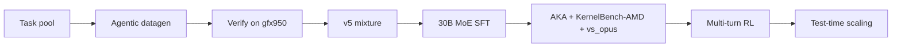

# KORE

KORE trains `Qwen/Qwen3-Coder-30B-A3B-Instruct` to write and optimize GPU
kernels for AMD Instinct MI355X (`gfx950`, CDNA4: 256 compute units, 160 KB
LDS per compute unit, 32 XCDs, 64-lane wavefronts), in the three languages AMD
ships kernels in: Triton, HIP C++, and FlyDSL (AMD's MLIR-native tile/layout
DSL). Every candidate kernel is compiled, checked against a numerical oracle,
and only then timed. A fast wrong kernel receives no speed credit.

The production backbone is `Qwen/Qwen3-Coder-30B-A3B-Instruct`: 30.5B
parameters total, 3.3B active per token, 48 layers, 128 experts, and 8
selected experts per token. It is chosen for code and tool use, and its active
MoE compute is about ten times lower than a comparable 32B dense model while
retaining comparable memory requirements. The pinned, full-parameter SFT
recipe is [`configs/sft_coder30b_a3b.json`](configs/sft_coder30b_a3b.json).

## Status

**All four stages have run. The cycle is complete and stopped, not converged.**
Supervised fine-tuning finished, multi-turn RL ran for 31 of a configured 1,000
optimizer steps, and all four arms were scored on the same 416 AgentKernelArena
tasks. The numbers below are measured, and the ledgers behind them are committed
under [`docs/evidence/rl_v5_frontier/`](docs/evidence/rl_v5_frontier/).

| Arm | Correct | Compiles | Speedup (geomean, own correct set) |
| --- | --- | --- | --- |
| Base `Qwen3-Coder-30B-A3B-Instruct` | 28.6% | 49.0% | 0.841x |
| + supervised fine-tuning | 52.4% | 82.7% | 0.951x |
| + multi-turn RL, step 30 | **62.3%** | **93.8%** | 0.955x |
| Claude Opus (external bar) | 67.3% | 78.8% | 1.617x |

**RL bought correctness and did not buy speed.** Paired on identical task IDs
against the fine-tuned model, RL fixed 63 tasks and broke 22, McNemar z = 4.34
with continuity correction — a net 41 tasks, or 9.9 points. Compile rate rose
11.1 points. On the 186 tasks where both models produced a correct, timed
kernel, the geometric means are 0.940x and 0.878x, a ratio of 0.934x with a
paired t of -2.84 on the log ratio; RL is faster on 56 of the 186. So speed
regressed slightly rather than holding flat.

The leading explanation is a configuration bug rather than a limit of the
method. `overlong_buffer_len` was 512 against a `max_response_length` of 1024,
so the overlong mask dropped every response of 512 tokens or more instead of
only the truncated tail. Counted from the committed event log that is **908**
discarded samples across 31 steps, a mean of 29.3 per step, and it falls
hardest on long responses — which is where optimised kernels live.
[`HANDOVER.md`](HANDOVER.md) has the three-part fix, cheapest first.

Two caveats on that table. Opus was measured against its own baseline ledger,
so its speedup rests on a different denominator — the correctness and compile
columns are directly comparable, the speedup column is not. And the base-model
ledger is the one row not committed here, so it is the only figure a reader
cannot re-derive from this repository.

| | |
| --- | --- |
| Model | `Qwen/Qwen3-Coder-30B-A3B-Instruct`, full-parameter SFT, then GRPO with TRLOO |
| SFT | 1,609 optimizer steps, 1 epoch over 206,000 rows, 8x MI355X |
| RL | 31 of 1,000 steps, 2026-08-27 to 2026-08-30, 81.8 h at world size 8 |
| Recipe | [`configs/sft_coder30b_a3b.json`](configs/sft_coder30b_a3b.json), then [`configs/grpo_coder30b_a3b_trloo_frontier.json`](configs/grpo_coder30b_a3b_trloo_frontier.json) |
| Checkpoints | **Not in this repository.** ~488 GB each; see [`HANDOVER.md`](HANDOVER.md) |

**Training data.** The v5 mixture is 206,000 rows / 490,174,073 tokens, 61.38%
kernel and 38.62% replay by rows, spanning six task shapes: optimize, repair,
PyTorch-to-kernel, spec-to-kernel, dialect port, and language fluency. A
held-out evaluation split of 899 rows across 8 capability groups is scored
during training and has zero row-level overlap with the training set.
Kernel-language rows split Triton 61.2% / HIP 32.3% / FlyDSL 6.5%. See
[`docs/DATASET_SPEC.md`](docs/DATASET_SPEC.md) for the dataset contract and
[`DATAGEN_OVERVIEW.md`](DATAGEN_OVERVIEW.md) for how the corpus is mined,
generated, and verified on hardware.

**Why six task shapes, not one.** The prior SFT mixture was 69,851 rows and
taught a single task shape: "here is a slow kernel, make it
faster." Evaluated on AgentKernelArena it scored 55.1% against a 55.9%
baseline: supervised fine-tuning made the model *worse*. The diagnosis was
shape monoculture, not insufficient volume, which is why v5 was built around
the five other shapes the benchmark actually asks for.

Mind the naming trap when you go looking for that mixture. The 69,851-row file
is `data/b05factory/sft/multicap_v3.jsonl`, which
[`configs/sft_coder30b_a3b.json`](configs/sft_coder30b_a3b.json) labels v3 in
`_comment_dataset_path_v3` (69,851 rows, ~255M tokens) — but every v5 build
script calls it "v4", because `scripts/v5_stage4_mixture.py` binds `V4_SFT` to
that path. A separate `multicap_v4.jsonl` also exists and is a different
artifact: 244,732 rows, counted by reassembling the release parts and matching
[`data/release/sft/multicap_v4.manifest.json`](data/release/sft/multicap_v4.manifest.json),
and described by the same config's `_comment_dataset_path`. The 288.4M token
figure this paragraph used to carry belongs to neither file.

**Where to look next.** [`HANDOVER.md`](HANDOVER.md) is the map: where every
artifact lives, what is missing, and three defects found and deliberately left
open. [`docs/REPRODUCING.md`](docs/REPRODUCING.md) is honest about which stages
a stranger can rerun and which they cannot.
[`docs/evidence/RL_RUN_PROVENANCE.md`](docs/evidence/RL_RUN_PROVENANCE.md)
records exactly what the RL run did.
[`docs/SFT_READINESS.md`](docs/SFT_READINESS.md) is the pre-launch checklist
that run went through, and
[`docs/CLUSTER_OPERATIONS.md`](docs/CLUSTER_OPERATIONS.md) covers how a run is
scheduled, supervised, and resumed here. Each stage was evaluated against the
exact checkpoint it started from before the next stage consumed it (see
[`kore/eval/README.md`](kore/eval/README.md)).

## The production path


```mermaid
flowchart LR
  P[Task pool] --> D[Agentic datagen]
  D --> V[Verify on gfx950]
  V --> M[v5 mixture]
  M --> F[30B MoE SFT]
  F --> E[AKA + KernelBench-AMD + vs_opus]
  E --> R[Multi-turn RL]
  R --> T[Test-time scaling]
```

1. `scripts/build_task_pool.py` mines external PyTorch modules without
   changing the content-addressed registry. The pool is screened against
   held-out KORE tasks and KernelBench, deduplicated, and materialized with
   the same task ABI. The current inventory is 14,859 plannable tasks and
   14,461 eligible tasks: 13,570 are external and 398 registry seeds are
   excluded by the held-out screen.
2. `scripts/spur_data_driver.sh` waits for the pool before it saturates
   datagen; task diversity, not raw episode count, limits non-redundant
   trajectories. The QoS cap is six concurrent nodes. Measured datagen is
   462–469 kept episodes per node-hour at 100% keep rate.
3. `kore/verify/` proves every candidate numerically before anything downstream
   sees it, a four-prong oracle (reseeded random trials, adversarial fills,
   metamorphic relations, determinism) that runs identically in datagen and in
   training. `kore/data/step_centric.py` then keeps only the revisions that
   fix a broken kernel or improve measured speed by at least 5%, so the
   supervision teaches local improvement rather than search flailing.
4. `kore/reward/` shapes the training signal on top of that verified outcome:
   a lexicographic ladder where correctness always dominates speed, plus a
   roofline-derived shaping potential. The roofline is an integrity ceiling
   and a variance-reduction heuristic, not a validated speed predictor. See
   [`docs/P0_RESULTS.md`](docs/P0_RESULTS.md).
5. `kore/policy/sft.py` runs the full-parameter SFT stage described in
   [Status](#status) above, from the vendor instruct checkpoint. There is no
   production continued-pretraining, chat-vector merge, or DPO stage. This
   stage completed and took correctness from 28.6% to 52.4%.
6. `kore/policy/grpo.py` runs multi-turn RL via GRPO after SFT, and it ran for
   this cycle — 31 steps, taking correctness to 62.3%. Multi-turn RL consumes
   execution feedback directly. Kernel quality is verifiable by compile,
   correctness, and timing, which is a stronger signal than an offline
   preference pair, and the multi-turn path avoids applying a plain GRPO
   estimator to a setting where its policy gradient is biased. Credit is
   assigned per turn by TRLOO, a turn-level REINFORCE leave-one-out estimator.

## Why the older recipe is not production

The former 14B path was `base → CPT → chat-vector merge → SFT → DPO → GRPO`.
It is retained only as experimental history. No eligible 30B-class Qwen has a
Base variant: Qwen3-32B, Qwen3.6-35B-A3B, and Qwen3-Coder-30B-A3B are all
instruct-only. CPT requires a Base model; the residual transfer requires a
same-family Base/Instruct pair.

This is not only a packaging constraint. The 14B experiment documented in
[`docs/EVAL_RESULTS.md`](docs/EVAL_RESULTS.md) found that CPT on an instruct
model improved the raw-code objective while destroying instruction-following and
kernel generation. `scripts/spur_pipeline_driver.sh` therefore defaults
`KORE_RECIPE=direct`; `KORE_RECIPE=cpt` is a legacy 14B-only branch.

## Measurement discipline

The registry has 1,546 tasks (1,334 Triton, a 188-task HIP C++ family, and a
24-task spec-synthesis family). 110
are vendor-lane tasks: 63 declare AITER and 4
declare hipBLASLt; runtime resolution adds 35 `gemm_fusion` hipBLASLt tasks and
8 gated activations backed by AITER. The remaining 93%, including all 1,052
generated breadth tasks and the whole HIP family, are torch-lane tasks. Vendor
and torch speedups must not be pooled: a torch-lane result does not establish a
production-library win.

Two of those families are not "optimize this kernel": a spec-synthesis task
carries its contract in prose and its seed is a signature stub, because the
corpus was already 90.9% synthesis (the 13,570 external-pool seeds alias eager
torch) and what was missing was a specification the model has to *read* rather
than a reference it can paraphrase. Measure the split yourself with
`scripts/seed_provenance_partition.py`.

Every HIP task is proven runnable on real gfx950 before it is counted: compiled,
verified through the same oracle, and timed under the same publication protocol.
The evidence is `data/hip_task_verification.json`. A HIP task whose torch
baseline is a multi-kernel CHAIN is graded against `torch.compile`, not against
unfused eager torch, so its speedup is not a measurement of the compiler's absence.

The production correctness oracle combines reseeded random trials, adversarial
fills when `KORE_VERIFIED_CORRECTNESS=1`, determinism, and post-timing
re-verification. Metamorphic checks are fail-closed for the 168 generated tasks
whose generator contracts prove a relation. Timing alternates candidate and
baseline under cold-cache, variance-gated measurement.

Roofline bounds remain an integrity ceiling and an optional shaping potential,
not a demonstrated speed predictor. The residual study was retracted as a
shared-denominator artifact; [`docs/P0_RESULTS.md`](docs/P0_RESULTS.md) records
the `INTEGRITY_ONLY` verdict.

## Evaluation

`scripts/run_agent_kernel_arena.py` evaluates AgentKernelArena in copied
workspaces using its compile → correctness → performance contract and its score.
The gfx950 filter admits 416 of the benchmark's 426 tasks, measured with
`run_agent_kernel_arena.py discover` against AKA `b09f5eb`. Published Claude
Opus comparison means are 6.89x (`torch2hip`), 6.69x (`hip2hip`), and 2.13x
(`triton2triton`); these are external bars, not KORE claims.

For KernelBench Triton, Kernel-Smith-235B reports 3.70 average speedup versus
3.33 for Claude-4.6-opus. Dr. Kernel-14B reports 31.6% single-pass and 47.8%
with test-time scaling on KernelBench L2, compared with GPT-5 at 28.6% and
Claude-4.5-Sonnet at 26.7%. KORE reports its own results through
KernelBench-AMD and paired `vs_opus` evaluation rather than importing those
numbers as its own. Per [Status](#status), KORE's own arms have now been scored
on AgentKernelArena: 62.3% correct at the RL step-30 checkpoint against 67.3%
for Opus on the same 416 tasks. KORE has not been scored on KernelBench L2, so
none of the Dr. Kernel or Kernel-Smith figures above is a comparison against a
KORE result.

## Operations

Corpus generation, SFT, RL and evaluation have all run; there is no active
cluster work. Scheduling and supervision are documented in
[`docs/CLUSTER_OPERATIONS.md`](docs/CLUSTER_OPERATIONS.md), which also records
which account and QoS pairings actually schedule here — a pairing can be
accepted by `sbatch` and then never become a scheduling candidate. The data
driver stops before training and leaves `runs/DATA_NOT_FINAL` in place for human
review; that sentinel is not removed automatically, and a fresh datagen pass
would still need to go through it.

For the production SFT invocation and the checkpoint storage constraint, see
[`docs/DISTRIBUTED.md`](docs/DISTRIBUTED.md). A 30B checkpoint is about 488 GB;
`save_total_limit` is sized against the shared volume's free space, which is
re-measured before each launch rather than assumed. It was 2 for these runs, so
older checkpoints were rotated out by design — which is why
[`HANDOVER.md`](HANDOVER.md) treats rescuing the surviving ones as urgent.

## Release prerequisites

[`LICENSE`](LICENSE) declares the repository AMD-internal and not for external
release. [`THIRD_PARTY.md`](THIRD_PARTY.md) contains the required attribution.
Do not publish source, weights, a dataset, or a build artifact without a new
authorized release decision.

## Testing

```bash
PYTHONPATH=. /home/shasriva/kore-venv/bin/python -m pytest tests/ -q \
  -p no:warnings
```

No deselection flag is needed. `pyproject.toml`'s `addopts` already applies
`-m "not gpu and not release"`, which selects by *marker*. An earlier revision
of this command passed `-k "not gpu"`, which filters by test *name*: it
deselected every test with "gpu" in its id, GPU-marked or not, and kept every
`@pytest.mark.gpu` test whose name happens not to contain the substring.

## Documentation

- [`docs/README.md`](docs/README.md): evidence and decisions
- [`docs/DATASET_SPEC.md`](docs/DATASET_SPEC.md): dataset contract
- [`DATAGEN_OVERVIEW.md`](DATAGEN_OVERVIEW.md): how the v5 corpus is built and verified
- [`docs/SFT_READINESS.md`](docs/SFT_READINESS.md): pre-launch checklist for the current run
- [`docs/CLUSTER_OPERATIONS.md`](docs/CLUSTER_OPERATIONS.md): scheduling, supervision, and resume procedure
- [`docs/DISTRIBUTED.md`](docs/DISTRIBUTED.md): 30B FSDP launch
- [`kore/data/README.md`](kore/data/README.md): data factory
- [`kore/eval/README.md`](kore/eval/README.md): evaluation harnesses
