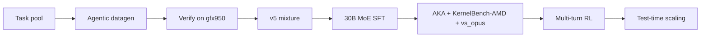

# KORE

KORE trains `Qwen/Qwen3-Coder-30B-A3B-Instruct` to write and optimize GPU
kernels for AMD Instinct MI355X (`gfx950`, CDNA4: 256 compute units, 160 KB
LDS per compute unit, 32 XCDs, 64-lane wavefronts), in the three languages AMD
ships kernels in: Triton, HIP C++, and FlyDSL (AMD's MLIR-native tile/layout
DSL). Every candidate kernel is compiled, checked against a numerical oracle,
and only then timed. A fast wrong kernel receives no speed credit.

The production backbone is `Qwen/Qwen3-Coder-30B-A3B-Instruct`: 30.5B
parameters total, 3.3B active per token, 48 layers, 128 experts, and 8
selected experts per token. It is chosen for code and tool use, and its active
MoE compute is about ten times lower than a comparable 32B dense model while
retaining comparable memory requirements. The pinned, full-parameter SFT
recipe is [`configs/sft_coder30b_a3b.json`](configs/sft_coder30b_a3b.json).

## Status

**KORE is running its first full v5 supervised fine-tuning job. No
post-training result exists yet.** Nothing below this line is a model
capability claim; it describes the pipeline and the state of training.

| | |
| --- | --- |
| Stage | v5 SFT training in progress, the first full run on the v5 mixture |
| Model | `Qwen/Qwen3-Coder-30B-A3B-Instruct`, full-parameter SFT |
| Hardware | 8x MI355X, one node, `amd-primus-qos` (guaranteed pool) |
| Schedule | 1,609 optimizer steps, 1 epoch, ~29 hours expected |
| Launcher | [`scripts/sft_supervise_v5.sh`](scripts/sft_supervise_v5.sh) over [`scripts/spur_sft_1node.sbatch`](scripts/spur_sft_1node.sbatch) |

**Training data.** The v5 mixture is 206,000 rows / 490,174,073 tokens, 61.2%
kernel and 38.8% replay by rows, spanning six task shapes: optimize, repair,
PyTorch-to-kernel, spec-to-kernel, dialect port, and language fluency. A
held-out evaluation split of 899 rows across 8 capability groups is scored
during training and has zero row-level overlap with the training set.
Kernel-language rows split Triton 61.2% / HIP 32.3% / FlyDSL 6.5%. See
[`docs/DATASET_SPEC.md`](docs/DATASET_SPEC.md) for the dataset contract and
[`DATAGEN_OVERVIEW.md`](DATAGEN_OVERVIEW.md) for how the corpus is mined,
generated, and verified on hardware.

**Why six task shapes, not one.** The prior dataset, v4 (69,851 rows / 288.4M
tokens), taught a single task shape: "here is a slow kernel, make it
faster." Evaluated on AgentKernelArena it scored 55.1% against a 55.9%
baseline: supervised fine-tuning made the model *worse*. The diagnosis was
shape monoculture, not insufficient volume, which is why v5 was built around
the five other shapes the benchmark actually asks for.

**Where to look next.** [`docs/SFT_READINESS.md`](docs/SFT_READINESS.md) is
the pre-launch checklist this run went through.
[`docs/CLUSTER_OPERATIONS.md`](docs/CLUSTER_OPERATIONS.md) covers how a run is
scheduled, supervised, and resumed on this cluster. Once training finishes,
the SFT checkpoint is evaluated against the exact instruct checkpoint it
started from before any downstream stage consumes it (see
[`kore/eval/README.md`](kore/eval/README.md)).

## The production path


```mermaid
flowchart LR
  P[Task pool] --> D[Agentic datagen]
  D --> V[Verify on gfx950]
  V --> M[v5 mixture]
  M --> F[30B MoE SFT]
  F --> E[AKA + KernelBench-AMD + vs_opus]
  E --> R[Multi-turn RL]
  R --> T[Test-time scaling]
```

1. `scripts/build_task_pool.py` mines external PyTorch modules without
   changing the content-addressed registry. The pool is screened against
   held-out KORE tasks and KernelBench, deduplicated, and materialized with
   the same task ABI. The current inventory is 14,859 plannable tasks and
   14,461 eligible tasks: 13,570 are external and 398 registry seeds are
   excluded by the held-out screen.
2. `scripts/spur_data_driver.sh` waits for the pool before it saturates
   datagen; task diversity, not raw episode count, limits non-redundant
   trajectories. The QoS cap is six concurrent nodes. Measured datagen is
   462–469 kept episodes per node-hour at 100% keep rate.
3. `kore/verify/` proves every candidate numerically before anything downstream
   sees it, a four-prong oracle (reseeded random trials, adversarial fills,
   metamorphic relations, determinism) that runs identically in datagen and in
   training. `kore/data/step_centric.py` then keeps only the revisions that
   fix a broken kernel or improve measured speed by at least 5%, so the
   supervision teaches local improvement rather than search flailing.
4. `kore/reward/` shapes the training signal on top of that verified outcome:
   a lexicographic ladder where correctness always dominates speed, plus a
   roofline-derived shaping potential. The roofline is an integrity ceiling
   and a variance-reduction heuristic, not a validated speed predictor. See
   [`docs/P0_RESULTS.md`](docs/P0_RESULTS.md).
5. `kore/policy/sft.py` runs the full-parameter SFT stage described in
   [Status](#status) above, from the vendor instruct checkpoint. There is no
   production continued-pretraining, chat-vector merge, or DPO stage.
6. `kore/policy/grpo.py` runs multi-turn RL via GRPO after SFT; it has not yet
   started for this cycle. Multi-turn RL consumes execution feedback directly.
   Kernel quality is verifiable by compile, correctness, and timing, which
   is a stronger signal than an offline preference pair, and the multi-turn
   path avoids applying a plain GRPO estimator to a setting where its policy
   gradient is biased.

## Why the older recipe is not production

The former 14B path was `base → CPT → chat-vector merge → SFT → DPO → GRPO`.
It is retained only as experimental history. No eligible 30B-class Qwen has a
Base variant: Qwen3-32B, Qwen3.6-35B-A3B, and Qwen3-Coder-30B-A3B are all
instruct-only. CPT requires a Base model; the residual transfer requires a
same-family Base/Instruct pair.

This is not only a packaging constraint. The 14B experiment documented in
[`docs/EVAL_RESULTS.md`](docs/EVAL_RESULTS.md) found that CPT on an instruct
model improved the raw-code objective while destroying instruction-following and
kernel generation. `scripts/spur_pipeline_driver.sh` therefore defaults
`KORE_RECIPE=direct`; `KORE_RECIPE=cpt` is a legacy 14B-only branch.

## Measurement discipline

The registry has 1,546 tasks (1,334 Triton, a 188-task HIP C++ family, and a
24-task spec-synthesis family). 110
are vendor-lane tasks: 63 declare AITER and 4
declare hipBLASLt; runtime resolution adds 35 `gemm_fusion` hipBLASLt tasks and
8 gated activations backed by AITER. The remaining 93%, including all 1,052
generated breadth tasks and the whole HIP family, are torch-lane tasks. Vendor
and torch speedups must not be pooled: a torch-lane result does not establish a
production-library win.

Two of those families are not "optimize this kernel": a spec-synthesis task
carries its contract in prose and its seed is a signature stub, because the
corpus was already 90.9% synthesis (the 13,570 external-pool seeds alias eager
torch) and what was missing was a specification the model has to *read* rather
than a reference it can paraphrase. Measure the split yourself with
`scripts/seed_provenance_partition.py`.

Every HIP task is proven runnable on real gfx950 before it is counted: compiled,
verified through the same oracle, and timed under the same publication protocol.
The evidence is `data/hip_task_verification.json`. A HIP task whose torch
baseline is a multi-kernel CHAIN is graded against `torch.compile`, not against
unfused eager torch, so its speedup is not a measurement of the compiler's absence.

The production correctness oracle combines reseeded random trials, adversarial
fills when `KORE_VERIFIED_CORRECTNESS=1`, determinism, and post-timing
re-verification. Metamorphic checks are fail-closed for the 168 generated tasks
whose generator contracts prove a relation. Timing alternates candidate and
baseline under cold-cache, variance-gated measurement.

Roofline bounds remain an integrity ceiling and an optional shaping potential,
not a demonstrated speed predictor. The residual study was retracted as a
shared-denominator artifact; [`docs/P0_RESULTS.md`](docs/P0_RESULTS.md) records
the `INTEGRITY_ONLY` verdict.

## Evaluation

`scripts/run_agent_kernel_arena.py` evaluates AgentKernelArena in copied
workspaces using its compile → correctness → performance contract and its score.
The gfx950 filter admits 402 of the benchmark's 412 tasks. Published Claude
Opus comparison means are 6.89x (`torch2hip`), 6.69x (`hip2hip`), and 2.13x
(`triton2triton`); these are external bars, not KORE claims.

For KernelBench Triton, Kernel-Smith-235B reports 3.70 average speedup versus
3.33 for Claude-4.6-opus. Dr. Kernel-14B reports 31.6% single-pass and 47.8%
with test-time scaling on KernelBench L2, compared with GPT-5 at 28.6% and
Claude-4.5-Sonnet at 26.7%. KORE reports its own results through
KernelBench-AMD and paired `vs_opus` evaluation rather than importing those
numbers as its own. Per [Status](#status), no KORE checkpoint has been
scored against any of these yet: the v5 SFT run in progress is the first
candidate.

## Operations

Corpus generation for v5 is complete; the current cluster activity is the SFT
run described in [Status](#status), scheduled and supervised as documented in
[`docs/CLUSTER_OPERATIONS.md`](docs/CLUSTER_OPERATIONS.md). The data driver
itself stops before training and leaves `runs/DATA_NOT_FINAL` in place for
human review; that sentinel is not removed automatically, and a fresh datagen
pass would still need to go through it.

For the production SFT invocation and the checkpoint storage constraint, see
[`docs/DISTRIBUTED.md`](docs/DISTRIBUTED.md). A 30B checkpoint is about 488 GB;
`save_total_limit` is sized against the shared volume's free space, which is
re-measured before each launch rather than assumed.

## Release prerequisites

[`LICENSE`](LICENSE) declares the repository AMD-internal and not for external
release. [`THIRD_PARTY.md`](THIRD_PARTY.md) contains the required attribution.
Do not publish source, weights, a dataset, or a build artifact without a new
authorized release decision.

## Testing

```bash
PYTHONPATH=. /home/shasriva/kore-venv/bin/python -m pytest tests/ -q \
  -p no:warnings -k "not gpu"
```

## Documentation

- [`docs/README.md`](docs/README.md): evidence and decisions
- [`docs/DATASET_SPEC.md`](docs/DATASET_SPEC.md): dataset contract
- [`DATAGEN_OVERVIEW.md`](DATAGEN_OVERVIEW.md): how the v5 corpus is built and verified
- [`docs/SFT_READINESS.md`](docs/SFT_READINESS.md): pre-launch checklist for the current run
- [`docs/CLUSTER_OPERATIONS.md`](docs/CLUSTER_OPERATIONS.md): scheduling, supervision, and resume procedure
- [`docs/DISTRIBUTED.md`](docs/DISTRIBUTED.md): 30B FSDP launch
- [`kore/data/README.md`](kore/data/README.md): data factory
- [`kore/eval/README.md`](kore/eval/README.md): evaluation harnesses
