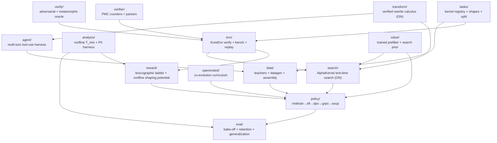

# `kore/` - the KORE package

The `kore` package is the whole KORE system: task registry, verified GPU environment, physics reward, correctness oracle, data factory, policy-training stages, and evaluation. This page is the **module map**; each subpackage has its own README with per-file detail, schemas, and diagrams.

For the project overview, science, and how to run a campaign, see the [repository README](../README.md).

> **Paradigm-v2.** The flagship RL signal was upgraded: the within-turn terminal reward is the high-contrast vendor-relative **speedup** (`reward/`), and the roofline attainment now enters credit as an **approximately policy-invariant shaping potential** (`reward/whitebox.py` + `reward/shaping.py`) that densifies per-turn credit in `policy/grpo.py` — online it is the PMC-free `η`; the validated named-residual `ρ` is offline-only so far (the #1 open item); the `value/` model is now trained from the run's own ranked groups. Four further subsystems are now **wired into the live pipeline and turned ON in the flagship** (each fail-safe + unit-tested): `transform/` - the verified ε-typed rewrite calculus, exposed to the agent as `list_transforms`/`apply_transform` tools (`agentic_transform_tools: true`); `search/` - AlphaKernel value-guided test-time search via the production `search/propose.py`, run as a throttled, off-policy search-then-distill hook (`use_search: true`, `search_budget: 16`, `search_every: 50`); `openended/minter.py` + `openended/materialize.py` - open-ended task minting materialized into runnable dirs with a self-check (`coevolve_mint: true`, `coevolve_mint_batch: 6`); and the `eval/` frontier suite, wired into the campaign eval stage. See [What's new: paradigm-v2](../README.md#whats-new-paradigm-v2).

---

## Subpackage map

Arrows show the primary "consumed-by" direction. `analysis` and `reward` share the roofline/physics math (`analysis` for offline study, `reward` for the live training signal).

---

## Subpackages

| Package | One-line purpose | README |
| --- | --- | --- |
| [`tasks`](tasks/README.md) | 282 kernel optimization tasks: reference oracle, vendor baseline, shapes, deterministic train/held-out split | [→](tasks/README.md) |
| [`env`](env/README.md) | `KoreEnv`: sandboxed compile → correctness → cold-cache bench → optional PMC, with a JSONL replay cache | [→](env/README.md) |
| [`analysis`](analysis/README.md) | Roofline `T_min`/`η` model, the P0 falsification harness, and the cross-family transfer crux | [→](analysis/README.md) |
| [`reward`](reward/README.md) | The lexicographic anti-hack reward ladder, the physics residual-descent reward, and the *approximately* policy-invariant roofline **shaping potential** (online `η`; `whitebox.phi_potential`, `shaping.py`) | [→](reward/README.md) |
| [`verify`](verify/README.md) | Four-prong equivalence oracle (random + adversarial + metamorphic + determinism) | [→](verify/README.md) |
| [`verifier`](verifier/README.md) | rocprofv3 PMC counter sets and CSV / compiler-output parsers | [→](verifier/README.md) |
| [`data`](data/README.md) | Teacher backends + datagen (repair/groups/wins/agentic) + leakage-aware dataset assembly | [→](data/README.md) |
| [`agent`](agent/README.md) | `AgentHarness` multi-turn Hermes tool-use loop (build/test/bench/pmc/keep/revert) | [→](agent/README.md) |
| [`openended`](openended/README.md) | Open-ended co-evolution: task-frontier proposer (learnability/regret/novelty) + archive + verifiable task **minter** (`minter.py` + `materialize.py`, **wired + ON, fail-safe**: `coevolve_mint: true` mints net-new correct-by-construction tasks into runnable dirs with a materialize-time self-check, served by the `CoevolutionController`) | [→](openended/README.md) |
| [`policy`](policy/README.md) | The five training stages + configs, FSDP wiring, and prompt/response contract | [→](policy/README.md) |
| [`value`](value/README.md) | Cheap 3-head surrogate (P(compile), P(SNR), E[log speedup]) for GRPO bench prefiltering; **trained from the run's own ranked groups** (`replay_train.py`), feeding the prefilter + search prior | [→](value/README.md) |
| [`eval`](eval/README.md) | Matched-budget bake-off, `fast_p`, retention gate, generalization, champion re-eval + frontier suite (KernelBench-AMD, robust-kbench, paired stats) | [→](eval/README.md) |
| [`search`](search/alphakernel.py) | **(paradigm-v2, wired + ON, fail-safe)** AlphaKernel value-guided test-time search over kernel transformations (verifier as simulator + roofline admissible bound), driven by the production `ProposePolicy` (`search/propose.py`) as a throttled, off-policy search-then-distill hook (`use_search: true`, `search_budget: 16`, `search_every: 50`) that banks faster verified kernels as distillation targets | [→](search/alphakernel.py) |
| [`transform`](transform/__init__.py) | **(paradigm-v2, wired + ON, fail-safe)** verified ε-typed rewrite calculus - a safe RL action space (exact `≡` / approx `≈_ε` with an error budget), exposed to the agent as `list_transforms`/`apply_transform` tools (`agentic_transform_tools: true`; pure CPU rewrites, the env still verifies) | [→](transform/__init__.py) |

---

## Top-level modules

| Module | Purpose |
| --- | --- |
| `config.py` | The central `CONFIG` dataclass: all reward weights, bench variance knobs, and env-var overrides. Reward-ladder dominance invariants are enforced in `__post_init__`. |
| `obs.py` | Structured JSONL logging, stage timers, progress + heartbeat events (drives `events.jsonl`). |
| `cli.py` | The `kore` command-line entrypoint (`kore tasks`, `kore eval`, stage helpers). |

---

## Conventions

- **Lazy heavy imports.** `torch`, `transformers`, `vllm`, and `anthropic` are imported *inside* functions, so the package imports on a CPU box and unit tests stay GPU-free.
- **Lexicographic reward dominance.** Correctness always dominates speed; `CONFIG.__post_init__` asserts `reward_hack < reward_compile_fail < reward_incorrect < correctness_weight` and that shaping/format/profile bonuses can never cross a tier boundary.
- **Approximately policy-invariant densification (paradigm-v2).** The roofline attainment (online the PMC-free `η`; the named-residual `ρ` is offline-validated only) is added as Ng-Harada-Russell potential-based shaping (`F = γ·Φ' − Φ`), densifying per-turn credit toward Speed-of-Light as an expected-gradient-neutral state-dependent baseline. The invariance is **approximate, not an at-any-weight theorem** here (GRPO's std-normalized group-relative advantage + the correct→incorrect boundary leave a small bounded ≤~0.06 leak); the true anti-hack spine is the lexicographic correctness gate + bounded action space.
- **Verifiability first.** No reward is granted to an unverified kernel; timing is cold-cache and re-checked after benching to defeat stateful-timing hacks.
- **Held-out discipline.** The MLA (latent attention) and paged-KV decode families are reserved whole by the registry, along with any task targeting a foreign arch (outside the `gfx950`/`gfx942` lineage); core attention still trains for product capability. Training data-gen and eval both honor the split by *family*, so no generated or mined variant of a held-out family can leak into training.
