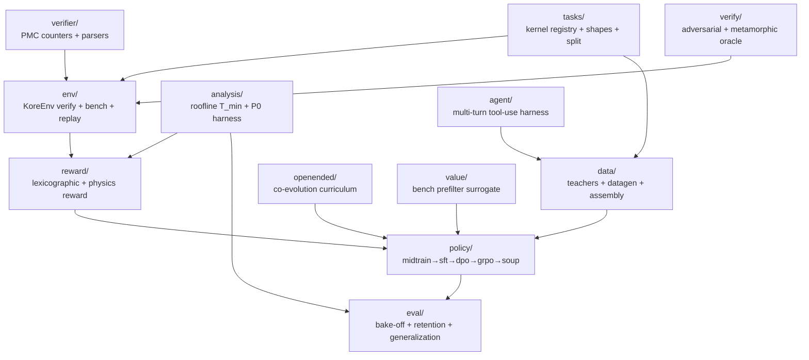

# `kore/` - the KORE package

The `kore` package is the whole KORE system: task registry, verified GPU environment, physics reward, correctness oracle, data factory, policy-training stages, and evaluation. This page is the **module map**; each subpackage has its own README with per-file detail, schemas, and diagrams.

For the project overview, science, and how to run a campaign, see the [repository README](../README.md).

---

## Subpackage map

Arrows show the primary "consumed-by" direction. `analysis` and `reward` share the roofline/physics math (`analysis` for offline study, `reward` for the live training signal).

---

## Subpackages

| Package | One-line purpose | README |
| --- | --- | --- |
| [`tasks`](tasks/README.md) | 251 kernel optimization tasks: reference oracle, vendor baseline, shapes, deterministic train/held-out split | [→](tasks/README.md) |
| [`env`](env/README.md) | `KoreEnv`: sandboxed compile → correctness → cold-cache bench → optional PMC, with a JSONL replay cache | [→](env/README.md) |
| [`analysis`](analysis/README.md) | Roofline `T_min`/`η` model, the P0 falsification harness, and the cross-family transfer crux | [→](analysis/README.md) |
| [`reward`](reward/README.md) | The lexicographic anti-hack reward ladder and the physics residual-descent reward | [→](reward/README.md) |
| [`verify`](verify/README.md) | Four-prong equivalence oracle (random + adversarial + metamorphic + determinism) | [→](verify/README.md) |
| [`verifier`](verifier/README.md) | rocprofv3 PMC counter sets and CSV / compiler-output parsers | [→](verifier/README.md) |
| [`data`](data/README.md) | Teacher backends + datagen (repair/groups/wins/agentic) + leakage-aware dataset assembly | [→](data/README.md) |
| [`agent`](agent/README.md) | `AgentHarness` multi-turn Hermes tool-use loop (build/test/bench/pmc/keep/revert) | [→](agent/README.md) |
| [`openended`](openended/README.md) | Open-ended co-evolution: task-frontier proposer (learnability/regret/novelty) + archive | [→](openended/README.md) |
| [`policy`](policy/README.md) | The five training stages + configs, FSDP wiring, and prompt/response contract | [→](policy/README.md) |
| [`value`](value/README.md) | Cheap 3-head surrogate (P(compile), P(SNR), E[log speedup]) for GRPO bench prefiltering | [→](value/README.md) |
| [`eval`](eval/README.md) | Matched-budget bake-off, `fast_p`, retention gate, generalization, champion re-eval | [→](eval/README.md) |

---

## Top-level modules

| Module | Purpose |
| --- | --- |
| `config.py` | The central `CONFIG` dataclass: all reward weights, bench variance knobs, and env-var overrides. Reward-ladder dominance invariants are enforced in `__post_init__`. |
| `obs.py` | Structured JSONL logging, stage timers, progress + heartbeat events (drives `events.jsonl`). |
| `cli.py` | The `kore` command-line entrypoint (`kore tasks`, `kore eval`, stage helpers). |

---

## Conventions

- **Lazy heavy imports.** `torch`, `transformers`, `vllm`, and `anthropic` are imported *inside* functions, so the package imports on a CPU box and unit tests stay GPU-free.
- **Lexicographic reward dominance.** Correctness always dominates speed; `CONFIG.__post_init__` asserts `reward_hack < reward_compile_fail < reward_incorrect < correctness_weight` and that shaping/format/profile bonuses can never cross a tier boundary.
- **Verifiability first.** No reward is granted to an unverified kernel; timing is cold-cache and re-checked after benching to defeat stateful-timing hacks.
- **Held-out discipline.** The MLA (latent attention) and paged-KV decode families are reserved whole by the registry, along with any task targeting a foreign arch (outside the `gfx950`/`gfx942` lineage); core attention still trains for product capability. Training data-gen and eval both honor the split by *family*, so no generated or mined variant of a held-out family can leak into training.
