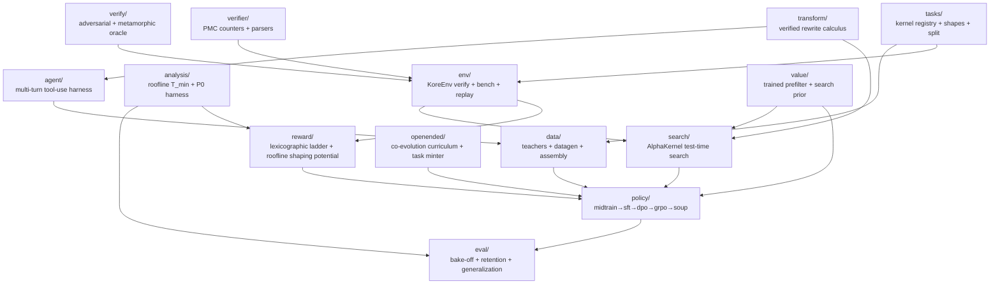

# `kore/` — the KORE package

The `kore` package is the whole KORE system: the kernel task registry, the verified GPU environment, the physics-grounded reward, the correctness oracle, the data factory, the policy-training stages, and evaluation. This page is the **module map**; each subpackage has its own README with per-file detail, schemas, and diagrams.

For the project overview, method, and how to run a campaign, see the [repository README](../README.md).

The within-turn terminal reward is the high-contrast, vendor-relative **speedup**, awarded only after correctness is proven (`reward/`). Roofline attainment enters credit assignment as a **potential-based shaping** term that densifies per-turn progress toward the hardware limit (`reward/whitebox.py`, `reward/shaping.py`, applied in `policy/grpo.py`): online the potential is the PMC-free `η = T_min/T_measured`; when rocprofv3 counters are available it refines to the named residual `ρ = T_min/(T_min + N)` (validated offline at R²≈0.98, see [`docs/P0_RESULTS.md`](../docs/P0_RESULTS.md)). The `value/` model is trained from the run's own ranked groups and drives the bench prefilter and the search prior. Four subsystems extend the live GRPO loop, each fail-safe and unit-tested: the ε-typed rewrite calculus (`transform/`, exposed to the agent as `list_transforms` / `apply_transform`), value-guided test-time search (`search/`, a throttled off-policy search-then-distill hook), open-ended task minting (`openended/minter.py` + `materialize.py`), and the `eval/` frontier suite. See [Method](../README.md#method).

---

## Subpackage map

Arrows show the primary "consumed-by" direction. `analysis` and `reward` share the roofline/physics math (`analysis` for offline study, `reward` for the live training signal).

---

## Subpackages

| Package | One-line purpose | README |
| --- | --- | --- |
| [`tasks`](tasks/README.md) | Kernel task registry: reference oracle, vendor baseline, shapes, deterministic train/held-out split, op-class generators | [→](tasks/README.md) |
| [`env`](env/README.md) | `KoreEnv`: sandboxed compile → correctness → cold-cache bench → optional PMC, with a JSONL replay cache | [→](env/README.md) |
| [`analysis`](analysis/README.md) | Roofline `T_min` / `η` model, the P0 falsification harness, and the cross-family transfer analysis | [→](analysis/README.md) |
| [`reward`](reward/README.md) | The lexicographic anti-hack reward ladder, the physics residual-descent reward, and the roofline **shaping potential** (online `η`; `whitebox.phi_potential`, `shaping.py`) | [→](reward/README.md) |
| [`verify`](verify/README.md) | Four-prong equivalence oracle (random + adversarial + metamorphic + determinism) | [→](verify/README.md) |
| [`verifier`](verifier/README.md) | rocprofv3 PMC counter sets and CSV / compiler-output parsers | [→](verifier/README.md) |
| [`data`](data/README.md) | Teacher backends + datagen (repair/groups/wins/agentic) + leakage-aware dataset assembly | [→](data/README.md) |
| [`agent`](agent/README.md) | `AgentHarness` multi-turn Hermes tool-use loop (build/test/bench/pmc/keep/revert) | [→](agent/README.md) |
| [`openended`](openended/README.md) | Co-evolution task-frontier proposer + archive + verifiable task minter (`minter.py` + `materialize.py`) served by the `CoevolutionController` | [→](openended/README.md) |
| [`search`](search/README.md) | AlphaKernel value-guided test-time search over kernel transformations (verifier as simulator + roofline admissible bound), driven by the production `ProposePolicy` as a throttled search-then-distill hook | [→](search/README.md) |
| [`transform`](transform/README.md) | Verified ε-typed rewrite calculus — a safe RL action space (exact `≡` / approx `≈_ε` with an error budget), exposed to the agent as `list_transforms` / `apply_transform` tools | [→](transform/README.md) |
| [`policy`](policy/README.md) | The training stages + configs, FSDP wiring, and prompt/response contract | [→](policy/README.md) |
| [`value`](value/README.md) | Cheap 3-head surrogate (P(compile), P(SNR), E[log speedup]) for GRPO bench prefiltering, trained from the run's own ranked groups (`replay_train.py`), feeding the prefilter + search prior | [→](value/README.md) |
| [`eval`](eval/README.md) | Matched-budget bake-off, `fast_p`, retention gate, generalization, champion re-eval + frontier suite (KernelBench-AMD, robust-kbench, paired stats, head-to-head) | [→](eval/README.md) |

---

## Top-level modules

| Module | Purpose |
| --- | --- |
| `config.py` | The central `CONFIG` dataclass: all reward weights, bench variance knobs, and env-var overrides. Reward-ladder dominance invariants are enforced in `__post_init__`. |
| `obs.py` | Structured JSONL logging, stage timers, progress + heartbeat events (drives `events.jsonl`). |
| `cli.py` | The `kore` command-line entrypoint (`kore tasks`, `kore eval`, stage helpers). |

---

## Conventions

- **Lazy heavy imports.** `torch`, `transformers`, `vllm`, and `anthropic` are imported *inside* functions, so the package imports on a CPU box and unit tests stay GPU-free.
- **Lexicographic reward dominance.** Correctness always dominates speed; `CONFIG.__post_init__` asserts `reward_hack < reward_compile_fail < reward_incorrect < correctness_weight` and that shaping/format/profile bonuses can never cross a tier boundary.
- **Physics-grounded densification.** Roofline attainment (online the PMC-free `η`; the named residual `ρ` when counters are present) is added as Ng–Harada–Russell potential-based shaping (`F = γ·Φ′ − Φ`), densifying per-turn credit toward Speed-of-Light as a state-dependent baseline. The invariance is approximate — GRPO's std-normalized group-relative advantage plus the correct→incorrect boundary leave a small bounded leak (≤~0.06) — so the anti-hack spine is the lexicographic correctness gate plus the bounded action space, not the shaping term.
- **Verifiability first.** No reward is granted to an unverified kernel; timing is cold-cache and re-checked after benching to defeat stateful-timing hacks.
- **Held-out discipline.** The MLA (latent attention) and paged-KV decode families are reserved whole by the registry, along with any task targeting a foreign arch (outside the `gfx950`/`gfx942` lineage); core attention still trains for product capability. Data generation and eval both honor the split by *family*, so no generated or mined variant of a held-out family can leak into training.
