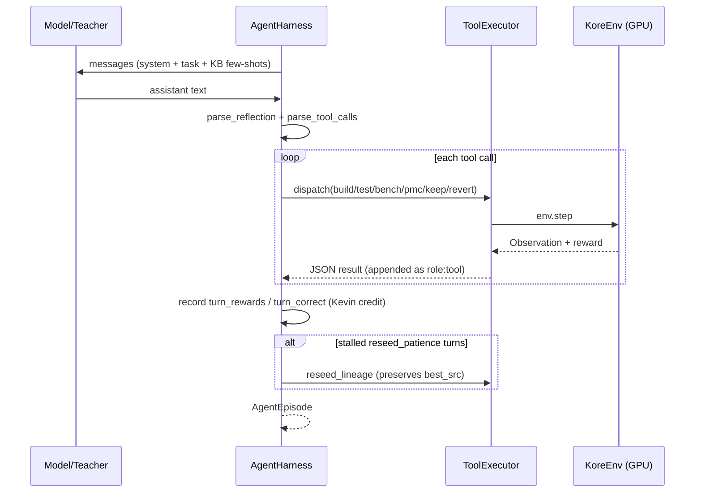

# `kore/agent` - the multi-turn tool-use harness

`AgentHarness` drives a Hermes-style tool-use loop over `KoreEnv`: the model calls `build` / `test` / `bench` / `pmc` / `keep` / `revert` across multiple turns, receiving verifier feedback each turn. It powers both agentic datagen ([`kore/data/gen_agentic.py`](../data/README.md)) and the agentic GRPO rollout ([`kore/policy/grpo.py`](../policy/README.md)). CPU-only orchestration; all GPU work is injected via `env`.

The same message contract (`format.py`) is reused **without a GPU** by [`kore/data/synth_agentic.py`](../data/README.md), which reconstructs agentic SFT trajectories from already-verified `repair`/`wins`/`groups` records. `build_agent_system_prompt(..., arch=)` parameterizes the target descriptor (e.g. `gfx950`→"AMD MI355X (gfx950 / CDNA4)"); `arch=None` preserves the legacy `gfx942` wording so existing callers are byte-for-byte unchanged.

---

## Files

| File | Purpose |
| --- | --- |
| `harness.py` | `AgentHarness` turn loop + `WinsKB` few-shot retrieval |
| `tools.py` | Tool schemas + `ToolExecutor` + `tool_use_reward` |
| `format.py` | Hermes `<tool_call>` parsing / rendering, reflection parsing, `episode_to_chat` |
| `schema.py` | `AgenticTrajectoryRecord` |

---

## The turn loop

Key behaviors:

- **Kevin credit contract.** `ToolExecutor` tracks `best_src` - the trajectory is scored by the *best correct* kernel seen, not the last turn. `turn_rewards`/`turn_correct` are recorded per turn **without rounding** (bit-exact for GRPO advantage estimation).
- **Phase switch.** Starts in a correctness phase; on the first correct kernel the system prompt swaps to an optimization phase.
- **Reseed escape.** After `reseed_patience` (3) non-improving turns it reseeds the lineage - but preserves `best_src`, so a reset can never erase verified progress.
- **Wins knowledge base.** `WinsKB` retrieves prior `WinRecord`s by `(family, dtype)` for few-shot injection, same-family only (no cross-op leak).
- **Reward mode.** `ToolExecutor` honors `KORE_REWARD_MODE` (default `speedup`; `residual` for the physics reward), so agentic rollouts use the same reward as the rest of the system.

Tool-use shaping (`tool_use_reward`) rewards correct schemas, keep/revert discipline, and reflection, folded into the best correct turn - but always dominated by the verified kernel outcome.

See also: [`kore/data`](../data/README.md), [`kore/policy`](../policy/README.md), [`kore/env`](../env/README.md).
