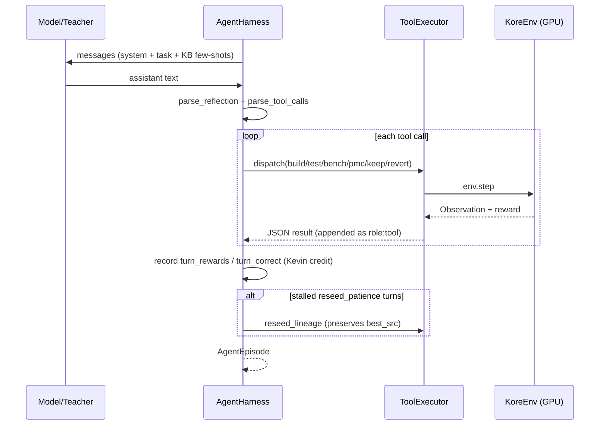

# `kore/agent` - the multi-turn tool-use harness

`AgentHarness` drives a Hermes-style tool-use loop over `KoreEnv`: the model calls `build` / `test` / `bench` / `pmc` / `keep` / `revert` across multiple turns, receiving verifier feedback each turn. It powers both agentic datagen ([`kore/data/gen_agentic.py`](../data/README.md)) and the agentic GRPO rollout ([`kore/policy/grpo.py`](../policy/README.md)). CPU-only orchestration; all GPU work is injected via `env`.

The same message contract (`format.py`) is reused **without a GPU** by [`kore/data/synth_agentic.py`](../data/README.md), which reconstructs agentic SFT trajectories from already-verified `repair`/`wins`/`groups` records. `build_agent_system_prompt(..., arch=)` parameterizes the target descriptor (`gfx950`→"AMD Instinct MI350X (gfx950 / CDNA4)", `gfx942`→"AMD Instinct MI300X (gfx942 / CDNA3)"); `arch=None` falls back to the KORE target default (gfx950/CDNA4), so an un-arched caller trains the policy on the current target rather than a previous-gen board.

---

## Files

| File | Purpose |
| --- | --- |
| `harness.py` | `AgentHarness` turn loop + `WinsKB` few-shot retrieval |
| `tools.py` | Tool schemas (base 6 + opt-in verified-transform tools) + `ToolExecutor` + `tool_use_reward` |
| `format.py` | Hermes `<tool_call>` parsing / rendering, reflection parsing, `episode_to_chat` |
| `schema.py` | `AgenticTrajectoryRecord` |

---

## The turn loop

Key behaviors:

- **Kevin credit contract.** `ToolExecutor` tracks `best_src` - the trajectory is scored by the *best correct* kernel seen, not the last turn. `turn_rewards`/`turn_correct` are recorded per turn **without rounding** (bit-exact for GRPO advantage estimation).
- **Phase switch.** Starts in a correctness phase; on the first correct kernel the system prompt swaps to an optimization phase.
- **Reseed escape.** After `reseed_patience` (3) non-improving turns it reseeds the lineage - but preserves `best_src`, so a reset can never erase verified progress.
- **Wins knowledge base.** `WinsKB` retrieves prior `WinRecord`s by `(family, dtype)` for few-shot injection, same-family only (no cross-op leak).
- **Reward mode.** `ToolExecutor` honors `KORE_REWARD_MODE` (default `speedup`; `residual` for the physics reward), so agentic rollouts use the same reward as the rest of the system.

Tool-use shaping (`tool_use_reward`) rewards correct schemas, keep/revert discipline, and reflection, folded into the best correct turn - but always dominated by the verified kernel outcome.

---

## Verified-transform tools (paradigm-v2 action space)

Beyond the base six, the harness can advertise a **verified ε-typed transformation calculus** as first-class tools, so the policy proposes **provably-in-contract** optimization moves instead of free-form edits. This is **opt-in and on in the flagship** (`agentic_transform_tools: true` → `_rollout_agentic` builds the harness via `agent_tool_schemas(transforms=True)`); it is **off by default**, so agentic datagen / SFT reconstruction stay byte-identical to the legacy set.

| Tool | Effect |
| --- | --- |
| `list_transforms` | The transforms currently **legal** for the working kernel under its remaining ε-budget (each typed `exact`/`approx` with an ε cost + side conditions) |
| `apply_transform` | Apply ONE named transform (+ params) with ε-accounting; returns the rewritten source. An inadmissible / budget-exceeding move is **rejected** and the source is left unchanged (never out-of-contract) |

- **Bounded, shared budget.** `ToolExecutor` lazily builds a per-episode `ErrorBudget` sized from the task's `(operation, dtype)` ([`kore/transform`](../transform/README.md)); approx moves draw it down across turns (exact moves are free), and it is **reset on reseed**, so the agent sees a *shrinking* set of safe moves as it spends numerical tolerance.
- **The env is still the authority.** These tools are **pure CPU source rewrites** - the model must still `build`/`test`/`bench` the result through the verified env, so an approx move that actually drifts is caught by the **SNR gate**. The `exact`/`approx` typing is a *design-time label, not a proof* (e.g. `fp32_accumulator` is labeled exact but changes output bits) - the guarantee is downstream verification, not the type. See [`kore/transform`](../transform/README.md).
- **Anti-reward-hack spine.** Because the action space is bounded to in-contract rewrites, a policy composing only these moves structurally *cannot* emit a memset/cache/timing exploit - the same calculus AlphaKernel searches over ([`kore/search`](../search/README.md)).

---

## Paradigm-v2: per-turn physics trace + latency feedback

The harness now records four **index-aligned** per-turn arrays on `AgentEpisode` (one entry per turn, in lockstep with `turn_rewards`/`turn_correct`), so the agentic rollout feeds GRPO the same per-turn signals as the serial path:

| `AgentEpisode` field | Meaning |
| --- | --- |
| `turn_speedups` | per-turn MEASURED vendor speedup (only when the turn benched a correct kernel, else `None`) |
| `turn_phis` | per-turn roofline **potential** `Φ` for PBS — online the PMC-free `η` (`ρ` only when counters are threaded); `None` unless benched + correct |
| `turn_codes` | per-turn candidate kernel source |

These are populated in `_record_turn` from matching `ToolExecutor` state set in `_evaluate`:

- **`ToolExecutor.candidate_speedup`** - the benched-correct candidate's measured worst-shape speedup. A `build`/`test` turn leaves it `None`, so a non-timed turn never fabricates a speedup.
- **`ToolExecutor.candidate_phi`** - the roofline potential `phi_potential(task, obs)` for that turn (fail-safe `None` on any physics gap - a shaping boundary). It feeds GRPO's policy-invariant PBS credit toward the roofline (`kore.reward.shaping`, weight `physics_shaping_weight`). *Live wiring:* `phi_potential` is called **without a counter dict**, so the online potential is the PMC-free `η = T_min/T_measured`; the named-residual `ρ` path in `kore.reward.whitebox` engages only when rocprofv3 counters are supplied.
- **`ToolExecutor.best_speedup`** - the measured-speedup **frontier** (max over benched-correct candidates), tracked *independently* of `best_reward` (still the Kevin scoring key), so the `bench` tool can report an honest frontier delta.

On the GRPO side, `grpo._agentic_per_turn_signal` recovers these arrays correctness-gated and index-aligned (degrading to `("", None, None)` per turn): `turn_phis → traj_phis → build_kevin_samples(phi_weight=…)` densifies per-turn credit via PBS, while `turn_codes`/`turn_speedups` feed co-evolution distillation + the open-ended controller - reaching parity with the serial `_rollout`.

**Bench-tool frontier delta.** The `bench` tool result now carries per-turn latency feedback so the model can see whether *this* change actually helped:

| `bench` result field | Meaning |
| --- | --- |
| `best_speedup_so_far` | running best measured speedup this episode |
| `delta_vs_best` | signed `cur − prev_best` (the frontier is snapshotted *before* this candidate is folded in) |
| `improved_frontier` | whether this turn pushed the frontier |

This is **pure context** - the trained reward is still the verified `compute_kernel_reward`, so surfacing the delta to the policy cannot be gamed.

See also: [`kore/data`](../data/README.md), [`kore/policy`](../policy/README.md), [`kore/env`](../env/README.md), [`kore/reward`](../reward/README.md) (the `whitebox`/`shaping` potential this trace feeds), [`kore/transform`](../transform/README.md) (the verified action space behind the transform tools), [`kore/search`](../search/README.md) (AlphaKernel over that same calculus).
