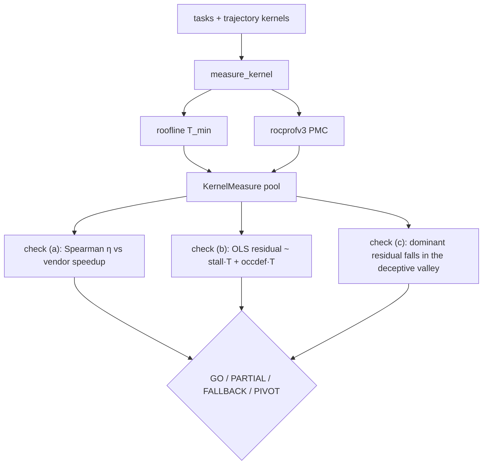

# `kore/analysis` - roofline physics & the P0 study

Offline diagnostics that establish (and stress-test) the physical premise behind KORE's reward. Nothing here trains a policy; these modules **measure** and **falsify**. This is the code behind the [`Kore-prelim-analysis`](../../../Kore-prelim-analysis/) study and [`docs/P0_RESULTS.md`](../../docs/P0_RESULTS.md).

> **Paradigm-v2: the roofline `T_min` (not the full named residual) reaches the online reward.** The roofline `T_min` is now a **live** reward input via [`kore.reward.whitebox`](../reward/README.md#paradigm-v2-white-box-potential--pbs-shaping): `whitebox` reuses `rooflines.roofline` for `T_min` and feeds the attainment as a potential-based shaping signal in GRPO. *Active in the live run:* the `T_min`-based `η = T_min/T_measured` is the live potential (`physics_shaping_weight = 0.15`). **The full named-residual `ρ = T_min/(T_min+N)` - the R²≈0.98 signal validated by check (b) below - is BUILT (`whitebox.physics_signal_from_counters`) but DORMANT online**: it engages only when rocprofv3 PMC counters are collected per candidate and threaded into `phi_potential`, which no live rollout site does (rocprofv3 is too slow per-candidate), so the online potential is `η`, not `ρ`. `p0_sol` remains where the decomposition is *validated* offline; making `ρ` the live signal is the **#1 open item** (see [`kore/reward`](../reward/README.md#paradigm-v2-white-box-potential--pbs-shaping)).

---

## Files

| File | Purpose |
| --- | --- |
| `rooflines.py` | The roofline `T_min` / `η` model: FLOPs & bytes per operator, hardware peaks |
| `p0_sol.py` | The P0 falsification harness (checks a/b/c) + `KernelMeasure` + bootstrap CIs |
| `residual_transfer.py` | The **crux** experiment: leave-one-family-out residual transfer |
| `calibrate_peaks.py` | On-device STREAM + matmul peak calibration → `KORE_PEAK_*` |
| `plots.py` | The five publication figures from a P0 report JSON |

---

## Roofline model

```
T_min = max( W_flops / P_peak ,  Q_bytes / B_peak )
η     = T_min / T_measured        ∈ (0, 1]
```

`flops_bytes(operation, dims, dtype)` returns `(W, Q)` - exact for GEMM/batched-GEMM/norms/activations, first-order for attention/MoE, with a safe memory-bound fallback for generic elementwise ops. `roofline(...)` returns a `Roofline` with `arithmetic_intensity`, `t_compute_ms`, `t_mem_ms`, `t_min_ms`, and `bound ∈ {compute, memory}`. Peaks default to gfx950/gfx942 datasheets and are overridable via `KORE_PEAK_BF16` / `KORE_PEAK_FP8` / `KORE_PEAK_HBM_BW`.

---

## The P0 falsification harness



| Check | Question | Pass |
| --- | --- | --- |
| **(a)** | does `η` predict speedup vs. the production vendor? | Spearman ρ ≥ 0.5 |
| **(b)** | does the residual decompose into named stall + occupancy-deficit? | OLS R² ≥ 0.7 |
| **(c)** | along an improving trajectory, does the dominant residual fall while wall-clock is flat? | frac ≥ 0.6 |

**Final result (gfx950, AITER baselines, calibrated peaks, 1000× bootstrap):** (a) ρ = 0.529, (b) **R² = 0.978**, (c) frac = 0.525 → verdict **PARTIAL**. The "named gradient" is real; the monotone-in-valley signal is thin pre-RL (which is the policy's job, not a random variant's).

> **The #1 false PIVOT is wrong peaks.** If check (a) fails, recalibrate with `calibrate_peaks.py` and set `KORE_PEAK_*` before concluding the roofline isn't predictive.

---

## The transfer crux

`residual_transfer.py` asks the paradigm-deciding question: does the residual decomposition **transfer across operator families**, or is it operator-specific?

- **Test A (LOFO):** fit the named-term → residual map on all families but one, predict the held-out family. Raw (`residual_ms ~ stall·T + occdef·T`) and normalized (`(1-η) ~ stall + occdef`, size-confound removed, marked PRIMARY).
- **Test B:** coefficient stability across folds.
- **Test C:** family decodability from the residual latent (nearest-centroid LOO).

**Result:** pooled in-sample R² = 0.978 (raw) but **median out-of-family R² = 0.107 (raw) / negative (normalized)**; families are separable in residual space. **Verdict: the residual value is operator-specific, not a universal latent.** KORE therefore trains on the dense per-family signal and frames the contribution as the *combination* + diagnosis-conditioned control, not a universal residual manifold. This is the honest, falsification-tested scope - see [`docs/P0_RESULTS.md`](../../docs/P0_RESULTS.md).

```python
@dataclass
class KernelMeasure:
    task_id: str; correct: bool
    cand_ms: Optional[float]; vendor_ms: Optional[float]; t_min_ms: float
    eta: Optional[float]; speedup: Optional[float]; residual_ms: Optional[float]
    stall_frac: Optional[float]; occupancy: Optional[float]; counters: dict
```

---

## Reproduce (CPU-safe subset)

```bash
# dry-run roofline table (no GPU), mining η from the replay cache:
python -m kore.analysis.p0_sol --dry-run --tasks gemm_bf16,rmsnorm_aiter
# the transfer crux over an existing P0 report:
python -m kore.analysis.residual_transfer --report data/p0_study_final.json --out data/residual_transfer.json
```

The bridge to the live reward: `physics_from_measure(KernelMeasure) → PhysicsSignal → compute_residual_reward` - the same math the training reward uses (see [`kore/reward`](../reward/README.md)). Online, `kore.reward.whitebox` reuses `rooflines.roofline` for `T_min` to feed GRPO's potential-based shaping, so the roofline `T_min` model is a live reward input, not only an offline diagnostic. The **named-term** (`stall + occupancy-deficit`) decomposition, however, is exercised online only if per-candidate PMC counters are threaded in - which the live run does not do - so the *validated* `ρ` decomposition below is currently an offline result, and the live potential is `η`.

See also: [`tasks`](../tasks/README.md), [`verifier`](../verifier/README.md) (PMC), [`eval/generalization`](../eval/README.md).
