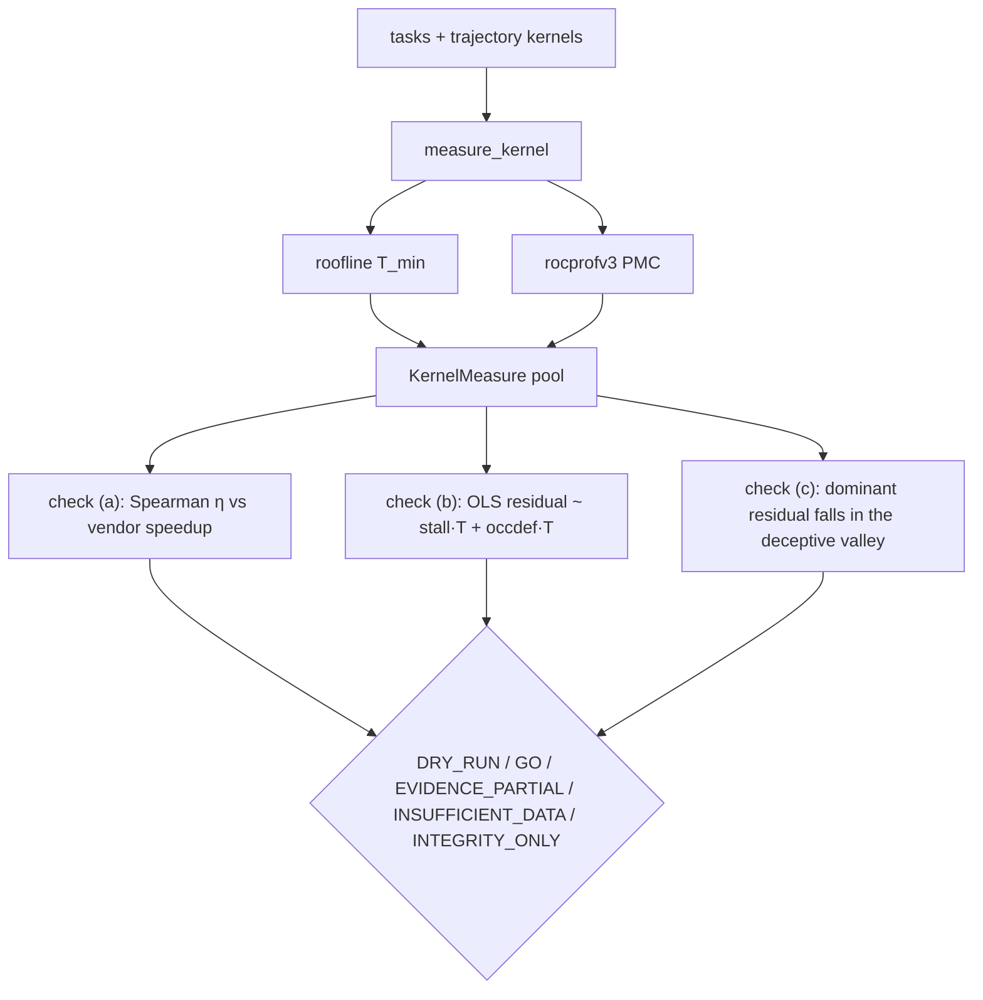

# `kore/analysis` — roofline physics & the P0 study

Offline diagnostics that establish and stress-test the physical premise behind KORE's reward. Nothing here trains a policy; these modules **measure** and **falsify**. This is the code behind the [`Kore-prelim-analysis`](../../../Kore-prelim-analysis/) study and [`docs/P0_RESULTS.md`](../../docs/P0_RESULTS.md).

> **The roofline `T_min` is a live reward input.** [`kore.reward.whitebox`](../reward/README.md) reuses `rooflines.roofline` for `T_min` and feeds attainment into GRPO as a potential-based shaping signal (`physics_shaping_weight`) and as a speed-of-light integrity ceiling (`roofline_gate`). The online potential is `η = T_min/T_measured`; its counter-grounded refinement `ρ = T_min/(T_min + N)` is computed by `whitebox.physics_signal_from_counters` and engages only when per-candidate rocprofv3 PMC counters are threaded into `phi_potential` (rocprofv3 is too slow to run per candidate, so live rollouts use `η`).
>
> **Neither `η` nor `ρ` is a validated predictor of speedup.** `p0_sol` **falsified** that hypothesis: see [Result](#result) below and [`docs/P0_RESULTS.md`](../../docs/P0_RESULTS.md). The two uses that survive are the integrity ceiling (sound under a conservative lower bound) and potential-based shaping (sound because it preserves the ordering of returns regardless of whether `Φ` predicts anything). See [`kore/reward`](../reward/README.md).

---

## Files

| File | Purpose |
| --- | --- |
| `rooflines.py` | The roofline `T_min` / `η` model: FLOPs & bytes per operator, hardware peaks |
| `p0_sol.py` | The P0 falsification harness (checks a/b/c) + `KernelMeasure` + bootstrap CIs |
| `residual_transfer.py` | The leave-one-family-out residual-transfer experiment |
| `calibrate_peaks.py` | On-device STREAM + matmul peak calibration → a fingerprinted `kore.runtime-calibration.v1` JSON document (its old `export KORE_PEAK_*` output contract was a no-op and was removed) |
| `plots.py` | The five publication figures from a P0 report JSON |

---

## Roofline model

```
T_min = max( W_flops / P_peak ,  Q_bytes / B_peak )
η     = T_min / T_measured        ∈ (0, 1]
```

`flops_bytes(operation, dims, dtype)` returns `(W, Q)` — exact for GEMM/batched-GEMM/norms/activations, first-order for attention/MoE, with a safe memory-bound fallback for generic elementwise ops. `roofline(...)` returns a `Roofline` with `arithmetic_intensity`, `t_compute_ms`, `t_mem_ms`, `t_min_ms`, and `bound ∈ {compute, memory}`.

Peaks default to the gfx950/gfx942 **datasheet** (MI350X: HBM 8.0 TB/s, bf16 2.3 PF/s, fp8 4.6 PF/s). To use measured peaks, pass a `kore.runtime-calibration.v1` document — `resolve_peaks(calibration=..., expected_fingerprint=...)`, or `KORE_PHYSICS_CALIBRATION` pinned with `KORE_PHYSICS_MODEL_FINGERPRINT`. The legacy `KORE_PEAK_BF16` / `KORE_PEAK_FP8` / `KORE_PEAK_HBM_BW` globals are **dead**: they were removed as invisible, unfingerprinted calibration, and `resolve_peaks` now raises a `RuntimeWarning` naming any that are exported rather than honouring them.

---

## The P0 falsification harness


```mermaid
flowchart TD
  T[tasks + trajectory kernels] --> M[measure_kernel]
  M --> RF[roofline T_min]
  M --> PMC[rocprofv3 PMC]
  RF & PMC --> KM[KernelMeasure pool]
  KM --> A["check (a): Spearman η vs vendor speedup"]
  KM --> B["check (b): OLS residual ~ stall·T + occdef·T"]
  KM --> C["check (c): dominant residual falls in the deceptive valley"]
  A & B & C --> D{DRY_RUN / GO / EVIDENCE_PARTIAL / INSUFFICIENT_DATA / INTEGRITY_ONLY}
```

Those five strings are the complete set `p0_sol.decide` can return. Anything else — `PARTIAL`, `FALLBACK`, `PIVOT`, or a per-check `WEAK` — is from a superseded revision and must not be quoted.

The preregistered criteria are the `kore.p0-validation.v2` schema in `p0_sol.PREREGISTRATION`; the primary target is the **normalized** gap `(T_candidate − T_min)/T_candidate`, scored by deterministic five-fold task-cluster CV against a `T_candidate`-only baseline, with Benjamini–Hochberg FDR at `alpha = 0.05`:

| Check | Question | Pass requires |
| --- | --- | --- |
| **(a)** | does `η` predict speedup vs. the production vendor, *beyond* `1/T_candidate`? | Spearman `ρ ≥ 0.5` **and** increment over the `T_candidate`-only baseline `≥ 0.05` **and** BH-adjusted `p ≤ 0.05` |
| **(b)** | does the residual decompose into named stall + occupancy-deficit? | normalized held-out CV `R² ≥ 0.10` **and** increment over baseline `≥ 0.05` **and** adjusted `p ≤ 0.05`, over `≥ 30` points and `≥ 6` task clusters |
| **(c)** | along an improving trajectory, does the dominant residual fall while wall-clock is flat? | `frac ≥ 0.6` over `≥ 20` pairs, adjusted `p ≤ 0.05` |

### <a name="result"></a>Result: `INTEGRITY_ONLY` — all three checks FAIL

Re-analysing the stored artifact (`data/p0_study_final.json`, datasheet peaks) with the current adjudicator: (a) `ρ = 0.529` but the `T_candidate`-only predictor reaches `0.727`, an increment of **−0.198**; (b) normalized held-out `R² = −0.458`, worse than predicting the mean, increment **−0.336**; (c) `frac = 0.500`. `p_adjusted` is 0.94–0.99 throughout. Two further runs on **measured** peaks agree — 10 operators (`data/p0_study_calibrated.json`) and all 15 once attention and MoE became modellable (`data/p0_study_v2_attention_moe.json`, where leave-one-family-out transfer on MoE is `R² = −384`).

An earlier revision of this page reported "(b) **R² = 0.978** → verdict **PARTIAL**" on "calibrated peaks". Three things were wrong: that artifact used *datasheet* peaks, `0.978` is a raw in-sample number on a shared-denominator target (a `T_candidate`-only predictor scores `0.997`), and `PARTIAL` is not a verdict the code emits. See [`docs/P0_RESULTS.md`](../../docs/P0_RESULTS.md) for the full controls.

> **Calibration helps and does not rescue.** Measured peaks narrow check (a)'s deficit from −0.198 to −0.109 but do not flip any check, so a datasheet-peak run is not the reason for the verdict. Emit a calibration document with `calibrate_peaks.py` and pass it via `--calibration`; exporting `KORE_PEAK_*` does nothing.

---

## The transfer experiment

`residual_transfer.py` asks whether the residual decomposition **transfers across operator families** or is operator-specific:

- **Test A (LOFO):** fit the named-term → residual map on all families but one, predict the held-out family. Raw (`residual_ms ~ stall·T + occdef·T`) and normalized (`(1-η) ~ stall + occdef`, size-confound removed, marked PRIMARY).
- **Test B:** coefficient stability across folds.
- **Test C:** family decodability from the residual latent (nearest-centroid LOO).

**Result** (`data/residual_transfer.json`): pooled in-sample R² = 0.978 on the raw check-(b) form, but **median out-of-family R² = 0.107 (raw), and negative for most families on the PRIMARY normalized form** — activation −1.91, norm −5.13, MoE −348. The module prints `VERDICT: NOT_SUPPORTED_FOR_SHAPING`. The residual decomposition does not transfer across operator families, and it does not survive removing the size confound *within* them either.

> An earlier revision concluded from this that "KORE trains on the dense per-family signal accordingly, applying diagnosis-conditioned control within each family". It does not, and it never did. Empirical per-family shaping requires both `physics_shaping_evidence_path` and `physics_shaping_evidence_fingerprint`; `configs/grpo_14b_full.json` sets neither, so `_dense_profile_weight` returns 0.0 and `reanalyze_report` reports `shaping_evidence.status = "disabled"` with **no** authorized families. No shipped model was trained on this signal. See [`docs/P0_RESULTS.md`](../../docs/P0_RESULTS.md).

```python
@dataclass
class KernelMeasure:
    task_id: str; correct: bool
    cand_ms: Optional[float]; vendor_ms: Optional[float]; t_min_ms: float
    eta: Optional[float]; speedup: Optional[float]; residual_ms: Optional[float]
    stall_frac: Optional[float]; occupancy: Optional[float]; counters: dict
```

---

## Reproduce (CPU-safe subset)

```bash
# dry-run roofline table (no GPU), mining η from the replay cache:
python -m kore.analysis.p0_sol --dry-run --tasks gemm_bf16,rmsnorm_aiter
# the transfer experiment over an existing P0 report:
python -m kore.analysis.residual_transfer --report data/p0_study_final.json --out data/residual_transfer.json
```

Both commands are CPU-only and verified to run from the repo root at the current commit.

The bridge to the live reward: `physics_from_measure(KernelMeasure) → PhysicsSignal → compute_residual_reward`, the same math the training reward uses (see [`kore/reward`](../reward/README.md)). Online, `kore.reward.whitebox` reuses `rooflines.roofline` for `T_min` to feed GRPO's potential-based shaping and the speed-of-light ceiling, so the roofline `T_min` model is a live reward input, not only an offline diagnostic. The named-term (`stall + occupancy-deficit`) decomposition engages online only when per-candidate PMC counters are threaded in; the live potential is `η`. The `ρ` decomposition is **falsified** offline here, not validated — that is the point of this package.

See also: [`tasks`](../tasks/README.md), [`verifier`](../verifier/README.md) (PMC), [`eval/generalization`](../eval/README.md).
