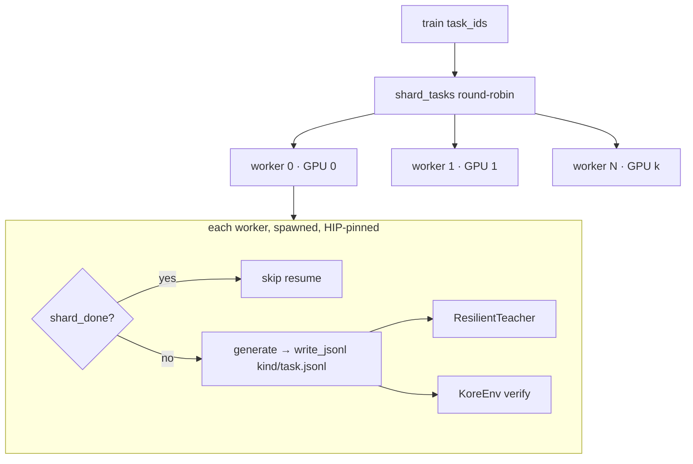
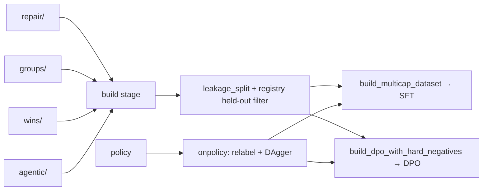

# `kore/data` — the training-data factory

Turns teachers (frontier LLMs) and policies into **verified** kernel-optimization training data, typed and sharded to JSONL, then assembles it into leakage-aware SFT/DPO corpora with anti-forgetting general replay. Includes evolutionary datagen and the iterative on-policy DPO/DAgger loop.

Every record is *verified before it is kept* — a repair is only recorded if the fix actually passes the oracle; no silent empty data.

---

## Record types (`schemas.py`)

| Type | Curriculum stage | Key fields |
| --- | --- | --- |
| `RepairRecord` | Stage 1 (repair SFT) | `failure_class` (`compile_fail`/`snr_fail`), `error_text`, `messages`, `child_snr_db` |
| `RankedGroupRecord` | Stage 2 (RFT + DPO) | `candidates[{source,wall_us,snr_db,rank}]`, `preferences[[chosen,rejected]]` |
| `WinRecord` | Stage 3 (win trajectories) | `trajectory`, `initial/final_wall_us`, `speedup`, `final_source` |
| `AgenticTrajectoryRecord` | Stage 4 (agentic) | `messages`, `tool_trace`, `best_kernel`, `success` (see [`kore/agent`](../agent/README.md)) |

All carry provenance (`operation`, `arch`, `shape`) for leakage-safe splitting. `read_jsonl` skips malformed lines with a warning, so one corrupt line can't poison a shard.

---

## Teachers (`teacher.py`)

Four interchangeable backends behind one `TeacherClient` protocol:

| Backend | Use |
| --- | --- |
| `StubTeacher` | deterministic, dependency-free (tests/dry-runs) |
| `VLLMTeacher` | an OpenAI-compatible vLLM/SGLang endpoint |
| `HFTeacher` | a local transformers model |
| `ClaudeTeacher` | Anthropic frontier model via **AMD's internal LLM gateway** |

`ClaudeTeacher` reads `AMD_LLM_API_KEY` (+ `AMD_NTID`, optional `AMD_LLM_GATEWAY_URL`, `KORE_TEACHER_MODEL`) from `.env.local`. All network teachers use bounded exponential-backoff retry (8 attempts) and drop truncated completions (`finish_reason=length`) rather than store half-written kernels. `ResilientTeacher` wraps any backend: a single exhausted call returns `""` (skip the sample), but **15 consecutive failures raise** — a sustained outage stops the run resumably instead of silently producing empty data.

---

## Parallel, resumable datagen



`run_parallel_datagen` shards tasks across GPU-pinned worker processes (`spawn`, HIP-only pinning). It is **resumable at shard granularity**: `shard_done(root, task, kind)` skips any existing non-empty `{kind}/{task}.jsonl`, so a crash/restart never redoes finished work. One shard failure never aborts a worker's batch.

Generators: `gen_repair` (inject breakage → teacher fix → keep only if verified), `gen_groups` (n_parents × k candidates, ranked correct>speed>SNR with a noise-margin gate), `gen_wins` (greedy multi-turn, keep if net >2% faster), `gen_agentic` (tool-use trajectories). `evolve.py` adds a D-MAB bandit (UCB1 + Page-Hinkley) over mutation operators with MAP-Elites islands and a value prefilter.

---

## Assembly & on-policy loop



- `build_datasets.py` / `assemble.py`: multi-capability SFT mix (repair + wins + QA + agentic + general replay) and DPO pairs with ≥8% reward-hack hard negatives.
- `leakage_split` groups by `(family, arch)` so whole groups stay on one side of train/val/test; the registry held-out filter is the final authority.
- `onpolicy.py`: `iterative_dpo` relabels preferences on-policy from the current checkpoint (DAgger no-regret), refreshing the reference each round; `dagger_repairs` mines the policy's own failures with a teacher-mixing fraction that decays 30%→0%.
- `general_replay.py`: anti-forgetting replay (code/math/chat/instruction/tool_use), real HF datasets when `KORE_GENERAL_REPLAY_HF=1`.

---

## Shard layout (`data/<root>/`)

```
repair/{task}.jsonl   groups/{task}.jsonl   wins/{task}.jsonl   agentic/{task}.jsonl
midtrain/corpus.jsonl   sft/multicap.jsonl   dpo/pairs.jsonl   dagger/round{N}.jsonl
campaign_manifest.json  campaign_events.jsonl  launch/*.json
```

Campaign datagen defaults: `n_repair=50`, `n_parents=20`, `k=6`, `wins_gens=8`, `n_agentic=16`.

See also: [`kore/agent`](../agent/README.md), [`kore/openended`](../openended/README.md), [`kore/policy`](../policy/README.md), [`docs/DATASET_SPEC.md`](../../docs/DATASET_SPEC.md).
