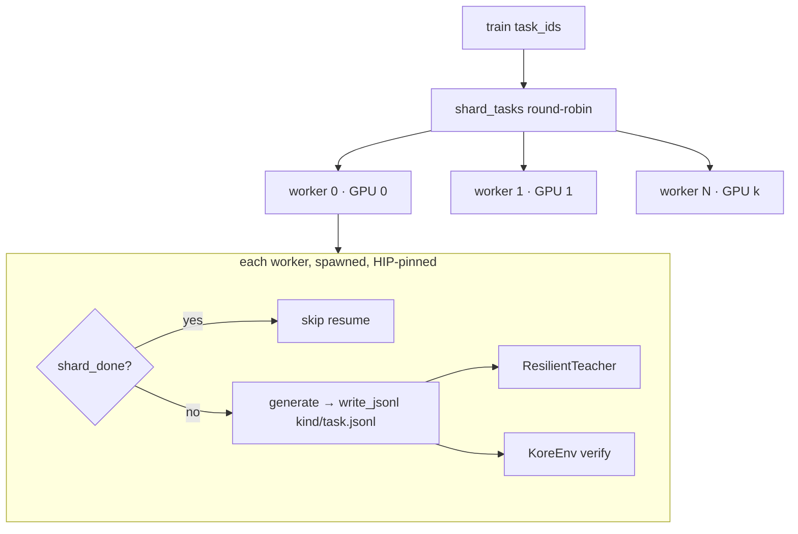
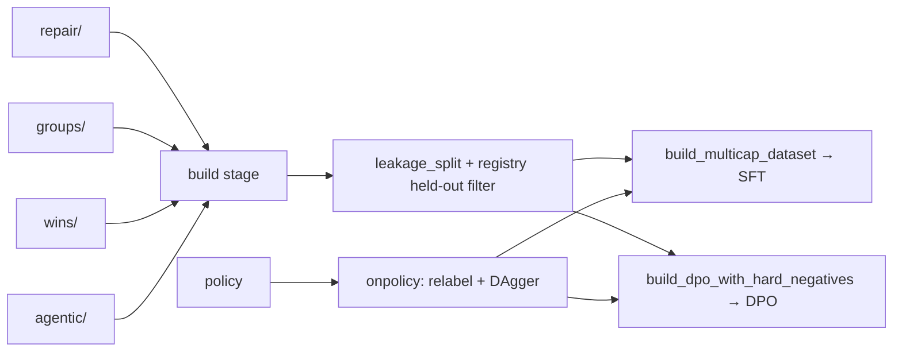

# `kore/data` — the training-data factory

Turns teachers (frontier LLMs) and policies into **verified** kernel-optimization training data, typed and sharded to JSONL, then assembles it into leakage-aware SFT/DPO corpora with anti-forgetting general replay. Includes evolutionary datagen and the iterative on-policy DPO/DAgger loop.

Every record is *verified before it is kept*: a repair is recorded only if the fix actually passes the oracle, so a shard never contains unverified data.

---

## Record types

Three of the four record types live in `schemas.py`; `AgenticTrajectoryRecord` is defined in [`kore/agent/schema.py`](../agent/README.md) instead (it re-uses `schemas.py`'s `write_jsonl`/`read_jsonl` rather than duplicating them, so all four round-trip through the same JSONL machinery).

| Type | Defined in | Curriculum stage | Key fields |
| --- | --- | --- | --- |
| `RepairRecord` | `schemas.py` | Stage 1 (repair SFT) | `failure_class` (`compile_fail`/`snr_fail`), `error_text`, `messages`, `child_snr_db` |
| `RankedGroupRecord` | `schemas.py` | Stage 2 (RFT + DPO) | `candidates[{source,wall_us,snr_db,rank}]`, `preferences[[chosen,rejected]]`; optional `counters`/`parent_counters`/`parent_wall_us` (rocprofv3 PMC for the rank-0 candidate + a slower-correct parent, populated under `--ground-reasoning`) |
| `WinRecord` | `schemas.py` | Stage 3 (win trajectories) | `trajectory`, `initial/final_wall_us`, `speedup`, `final_source` |
| `AgenticTrajectoryRecord` | `agent/schema.py` | Stage 4 (agentic) | `messages`, `tool_trace`, `best_kernel`, `best_reward`, `turns_to_best`, `success`, `reflections`, `phase_trace` (see [`kore/agent`](../agent/README.md)) |

All carry provenance (`operation`, `arch`, `shape`) for leakage-safe splitting. `read_jsonl` skips malformed lines with a warning, so one corrupt line cannot poison a shard.

**Profiler-grounded reasoning (`grounded_reasoning.py`, `--ground-reasoning`).** Templated gold-win reasoning teaches the model to *say* optimization words without evidence. With `--ground-reasoning` on, `RankedGroupRecord.counters`/`parent_counters` carry real rocprofv3 PMC for the best and a slower-correct-parent candidate, and `diagnose_bottleneck`/`counter_grounded_prompt` turn them into a teacher prompt that must cite a measured counter; `verify_reasoning_grounding` rejects ungrounded chain-of-thought that does not reference the diagnosed bottleneck. Pure CPU and fail-safe (falls back to the templated path on any gap); `collect_counters` is the only GPU touch.

---

## Teachers (`teacher.py`)

Four interchangeable backends behind one `TeacherClient` protocol:

| Backend | Use |
| --- | --- |
| `StubTeacher` | deterministic, dependency-free (tests / dry-runs) |
| `VLLMTeacher` | an OpenAI-compatible vLLM/SGLang endpoint |
| `HFTeacher` | a local transformers model |
| `ClaudeTeacher` | Anthropic frontier model via **AMD's internal LLM gateway** |

`ClaudeTeacher` reads `AMD_LLM_API_KEY` (plus `AMD_NTID`, optional `AMD_LLM_GATEWAY_URL`, `KORE_TEACHER_MODEL`) from `.env.local`. All network teachers use bounded exponential-backoff retry (8 attempts) and drop truncated completions (`finish_reason=length`) rather than store half-written kernels. `ResilientTeacher` wraps any backend: a single exhausted call returns `""` (skip the sample), but **15 consecutive failures raise**, so a sustained outage stops the run resumably instead of silently producing empty data.

---

## Parallel, resumable datagen



`run_parallel_datagen` shards tasks across GPU-pinned worker processes (`spawn`, HIP-only pinning). It is **resumable at shard granularity**: `shard_done(root, task, kind)` skips any existing non-empty `{kind}/{task}.jsonl`, so a crash/restart never redoes finished work, and one shard failure never aborts a worker's batch.

Generators: `gen_repair` (inject breakage → teacher fix → keep only if verified), `gen_groups` (n_parents × k candidates, ranked correct > speed > SNR with a noise-margin gate), `gen_wins` (greedy multi-turn, keep if net > 2% faster), `gen_agentic` (tool-use trajectories). `evolve.py` adds a D-MAB bandit (UCB1 + Page-Hinkley change detection) over mutation operators with MAP-Elites islands and a value prefilter.

**Agentic slice — two ways to fill it.** The `gen_agentic` path drives the teacher + GPU harness per task (tens of GPU-hours) for real live rollouts, but is GPU/teacher-bound. `synth_agentic.py` is the CPU-only alternative: it *reconstructs* faithful Hermes tool-use trajectories from the already-verified `repair` / `wins` / `groups` records, so every `role:"tool"` result carries a **real measured** number (verifier SNR, walltime, error text) with no GPU and no teacher. It maps 1:1 onto the live curriculum — `repair`→`test(broken)→reflect→test(fixed)→keep`, `wins`→`bench(seed)→bench(optimized)→keep`, `groups`→`bench(candidates)→keep(fastest)` — and writes `agentic/_synth_{repair,wins,groups}.jsonl`, which `assemble._agentic_rows` picks up (the SFT mixer then blends the web tool-use replay on top). Select the mode with `run_campaign.py --agentic {live,synth,both}` (`--synth-agentic-cap`, default 4000). **`synth` is the default** because it always populates the slice from verified data with no GPU or teacher; `live` depends on the GPU harness and can leave the slice empty, so `live`/`both` are opt-in.

**Gold wins — rebalancing the thinnest family.** `gen_wins` yields ~1 trajectory per task, so pure-optimization demos are scarce next to `repair`. `gold_wins.py` mints extra optimization-win `WinRecord`s from the **rank-0** (robustly-best, correct) candidate in each ranked `group` — code that `build_sft` otherwise sees only via DPO. It frames a slower correct sibling as the parent and emits the real-wins format (`SYSTEM_PROMPT` + `build_turn_prompt` + `ANALYSIS: … FULL_KERNEL:`), writing `wins/_gold_from_groups.jsonl`. The build stage mints these **before** the raw gather, so they pass the same dedup + leakage split + **RFT speedup gate** as real wins — only gold that is genuinely faster than its parent survives. On by default (`--gold-wins` / `--no-gold-wins`, `--gold-wins-cap` default 3000). This is rejection sampling (ReST-EM) on already-verified data: gold *code*, measurement-grounded reasoning, zero new GPU.

---

## Assembly & on-policy loop



- `build_datasets.py` / `assemble.py`: multi-capability SFT mix (repair + wins + QA + agentic + general replay) and DPO pairs with ≥8% reward-hack hard negatives.
- **Assembly aligned with the GRPO objective.** SFT/DPO assembly optimizes the same vendor-relative **speedup** objective the GRPO reward uses (`reward_mode=speedup`): DPO pairs come from the `faster-correct > slower-correct > incorrect > non-compiling` ranking (`gen_groups.rank_candidates`), and SFT/gold wins pass a speedup gate (`filter_trivial_wins`, the RFT speedup gate on `gold_wins`), so warm-start and RL pull in one direction. GRPO's physics named-residual `ρ` is layered on only as policy-invariant shaping, not as a competing assembly objective. This is an assembly/scoring alignment; the record generation above is unchanged.
- `leakage_split` groups by `(family, arch)` so whole groups stay on one side of train/val/test; the registry held-out filter is the final authority.
- `onpolicy.py`: `iterative_dpo` relabels preferences on-policy from the current checkpoint (DAgger no-regret), refreshing the reference each round; `dagger_repairs` mines the policy's own failures with a teacher-mixing fraction that decays 30% → 0%.
- `general_replay.py`: anti-forgetting replay (code/math/chat/instruction/tool_use), using real HF datasets when `KORE_GENERAL_REPLAY_HF=1`.

---

## Shard layout (`data/<root>/`)

```
repair/{task}.jsonl   groups/{task}.jsonl   wins/{task}.jsonl
wins/_gold_from_groups.jsonl (gold wins minted from ranked groups)
agentic/{task}.jsonl (live)   agentic/_synth_{repair,wins,groups}.jsonl (synth)
midtrain/corpus.jsonl   sft/multicap.jsonl   dpo/pairs.jsonl   dagger/round{N}.jsonl
campaign_manifest.json  campaign_events.jsonl  launch/*.json
```

Campaign datagen defaults: `n_repair=50`, `n_parents=20`, `k=6`, `wins_gens=8`, `n_agentic=16`, `--agentic synth` (the GPU-free reconstructed slice; use `--agentic live` or `--agentic both` to add real GPU/teacher-driven trajectories).

See also: [`kore/agent`](../agent/README.md), [`kore/openended`](../openended/README.md), [`kore/policy`](../policy/README.md), [`docs/DATASET_SPEC.md`](../../docs/DATASET_SPEC.md).
