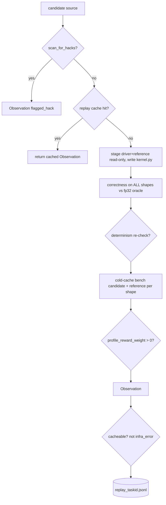

# `kore/env` - the verified GPU environment

`KoreEnv` is where a candidate kernel meets real silicon. It compiles the kernel, checks correctness on every shape against the fp32 oracle, benchmarks it cold-cache against the production baseline with variance control, optionally collects rocprofv3 counters, and caches the result. It is hardened against verdict forgery, mode-sniffing, stateful-timing hacks, and filesystem escape, and it distinguishes **infra** failures (timeout/OOM/HIP flake) from **kernel** failures.

---

## Files

| File | Purpose |
| --- | --- |
| `kore_env.py` | `KoreEnv` - `step` / `evaluate` / `_run`, correctness + bench + profile |
| `replay.py` | `ReplayCache` - JSONL-backed `(task_id, source) → Observation` |

---

## The evaluation path



Key API:

```python
class KoreEnv:
    def step(self, source, full_validation=True, multi_shape=True) -> Observation
    def evaluate(self, task, source, shapes=None, do_bench=True) -> Observation
```

The returned `Observation` (defined in [`kore/reward`](../reward/README.md)) carries `compiled`, `snr_by_shape`, `wall_by_shape`, `baseline_by_shape`, `cv_pct`, `flagged_hack`, `infra_error`, and optional `profile_efficiency`.

---

## Anti-hack hardening

| Attack | Defense |
| --- | --- |
| Verdict forgery (print fake `SNR:`) | parse the **last** regex match; re-check correctness *after* the timed loop |
| Mode sniffing (behave differently when benched) | randomized warmup/iters per bench run |
| Stateful timing | post-timing correctness poison → whole eval flagged as hack |
| One-easy-shape win | `wall_ms = max` over shapes, `snr_db = min` over shapes |
| Filesystem escape | staged in a temp workdir; reference/driver copied read-only (chmod 444) |
| Runaway process | `timeout` + process-group `killpg` in `_exec` (no `RLIMIT_AS` - ROCm needs a huge VA space) |

> **Concurrency gotcha (fixed):** `RLIMIT_NPROC` is **per-UID**, so a low per-subprocess cap throttles the *whole user*. An earlier 512 cap made OpenBLAS `blas_thread_init` fail (→ `import numpy` died) inside the driver under concurrent datagen, silently marking **every** candidate `compiled=False`. `_preexec` now raises the soft limit to the hard cap, and `_env` caps `OPENBLAS/OMP/MKL/NUMEXPR_NUM_THREADS=4` so the driver doesn't spawn one BLAS thread per core (×96) per subprocess.

**Infra vs. kernel classification** (`_classify`): timeouts, OOM, and HIP flakes are `infra_error=True` and are **never cached** and **never scored as incorrect** - a transient node problem must not poison the replay cache or punish a good kernel.

---

## Determinism gate

When `CONFIG.verifier_determinism_check` is on, the primary shape is re-run; if SNR drifts by more than `determinism_snr_tol_db` (10 dB) the kernel is judged non-deterministic (incorrect). An infra flake on the re-run is treated as *inconclusive*, preserving the original correct verdict.

---

## Replay cache

```python
def source_key(task_id, source) -> str      # SHA256(task_id + NUL + source)
class ReplayCache:
    def get(self, task_id, source) -> Optional[Observation]
    def put(self, task_id, source, obs) -> None
```

JSONL records are filtered to the current `Observation` field set on load, so schema evolution (e.g. removing a field) never causes a silent cache miss. Cacheability rule: `(compiled or error_text) and not infra_error`.

---

## Profiling

When `profile_reward_weight > 0`, `_collect_profile` runs rocprofv3 with `--bench-mode` on the primary shape and produces a `profile_efficiency ∈ [0,1]` (see [`kore/verifier`](../verifier/README.md) for counter sets and [`kore/reward`](../reward/README.md) for how it shapes reward). rocprof requires `--bench-mode`; without it candidate/reference profiles are degenerate.

`collect_counters(source, shape=primary)` is the PUBLIC rocprofv3 PMC entry point: it stages an isolated workdir, profiles the candidate, and returns aggregated `{counter: value}` (the gfx950 derived metrics `MemUnitStalled` / `OccupancyPercent`, plus captured `vgpr_count` / `lds_bytes` / `num_warps`) or `None` if the profiler is unavailable - fully fail-safe. Those *named* counters can feed the **online named-residual roofline potential** used by the paradigm-v2 training reward: `kore.reward.whitebox.phi_potential` turns them into `Φ = ρ = T_min/(T_min+N)` (the check-(b) `N = stall + occupancy-deficit` decomposition), which GRPO adds as an *approximately* policy-invariant potential-based-shaping term (`physics_shaping_weight`, see [`kore/reward`](../reward/README.md); the invariance is approximate under GRPO's std-normalized group-relative advantage). When no PMC is collected the potential degrades to the counter-free `η = T_min/T_meas` attainment.

> **Honest status: `ρ` is offline-validated, `η` is what actually runs online today.** The named-residual `ρ` (R²≈0.98 backing, `docs/P0_RESULTS.md`) needs `stall_frac`/`occupancy` from `collect_counters`. That per-turn threading exists for the *non-agentic* serial GRPO rollout (`kore.policy.grpo._dense_profile_bonus`, gated on `--profile-reward`/`profile_reward_weight>0`, itself a separate dense bonus term from the shaping potential) - but the agentic tool-use rollout (`agentic_transform_tools`/`config.agentic=true`, the mode the flagship run uses) calls `phi_potential(task, obs)` **without** counters (`kore/agent/tools.py`), so `Φ` falls back to the PMC-free `η` for every agentic turn today. The reward is still `reward_mode="speedup"` (vendor-relative, real and correct) either way; only the *dense shaping* term is running on the cheaper proxy. Threading per-turn PMC through the agentic path is an open item, not yet done.

---

## Config knobs (from `kore/config.py`)

| Knob | Effect |
| --- | --- |
| `verifier_determinism_check` | re-run primary shape; drift → incorrect |
| `min_variance_runs` / `max_variance_runs` / `cv_threshold_pct` | early-stop benching when CV is low enough |
| `warmup_iters` / `bench_iters` | base warmup/measure counts (randomized per run) |
| `profile_reward_weight` | trigger PMC collection + dense shaping |

See also: [`tasks`](../tasks/README.md), [`reward`](../reward/README.md), [`verifier`](../verifier/README.md).
