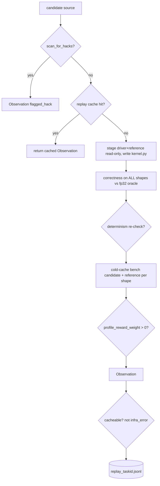

# `kore/env` — the verified GPU environment

`KoreEnv` is where a candidate kernel meets real silicon. It compiles the kernel, checks correctness on every shape against the fp32 oracle, benchmarks it cold-cache against the production baseline with variance control, optionally collects rocprofv3 counters, and caches the result. It is hardened against several reward-forgery paths and separates **infra** failures (timeout / OOM / HIP flake) from **kernel** failures. Its default subprocess backend is explicitly **trusted-code-only**, not a hostile-code sandbox; production/untrusted execution requires the external boundary in [`kore/sandbox`](../sandbox/README.md).

---

## Files

| File | Purpose |
| --- | --- |
| `kore_env.py` | `KoreEnv` — `step` / `evaluate` / `_run`; correctness + bench + profile |
| `replay.py` | `ReplayCache` — JSONL-backed `(task_id, source) → Observation` |

---

## The evaluation path



Key API:

```python
class KoreEnv:
    def step(self, source, full_validation=True, multi_shape=True) -> Observation
    def evaluate(self, task, source, shapes=None, do_bench=True) -> Observation
```

The returned `Observation` (defined in [`kore/reward`](../reward/README.md)) carries `compiled`, `snr_by_shape`, `wall_by_shape`, `baseline_by_shape`, `cv_pct`, `flagged_hack`, `infra_error`, and optional `profile_efficiency`.

---

## Anti-hack hardening

| Attack | Defense |
| --- | --- |
| Verdict forgery (print fake `SNR:`) | parse the **last** regex match; re-check correctness *after* the timed loop |
| Mode sniffing (behave differently when benched) | randomized warmup/iters per bench run |
| Stateful timing | post-timing correctness poison → whole eval flagged as hack |
| One-easy-shape win | `wall_ms = max` over shapes, `snr_db = min` over shapes |
| Accidental source mutation | staged in a private temp workdir; reference/driver copied read-only (chmod 444) |
| Runaway trusted process | bounded output + timeout + process-group cleanup (no `RLIMIT_AS` — ROCm needs a huge VA space) |

> **Isolation boundary.** Read-only staging, an allowlisted environment, rlimits, and a process group do not isolate code running under the same UID. They do not block filesystem or network access and cannot enforce GPU memory/fault separation. The local controller is labeled `trusted-code-only`. Untrusted or production policy fails closed unless an approved external broker and signed-verdict verifier are configured.

> **Concurrency and `RLIMIT_NPROC`.** `RLIMIT_NPROC` is **per-UID**: it counts every process and thread the user owns, not just the child, so a low per-subprocess soft cap throttles the *whole user*. The trusted backend therefore does not claim to enforce `max_processes` locally; the production broker must use cgroup v2 `pids.max`. The candidate environment caps `OPENBLAS/OMP/MKL/NUMEXPR_NUM_THREADS=4` to reduce accidental thread explosions.

Candidate children receive no inherited API keys, proxy controls, Slurm/SSH state, `LD_PRELOAD`, user site, or ambient `PYTHONPATH`. `HOME`, `TMPDIR`, and compiler caches are private to the evaluation. This intentionally removes the old cross-evaluation shared compile cache from the candidate trust boundary.

**Infra vs. kernel classification** (`_classify`): timeouts, OOM, and HIP flakes are `infra_error=True`; they are **never cached** and **never scored as incorrect**, so a transient node problem cannot poison the replay cache or penalize a good kernel.

---

## Determinism gate

When `CONFIG.verifier_determinism_check` is on, the primary shape is re-run; if SNR drifts by more than `determinism_snr_tol_db` (10 dB) the kernel is judged non-deterministic (incorrect). An infra flake on the re-run is treated as *inconclusive*, preserving the original correct verdict.

---

## Replay cache

```python
def source_key(task_id, source) -> str      # SHA256(task_id + NUL + source)
class ReplayCache:
    def get(self, task_id, source) -> Optional[Observation]
    def put(self, task_id, source, obs) -> None
```

JSONL records are filtered to the current `Observation` field set on load, so schema evolution (e.g. removing a field) never causes a silent cache miss. Cacheability rule: `(compiled or error_text) and not infra_error`.

---

## Profiling

When `profile_reward_weight > 0`, `_collect_profile` runs rocprofv3 with `--bench-mode` on the primary shape and produces a `profile_efficiency ∈ [0,1]` (see [`kore/verifier`](../verifier/README.md) for counter sets and [`kore/reward`](../reward/README.md) for how it shapes reward). rocprof requires `--bench-mode`; without it candidate/reference profiles are degenerate.

`collect_counters(source, shape=primary)` is the public rocprofv3 PMC entry point: it stages an isolated workdir, profiles the candidate, and returns aggregated `{counter: value}` (the gfx950 derived metrics `MemUnitStalled` / `OccupancyPercent`, plus captured `vgpr_count` / `lds_bytes` / `num_warps`) or `None` when the profiler is unavailable — fully fail-safe.

These named counters feed the roofline shaping potential. `kore.reward.whitebox.phi_potential` turns them into `Φ = ρ = T_min/(T_min + N)`, the counter-grounded named-residual attainment (`N = stall + occupancy-deficit`), which GRPO adds as an approximately policy-invariant potential-based-shaping term (`physics_shaping_weight`; the invariance is approximate under GRPO's std-normalized group-relative advantage — see [`kore/reward`](../reward/README.md)). The online potential is the PMC-free attainment `η = T_min/T_measured`; `ρ` is its counter-grounded refinement, validated offline at R² ≈ 0.98 (`docs/P0_RESULTS.md`).

Per-candidate PMC is expensive, so the two rollout paths differ in how they compute the potential. The agentic tool-use rollout (`agentic_transform_tools` / `config.agentic=true`) calls `phi_potential(task, obs)` without counters (`kore/agent/tools.py`), so `Φ = η`. The serial GRPO rollout can thread per-turn counters through `kore.policy.grpo._dense_profile_bonus` (gated on `--profile-reward` / `profile_reward_weight > 0`), a dense bonus term distinct from the shaping potential. In both paths the reward is `reward_mode="speedup"` (vendor-relative); only the dense shaping term varies between the counter-grounded `ρ` and the PMC-free `η`.

---

## Config knobs (from `kore/config.py`)

| Knob | Effect |
| --- | --- |
| `verifier_determinism_check` | re-run primary shape; drift → incorrect |
| `min_variance_runs` / `max_variance_runs` / `cv_threshold_pct` | early-stop benching when CV is low enough |
| `warmup_iters` / `bench_iters` | base warmup/measure counts (randomized per run) |
| `profile_reward_weight` | trigger PMC collection + dense shaping |
| `sandbox` | `SandboxConfig`; trusted compatibility or fail-closed external broker |

See also: [`tasks`](../tasks/README.md), [`reward`](../reward/README.md), [`verifier`](../verifier/README.md).
