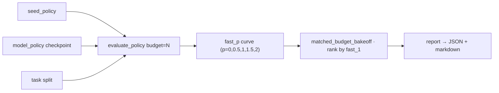
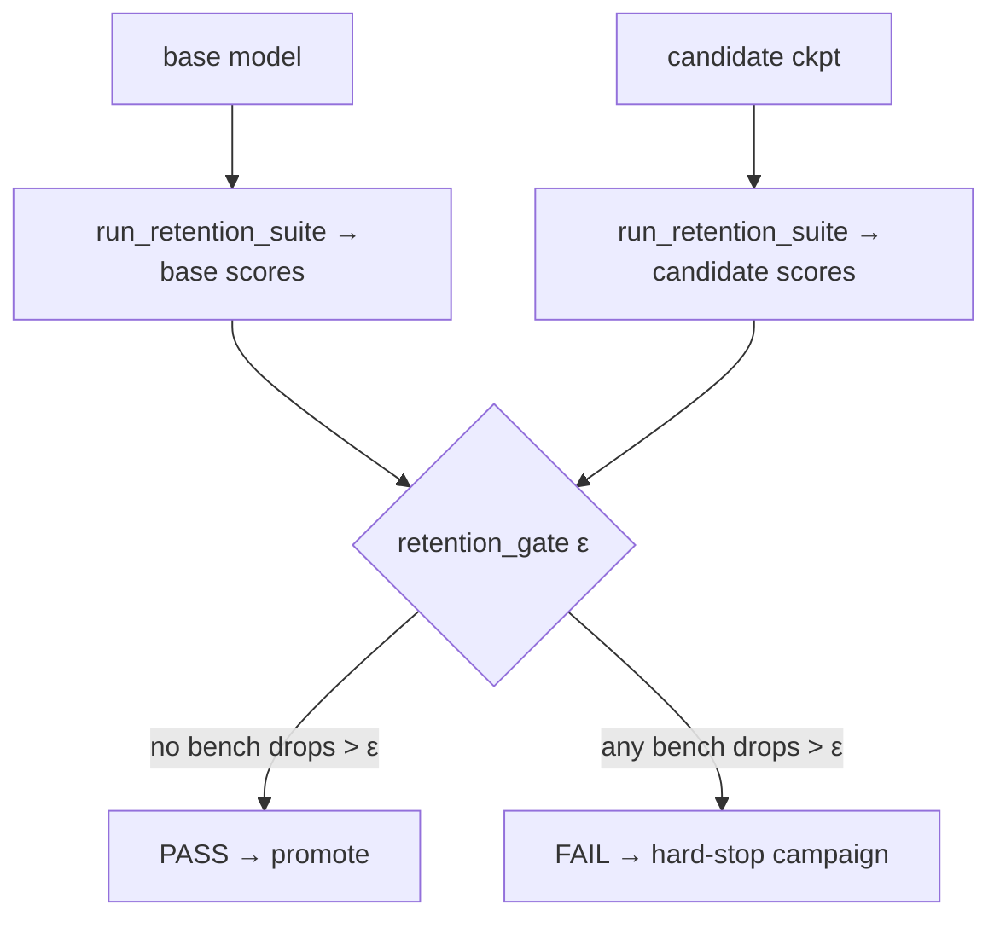

# `kore/eval` — evaluation, gates & generalization

KORE's target is conjunctive: **strong kernel numbers _while_ matching-or-beating the base model on every general benchmark, _and_ generalizing to held-out operator families.** This package measures all three, adds a maximum-scrutiny anti-hack re-evaluation of champion kernels, and provides a literature-comparable frontier suite: a recognized-benchmark adapter (`kernelbench_amd.py`), a robust-KernelBench correctness battery (`robust_eval.py`), paired significance statistics (`paired_stats.py`), and a head-to-head-vs-frontier-model harness (`head_to_head.py` / `vs_opus.py` / `opus_policy.py`).

---

## Files

| File | Purpose |
| --- | --- |
| `fastp.py` | The KernelBench `fast_p` metric (+ pass@k, fast_p@k, multi-seed CIs) |
| `bakeoff.py` | Matched-measurement-budget bake-off of policies (seed vs. trained) |
| `retention.py` | Six-benchmark general-capability suite |
| `gates.py` | PASS/FAIL stage gates (`retention_gate`, `StageGate`) |
| `generalization.py` | Zero-shot cross-family transfer harness |
| `champion.py` | Champion kernel re-eval under harder-than-training scrutiny |
| `policies.py` | Bake-off policies: `seed_policy` (frozen seed) + `model_policy` (trained checkpoint) |
| `korebench.py` | Standardized worst-shape-win-rate benchmark report |
| `report.py` | Markdown/JSON rendering for eval results |
| `kernelbench_amd.py` | Recognized-benchmark adapter: KernelBench ⇄ KORE, `fast_p` at `p ∈ {1, 1.5, 2}`, wider held-out protocol |
| `robust_eval.py` | Robust-KernelBench anti-hack battery: adversarial regimes, fp64 differential oracle, metamorphic relations, halt-on-first |
| `paired_stats.py` | Paired bootstrap CI + sign/Wilcoxon tests for KORE-vs-baseline/frontier comparisons |
| `opus_policy.py` | Adapts the frontier teacher into a `PolicyFn` scored through the identical bake-off path |
| `head_to_head.py` | KORE-vs-frontier head-to-head with paired significance on per-task speedup deltas |
| `vs_opus.py` | KORE-vs-frontier head-to-head reporting multi-seed fast_p + win-rate with CIs |
| `e2e_sglang_vllm.py` | End-to-end serving gate (throughput + accuracy on vLLM / SGLang) |

---

## fast_p and the bake-off

```
fast_p = (1/n) · #{ tasks that are correct AND baseline/actual > p }
```

`n` is the **full** split size (uncorrected denominator) — failed or unattempted tasks contribute 0, penalizing wasted budget. `bakeoff.matched_budget_bakeoff` compares policies at an **equal bench budget** per task and ranks by `fast_p[1.0]`. Two policies matter: `seed_policy` (the frozen starter) and `model_policy(checkpoint)` (the trained model). The bake-off scores both at the same budget; reporting only the seed, or comparing at unequal budgets, misstates the result. The speedup that feeds `fast_p` is timing-integrity gated (excessive-ratio artifacts capped, high-variance timings damped to ≤1×), so the headline metric cannot be farmed with a glitch or a noisy bench.



`evaluate_policy` runs each task under a matched budget in `serial` (one refinement trajectory, feedback accumulates) or `parallel` (independent best-of-N) mode, and can report a second `fast_p` curve versus a torch-eager baseline (KernelBench-comparable) alongside the production vendor curve. `pass_at_k` / `fast_p_at_k` give unbiased best-of-N estimates.

---

## Retention gate



`run_retention_suite` scores six benches — **MMLU, HumanEval, LiveCodeBench, IFEval, BFCL, MT-Bench** — each normalized to `[0,1]`. `KORE_EVAL_FULL=1` pulls the real HuggingFace splits (capped by `KORE_EVAL_N`, default 300/bench), with an offline fallback to bundled smoke subsets; the `sources` field records which was used, since a PASS on smoke is not comparable to a PASS on full HF. The campaign calls `retention_gate` after midtrain/sft/dpo/grpo, and a FAIL raises and stops the run. `StageGate` additionally requires the targeted kernel metrics to strictly improve for promotion. Every scorer takes a single `model_generate(prompt, **kw) -> str` callable, so a stub exercises the whole pipeline on CPU and a real HF/vLLM model plugs in unchanged; executable-code benches run in a sandboxed subprocess with a wall-clock timeout.

> MT-Bench is the highest-variance gate key (LLM-as-judge noise); it needs a strong injected judge and enough items, or `ε` will trip on judge noise. The campaign default `ε=0.02` is chosen with this in mind.

---

## Generalization (held-out families)

`generalization.py` classifies tasks into 8 families (`attention, moe, gemm, norm, positional, quant, reduction, activation`, first-match-wins rules), builds a leakage-checked split by **entire families**, and evaluates the physics residual reward on held-out families from a P0 measures JSON — offline, no training. It gates aggregation on the reward's own correctness verdict (`rr.correct`), not just the raw measure flag.

> **Two family taxonomies, by design.** The 8-family `classify` here is the richer analysis / leave-one-family-out grouping. The authoritative product split is `kore.tasks.registry` (`operator_family` + `HELDOUT_FAMILIES`): the model **trains** core attention (flash prefill/decode/varlen/fp8) and reserves the structurally distinct **MLA** (latent attention) and **paged-KV decode** families (plus any foreign-arch task) as the never-trained set. `korebench.py`'s per-family view uses the registry taxonomy; the two taxonomies are kept separate.

---

## Champion re-eval (anti-hack)

`champion.py` re-benchmarks the best-per-task kernels under **harder** conditions than training — `KORE_VERIFIED_CORRECTNESS=1`, `KORE_COMPILE_BASELINE=1`, `KORE_BENCH_COLD=1`, `KORE_CORRECTNESS_TRIALS=10`, and augmented held-out shapes, with the replay cache disabled. A kernel is certified only if it is correct on unseen shapes, static-hack-free, low-variance, and its measured speedup has not collapsed below `0.7×` of the claimed value — catching kernels that overfit training shapes or the timing setup. The verdict logic (`champion_verdict`) is pure and CPU-unit-tested; `run_champion_reeval` drives the real `KoreEnv` on hardware and writes a certification report.

---

## Publishable frontier suite

Four capabilities make a KORE result comparable to the field, hardened against correctness hacks, and statistically defensible. All are import-safe (torch/numpy imported lazily) and unit-tested in `kore/eval/tests/test_eval_frontier.py`. The campaign eval stage (`scripts/run_campaign.py._stage_eval`) runs three fail-safe tracks — each wrapped so a failure logs and skips rather than breaking eval:

- **paired significance (KORE vs seed)** — `paired_speedup_comparison` on the per-task speedups both policies solved → `eval/paired_seed_vs_kore.json`;
- **KernelBench-AMD `fast_p`** — `run_kernelbench_amd` on bundled offline specs by default, or a real checkout via `--kernelbench-root` → `eval/kernelbench_amd.json`;
- **head-to-head vs the frontier model** — `head_to_head_vs_opus` → `eval/head_to_head_vs_opus.json` (skips cleanly with no API key).

`robust_eval.py` stays exposed for maximum-scrutiny anti-hack audits and is import-checked in the campaign preflight.

### `kernelbench_amd.py` — recognized-benchmark adapter

Bridges KORE and the field-standard **KernelBench** in both directions, measured on the KORE target AMD arch (**gfx950**/CDNA4 by default, gfx942/CDNA3 accepted; every task is backend-tagged):

- **Forward** (`spec_to_task`): a KernelBench-style problem (a PyTorch `Model.forward` + input generator + named shapes, Level 1 single-ops / Level 2 fusions) becomes a genuine KORE `Task`, graded through KORE's own verified, timing-integrity-gated matched-budget bake-off. The PyTorch reference becomes the correctness oracle; the baseline is **torch-eager** (KernelBench's baseline), labeled as such.
- **Reverse** (`to_kernelbench_report`): renders a KORE `evaluate_policy` result as the field-standard **`fast_p` at `p ∈ {1.0, 1.5, 2.0}`** (fraction of the whole split that is correct AND >p× faster than the baseline), with a per-**level** (1 vs 2) breakdown, correct rate, and geomean speedup. `fast_1` is the headline.
- **Bundled fixtures** (`bundled_specs`) span the three canonical classes (elementwise L1, GEMM L1, pointwise + GEMM-epilogue L2) so the whole path is CPU-testable offline; `load_real_kernelbench` loads the real Level 1/2 problem files from a checkout.
- **Wider held-out protocol** (`propose_heldout_protocol`): the registry reserves only a couple of families (MLA, paged-KV), so this proposes a **dozens-of-tasks** split stratified over three axes — operator **family × shape-regime × dtype** — reserving *whole* families with a strict `leakage_check` / `assert_no_leakage` (no task in both splits, no family straddling the boundary). It only computes a proposal; it never mutates the registry.

### `robust_eval.py` — robust-KernelBench anti-hack battery

Hardens the eval-time correctness verdict against kernels that pass a naive `allclose` on a few random inputs. Each check is a pure function of a candidate callable + a torch reference + a deterministic input factory (CPU/torch-testable with fake kernels):

- **Adversarial regimes** (`check_adversarial_regimes`): enumerated hard fills — zeros / ones / neg-ones / large / neg-large / small / sign-alternating / NaN-Inf — with **non-finite-structure-aware** comparison (a correct kernel must reproduce the reference's NaN/Inf positions and inf signs exactly).
- **fp64 differential oracle** (`check_differential_oracle`): recompute the reference in fp64 (the high-precision truth) and reject a candidate that is materially **less accurate than its own dtype warrants** — catching a precision downgrade that `allclose` waves through.
- **Metamorphic relations**: `permutation_invariance` (reductions/softmax), `homogeneity` `f(ax)=a·f(x)` (linear/GEMM), and `additive_response` (fusions) — each applied only when the *reference* itself satisfies it, then required of the candidate (flags constant/memset and mis-fused kernels). Plus reseeded random inits and non-contiguous/strided inputs.
- **Halt-on-first**: `robust_correctness(...)` runs the applicable battery in order and **halts on the first mismatch**, returning a `RobustReport` naming the failing check. `inputs_factory_from_spec` bridges it directly onto a `kernelbench_amd` spec.

### `paired_stats.py` — paired significance

Because KORE and the other side (the seed baseline or the frontier teacher) are scored on the **same** held-out tasks under a matched budget, the comparison is **paired** — far more powerful than unpaired, since it cancels task-to-task difficulty variance. Pure numpy/python (no scipy, no torch):

- **Effect size + 95% CI**: `paired_bootstrap` gives a percentile bootstrap CI (and a recentred-bootstrap two-sided p-value) on the mean per-task delta; `paired_speedup_comparison` works in the log domain so the effect is a **geometric-mean speedup ratio** with an exponentiated CI ("X× faster, 95% CI …").
- **Non-parametric p-values**: an exact two-sided **sign test** (binomial, robust to outliers) and the **Wilcoxon signed-rank** test (normal approx with tie + continuity correction). `paired_comparison` bundles all three, with the headline test (Wilcoxon by default) deciding significance at `alpha`.

### Head-to-head vs a frontier model

`opus_policy.py` adapts the frontier teacher (`kore.data.teacher.make_teacher`, whose `claude` backend defaults to `claude-opus-4.8` via AMD's internal LLM gateway) into a `PolicyFn` built by the **same** `model_policy` path as the KORE side, so both share the identical prompt contract and response parser — the only difference is the token source. `head_to_head.head_to_head_vs_opus` scores both sides through the identical `KoreEnv` verified oracle + cold-cache timing + matched budget at a matched decode temperature, then runs the paired battery (bootstrap CI + Wilcoxon + sign test) on the KORE-minus-frontier per-task speedup deltas, plus a geometric-mean speedup ratio on the both-correct subset and a win/loss/tie tally. `vs_opus.head_to_head` is the multi-seed variant reporting per-side `fast_p` and win-rate with confidence intervals over seeds.

Both harnesses degrade gracefully: with no `anthropic` SDK / `AMD_LLM_API_KEY`, or a gateway outage mid-run, the frontier side is skipped with a loud warning and the KORE-only numbers are still returned. The harness makes the comparison correctly paired and fair; the reported verdict follows from the measured per-task speedups.

See also: [`kore/policy`](../policy/README.md), [`kore/reward`](../reward/README.md), [`kore/analysis`](../analysis/README.md), [`docs/KORE_BENCH_BLUEPRINT.md`](../../docs/KORE_BENCH_BLUEPRINT.md).
