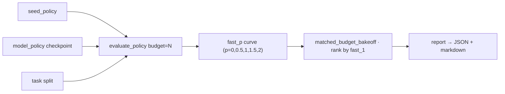
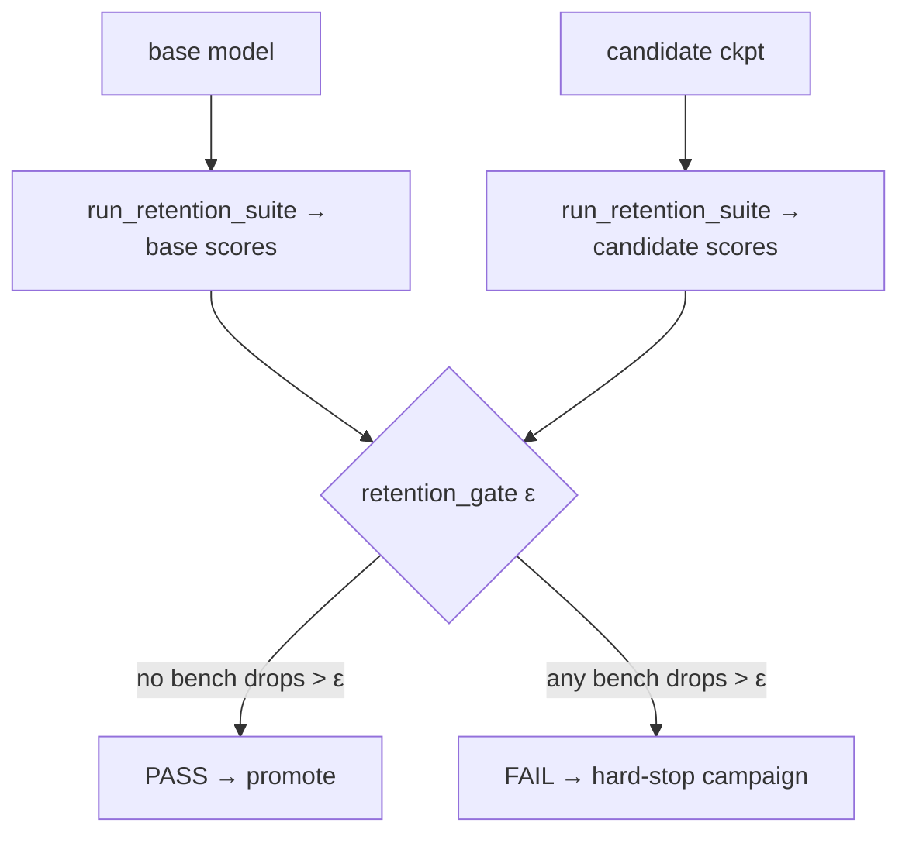

# `kore/eval` - evaluation, gates & generalization

KORE's claim is conjunctive: **best kernel numbers _while_ matching-or-beating the base model on every general benchmark, _and_ generalizing to a held-out operator family.** This package measures all three, plus a maximum-scrutiny anti-hack re-eval of champion kernels.

---

## Files

| File | Purpose |
| --- | --- |
| `fastp.py` | The KernelBench `fast_p` metric (+ pass@k, bootstrap CIs) |
| `bakeoff.py` | Matched-measurement-budget bake-off of policies (seed vs. trained) |
| `retention.py` | Six-benchmark general-capability suite |
| `gates.py` | PASS/FAIL stage gates (`retention_gate`, `StageGate`) |
| `generalization.py` | Zero-shot cross-family transfer harness |
| `champion.py` | Champion kernel re-eval under harder-than-training scrutiny |
| `korebench.py`, `policies.py`, `report.py`, `e2e_sglang_vllm.py` | standardized report, policy wrappers, markdown/JSON output, E2E serving gate |

---

## fast_p and the bake-off

```
fast_p = (1/n) · #{ tasks that are correct AND baseline/actual > p }
```

`n` is the **full** split size (uncorrected denominator) - failed or unattempted tasks contribute 0, penalizing wasted budget. `bakeoff.matched_budget_bakeoff` compares policies at an **equal bench budget** per task and ranks by `fast_p[1.0]`. Two policies matter: `seed_policy` (the frozen starter) and `model_policy(checkpoint)` (the trained model). Reporting only the seed, or comparing at unequal budgets, is a documented audit trap.



---

## Retention gate



`run_retention_suite` scores six benches - **MMLU, HumanEval, LiveCodeBench, IFEval, BFCL, MT-Bench** - each normalized to `[0,1]`. `KORE_EVAL_FULL=1` pulls the real HuggingFace splits (capped by `KORE_EVAL_N`, default 300/bench); otherwise bundled smoke subsets are used, and the `sources` field records which (a PASS on smoke is *not* comparable to a PASS on full HF). The campaign calls `retention_gate` after midtrain/sft/dpo/grpo; a FAIL raises and stops the run. `StageGate` additionally requires kernel metrics to strictly improve for promotion.

> MT-Bench is the highest-variance gate key (LLM-as-judge noise); it needs a strong injected judge and enough items, or `ε` will trip on judge noise. The campaign default `ε=0.02` is chosen with this in mind.

---

## Generalization (held-out families)

`generalization.py` classifies tasks into 8 families (`attention, moe, gemm, norm, positional, quant, reduction, activation`, first-match-wins rules), builds a leakage-checked split by **entire families**, and evaluates the physics residual reward on held-out families from a P0 measures JSON - **offline, no training**. It gates aggregation on the reward's own correctness verdict (`rr.correct`), not just the raw measure flag.

---

## Champion re-eval (anti-hack)

`champion.py` re-benchmarks the best-per-task kernels under **harder** conditions than training - `KORE_VERIFIED_CORRECTNESS=1`, `KORE_COMPILE_BASELINE=1`, `KORE_BENCH_COLD=1`, `KORE_CORRECTNESS_TRIALS=10`, and augmented held-out shapes, with the replay cache disabled. A kernel is certified only if it is correct on unseen shapes, hack-free, low-variance, and its measured speedup hasn't *collapsed* below `0.7×` of the claimed value - catching kernels that overfit training shapes or the timing setup.

See also: [`kore/policy`](../policy/README.md), [`kore/reward`](../reward/README.md), [`kore/analysis`](../analysis/README.md), [`docs/KORE_BENCH_BLUEPRINT.md`](../../docs/KORE_BENCH_BLUEPRINT.md).
