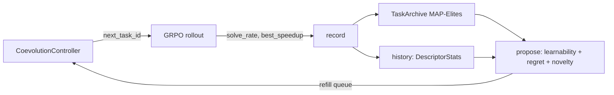

# `kore/openended` - open-ended co-evolution curriculum

Instead of cycling tasks round-robin, KORE can **co-evolve the curriculum with the policy**: propose the tasks at the policy's competence frontier - maximally *learnable*, high *headroom-regret*, and *novel* relative to what's been mastered. This is UED/PLR + MAP-Elites over a parametric task space, integrated into GRPO through `CoevolutionController`. Pure CPU control logic (no torch at import).

The package now has **two complementary halves**:

- **SELECT (live):** `controller.py` curriculum-**selects** tasks from the *fixed* registered menu (the intersection of the parametric space with the trainer's allowed list). This is what the flagship 14B GRPO run uses (`coevolve: true`).
- **MINT (live):** `grammar.py` + `minter.py` **mint net-new, correct-by-construction tasks** beyond the registered menu and `materialize.py` turns each into a runnable on-disk task dir, so the curriculum grows open-endedly instead of only re-weighting a fixed menu. Now **wired into `CoevolutionController` and on in the flagship** (`coevolve_mint: true`, `coevolve_mint_batch: 6`), and still fully fail-safe - a bad mint is skipped, never trained on (see [Open-ended task minting](#open-ended-task-minting-grammarpy--minterpy) below).

---

## Files

| File | Purpose |
| --- | --- |
| `task_space.py` | `TaskDescriptor` parametric space (family / op / dtype / shape regime) + mutation |
| `proposer.py` | Frontier scoring: learnability + regret + novelty |
| `archive.py` | MAP-Elites task archive (niche = behavioral descriptor) |
| `coevolve.py` | Full open-ended generation loop |
| `controller.py` | `CoevolutionController` - the GRPO-facing adapter (curriculum-**selects** registered tasks) |
| `grammar.py` | **(new)** Typed composition grammar over verified torch primitives - the minter's correct-by-construction oracle builder |
| `minter.py` | `TaskMinter` - **mints** net-new verifiable tasks beyond the registered menu (wired via `coevolve_mint`; **on in the flagship**) |
| `materialize.py` | **(new)** `materialize_minted_task` - writes a `MintedTask` to a runnable on-disk task dir (reusing the `_genops` driver/reference ABI) with a materialize-time **self-check** that rejects any faithless reconstruction |

---

## Frontier scoring

```python
learnability(p) = 4·p·(1-p)          # peaks at solve-rate p = 0.5
score = w_learn·learnability + w_regret·headroom_regret + w_novelty·novelty
```

With evidence, a task that is essentially unsolvable (`p ≤ 0.05`) or trivial (`p ≥ 0.95`) scores 0 - the proposer targets the *zone of proximal development*. `headroom_regret` is the unrealized speedup vs. the roofline; `novelty` is the Hamming distance to occupied archive niches (`family`, arithmetic intensity, fusion depth, dtype precision, shape scale).



---

## Held-out safety

The generalization split can never leak through the curriculum. The parametric
task space is drawn only from trainable op registries (`kore.tasks._genops`:
`unary`/`binary`/`reduce`/`fusion`/`gemm_fusion`, plus the vendor-baselined ops),
so the held-out families (`mla`, `paged_attention` - see [`kore/tasks`](../tasks/README.md))
are **not representable** as a `TaskDescriptor` and the proposer cannot mint one.
`CoevolutionController` adds a second guard: it only serves task_ids from the
trainer's allowed list, which in a KORE campaign is the held-out complement.

---

## Distributed determinism (important)

Under multi-rank FSDP GRPO, every rank builds the **same** controller (same `seed` + task list) and `next_task_id` is deterministic (driven by `seed + refills` and the proposer RNG, not by wall-clock or step index). The per-rollout feedback (`solve_rate`, `best_speedup`) is all-gathered across ranks before `record()`, so the archive update is **rank-invariant** - all ranks propose identical tasks and stay in lockstep. This is what makes the curriculum safe to enable on the 8-GPU production run.

```python
class CoevolutionController:
    def next_task_id(step=0, attempt=0) -> str   # deterministic across ranks; minted OR registered
    def resolve_task(task_id) -> Task             # materialized minted task if minted, else registered
    def record(task_id, solve_rate, best_speedup) -> bool
    def report() -> dict                          # frontier metrics
```

Enabled via `coevolve: true` in [`configs/grpo_14b_full.json`](../../configs/README.md). See also: [`kore/policy/grpo.py`](../policy/README.md), [`kore/tasks`](../tasks/README.md).

---

## Open-ended task minting (`grammar.py` + `minter.py`)

The controller above curriculum-**SELECTS** from the *fixed* registered task menu - it re-weights the 282 registered (op × dtype) tasks. `grammar.py` + `minter.py` **grow it open-endedly**: they **MINT net-new, correct-by-construction tasks**, and `materialize.py` turns each into a runnable on-disk task dir, so the RL curriculum is no longer capped at the registered set. Once a planned "future extension," minting is now **wired into `CoevolutionController` (`next_task_id`/`resolve_task`) and live in the flagship run**.

> **Status: WIRED + LIVE IN THE FLAGSHIP.** `grammar.py` + `minter.py` are implemented and unit-tested (`kore/openended/tests/test_minter.py`: all four moves, the construction gate, behavioral dedup, held-out rejection, fused-vs-sequential reference equality, niche placement, and a runnable-namespace round-trip), and the new `materialize.py` turns each `MintedTask` into a runnable on-disk task dir - guarded by a materialize-time **self-check** that rejects any faithless reconstruction. Minting is wired into `CoevolutionController` (`next_task_id`/`resolve_task`) behind the `coevolve_mint` GRPO flag (`GRPOConfig.coevolve_mint`) and is **on in the flagship 14B run** (`coevolve_mint: true`, `coevolve_mint_batch: 6` in `configs/grpo_14b_full.json`), expanding the curriculum beyond the registered menu. It stays fully **fail-safe**: any bad mint or self-check mismatch is skipped and the loop falls back to registered tasks, so enabling it can never crash or corrupt the run. CPU-only (torch imported lazily, only to build/gate/self-check references - never a GPU).

### `grammar.py` - a typed grammar over verified torch primitives

The "correct-by-construction" half: a small typed IR whose leaves are **verified torch primitives** (`relu`, `matmul`, `rmsnorm`, `softmax`, reductions, ...) and whose composition is **type-checked**, so any well-typed `Pipeline` denotes a pure torch function that *is* the task's reference oracle - there is no separate spec to drift from.

- **Type system:** values are `MATRIX` (`[M,N]`) or `ROWVEC` (`[M]`, terminal). Each `Primitive` declares the type it consumes/produces and the aux tensors it samples (matmul weight, bias, residual, norm scale). `Pipeline.typecheck()` is the soundness gate: exactly one leading source, every stage consumes the prior stage's type, nothing follows a terminal reduction.
- **Correct-by-construction oracle:** `build_reference()` folds inputs in fp32 and casts to the task dtype - identical to `kore.tasks._genops.make_reference` (`ref_fn`), so a minted reference grades like a hand-written generated op. `build_sampler()` draws seeded inputs with the same `1/sqrt(K)` GEMM scaling `_genops` uses, keeping references well-conditioned.
- **Measured cost model:** `flops_and_bytes()` estimates fused FLOPs, HBM bytes, and **arithmetic intensity** (the roofline x-axis) on CPU - deeper fusions raise intensity (more FLOPs, same bytes).
- **Behavioral hash:** `behavioral_hash()` is a SHA1 of the reference's fp32 outputs on a canonical probe - a shape/precision-independent fingerprint of the *operation*, used for behavioral dedup.

### `minter.py` - the verifiable `TaskMinter`

A `MintedTask` is an **in-memory RL-curriculum task** whose six-field ABI (`name, reference_fn, input_sampler, dtype, tol, family`) matches KORE's task ABI; `to_reference_namespace()` emits the exact namespace `_genops.make_reference` returns, so a minted task drops into the generic driver/verifier and runs on GPU at train time. At train time the new `materialize.py` writes each `MintedTask` to a runnable on-disk task dir on demand - reusing the trusted `_genops` driver/reference ABI, with a self-check that rejects any faithless reconstruction - and `CoevolutionController.resolve_task` serves it alongside registered tasks (these are ephemeral RL-curriculum task dirs, distinct from the offline datagen corpus).

- **Four minting moves:** `fusion` (chain primitives into a new fused op), `extrapolate` (re-cast a structure at a new dtype/shape scale), `novel` (compose activations/reductions into a brand-new op), and `mutate_crossover` (lift **registered** descriptors into the grammar and perturb/recombine).
- **Robust-kbench-style construction gate:** every candidate must (1) type-check, (2) not be a held-out family, (3) execute on CPU, (4) be finite, (5) be deterministic (same seed → identical output), (6) be non-constant, (7) vary along **every** axis, and (8) be sensitive to **every** input - rejecting constant/memset, collapsed, and dead-input degenerates before a task can enter the curriculum. Followed by **behavioral-hash dedup** (`hash × dtype × shape_scale`, so a genuine parametric-extrapolation variant is *not* a duplicate).
- **Measured-roofline QD:** survivors get a MAP-Elites niche from **measured CPU proxies** (`arithmetic_intensity` compute/memory-bound at a FLOPs/byte ridge of 20, fusion depth, dtype precision, shape scale) - the same `task_space.descriptor_features` keys, so minted ops niche-place alongside registered ones in the archive.
- **Learning progress:** learnability is `4·p·(1-p)` from a supplied rollout success-rate `p`, novelty is Hamming distance to occupied niches, and the **proposer reward is the injected learning-progress delta** (`progress_fn`, falling back to the learnability prior).

> **Honest scope of "correct-by-construction."** The construction gate + materialize-time self-check guarantee only that a minted task has a **valid, executable, non-degenerate** oracle - *not* that the task is **realistic** or well-distributed in difficulty. Random torch-primitive compositions can be numerically valid yet unrepresentative of real kernel workloads; the difficulty knobs (fusion depth / dtype / shape) are heuristic priors, not a calibrated curriculum. Minting *grows the space soundly*; it does not by itself guarantee the *hard, useful* problem. Also note the seed: a minted task's **seed kernel is the torch reference, not a Triton kernel** (`materialize._seed_source`), so the Triton-source transform library ([`kore/transform`](../transform/README.md)) is inapplicable to a minted *seed* - AlphaKernel searched from a minted seed yields ~0 children (see [`kore/search`](../search/README.md)). At train time the policy still writes Triton for it, so the "make this correct kernel fast" task itself is well-posed.

### Held-out safety (by construction)

Minting inherits and strengthens the SELECT-path guard: the grammar has **no** attention / MLA / paged-KV primitive at all, so a held-out task is literally *unrepresentable*. The gate additionally rejects any candidate whose name/family hits the held-out tokens or the canonical registry classifier (`kore.tasks.registry`), so the guard can never drift from the train/held-out split.

```python
from kore.openended import minter
tasks = minter.mint_batch(archive, policy_p_fn, n=8, seed=0,   # deterministic, LLM-free
                          progress_fn=learning_progress_delta)  # wired via coevolve_mint (ON in the flagship)
```

---

## Novelty & honest limitations

The mechanics above are **correct and sound**, but most of the machinery is **incremental prior art** and should not be oversold:

- **Proposer + archive are faithful re-implementations, not novel.** Frontier scoring is textbook **UED/PLR** (learnability `4·p·(1-p)` + regret) and the archive is textbook **MAP-Elites**; the generation loop is **POET-shaped**. Correctly applied, but not new.
- **The genuinely-new bit is the *substrate*: roofline-coordinate QD niching over a verifiable kernel task space.** Every kernel task is cheaply generatable, ground-truth **verifiable**, and carries a **continuous performance-headroom regret** (unrealized speedup vs. the roofline), so the usual blockers for open-ended RL - unverifiable reward and hard-to-estimate regret - largely dissolve here. That grounding, plus minting *net-new correct-by-construction* tasks, is the paradigm contribution.
- **The minter is the strongest piece** - correct-by-construction synthesis from a typed torch-primitive grammar with a rigorous 8-check gate + materialize-time self-check is a genuinely-new-leaning combination for kernel curricula - **but** it guarantees *valid* tasks, not *realistic or hard* ones (see the scope note above).
- **Live status.** These levers are on in the flagship **template** (`coevolve`, `coevolve_mint`), but they only engage **when the GRPO stage runs**. The run is currently in midtrain, so the co-evolution / minting curriculum is **days away** from actually driving task selection.

See also: [`kore/search`](../search/README.md) (test-time search over the transform calculus), [`kore/transform`](../transform/README.md) (the verified action space), [`kore/tasks`](../tasks/README.md), [`kore/policy`](../policy/README.md) (the GRPO wiring), [`kore/reward`](../reward/README.md).
