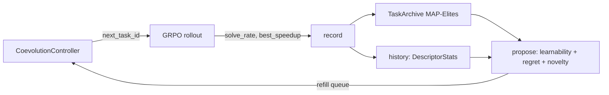

# `kore/openended` - open-ended co-evolution curriculum

Instead of cycling tasks round-robin, KORE can **co-evolve the curriculum with the policy**: propose the tasks at the policy's competence frontier - maximally *learnable*, high *headroom-regret*, and *novel* relative to what's been mastered. This is UED/PLR + MAP-Elites over a parametric task space, integrated into GRPO through `CoevolutionController`. Pure CPU control logic (no torch at import).

---

## Files

| File | Purpose |
| --- | --- |
| `task_space.py` | `TaskDescriptor` parametric space (family / op / dtype / shape regime) + mutation |
| `proposer.py` | Frontier scoring: learnability + regret + novelty |
| `archive.py` | MAP-Elites task archive (niche = behavioral descriptor) |
| `coevolve.py` | Full open-ended generation loop |
| `controller.py` | `CoevolutionController` - the GRPO-facing adapter |

---

## Frontier scoring

```python
learnability(p) = 4·p·(1-p)          # peaks at solve-rate p = 0.5
score = w_learn·learnability + w_regret·headroom_regret + w_novelty·novelty
```

With evidence, a task that is essentially unsolvable (`p ≤ 0.05`) or trivial (`p ≥ 0.95`) scores 0 - the proposer targets the *zone of proximal development*. `headroom_regret` is the unrealized speedup vs. the roofline; `novelty` is the Hamming distance to occupied archive niches (`family`, arithmetic intensity, fusion depth, dtype precision, shape scale).



---

## Distributed determinism (important)

Under multi-rank FSDP GRPO, every rank builds the **same** controller (same `seed` + task list) and `next_task_id` is deterministic (driven by `seed + refills` and the proposer RNG, not by wall-clock or step index). The per-rollout feedback (`solve_rate`, `best_speedup`) is all-gathered across ranks before `record()`, so the archive update is **rank-invariant** - all ranks propose identical tasks and stay in lockstep. This is what makes the curriculum safe to enable on the 8-GPU production run.

```python
class CoevolutionController:
    def next_task_id(step=0, attempt=0) -> str   # deterministic across ranks
    def record(task_id, solve_rate, best_speedup) -> bool
    def report() -> dict                          # frontier metrics
```

Enabled via `coevolve: true` in [`configs/grpo_14b_full.json`](../../configs/README.md). See also: [`kore/policy/grpo.py`](../policy/README.md), [`kore/tasks`](../tasks/README.md).
