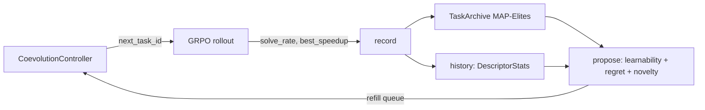

# `kore/openended` — open-ended co-evolution curriculum

Instead of cycling tasks round-robin, KORE **co-evolves the curriculum with the policy**: it proposes tasks at the policy's competence frontier — maximally *learnable*, high in *headroom-regret*, and *novel* relative to what has been mastered. This is UED/PLR + MAP-Elites over a parametric task space, integrated into GRPO through `CoevolutionController`. The control logic is pure CPU (no torch at import).

The package has two complementary halves:

- **SELECT** — `controller.py` curriculum-selects tasks from the *fixed* registered menu (the intersection of the parametric space with the trainer's allowed list). This is what the flagship 14B GRPO run uses (`coevolve: true`).
- **MINT** — `grammar.py` + `minter.py` mint net-new, correct-by-construction tasks beyond the registered menu, and `materialize.py` turns each into a runnable on-disk task dir, so the curriculum grows open-endedly instead of only re-weighting a fixed menu. Wired into `CoevolutionController` and enabled in the flagship (`coevolve_mint: true`, `coevolve_mint_batch: 6`), fail-safe by construction (a bad mint is skipped, never trained on; see [Open-ended task minting](#open-ended-task-minting-grammarpy--minterpy)).

---

## Files

| File | Purpose |
| --- | --- |
| `task_space.py` | `TaskDescriptor` parametric space (family / op / dtype / shape regime) + mutation |
| `proposer.py` | Frontier scoring: learnability + regret + novelty (+ optional competitor anchor) |
| `archive.py` | MAP-Elites task archive (niche = behavioral descriptor) |
| `coevolve.py` | Full open-ended generation loop |
| `controller.py` | `CoevolutionController` — the GRPO-facing adapter (curriculum-selects registered tasks; optionally mints) |
| `grammar.py` | Typed composition grammar over verified torch primitives — the minter's correct-by-construction oracle builder |
| `minter.py` | `TaskMinter` — mints net-new verifiable tasks beyond the registered menu (wired via `coevolve_mint`) |
| `materialize.py` | `materialize_minted_task` — writes a `MintedTask` to a runnable on-disk task dir (reusing the `_genops` driver/reference ABI) with a materialize-time self-check that rejects any faithless reconstruction |
| `opus_baseline.py` | Builds the optional per-task competitor-anchor map from existing teacher data |

---

## Frontier scoring

```python
learnability(p) = 4·p·(1-p)          # peaks at solve-rate p = 0.5
score = w_learn·learnability + w_regret·headroom_regret + w_novelty·novelty
```

With evidence, a task that is essentially unsolvable (`p ≤ 0.05`) or trivial (`p ≥ 0.95`) scores 0 — the proposer targets the *zone of proximal development*. `headroom_regret` is the unrealized speedup vs. the roofline; `novelty` is the Hamming distance to occupied archive niches (`family`, arithmetic intensity, fusion depth, dtype precision, shape scale).

An optional fourth term anchors the curriculum to a competitor: when an `opus_scores` map (`{task_id: regret_vs_opus ∈ [0,1]}`, built from existing Opus-teacher data by `opus_baseline.py`) is supplied, each task gains an additive `opus_regret · regret_vs_opus · learnability` boost, concentrating compute on tasks that are both learnable and where a strong external baseline is not yet matched. It is fail-safe (missing / NaN / out-of-range values fall back to the plain score) and inert by default, so scoring is byte-identical to the learnability + regret + novelty curriculum unless a map is provided.



---

## Held-out safety

The generalization split can never leak through the curriculum. The parametric task space is drawn only from trainable op registries (`kore.tasks._genops`: `unary` / `binary` / `reduce` / `fusion` / `gemm_fusion`, plus the vendor-baselined ops), so the held-out families (`mla`, `paged_attention` — see [`kore/tasks`](../tasks/README.md)) are **not representable** as a `TaskDescriptor` and the proposer cannot produce one. `CoevolutionController` adds a second guard: it only serves task_ids from the trainer's allowed list, which in a KORE campaign is the held-out complement.

---

## Distributed determinism

Under multi-rank FSDP GRPO, every rank builds the **same** controller (same `seed` + task list), and `next_task_id` is deterministic (driven by `seed + refills` and the proposer RNG, not by wall-clock or step index). The per-rollout feedback (`solve_rate`, `best_speedup`) is all-gathered across ranks before `record()`, so the archive update is rank-invariant — all ranks propose identical tasks and stay in lockstep. This is what makes the curriculum safe to enable on the 8-GPU production run.

```python
class CoevolutionController:
    def next_task_id(step=0, attempt=0) -> str   # deterministic across ranks; minted OR registered
    def resolve_task(task_id) -> Task             # materialized minted task if minted, else registered
    def record(task_id, solve_rate, best_speedup) -> bool
    def report() -> dict                          # frontier metrics
```

Enabled via `coevolve: true` in [`configs/grpo_14b_full.json`](../../configs/README.md). See also: [`kore/policy/grpo.py`](../policy/README.md), [`kore/tasks`](../tasks/README.md).

---

## Open-ended task minting (`grammar.py` + `minter.py`)

The controller above curriculum-selects from the *fixed* live registry (`python -c "from kore.tasks.registry import task_ids; print(len(task_ids()))"` prints its current size). `grammar.py` + `minter.py` grow it open-endedly: they mint net-new, correct-by-construction tasks, and `materialize.py` turns each into a runnable on-disk task dir, so the RL curriculum is no longer capped at the registered set. Minting is wired into `CoevolutionController` (`next_task_id` / `resolve_task`) behind the `coevolve_mint` GRPO flag and enabled in the flagship run (`coevolve_mint: true`, `coevolve_mint_batch: 6`).

Minting is implemented and unit-tested (`kore/openended/tests/test_minter.py` covers the four moves, the construction gate, behavioral dedup, held-out rejection, fused-vs-sequential reference equality, niche placement, and a runnable-namespace round-trip). It is fail-safe: any bad mint or self-check mismatch is skipped and the loop falls back to registered tasks, so enabling it can never crash or corrupt the run. It is CPU-only (torch is imported lazily, only to build / gate / self-check references — never a GPU).

### `grammar.py` — a typed grammar over verified torch primitives

The correct-by-construction half: a small typed IR whose leaves are **verified torch primitives** (`relu`, `matmul`, `rmsnorm`, `softmax`, reductions, …) and whose composition is **type-checked**, so any well-typed `Pipeline` denotes a pure torch function that *is* the task's reference oracle — there is no separate spec to drift from.

- **Type system.** Values are `MATRIX` (`[M,N]`) or `ROWVEC` (`[M]`, terminal). Each `Primitive` declares the type it consumes/produces and the aux tensors it samples (matmul weight, bias, residual, norm scale). `Pipeline.typecheck()` is the soundness gate: exactly one leading source, every stage consumes the prior stage's type, and nothing follows a terminal reduction.
- **Correct-by-construction oracle.** `build_reference()` folds inputs in fp32 and casts to the task dtype — identical to `kore.tasks._genops.make_reference` (`ref_fn`), so a minted reference grades like a hand-written generated op. `build_sampler()` draws seeded inputs with the same `1/sqrt(K)` GEMM scaling `_genops` uses, keeping references well-conditioned.
- **Measured cost model.** `flops_and_bytes()` estimates fused FLOPs, HBM bytes, and **arithmetic intensity** (the roofline x-axis) on CPU — deeper fusions raise intensity (more FLOPs, same bytes).
- **Behavioral hash.** `behavioral_hash()` is a SHA1 of the reference's fp32 outputs on a canonical probe — a shape/precision-independent fingerprint of the *operation*, used for behavioral dedup.

### `minter.py` — the verifiable `TaskMinter`

A `MintedTask` is an **in-memory RL-curriculum task** whose six-field ABI (`name, reference_fn, input_sampler, dtype, tol, family`) matches KORE's task ABI; `to_reference_namespace()` emits the exact namespace `_genops.make_reference` returns, so a minted task drops into the generic driver/verifier and runs on GPU at train time. At train time, `materialize.py` writes each `MintedTask` to a runnable on-disk task dir on demand — reusing the trusted `_genops` driver/reference ABI, with a self-check that rejects any faithless reconstruction — and `CoevolutionController.resolve_task` serves it alongside registered tasks (these are ephemeral RL-curriculum task dirs, distinct from the offline datagen corpus).

- **Minting moves.** Four core moves: `fusion` (chain primitives into a new fused op), `extrapolate` (re-cast a structure at a new dtype / shape scale), `novel` (compose activations / reductions into a brand-new op), and `mutate_crossover` (lift **registered** descriptors into the grammar and perturb / recombine). An opt-in fifth move (`evolve_grammar`, off by default, `KORE_MINTER_EVOLVE_GRAMMAR`) grows new well-typed productions from existing ones to reach depths the fixed templates never enumerate; survivors run the same construction gate.
- **Construction gate (robust-kbench style).** Every candidate must (1) type-check, (2) not be a held-out family, (3) execute on CPU, (4) be finite, (5) be deterministic (same seed → identical output), (6) be non-constant, (7) vary along **every** axis, and (8) be sensitive to **every** input — rejecting constant/memset, collapsed, and dead-input degenerates before a task can enter the curriculum. Survivors then pass **behavioral-hash dedup** (`hash × dtype × shape_scale`, so a genuine parametric-extrapolation variant is not a duplicate).
- **Measured-roofline QD.** Survivors get a MAP-Elites niche from **measured CPU proxies** (`arithmetic_intensity` compute/memory-bound at a FLOPs/byte ridge of 20, fusion depth, dtype precision, shape scale) — the same `task_space.descriptor_features` keys, so minted ops niche-place alongside registered ones in the archive.
- **Learning progress.** Learnability is `4·p·(1-p)` from a supplied rollout success-rate `p`, novelty is the Hamming distance to occupied niches, and the proposer reward is the injected learning-progress delta (`progress_fn`, falling back to the learnability prior).

### Scope of "correct-by-construction"

The construction gate and materialize-time self-check guarantee that a minted task has a **valid, executable, non-degenerate** oracle — not that the task is **realistic** or well-distributed in difficulty. Random torch-primitive compositions can be numerically valid yet unrepresentative of real kernel workloads; the difficulty knobs (fusion depth / dtype / shape) are heuristic priors, not a calibrated curriculum. Minting grows the space soundly; it does not by itself guarantee a hard, useful problem.

A minted task's **seed kernel is the torch reference, not a Triton kernel** (`materialize._seed_source`), so the Triton-source transform library ([`kore/transform`](../transform/README.md)) is inapplicable to a minted *seed* — AlphaKernel searched from a minted seed yields ~0 children (see [`kore/search`](../search/README.md)). At train time the policy still writes Triton for it, so the "make this correct kernel fast" task itself is well-posed.

### Held-out safety (by construction)

Minting inherits and strengthens the SELECT-path guard: the grammar has **no** attention / MLA / paged-KV primitive at all, so a held-out task is literally *unrepresentable*. The gate additionally rejects any candidate whose name/family hits the held-out tokens or the canonical registry classifier (`kore.tasks.registry`), so the guard can never drift from the train/held-out split.

```python
from kore.openended import minter
tasks = minter.mint_batch(archive, policy_p_fn, n=8, seed=0,   # deterministic, LLM-free
                          progress_fn=learning_progress_delta)  # wired via coevolve_mint
```

---

## Design notes

The frontier proposer and archive are faithful implementations of established methods: frontier scoring is UED/PLR (learnability `4·p·(1-p)` + regret), the archive is MAP-Elites, and the standalone generation loop is POET-shaped. What KORE adds is the *substrate*: roofline-coordinate QD niching over a verifiable kernel task space. Every kernel task is cheaply generatable, ground-truth **verifiable**, and carries a **continuous performance-headroom regret** (unrealized speedup vs. the roofline), so the usual blockers for open-ended RL — unverifiable reward and hard-to-estimate regret — largely dissolve here. Minting net-new correct-by-construction tasks from a typed torch-primitive grammar, gated by the rigorous 8-check construction gate plus a materialize-time self-check, extends that substrate beyond the registered menu while guaranteeing valid (not necessarily realistic or hard) tasks, per the scope note above.

See also: [`kore/search`](../search/README.md) (test-time search over the transform calculus), [`kore/transform`](../transform/README.md) (the verified action space), [`kore/tasks`](../tasks/README.md), [`kore/policy`](../policy/README.md) (the GRPO wiring), [`kore/reward`](../reward/README.md).
