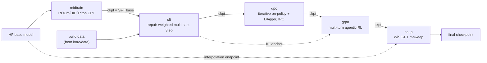
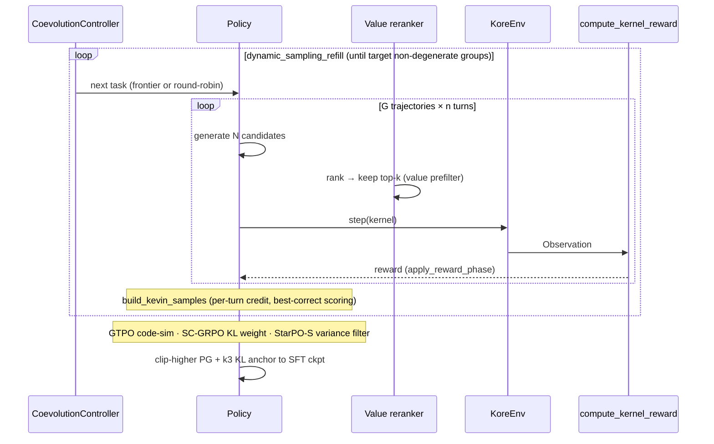

# `kore/policy` — the training stages

The five-stage policy curriculum that turns a base LLM into a kernel-optimization agent, plus the prompt/response contract, pure RL math, FSDP wiring, and optional vLLM serving. Every training stage saves a consolidated HF checkpoint so the next stage loads it with `from_pretrained` — no FSDP mesh required for cross-stage handoff.

---

## The curriculum

| File | Stage | Algorithm |
| --- | --- | --- |
| `midtrain.py` | Stage 0 | Continued pretraining on a ROCm/HIP/Triton corpus (`{"text"}` JSONL), plain-text completion |
| `sft.py` | Stage 1 | Repair-weighted multi-capability SFT (repair rows upsampled 2×) |
| `dpo.py` | Stage 2 | DPO on preference pairs; iterative rounds use IPO loss + refreshed reference |
| `grpo.py` | Stage 3 | Multi-turn agentic GRPO (see below) |
| `soup.py` | Stage 4 | WiSE-FT interpolation `θ = (1-α)·θ_base + α·θ_kore`, α-swept under a retention gate |
| `configs.py` | — | All stage config dataclasses + FSDP/DeepSpeed helpers (no torch import) |
| `format.py` | — | `SYSTEM_PROMPT`, transcript assembly, `parse_response`, turn feedback |
| `anticollapse.py` | — | Pure anti-collapse math (RC-GRPO, AVSPO, SC-GRPO, GTPO) |
| `dynamic.py` | — | `DynamicStepController` plateau early-stop |
| `coevolve_distill.py` | — | `DistillationSink` — write verified co-evolution wins to JSONL |
| `serve.py` | — | Optional vLLM-ROCm serving wrapper (not used by the native GRPO loop) |

---

## GRPO in depth

`grpo.py` is a native, in-process, multi-turn GRPO implementation (no external rollout server). It has a single-GPU fallback (`_train_grpo_fallback`) and an FSDP/DeepSpeed distributed path (`_train_grpo_distributed`).

Techniques wired in (all with paper references in [`papers/`](../../../papers/)):

- **Kevin multi-turn credit** — trajectory scored by the *best correct* kernel; per-turn discounted returns, correctness-gated.
- **StarPO-S** — keep the top-variance groups (echo-trap stabilization).
- **DAPO dynamic sampling** — oversample and refill until enough non-degenerate groups.
- **Clip-higher** — asymmetric PPO surrogate; **k3 KL anchor** (`ref_anchor_coef`) to the post-SFT checkpoint (the only KL term).
- **Anti-collapse ladder** — RC-GRPO reward tokens, AVSPO variance floor, SC-GRPO KL weighting, GTPO code-similarity partial rewards for all-fail groups.
- **Value prefilter** — generate N, bench only top-k (~4× measurement efficiency; see [`kore/value`](../value/README.md)).
- **Co-evolution** — `CoevolutionController` replaces round-robin task selection with a learnability/regret/novelty frontier (see [`kore/openended`](../openended/README.md)).
- **Physics reward** — `reward_mode="residual"` selects the roofline reward; `reward_phase` drives the correctness→latency curriculum.

---

## Key config defaults (`configs.py`)

**GRPOConfig** (production values set in [`configs/grpo_14b_full.json`](../../configs/README.md)):

| Field | Default | Field | Default |
| --- | --- | --- | --- |
| `num_trajectories` | 16 | `num_turns` | 4 |
| `tasks_per_step` | 8 | `temperature` | 0.9 |
| `learning_rate` | 2e-6 | `ref_anchor_coef` | 1e-3 |
| `clip_ratio_low/high` | 0.03 / 0.04 | `max_response_length` | 16384 |
| `reward_mode` | `speedup` | `physics_weight` | 1.0 |
| `starpo_s` | true | `dynamic_sampling` | true |
| `coevolve` | false | `value_prefilter` | false |
| `agentic` | false | `synced_gpus` | true |

**SFT**: full-FT, `max_seq_length=16384`, `num_train_epochs=3`, `repair_loss_weight=2.0`. **DPO**: `beta=0.1`, iterative uses `loss_type="ipo"`. **Midtrain**: `general_replay_frac=0.30`, `max_seq_length=8192`. **Soup**: `alphas=(0.7,0.8,0.9)`, retention `epsilon=0.005`.

---

## FSDP gotchas (PhD-level)

- **GRPO distributed uses ZeRO-2 (SHARD_GRAD_OP), not FULL_SHARD**: FULL_SHARD reshards params to a 1-D flat buffer between forwards, which breaks `model.generate()`. ZeRO-2 keeps params replicated between forwards.
- **`summon_full_params` once per step** wraps the whole rollout; `synced_gpus=True` is mandatory or ragged completion lengths deadlock NCCL.
- **Gradient checkpointing**: non-reentrant on the GRPO sharded path; reentrant for SFT/DPO/midtrain (flash→SDPA downgrade breaks the non-reentrant tensor-count check).
- **SDPA, not flash_attention_2**, for GRPO/DPO: ROCm FlashAttention hard-faults on padded generate/logp batches.
- **Agentic rollouts run serial on the distributed path** — ragged per-trajectory turn counts would desync collectives.

See [`docs/DISTRIBUTED.md`](../../docs/DISTRIBUTED.md) for sizing and the one-command launch. See also [`kore/data`](../data/README.md) (produces the corpora), [`kore/reward`](../reward/README.md), [`kore/eval`](../eval/README.md).
