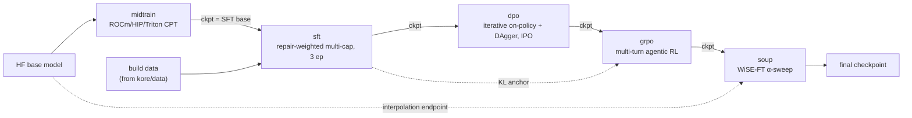
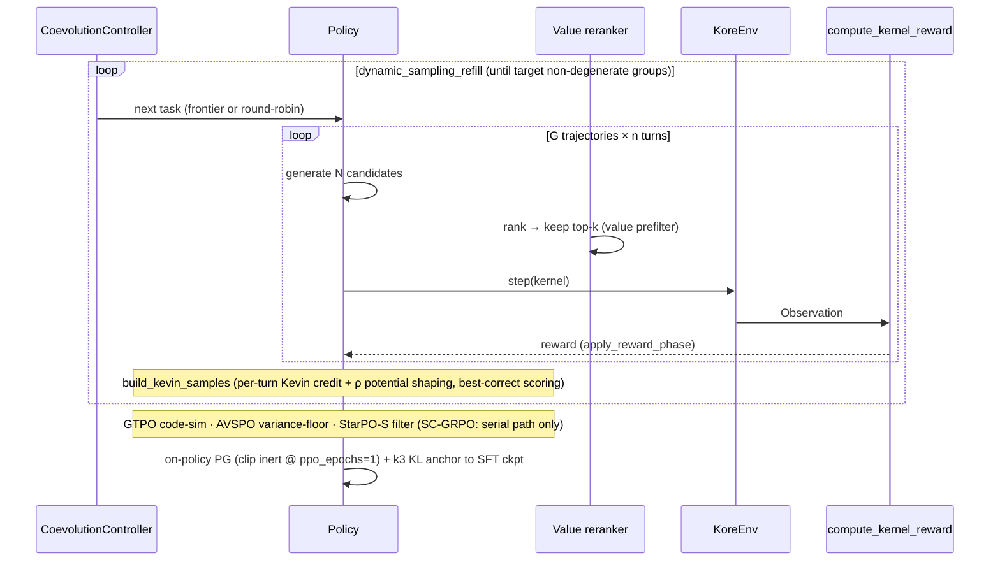

# `kore/policy` - the training stages

The five-stage policy curriculum that turns a base LLM into a kernel-optimization agent, plus the prompt/response contract, pure RL math, FSDP wiring, and optional vLLM serving. Every training stage saves a consolidated HF checkpoint so the next stage loads it with `from_pretrained` - no FSDP mesh required for cross-stage handoff.

---

## The curriculum

| File | Stage | Algorithm |
| --- | --- | --- |
| `midtrain.py` | Stage 0 | Continued pretraining on a ROCm/HIP/Triton corpus (`{"text"}` JSONL), plain-text completion |
| `sft.py` | Stage 1 | Repair-weighted multi-capability SFT (repair rows upsampled 2×) |
| `dpo.py` | Stage 2 | DPO on preference pairs; iterative rounds use IPO loss + refreshed reference |
| `grpo.py` | Stage 3 | Multi-turn agentic GRPO (see below) |
| `soup.py` | Stage 4 | WiSE-FT interpolation `θ = (1-α)·θ_base + α·θ_kore`, α-swept under a retention gate |
| `configs.py` | - | All stage config dataclasses + FSDP/DeepSpeed helpers (no torch import) |
| `format.py` | - | `SYSTEM_PROMPT`, transcript assembly, `parse_response`, turn feedback |
| `anticollapse.py` | - | Pure anti-collapse math (RC-GRPO, AVSPO, SC-GRPO, GTPO). NB *names*: "GTPO" here is KORE-coined and collides with an unrelated published method of the same name; "AVSPO"/"SC-GRPO" are KORE-coined variants of known ideas (GRPO std-norm; reward-conditioning / upside-down RL). Not all bite in the flagship - see below. |
| `dynamic.py` | - | `DynamicStepController` plateau early-stop |
| `coevolve_distill.py` | - | `DistillationSink` - write verified co-evolution wins to JSONL |
| `serve.py` | - | Optional vLLM-ROCm serving wrapper (not used by the native GRPO loop) |

---

## GRPO in depth

`grpo.py` is a native, in-process, multi-turn GRPO implementation (no external rollout server). It has a single-GPU fallback (`_train_grpo_fallback`) and an FSDP/DeepSpeed distributed path (`_train_grpo_distributed`).

Techniques wired in (all with paper references in [`papers/`](../../../papers/)):

- **Kevin multi-turn credit** - trajectory scored by the *best correct* kernel; per-turn discounted returns, correctness-gated.
- **StarPO-S** - keep the top-variance groups (echo-trap stabilization).
- **DAPO dynamic sampling** - oversample and refill until enough non-degenerate groups.
- **GRPO objective (sound)** - the importance ratio is the **GSPO sequence ratio** `r = exp(logp − old_logp)` on **token-mean** log-probs (`token_mean_logprob`, DAPO length-debias), with **global token-mean** normalization across the kept batch, a **k3 KL anchor** (`ref_anchor_coef`, the only KL term) to the post-SFT checkpoint, and a **cross-rank** group-relative baseline on the distributed path (`distributed_group_advantages` over an `all_gather` of returns). The **clip-higher** bounds (`0.03/0.04`) are **inert in the flagship**: at `ppo_epochs=1` the loss is on-policy (`old_logp == new_logp` ⇒ `r ≈ 1`), so the asymmetric clip is defense-in-depth for any `ppo_epochs > 1`, not an active lever.
- **Anti-collapse ladder (which levers actually bite)** - in the distributed + agentic flagship the *active* rungs are **AVSPO variance-floor** (`avspo_advantages`, `variance_floor=0.1`), **GTPO code-similarity** partial rewards for all-fail groups, **StarPO-S** high-variance selection, and **DAPO dynamic-sampling** refill. **SC-GRPO and RC-GRPO are effectively serial-path-only**: the SC-GRPO KL-weighting block runs only in the single-process loop (distributed samples carry no `sc_weight`), and RC-GRPO reward tokens are prepended only in the serial `_rollout`, not in `_rollout_agentic` - so under FSDP+agentic they are configured (`sc_grpo=true`, `rc_grpo=true`) but do not meaningfully act.
- **Value prefilter** - generate N, bench only top-k (~4× measurement efficiency); the ranker is an incremental (Ansor-like) learned cost model, **trained from the run's own verified ranked groups when enough exist, else a hand-coded schedule heuristic** (`kore/value/replay_train.py`, auto-trained pre-GRPO; fully fail-safe), see [`kore/value`](../value/README.md).
- **Co-evolution** - `CoevolutionController` replaces round-robin task selection with a learnability/regret/novelty frontier (see [`kore/openended`](../openended/README.md)).
- **Physics-shaped credit (paradigm-v2)** - the flagship terminal reward is the vendor-relative **speedup** (`reward_mode="speedup"`); a roofline-attainment potential (`kore/reward/whitebox.py:phi_potential`) is added via Ng-Harada-Russell shaping `F = γ·Φ' − Φ` (`physics_shaping_weight`; flagship 0.15), and **incorrect turns keep their bounded shaped progress** instead of a hard zero (`credit_incorrect_turns`). **The live potential is `Φ = η = T_min/T_meas` (PMC-free), *not* the validated named residual `ρ`** - `_turn_phi`/`ToolExecutor` call `phi_potential(task, obs)` with no counter dict. And because that offset feeds GRPO's *std-normalized, group-relative, per-turn-as-sample* advantage, the invariance is an **approximate, expected-gradient-neutral state-dependent baseline**, not the vanilla-gradient theorem (a small bounded ≈`γ·w·Φ ≈ 0.06` leak at the correct→incorrect boundary); see [`kore/reward`](../reward/README.md). `reward_phase` drives the correctness→latency curriculum. (`reward_mode="residual"` would instead score the correct tier by attainment directly - also `η` online until counters are threaded in.)
- **Identical single-process / distributed credit (paradigm-v2)** - the potential is wired `ToolExecutor.candidate_phi → AgentEpisode.turn_phis → build_kevin_samples` through both `_one_group` (single-GPU fallback) and `_rollout_slice_distributed` (FSDP), so the two GRPO paths assign identical per-turn credit.
- **Verified-transform action space + test-time search + open-ended minting (paradigm-v2, now LIVE)** - the paradigm-v2 discovery stack is wired into the loop and **on in the flagship**. `agentic_transform_tools=true` exposes the verified ε-typed transform calculus (`kore/transform`) to the agentic policy as first-class `list_transforms`/`apply_transform` tools (`kore/agent/tools.py`; `_rollout_agentic` builds the harness via `agent_tool_schemas(transforms=True)`), so the model proposes provably-in-contract rewrites, not free-form edits. `use_search=true` runs AlphaKernel value-guided best-first search (`kore/search`) over that same calculus through the production `TransformProposePolicy` (`kore/search/propose.py`), wired as a **throttled, fail-safe, off-policy search-then-distill** hook (`_maybe_search_then_distill`, in *both* the serial and distributed loops): it fires once every `search_every=50` steps on the step's single best group, *after* the on-policy gradient is built, spends only `search_budget=16` verifier benches, and feeds **only** the distillation sink - so it never corrupts on-policy credit and any error is a no-op. `coevolve_mint=true` lets `CoevolutionController` mint net-new correct-by-construction tasks (`kore/openended/minter.py`) and materialize them into runnable on-disk task dirs (`kore/openended/materialize.py`, self-checked) - see [`kore/openended`](../openended/README.md).

> **Honest novelty scope.** The GRPO math above is standard and sound, not novel: GSPO sequence ratio, DAPO clip-higher/dynamic-sampling/overlong-mask, StarPO-S, k3 KL anchor, Kevin correctness-gated multi-turn credit. The value model is an incremental Ansor-style learned cost model. The genuinely-new narrow pieces are the physics primitives (named-residual `ρ` as an RL signal, roofline attainment as a PBS potential) - and as noted above, the `ρ` variant is not yet the live gradient (`η` is). Treat the contribution as a *novel combination*, ~70% incremental prior art.

---

## Key config defaults (`configs.py`)

**GRPOConfig** dataclass defaults (the full 14B campaign's [`configs/grpo_14b_full.json`](../../configs/README.md) pins `model_id` to Qwen3-14B and flips on the full stack: `reward_mode=speedup` terminal reward with the paradigm-v2 roofline shaping (`credit_incorrect_turns=true`, `physics_shaping_weight=0.15`), `agentic`, `coevolve`, `value_prefilter`, and the anti-collapse rungs - plus the now-live paradigm-v2 discovery levers `agentic_transform_tools=true`, `use_search=true` (`search_budget=16`, `search_every=50`), and `coevolve_mint=true` (`coevolve_mint_batch=6`)):

| Field | Default | Field | Default |
| --- | --- | --- | --- |
| `num_trajectories` | 16 | `num_turns` | 4 |
| `tasks_per_step` | 8 | `temperature` | 0.9 |
| `learning_rate` | 2e-6 | `ref_anchor_coef` | 1e-3 |
| `clip_ratio_low/high` | 0.03 / 0.04 | `max_response_length` | 16384 |
| `reward_mode` | `speedup` | `physics_weight` | 1.0 |
| `starpo_s` | true | `dynamic_sampling` | true |
| `coevolve` | false | `value_prefilter` | false |
| `agentic` | false | `synced_gpus` | true |
| `credit_incorrect_turns` | false | `physics_shaping_weight` | 0.0 |
| `use_search` | false | `search_budget` | 64 |
| `coevolve_mint` | false | `coevolve_mint_batch` | 8 |
| `search_every` | 25 | `agentic_transform_tools` | false |

The paradigm-v2 rows above are dataclass **defaults** (legacy Kevin credit, search + mint off); the flagship JSON turns the whole paradigm-v2 stack **on**, overriding `credit_incorrect_turns=true`, `physics_shaping_weight=0.15`, `agentic_transform_tools=true`, `use_search=true` (`search_budget=16`, `search_every=50`), and `coevolve_mint=true` (`coevolve_mint_batch=6`).

**SFT**: full-FT, `max_seq_length=16384`, `num_train_epochs=3`, `repair_loss_weight=2.0`. **DPO**: `beta=0.1`, iterative uses `loss_type="ipo"`. **Midtrain**: `general_replay_frac=0.30`, `max_seq_length=8192`. **Soup**: `alphas=(0.7,0.8,0.9)`, retention `epsilon=0.005`.

---

## FSDP gotchas (PhD-level)

- **GRPO distributed uses ZeRO-2 (SHARD_GRAD_OP), not FULL_SHARD**: FULL_SHARD reshards params to a 1-D flat buffer between forwards, which breaks `model.generate()`. ZeRO-2 keeps params resident per rank (only grads + optimizer state are sharded).
- **Rollout runs on a full-weight replica**: generating on the sharded policy deadlocks (per-layer all-gathers interleave with `generate`'s own collectives on ragged lengths), so each step syncs the policy weights into a plain per-rank replica (`summon_full_params` + tensor copy, no forward) and generates locally with zero FSDP collectives, so `synced_gpus` is OFF on the distributed path.
- **Gradient checkpointing**: non-reentrant on the GRPO sharded path; reentrant for SFT/DPO/midtrain (flash→SDPA downgrade breaks the non-reentrant tensor-count check).
- **SDPA, not flash_attention_2**, for GRPO/DPO: ROCm FlashAttention hard-faults on padded generate/logp batches.
- **Agentic rollouts run serial on the distributed path** - ragged per-trajectory turn counts would desync collectives.

See [`docs/DISTRIBUTED.md`](../../docs/DISTRIBUTED.md) for sizing and the one-command launch. See also [`kore/data`](../data/README.md) (produces the corpora), [`kore/reward`](../reward/README.md), [`kore/eval`](../eval/README.md).
