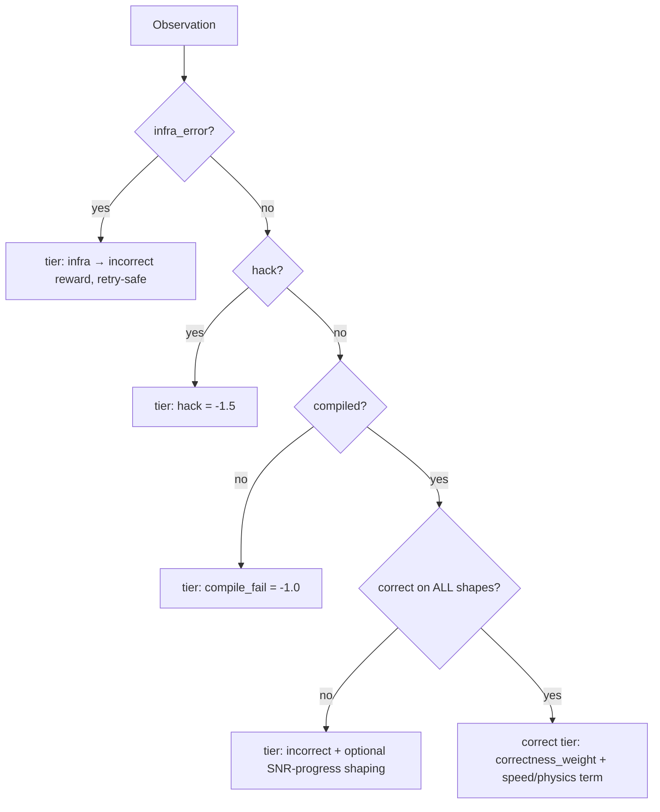
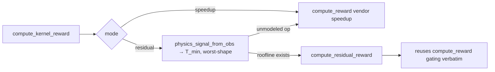

# `kore/reward` — the reward ladder and physics reward

KORE scores every candidate kernel with a strictly lexicographic reward: correctness always dominates speed, and no shaping, format, or profile bonus can ever cross a tier boundary. Two reward functions share this anti-hack skeleton and differ only in the continuous term granted to a *correct* kernel:

1. **Lexicographic speedup reward** (`reward.py`) — the default (`reward_mode="speedup"`). On the correct tier the continuous term is the worst-shape, vendor-relative speedup, log-shaped above 1× with significance-gated `fast_p` crossover bonuses.
2. **Physics residual-descent reward** (`physics.py`) — `reward_mode="residual"`. On the correct tier it replaces relative speedup with *absolute roofline attainment*, so the policy is rewarded for approaching the hardware's physical limit rather than for beating a baseline.

Below the correct tier the two are byte-for-byte identical: the physics reward delegates every hack / compile / correctness gate verbatim to `compute_reward`, so a faster wrong kernel can never outscore a correct one under either mode.

**What the flagship optimizes.** The full 14B campaign (`configs/grpo_14b_full.json`) runs `reward_mode="speedup"` as the terminal reward and folds the physics signal in as a **potential-based shaping (PBS)** term (`physics_shaping_weight=0.15`, `credit_incorrect_turns=true`). The base objective is vendor-relative speedup; the shaping potential is roofline attainment. The online potential is the PMC-free `η = T_min / T_measured`; the counter-grounded named residual `ρ` is used when rocprofv3 counters are supplied (see [White-box potential and PBS shaping](#white-box-potential-and-pbs-shaping)).

---

## Files

| File | Purpose |
| --- | --- |
| `reward.py` | `Observation`, `RewardResult`, `compute_reward`, `scan_for_hacks`, roofline Speed-of-Light ceiling gate |
| `physics.py` | Residual-descent reward + `compute_kernel_reward` dispatch |
| `whitebox.py` | Named-residual `ρ` from PMC counters + `phi_potential` (PBS potential) + `whitebox_structural_score` |
| `shaping.py` | Potential-based reward shaping (Ng–Harada–Russell) over the per-turn credit path |
| `profile_reward.py` | rocprofv3-derived dense efficiency bonus |
| `stats.py` | `median`, `mean`, `std`, `cv_pct` |
| `timing_integrity.py` | Performance-hack taxonomy + defense coverage map |

---

## The lexicographic ladder



Dominance is enforced as a config invariant in `CONFIG.__post_init__`:

```
reward_hack < reward_compile_fail < reward_incorrect < correctness_weight
eps_shape + format_weight < correctness_weight            # shaping can't cross a tier
profile_reward_weight < min(fast_p_bonus)                 # PMC bonus can't cross a crossover
```

No faster-but-wrong kernel, and no shaping / format / profile bonus, can outscore a plain correct kernel.

```python
@dataclass
class RewardResult:
    reward: float; correct: bool; speedup: Optional[float]
    tier: str; flags: list[str]; detail: str

def compute_reward(obs, source="", dtype="fp32", mode="eval", cfg=CONFIG,
                   snr_threshold=None, phase=None, response=None,
                   roofline_gate=False, t_min_ms=None, roofline_tol=0.25) -> RewardResult
def scan_for_hacks(source: str) -> Optional[str]   # strips comments/docstrings first
```

**Speed term.** Worst-shape aggregation by default (`min(base/cand)`, the CVaR endpoint as α→0), log-shaped above 1× (`w·(1 + ln su)`), with discrete `fast_p` crossover bonuses at 1.0 / 1.2 / 1.5× that require a noise-floor margin so timing parity cannot farm them. High CV damps the scored speedup; implausible speedups are capped and flagged (`excessive_speedup`).

**Speed-of-Light ceiling (opt-in).** With `roofline_gate=True`, a measured time faster than the operator's roofline floor `T_min` by more than a tolerance is physically impossible for a correct kernel and is rejected to the hack tier (`roofline_ceiling_violation`). This closes the measurement-exploit channel that a source scan cannot see (warm cache, do-less path, forged timer). It is fail-open on any missing/non-positive input and sound only under cold-cache timing, so it is off by default.

---

## The physics reward

```
T_measured = T_min + R
N (named residual) = (stall_frac + occupancy_deficit) · T_measured      # PMC available
ρ_phys = T_min / (T_min + N)                                            # in (0,1]
η      = T_min / T_measured                                             # PMC-free fallback (flagged no_pmc)
                                                                        # invariant: η ≤ ρ_phys ≤ 1  (N clamped to [0,R])
```

On the correct tier the reward becomes `correctness_weight + physics_weight · ρ_phys (+ format)` (default `physics_weight = 1.0`). `ρ_phys → 1` as the kernel drives the named residual `N → 0` (it approaches the roofline).

`η = T_min / T_measured` is the PMC-free attainment used online; `ρ` is its counter-grounded named-residual refinement, which reconstructs the runtime residual with R² ≈ 0.98 on gfx950 (offline validation, [`docs/P0_RESULTS.md`](../../docs/P0_RESULTS.md)). Because `N` is clamped to `[0, R]`, crediting the named residual is never harsher than the timing-only fallback, giving the invariant `η ≤ ρ_phys ≤ 1`.



```python
@dataclass
class PhysicsSignal:
    t_min_ms: float; measured_ms: Optional[float]
    stall_frac: Optional[float]; occupancy: Optional[float]

def compute_kernel_reward(obs, source, task, *, mode="speedup"|"residual",
                          physics_weight=1.0, ...) -> RewardResult
```

In `residual` mode, `physics_signal_from_obs` supplies only `(t_min_ms, measured_ms)`, so `residual_descent_frac` returns the `η` fallback (`pmc_used=False`, flagged `no_pmc`) — a bounded absolute-distance-to-roofline signal. The full `ρ` stall/occupancy decomposition is populated per-rollout only when rocprofv3 counters are threaded into `whitebox.physics_signal_from_counters`; rocprofv3 is too slow to run on every candidate, so `η` is the online default. When the operator is not roofline-modelable, `compute_kernel_reward` transparently falls back to the speedup reward.

---

## PMC dense shaping (optional)

`profile_reward.py` turns rocprofv3 counters into a small bonus on the correct tier:

```
issue_efficiency = 1 - SQ_WAIT_INST_ANY / (issued + SQ_WAIT_INST_ANY)
score = mean( issue_eff(cand)/issue_eff(ref),  vmem(ref)/vmem(cand) )   # clamped [0,1]
```

By invariant this bonus is smaller than the smallest `fast_p` crossover, so it refines ranking *within* a tier without ever crossing one. `roofline_dense_score` adds an absolute, roofline-anchored variant (attainment + issue efficiency + optional baseline-relative traffic) for the common GRPO case where only the candidate's own counters are available.

---

## White-box potential and PBS shaping

`reward.py` / `physics.py` define the reward *ladder*; the white-box surface defines how the physics signal reaches the policy. The physics signal enters the multi-turn GRPO credit path as a **potential-based shaping (PBS)** term added to the per-turn reward — it does not replace the speed term.

**`whitebox.py` — the online white-box physics surface:**

```python
def physics_signal_from_counters(task, obs, counters, arch=None) -> PhysicsSignal | None
def whitebox_attainment(task, obs, counters=None, arch=None) -> tuple[float|None, bool]  # (rho, pmc_used)
def whitebox_structural_score(counters, *, flops=None, bytes=None, measured_ms=None, ...) -> float | None
def phi_potential(task, obs, counters=None, arch=None) -> float | None   # Phi(s) = rho with counters, else eta
```

- `physics_signal_from_counters` populates the *named* residual (`stall_frac`, `occupancy`) on a worst-shape `PhysicsSignal` from rocprofv3 counters, so `physics.residual_descent_frac` takes the `ρ = T_min/(T_min+N)` path instead of the `η` fallback. It prefers the derived gfx950 metrics (`MemUnitStalled` / `OccupancyPercent`, the `p0_sol` set), falls back to raw `SQ_*` counters (via `profile_reward`) and the `pmc.est_occupancy` resource model, and degrades gracefully to `η` when counters are absent. It requires a non-empty counter dict, so `ρ` engages only where per-turn counters are collected.
- `phi_potential(task, obs, counters=None) → Φ(s)` returns the named residual `ρ` when counters are supplied and the `η` fallback otherwise. The rollout sites (`grpo._turn_phi(task, obs)` and `agent/tools.py:ToolExecutor` via `phi_potential(self.task, obs)`) call it without a counter dict, so the online PBS potential is `Φ = η = T_min / T_measured`.
- `whitebox_structural_score` (delegating to `profile_reward.roofline_dense_score`) blends roofline attainment, issue efficiency, and baseline-relative traffic. It is not hack-proof in isolation: attainment is `attained_fraction / 100` computed from the op's *modeled* FLOPs over `measured_ms` and clamped to `1.0`, and issue efficiency `1 − stall_fraction` runs high for a kernel that issues little, so a memset / do-less kernel can inflate it. Hack-resistance is enforced by the correctness / SNR / determinism **gate** in `compute_reward` (`scan_for_hacks` + compile + `validation_passed` + per-shape SNR), which fences this term to the correct tier that a do-less kernel never reaches. The score is used in tests and behind `profile_reward_weight`.

**`shaping.py` — Ng–Harada–Russell PBS:**

```python
def shaping_terms(phis, gamma, terminal_phi=0.0) -> list[float]          # F_t = gamma*Phi(s_{t+1}) - Phi(s_t)
def shaped_turn_rewards(turn_rewards, phis, gamma, weight=1.0, ...) -> list[float]
def discounted_shaping_sum(phis, gamma, ...) -> float                    # telescopes to -Phi(s_0)
```

Under the vanilla expected-gradient estimator, PBS leaves the optimal policy invariant for any potential and any weight: the discounted shaping telescopes to `−Φ(s_0)`, a constant of the start state. KORE feeds the per-turn offset `−w·Φ(s_t)` into GRPO's std-normalized, group-relative, per-turn-as-sample advantage — dividing by a σ that itself depends on the shifted returns — so the invariance is approximate. PBS therefore functions as an **expected-gradient-neutral state-dependent baseline** that redistributes existing terminal credit across turns (variance reduction and a denser per-turn signal in the flat correct-but-slow valley), rather than adding directional gradient toward the roofline; a small bounded residual of order `γ·w·Φ` remains at correct↔incorrect boundaries where `Φ` is undefined. `None` potentials (turns whose kernel is not correct-and-timed) are zero-contribution shaping boundaries, so gradient is never fabricated where there is no measurement. The lexicographic correctness gate and bounded action space — not this term — are the anti-hack spine.

The credit path is wired identically on both GRPO paths: `ToolExecutor.candidate_phi → AgentEpisode.turn_phis → build_kevin_samples` through `_one_group` (single-GPU fallback) and `_rollout_slice_distributed` (FSDP), so the two paths assign the same per-turn credit. The `reward_mode="residual"` reward and the named-residual `ρ` path are available and unit-tested (`tests/test_whitebox_reward.py`); both engage once rocprofv3 counters are threaded per candidate.

---

## Environment variables

| Variable | Effect |
| --- | --- |
| `KORE_REWARD_MODE` | `speedup` (default) or `residual` |
| `KORE_PROFILE_REWARD_WEIGHT` | Weight of the PMC dense bonus (0 disables) |
| `KORE_SPEED_AGG` | `worst` / `cvar` / `mean` speed aggregation |

`reward_phase="correctness"` zeroes the speed term (the GRPO correctness→latency curriculum). The agentic `ToolExecutor` reads `KORE_REWARD_MODE` / `KORE_REWARD_PHASE`; the GRPO loop drives `reward_mode`, `physics_shaping_weight`, and `credit_incorrect_turns` from the run config, not from environment variables.

See also: [`analysis`](../analysis/README.md) (the roofline `T_min` and named-residual math, validated offline; `whitebox.py` reuses the `T_min` half as the online `η` potential and the named-residual `ρ` half when counters are threaded in), [`env`](../env/README.md) (produces `Observation`), [`verify`](../verify/README.md) (correctness gate), and the root [Method](../../README.md#method).
