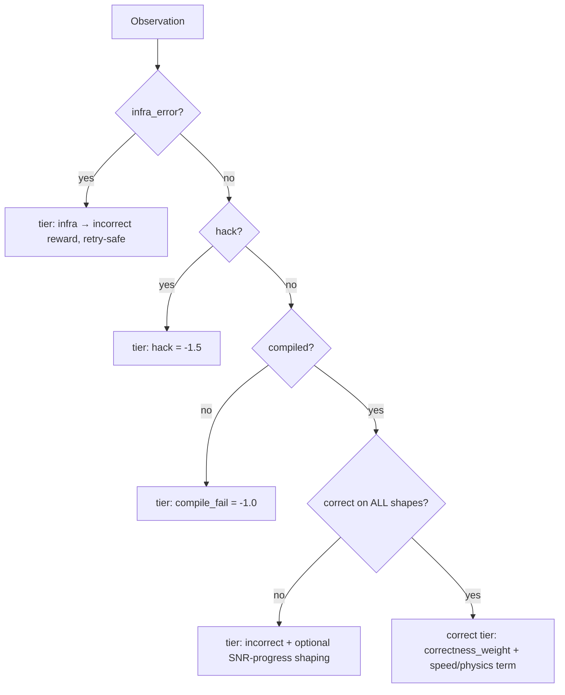
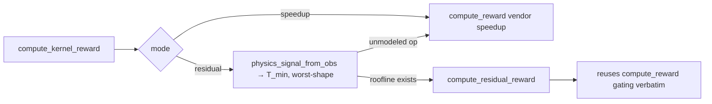

# `kore/reward` — the reward ladder and physics reward

Two reward functions share one anti-hack skeleton:

1. **Lexicographic speedup reward** (`reward.py`) — the default. A strictly ordered ladder where correctness always dominates speed, with worst-shape vendor speedup and optional PMC dense shaping.
2. **Physics residual-descent reward** (`physics.py`) — the KORE paradigm. On the correct tier it replaces relative speedup with *absolute roofline attainment*, so the policy is rewarded for approaching the hardware's physical limit rather than beating an arbitrary baseline.

Both are byte-for-byte identical below the correct tier — only the continuous term granted to a *correct* kernel differs.

---

## Files

| File | Purpose |
| --- | --- |
| `reward.py` | `Observation`, `RewardResult`, `compute_reward`, `scan_for_hacks` |
| `physics.py` | residual-descent reward + `compute_kernel_reward` dispatch |
| `profile_reward.py` | rocprofv3-derived dense efficiency bonus |
| `stats.py` | `median`, `mean`, `std`, `cv_pct` |
| `timing_integrity.py` | performance-hack taxonomy + defense coverage map |

---

## The lexicographic ladder



Dominance is enforced as a config invariant in `CONFIG.__post_init__`:

```
reward_hack < reward_compile_fail < reward_incorrect < correctness_weight
eps_shape + format_weight < correctness_weight            # shaping can't cross a tier
profile_reward_weight < min(fast_p_bonus)                 # PMC bonus can't cross a crossover
```

So no faster-but-wrong kernel, and no shaping/format/profile bonus, can ever outscore a plain correct kernel.

```python
@dataclass
class RewardResult:
    reward: float; correct: bool; speedup: Optional[float]
    tier: str; flags: list[str]; detail: str

def compute_reward(obs, source="", dtype="fp32", mode="eval", cfg=CONFIG,
                   snr_threshold=None, phase=None, response=None) -> RewardResult
def scan_for_hacks(source: str) -> Optional[str]   # strips comments/docstrings first
```

**Speed term:** worst-shape aggregation by default (`min(base/cand)` = CVaR as α→0), log-shaped above 1× (`w·(1+ln su)`), with discrete `fast_p` crossover bonuses at 1.0/1.2/1.5× that require a noise-floor margin so timing parity can't farm them. High CV damps the scored speedup; absurd speedups are capped and flagged.

---

## The physics reward

```
T_measured = T_min + R
N (named residual) = (stall_frac + occupancy_deficit) · T_measured      # PMC available
ρ_phys = T_min / (T_min + N)                                            # in (0,1]
η      = T_min / T_measured                                             # PMC-free fallback (flagged no_pmc)
                                                                        # invariant: η ≤ ρ_phys ≤ 1  (N clamped to [0,R])
```

On the correct tier the reward becomes `correctness_weight + physics_weight · ρ_phys (+ format)` (default `physics_weight = 1.0`).



```python
@dataclass
class PhysicsSignal:
    t_min_ms: float; measured_ms: Optional[float]
    stall_frac: Optional[float]; occupancy: Optional[float]

def compute_kernel_reward(obs, source, task, *, mode="speedup"|"residual",
                          physics_weight=1.0, ...) -> RewardResult
```

> **What the live GRPO run actually optimizes.** In training, `physics_signal_from_obs` supplies only `(t_min_ms, measured_ms)` — so the reward uses the **η fallback** (absolute distance to the roofline), which is dense and physics-grounded but does *not* require per-rollout PMC. The full `ρ_phys` stall/occupancy decomposition is validated offline (P0, R²≈0.98) and is available per-rollout only when `KORE_PROFILE_REWARD_WEIGHT > 0` (rocprofv3 is too slow to run on every candidate). This is a deliberate speed/fidelity trade, documented in [`docs/P0_RESULTS.md`](../../docs/P0_RESULTS.md).

---

## PMC dense shaping (optional)

`profile_reward.py` turns rocprofv3 counters into a small bonus on the correct tier:

```
issue_efficiency = 1 - SQ_WAIT_INST_ANY / (issued + SQ_WAIT_INST_ANY)
score = mean( issue_eff(cand)/issue_eff(ref),  vmem(ref)/vmem(cand) )   # clamped [0,1]
```

By invariant this bonus is smaller than the smallest `fast_p` crossover, so it refines ranking *within* a tier without ever crossing one.

---

## Environment variables

| Variable | Effect |
| --- | --- |
| `KORE_REWARD_MODE` | `speedup` (default) or `residual` |
| `KORE_PROFILE_REWARD_WEIGHT` | weight of the PMC dense bonus (0 disables) |
| `KORE_SPEED_AGG` | `worst` / `cvar` / `mean` speed aggregation |

`reward_phase="correctness"` zeroes the speed term (used by the GRPO correctness→latency curriculum).

See also: [`analysis`](../analysis/README.md) (the same roofline math offline), [`env`](../env/README.md) (produces `Observation`), [`verify`](../verify/README.md) (correctness gate).
