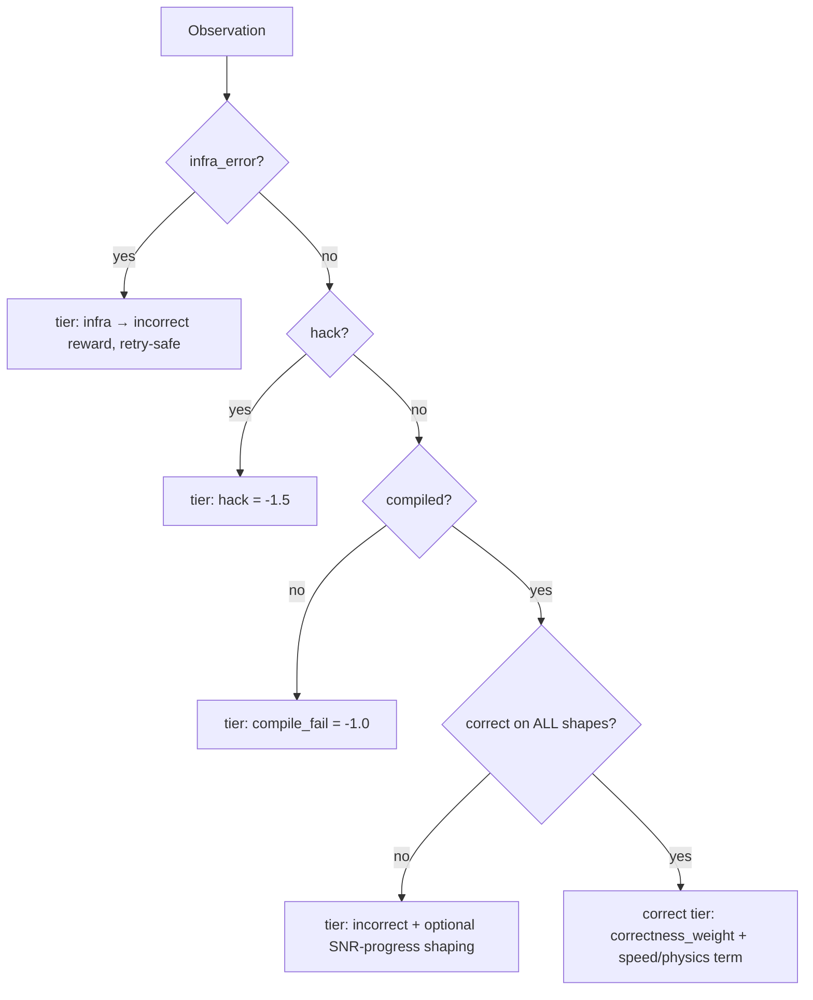
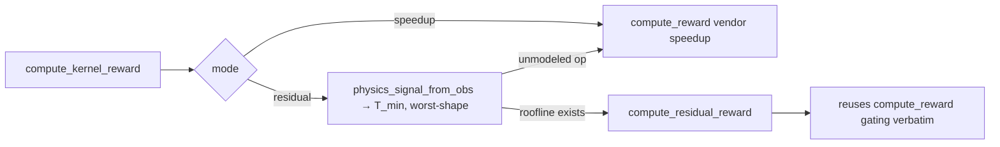

# `kore/reward` - the reward ladder and physics reward

Two reward functions share one anti-hack skeleton:

1. **Lexicographic speedup reward** (`reward.py`) - a strictly ordered ladder where correctness always dominates speed, with worst-shape vendor speedup and optional PMC dense shaping. **This is the flagship base reward** (`reward_mode="speedup"`).
2. **Physics residual-descent reward** (`physics.py`). On the correct tier it replaces relative speedup with *absolute roofline attainment*, so the policy is rewarded for approaching the hardware's physical limit rather than beating a baseline. It is **available but off in the live run** (`reward_mode="residual"` is config-gated off).

Both are byte-for-byte identical below the correct tier - only the continuous term granted to a *correct* kernel differs.

> **What the live 14B run actually optimizes.** The flagship (`configs/grpo_14b_full.json`) runs reward #1 (`reward_mode="speedup"`) as the terminal reward and folds the physics signal in only as a **potential-based shaping (PBS)** term on top (`physics_shaping_weight=0.15`, `credit_incorrect_turns=true`). So the base objective is vendor-relative speedup; the physics term is a shaping potential, and (see [ACTIVE vs BUILT](#paradigm-v2-white-box-potential--pbs-shaping) below) the *live* potential is the PMC-free `η`, **not** the named residual `ρ`.

> **Honest novelty scope.** This reward/credit stack is a *novel combination* that is ~70% incremental prior art: Kevin-32B (correctness-gated multi-turn credit), DeepSeek GRPO, DAPO, GSPO, Ng-Harada-Russell PBS, the roofline/SOL model, StarPO-S. The only genuinely-new narrow primitives are (a) the *named-residual* `ρ` as an RL signal and (b) roofline **attainment as a PBS potential** - and (a) is not yet on the live gradient (below).

---

## Files

| File | Purpose |
| --- | --- |
| `reward.py` | `Observation`, `RewardResult`, `compute_reward`, `scan_for_hacks` |
| `physics.py` | residual-descent reward + `compute_kernel_reward` dispatch |
| `whitebox.py` | named-residual `ρ` from PMC counters (BUILT; **dormant online → `η`**) + `phi_potential` (PBS potential) + `whitebox_structural_score` (correctness-gate-fenced, *not* structurally hack-proof - see below) |
| `shaping.py` | potential-based reward shaping (Ng-Harada-Russell) over the per-turn credit path |
| `profile_reward.py` | rocprofv3-derived dense efficiency bonus |
| `stats.py` | `median`, `mean`, `std`, `cv_pct` |
| `timing_integrity.py` | performance-hack taxonomy + defense coverage map |

---

## The lexicographic ladder



Dominance is enforced as a config invariant in `CONFIG.__post_init__`:

```
reward_hack < reward_compile_fail < reward_incorrect < correctness_weight
eps_shape + format_weight < correctness_weight            # shaping can't cross a tier
profile_reward_weight < min(fast_p_bonus)                 # PMC bonus can't cross a crossover
```

So no faster-but-wrong kernel, and no shaping/format/profile bonus, can ever outscore a plain correct kernel.

```python
@dataclass
class RewardResult:
    reward: float; correct: bool; speedup: Optional[float]
    tier: str; flags: list[str]; detail: str

def compute_reward(obs, source="", dtype="fp32", mode="eval", cfg=CONFIG,
                   snr_threshold=None, phase=None, response=None) -> RewardResult
def scan_for_hacks(source: str) -> Optional[str]   # strips comments/docstrings first
```

**Speed term:** worst-shape aggregation by default (`min(base/cand)` = CVaR as α→0), log-shaped above 1× (`w·(1+ln su)`), with discrete `fast_p` crossover bonuses at 1.0/1.2/1.5× that require a noise-floor margin so timing parity can't farm them. High CV damps the scored speedup; absurd speedups are capped and flagged.

---

## The physics reward

```
T_measured = T_min + R
N (named residual) = (stall_frac + occupancy_deficit) · T_measured      # PMC available
ρ_phys = T_min / (T_min + N)                                            # in (0,1]
η      = T_min / T_measured                                             # PMC-free fallback (flagged no_pmc)
                                                                        # invariant: η ≤ ρ_phys ≤ 1  (N clamped to [0,R])
```

On the correct tier the reward becomes `correctness_weight + physics_weight · ρ_phys (+ format)` (default `physics_weight = 1.0`).



```python
@dataclass
class PhysicsSignal:
    t_min_ms: float; measured_ms: Optional[float]
    stall_frac: Optional[float]; occupancy: Optional[float]

def compute_kernel_reward(obs, source, task, *, mode="speedup"|"residual",
                          physics_weight=1.0, ...) -> RewardResult
```

> **`residual` mode's PMC-free fallback (it does NOT degenerate).** When `reward_mode="residual"` is selected, `physics_signal_from_obs` supplies only `(t_min_ms, measured_ms)` - so the reward uses the **η fallback** `η = T_min/T_meas` (`residual_descent_frac` returns `pmc_used=False`, flagged `no_pmc`). This is a *bounded, sane* signal (absolute distance to the roofline), not a collapse - just **lower-contrast** than `ρ` because it credits the full residual `R` rather than the *named* part `N`. The full `ρ_phys` stall/occupancy decomposition is validated **offline** (P0, R²≈0.98) and is populated per-rollout only when rocprofv3 counters are threaded into `whitebox.physics_signal_from_counters` (rocprofv3 is too slow to run on every candidate). Documented in [`docs/P0_RESULTS.md`](../../docs/P0_RESULTS.md).
>
> **What the live GRPO run actually optimizes (paradigm-v2).** The campaign runs `reward_mode="speedup"` - the vendor-relative speed term is the base reward - and the physics residual enters only as a **potential-based shaping** term *on top of* it. And that shaping potential is currently `η`, not `ρ` (see [ACTIVE vs BUILT](#paradigm-v2-white-box-potential--pbs-shaping) below).

---

## PMC dense shaping (optional)

`profile_reward.py` turns rocprofv3 counters into a small bonus on the correct tier:

```
issue_efficiency = 1 - SQ_WAIT_INST_ANY / (issued + SQ_WAIT_INST_ANY)
score = mean( issue_eff(cand)/issue_eff(ref),  vmem(ref)/vmem(cand) )   # clamped [0,1]
```

By invariant this bonus is smaller than the smallest `fast_p` crossover, so it refines ranking *within* a tier without ever crossing one.

---

## Paradigm-v2: white-box potential + PBS shaping

`reward.py`/`physics.py` still define the reward *ladder*; paradigm-v2 changes how the physics residual reaches the policy. The physics signal enters the multi-turn GRPO credit path as a **potential-based shaping (PBS)** term added to the per-turn reward, not as a replacement for the speed term.

**`whitebox.py` - the online white-box physics surface:**

```python
def physics_signal_from_counters(task, obs, counters, arch=None) -> PhysicsSignal | None
def whitebox_attainment(task, obs, counters=None, arch=None) -> tuple[float|None, bool]  # (rho, pmc_used)
def whitebox_structural_score(counters, *, flops=None, bytes=None, measured_ms=None, ...) -> float | None
def phi_potential(task, obs, counters=None, arch=None) -> float | None   # Phi(s) = rho
```

- `physics_signal_from_counters` populates the *named* residual (`stall_frac`, `occupancy`) on a worst-shape `PhysicsSignal` from rocprofv3 counters, so `physics.residual_descent_frac` takes the `ρ = T_min/(T_min+N)` path instead of the flat `η` fallback. It prefers the derived gfx950 metrics (`MemUnitStalled`/`OccupancyPercent`, the `p0_sol` set), falls back to raw `SQ_*` counters (via `profile_reward`) and the `pmc.est_occupancy` resource model, and graceful-degrades to the `η` signal when counters are absent. **This function is only ever reached with a non-empty counter dict, and no live rollout site supplies one (below), so `ρ` is dormant online.**
- `phi_potential(task, obs, counters=None) → Φ(s)`. With counters it is the named residual `ρ`; **called without counters (the live case) it is the `η` fallback.** The rollout sites (`grpo._turn_phi(task, obs)` and `agent/tools.py:ToolExecutor` via `phi_potential(self.task, obs)`) both call it **without a counter dict**, so the live PBS potential is `Φ = η = T_min/T_meas`.
- `whitebox_structural_score` (delegates to `profile_reward.roofline_dense_score`) is **not** "hack-resistant by construction". It blends roofline attainment + issue efficiency + baseline-relative traffic, but attainment is `attained_fraction / 100` computed from the op's *modeled* FLOPs over `measured_ms` and **clamped to 1.0**, and issue-efficiency `1 − stall_fraction` runs high for a kernel that issues little. A memset / cache-reuse / "do-less" kernel is therefore *fast with a tiny `measured_ms`*, so it **inflates** attainment (→ clamped 1.0) and issue-efficiency rather than scoring ~0. The actual hack-resistance is the **correctness/SNR/determinism GATE** in `compute_reward` (`scan_for_hacks` + compile + `validation_passed` + per-shape SNR): a do-less kernel produces the wrong answer and never reaches the correct tier where this term is applied. Credit the GATE, not the score's structure. (It is also only unit-tested, not on the live gradient.)

**`shaping.py` - Ng-Harada-Russell PBS:**

```python
def shaping_terms(phis, gamma, terminal_phi=0.0) -> list[float]          # F_t = gamma*Phi(s_{t+1}) - Phi(s_t)
def shaped_turn_rewards(turn_rewards, phis, gamma, weight=1.0, ...) -> list[float]
def discounted_shaping_sum(phis, gamma, ...) -> float                    # telescopes to -Phi(s_0)
```

The discounted shaping telescopes to `−Φ(s_0)` (a start-state constant), so on the *vanilla expected policy gradient* this is the Ng-Harada-Russell policy-invariance result. **KORE's estimator is not that idealization, so invariance here is approximate, not a theorem.** KORE feeds the per-turn offset `−w·Φ(s_t)` into GRPO's **std-normalized, group-relative, per-turn-as-sample** advantage - dividing by a σ that itself depends on the shifted returns - and the correct→incorrect boundary (`Φ=None` zeroes the shaping term) leaves a small **bounded, action-dependent leak** of order `γ·w·Φ ≈ 0.4·0.15·1 ≈ 0.06`. So the honest description is an **approximate, expected-gradient-neutral state-dependent baseline**: it re-distributes existing terminal credit across turns (denser signal, variance reduction) without *adding* directional gradient toward the roofline, and the residual leak is benign but real - not zero at any weight. (In the special `n=2` contiguous-correct case the shaping *is* a valid state-dependent baseline.) `None` potentials (turns whose kernel is not correct-and-timed) are zero-contribution shaping boundaries, so gradient is never fabricated where there is no measurement.

> **ACTIVE vs BUILT (paradigm-v2).** *Active in the live run* (`configs/grpo_14b_full.json`): the base reward is `reward_mode="speedup"`, the PBS term is ON (`physics_shaping_weight = 0.15`, wired `grpo.build_kevin_samples → kevin_turn_returns → shaping.shaping_terms`), and `credit_incorrect_turns = true` (the P0d densification that credits a still-incorrect turn's bounded shaped-SNR progress instead of hard-zeroing it). Both the serial (`grpo._turn_phi`) and agentic (`ToolExecutor`) paths compute the potential via `phi_potential(task, obs)` **without a counter dict**, so the *live* potential is the PMC-free `η = T_min/T_measured` (approximately expected-gradient-neutral, with the ≈0.06 boundary leak noted above). *Built but not on the live gradient:* the named-residual `ρ` path (`physics_signal_from_counters` *with* counters) and `whitebox_structural_score` are implemented + unit-tested (`tests/test_whitebox_reward.py`) but are only engaged when rocprofv3 counters are supplied (rocprofv3 is too slow per-candidate). The `reward_mode="residual"` reward is likewise available but config-gated off this run.
>
> **⇒ #1 open item: make `ρ` live.** The single biggest gap between the validated P0 target and what the policy sees is that the online potential is `η`, not the R²≈0.98 named residual `ρ`. Closing it means either threading per-turn rocprofv3 PMC counters into `phi_potential` (thread `KoreEnv.collect_counters` output through `_turn_phi` / `ToolExecutor.candidate_phi`), or running `reward_mode="residual"` with real per-candidate counters. Until then, the `ρ` result in [`docs/P0_RESULTS.md`](../../docs/P0_RESULTS.md) is an **offline** validation, not the live signal.

---

## Environment variables

| Variable | Effect |
| --- | --- |
| `KORE_REWARD_MODE` | `speedup` (default) or `residual` |
| `KORE_PROFILE_REWARD_WEIGHT` | weight of the PMC dense bonus (0 disables) |
| `KORE_SPEED_AGG` | `worst` / `cvar` / `mean` speed aggregation |

`reward_phase="correctness"` zeroes the speed term (used by the GRPO correctness→latency curriculum). The agentic `ToolExecutor` reads `KORE_REWARD_MODE`/`KORE_REWARD_PHASE`; the GRPO loop itself drives the paradigm-v2 levers (`reward_mode`, `physics_shaping_weight`, `credit_incorrect_turns`) from the run config, not env vars.

See also: [`analysis`](../analysis/README.md) (the roofline `T_min` / named-residual math, validated offline; online `whitebox.py` reuses the `T_min` half as the `η` potential, and the named-residual `ρ` half only when counters are threaded in), [`env`](../env/README.md) (produces `Observation`), [`verify`](../verify/README.md) (correctness gate).
