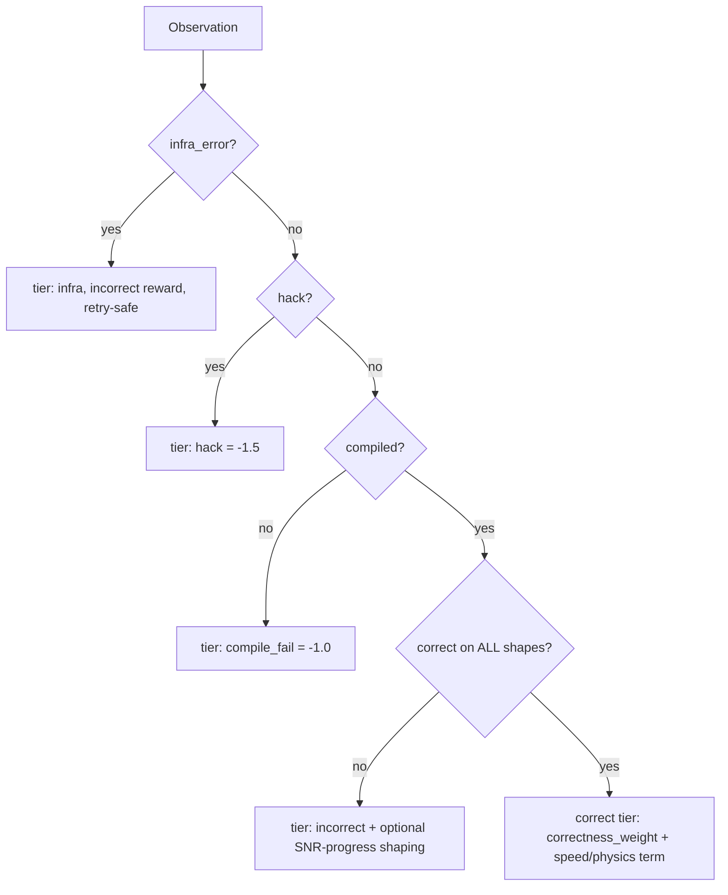
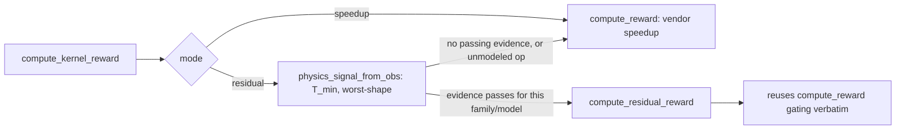

# `kore/reward`: the reward ladder and physics reward

KORE scores every candidate kernel with a strictly lexicographic reward:
correctness always dominates speed, and no shaping, format, or profile bonus can
ever cross a tier boundary. Two reward functions share this anti-hack skeleton
and differ only in the continuous term granted to a correct kernel:

1. **Lexicographic speedup reward** (`reward.py`), the default
   (`reward_mode="speedup"`). On the correct tier the continuous term is the
   worst-shape, vendor-relative speedup, log-shaped above 1x with
   significance-gated `fast_p` crossover bonuses.
2. **Physics residual-descent reward** (`physics.py`), `reward_mode="residual"`.
   On the correct tier it replaces relative speedup with absolute roofline
   attainment, so the policy is rewarded for approaching the hardware's
   physical limit rather than for beating a baseline.

Below the correct tier the two are byte-for-byte identical: the physics reward
delegates every hack, compile, and correctness gate verbatim to `compute_reward`,
so a faster wrong kernel can never outscore a correct one under either mode.

**What production RL optimizes.** The terminal objective is correctness-gated,
vendor-relative speedup. The 14B `grpo_14b_full.json` is a legacy experiment, not
the product configuration; the shipped 30B recipes
(`configs/grpo_coder30b_a3b_trloo.json`, `configs/grpo_32b_min_trustworthy.json`)
agree with it on every lever this document describes as optional. Empirical
roofline shaping, the residual reward's evidence gate, the PMC dense bonus, the
coverage-aware profiling bonus, and the coevolutionary adversarial hook are all
disabled in every shipped config, each with a `_comment_*` field in the JSON
explaining why. This is not a placeholder omission: `docs/P0_RESULTS.md` records
three independent studies of the residual model, all deciding `INTEGRITY_ONLY`
with no operator family clearing the preregistered evidence bar. Nothing here is
broken; the mechanisms are built, unit-tested, and wired end to end so that a
future evidence-backed recipe can arm them, but today they contribute nothing to
the reward a rollout actually receives.

---

## Files

| File | Purpose |
| --- | --- |
| `reward.py` | `Observation`, `RewardResult`, `compute_reward`, `scan_for_hacks`, the roofline Speed-of-Light ceiling gate |
| `physics.py` | Residual-descent reward plus `compute_kernel_reward` dispatch |
| `whitebox.py` | Evidence-gated named-residual potential from PMC counters (`phi_potential`), `physics_signal_from_counters`, `whitebox_structural_score` |
| `shaping.py` | Potential-based reward shaping (Ng-Harada-Russell) over the per-turn credit path, plus the `FamilyShapingEvidence` gate it shares with `physics.py` |
| `profile_reward.py` | Dimensionally-valid PMC diagnostics (`issue_efficiency`, `roofline_dense_score`); a bounded dense bonus on the correct tier when armed |
| `coverage.py` | Amdahl's-law coverage-aware profiling reward: whether the candidate's own kernels ran, and how much of the traced GPU time they account for |
| `stats.py` | `median`, `mean`, `std`, `cv_pct`, and the paired-timing statistics the publication gate checks |
| `timing_integrity.py` | Performance-hack taxonomy and the defense-coverage map |

---

## The lexicographic ladder


```mermaid
flowchart TD
  O[Observation] --> I{infra_error?}
  I -->|yes| T0[tier: infra, incorrect reward, retry-safe]
  I -->|no| H{hack?}
  H -->|yes| T1[tier: hack = -1.5]
  H -->|no| C{compiled?}
  C -->|no| T2[tier: compile_fail = -1.0]
  C -->|yes| V{correct on ALL shapes?}
  V -->|no| T3[tier: incorrect + optional SNR-progress shaping]
  V -->|yes| S[correct tier: correctness_weight + speed/physics term]
```

Dominance is enforced as a config invariant in `CONFIG.__post_init__`:

```
reward_hack < reward_compile_fail < reward_incorrect < correctness_weight
eps_shape + format_weight < correctness_weight            # shaping can't cross a tier
profile_reward_weight < min(fast_p_bonus)                 # PMC bonus can't cross a crossover
```

No faster-but-wrong kernel, and no shaping, format, or profile bonus, can
outscore a plain correct kernel.

```python
@dataclass
class RewardResult:
    reward: float; correct: bool; speedup: Optional[float]
    tier: str; flags: list[str]; detail: str

def compute_reward(obs, source="", dtype="fp32", mode="eval", cfg=CONFIG,
                   snr_threshold=None, phase=None, response=None,
                   roofline_gate=False, t_min_ms=None, roofline_tol=0.25) -> RewardResult
def scan_for_hacks(source: str) -> Optional[str]   # strips comments/docstrings first
```

**Speed term.** Worst-shape aggregation by default (`min(base/cand)`, the CVaR
endpoint as alpha to 0), log-shaped above 1x (`w*(1 + ln su)`), with discrete
`fast_p` crossover bonuses at 1.0 / 1.2 / 1.5x that require a noise-floor margin
so timing parity cannot farm them. High CV damps the scored speedup; implausible
speedups are capped and flagged (`excessive_speedup`).

**Speed-of-Light ceiling (opt-in).** With `roofline_gate=True`, a measured time
faster than the operator's roofline floor `T_min` by more than a tolerance is
physically impossible for a correct kernel and is rejected to the hack tier
(`roofline_ceiling_violation`). This closes the measurement-exploit channel that
a source scan cannot see (warm cache, do-less path, forged timer). It is
fail-open on any missing or non-positive input and sound only under cold-cache
timing, so it is off by default.

---

## The physics reward

```
T_measured = T_min + R
N (named residual) = (stall_frac + occupancy_deficit) * T_measured      # requires passing family evidence
rho_phys = T_min / (T_min + N)                                          # in (0,1]
eta      = T_min / T_measured                                           # PMC-free diagnostic (flagged no_pmc)
                                                                         # invariant: eta <= rho_phys <= 1  (N clamped to [0,R])
```

On the correct tier, when a family has passing held-out evidence under the
active model fingerprint, the reward becomes
`correctness_weight + physics_weight * rho_phys (+ format)` (default
`physics_weight = 1.0`). `rho_phys -> 1` as the kernel drives the named
residual `N -> 0` (it approaches the roofline). Without passing evidence,
`compute_residual_reward` returns the ordinary verified-speedup reward
unchanged and records `physics_shaping_disabled` in its flags: `eta` and `rho`
remain diagnostics and never silently become a shaping surface.

> **`rho` reconstructs the residual in-sample only, and that is not evidence.**
> An earlier revision of this page claimed "R-squared about 0.98 on gfx950
> (offline validation)". The 0.978 is reproducible but is a shared-denominator
> artifact (both sides scale with `T_candidate`), and a `T_candidate`-only
> predictor scores 0.997. On the preregistered normalized target over held-out
> task clusters the named model scores -0.458, and leave-one-family-out
> transfer is -384 on MoE. Three independent studies return `INTEGRITY_ONLY`
> with no authorized family. See [`docs/P0_RESULTS.md`](../../docs/P0_RESULTS.md).
> `residual` mode remains available and unit-tested, but must not be described
> as validated, and no shipped config enables it.


```mermaid
flowchart LR
  KR[compute_kernel_reward] --> M{mode}
  M -->|speedup| CR[compute_reward: vendor speedup]
  M -->|residual| PS[physics_signal_from_obs: T_min, worst-shape]
  PS -->|evidence passes for this family/model| RR[compute_residual_reward]
  PS -->|no passing evidence, or unmodeled op| CR
  RR --> GATE[reuses compute_reward gating verbatim]
```

```python
@dataclass(frozen=True)
class PhysicsSignal:
    t_min_ms: float; model_fingerprint: str
    measured_ms: Optional[float]; family: Optional[str]
    stall_frac: Optional[float]; occupancy: Optional[float]

def compute_kernel_reward(obs, source, task, *, mode="speedup"|"residual",
                          physics_weight=1.0, ...) -> RewardResult
```

`residual_descent_frac(signal, measured_ms, evidence)` returns `(value,
pmc_used)`. When `evidence` is `None`, does not match the signal's
`model_fingerprint`/`family`, or fails `FamilyShapingEvidence.passes()`, it
returns the bounded `eta = T_min / T_measured` diagnostic with `pmc_used=False`.
Only when evidence passes does it return the counter-grounded named residual
`rho` with `pmc_used=True`. `compute_kernel_reward` looks up that evidence via
`kore.reward.shaping.evidence_for_task`, which itself requires both
`physics_shaping_evidence_path` and `physics_shaping_evidence_fingerprint` to be
set on the config; neither is set in any shipped recipe, so `evidence_for_task`
returns `None` everywhere today and `mode="residual"` transparently falls back
to the ordinary speedup reward.

---

## PMC dense shaping (optional, currently inert)

`profile_reward.py` turns rocprofv3 counters into a small bonus on the correct
tier:

```
stall_fraction  = derived_percent(counters, "MemUnitStalled" | "MemUnitStalled_pct" | "MEM_UNIT_STALLED")
issue_efficiency = 1 - stall_fraction
score = mean( issue_eff(cand)/issue_eff(ref),  ref_hbm_bytes/cand_hbm_bytes (or VMEM-instruction ratio) )
```

`stall_fraction` reads a derived percentage metric only. An earlier version of
this module divided the raw `SQ_WAIT_INST_ANY` wait-cycle counter by an
instruction count; the two are measured in different units (quad-cycles versus
instructions), so that ratio was dimensionally invalid and now yields `None`
rather than a number, per the guard in `stall_fraction`'s docstring. By
invariant this bonus is smaller than the smallest `fast_p` crossover, so it
refines ranking within a tier without ever crossing one.
`roofline_dense_score` adds an absolute, roofline-anchored variant (attainment
plus issue efficiency plus optional baseline-relative traffic) for the common
GRPO case where only the candidate's own counters are available. Both are
bounded diagnostics, not an implicit reward authorization: `compute_reward`
only applies the PMC term when `profile_reward_weight > 0` and the observation
carries a passing, fingerprinted `profile_evidence_passed` flag. `KoreEnv._profile_evidence`
sets that flag from the same `physics_shaping_evidence_path` /
`physics_shaping_evidence_fingerprint` config pair the residual reward and PBS
shaping use, and `profile_reward_weight` itself defaults to `0.0` and is not
set by any shipped config, so the bonus does not fire in production either way.

---

## Coverage-aware profiling bonus (optional, currently inert)

Speedup alone cannot tell real optimization from lazy optimization. Dr. Kernel
(arXiv 2602.05885) motivates a profiling-based reward with a generated kernel
that accounted for 0.014% of total GPU execution time (it optimized something
irrelevant) against 86.15% for the same task solved with real fusion. Both can
report a healthy local speedup; only the second one matters.

`kore.reward.coverage.kernel_coverage` matches traced GPU kernel dispatches
against the candidate's own `@triton.jit` names and reports the share of GPU
busy time those dispatches account for. `0.0` is a measurement, not a missing
value: it is the decoy-kernel hack, where a fast kernel is shipped but nothing
calls it and the reference path does the work. `profiling_reward` combines a
measured local speedup `S` and that coverage `C` by Amdahl's law rather than a
weighted sum:

```
S_end_to_end = 1 / ((1 - C) + C / S)
reward = clamp( log(S_end_to_end) / log(reward_cap), 0, 1 )
```

A weighted sum of speedup and coverage would hand out most of the reward for a
large local speedup on a negligible slice, which is exactly the behavior this
term exists to train out. `kore.policy.grpo._coverage_bonus` wires this into
the agentic rollout: it collects a kernel trace via `KoreEnv.collect_kernel_trace`,
computes coverage against the candidate's own kernel names, and adds
`profiling_reward(...)` on the correct tier, capped strictly below
`correctness_weight`.

The bonus is opt-in and off in every shipped config
(`profiling_reward_weight: 0.0`, `profiling_reward_evidence_path: null`). The
`grpo_coder30b_a3b_trloo.json` config documents why in a `_comment_` field: the
trace collector is confirmed working on gfx950, but the coverage *denominator*
still includes fixed harness cost outside the timed region, so coverage rises
as the candidate gets slower rather than as it gets more fused. Ten correct
seed kernels measured coverage between 0.036 and 0.587 while a deliberately
46x-slowed copy of one of them measured 0.739, the wrong direction for a
reward term. The mechanism is real and tested; the magnitude it produces is
not yet trustworthy enough to reward.

---

## White-box potential and PBS shaping (evidence-gated, currently inert)

`reward.py` and `physics.py` define the reward ladder; the white-box surface in
`whitebox.py` defines how a physics signal could reach the policy as a *shaping*
term, separately from the terminal reward above. The physics signal enters the
multi-turn GRPO credit path as a potential-based shaping (PBS) term added to the
per-turn reward; it does not replace the speed term, and today it contributes
nothing.

```python
def physics_signal_from_counters(task, obs, counters, arch=None, *, model=None) -> PhysicsSignal | None
def whitebox_attainment(task, obs, counters=None, arch=None, *, model=None, evidence=None) -> tuple[float|None, bool]  # (value, pmc_used)
def whitebox_structural_score(counters, *, flops=None, bytes=None, measured_ms=None, ...) -> float | None
def phi_potential(task, obs, counters=None, arch=None, *, model=None, evidence=None) -> float | None
```

`phi_potential` returns `None` unless it is handed a `FamilyShapingEvidence`
object for which `evidence.passes()` is true and whose predicted attainment
lands in `[0, 1]`; there is no eta fallback inside `phi_potential` itself. Two
rollout sites build this potential, and they call it differently:
`kore.policy.grpo._turn_phi` looks up evidence via
`kore.reward.shaping.evidence_for_task(task, config, model.fingerprint)` and is
additionally gated on the config's physics-shaping weight being positive, so it
degrades cleanly to "no evidence configured, return `None`" on every shipped
recipe. `kore.agent.tools.ToolExecutor._evaluate` calls
`phi_potential(self.task, obs, _counters)` directly, with no `evidence=`
argument at all; since `evidence` defaults to `None`, this call returns `None`
unconditionally, regardless of `KORE_PHYSICS_SHAPING` or
`KORE_PHYSICS_LIVE_COUNTERS`. The comment above that call still describes the
pre-evidence-gate behavior (counters upgrading the potential to the named
residual); that description is stale against the current `phi_potential`
signature and is a documentation defect in `kore/agent/tools.py`, outside the
files this document owns.

Either way, no live rollout today produces a finite `Phi`, so the shaping term
below is always the "no potential" boundary case: it adds zero to every turn's
reward. The mechanism is real and unit-tested
(`tests/test_whitebox_reward.py`) on the `kore.policy.grpo` path, and would
engage automatically the moment a family passes the preregistered evidence bar
under a fingerprinted model and the agent path is updated to look evidence up
the same way; it is not a placeholder that needs new machinery, only that one
call site and a passing evidence artifact.

**`shaping.py`, Ng-Harada-Russell PBS:**

```python
def shaping_terms(phis, gamma, terminal_phi=0.0) -> list[float]          # F_t = gamma*Phi(s_{t+1}) - Phi(s_t)
def shaped_turn_rewards(turn_rewards, phis, gamma, weight=1.0, ...) -> list[float]
def discounted_shaping_sum(phis, gamma, ...) -> float                    # telescopes to -Phi(s_0)
```

Under the vanilla expected-gradient estimator, PBS leaves the optimal policy
invariant for any potential and any weight: the discounted shaping telescopes
to `-Phi(s_0)`, a constant of the start state. KORE feeds the per-turn offset
`-w*Phi(s_t)` into GRPO's std-normalized, group-relative, per-turn-as-sample
advantage (dividing by a sigma that itself depends on the shifted returns), so
the invariance is approximate when the potential is live. `None` potentials
(turns whose kernel is not correct-and-timed, or every turn today, since the
potential is never armed) are zero-contribution shaping boundaries, so gradient
is never fabricated where there is no measurement. The lexicographic
correctness gate and bounded action space, not this term, are the anti-hack
spine, which matters precisely because this term is currently a no-op.

`shaping.py` also owns `FamilyShapingEvidence` and `evidence_for_task`, shared
with `physics.py`: a family's evidence must state at least 20 points across at
least 3 task clusters, a normalized held-out CV R-squared of at least 0.10 that
improves on the `T_candidate`-only baseline by at least 0.05, a 95% CI lower
bound above zero, and an adjusted p-value at or below 0.05, all under the
active model's fingerprint, before `phi_potential` or the residual reward will
use it. `docs/P0_RESULTS.md` is the record of every family failing that bar so
far.

---

## Environment variables

| Variable | Effect |
| --- | --- |
| `KORE_REWARD_MODE` | `speedup` (default) or `residual` |
| `KORE_PROFILE_REWARD_WEIGHT` | Weight of the PMC dense bonus (0 disables) |
| `KORE_SPEED_AGG` | `worst` / `cvar` / `mean` speed aggregation |

`reward_phase="correctness"` zeroes the speed term (the GRPO
correctness-to-latency curriculum). The agentic `ToolExecutor` reads
`KORE_REWARD_MODE` / `KORE_REWARD_PHASE`; the GRPO loop drives `reward_mode`,
`physics_shaping_weight`, and `credit_incorrect_turns` from the run config, not
from environment variables.

---

## Known limitations

* The residual reward, the PMC dense bonus, the coverage-aware profiling bonus,
  and PBS shaping are all evidence-gated and, as configured today, always
  inert. Reading this package's code without checking the config values above
  would overstate what actually shapes a live rollout's reward.
* `whitebox_structural_score` (via `roofline_dense_score`) is not hack-resistant
  in isolation: a memset or do-less kernel can inflate its issue-efficiency
  term. It is safe only because the lexicographic correctness gate in
  `compute_reward` fences every use of it to the correct tier, which a do-less
  kernel never reaches.
* `kore.verify.adversarial_hook` (documented in [`kore/verify`](../verify/README.md))
  is the same story: built, tested, gated by a config flag, and not called from
  anywhere in this training loop today.

See also: [`analysis`](../analysis/README.md) (the roofline `T_min` and
named-residual math, validated offline; `whitebox.py` reuses the `T_min` half as
the diagnostic `eta` potential and the named-residual `rho` half once evidence
and counters are both present), [`env`](../env/README.md) (produces
`Observation`), [`verify`](../verify/README.md) (correctness gate), and the root
[Method](../../README.md#method).
