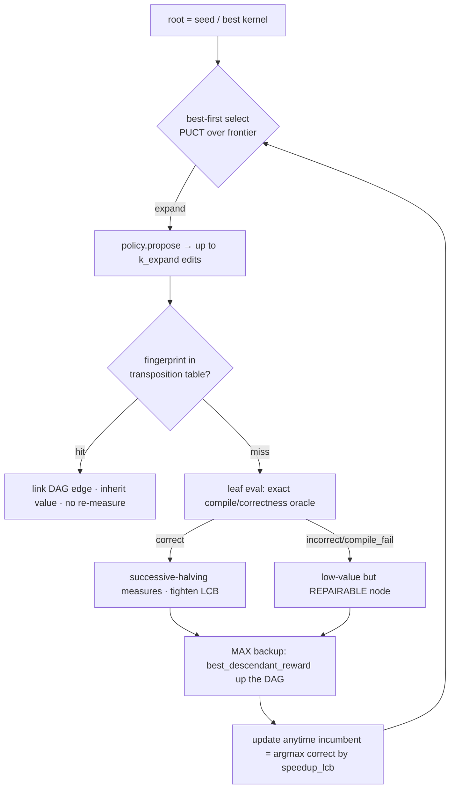
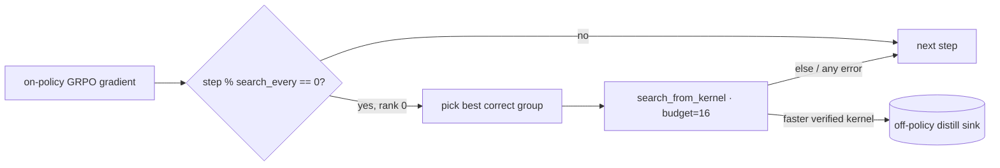

# `kore/search` — AlphaKernel value-guided test-time search

AlphaKernel treats the verified environment ([`kore/env`](../env/README.md)) as a **perfect but expensive simulator**: every leaf is *exactly* labeled correct/incorrect by the oracle and, when correct, *measured* by the timing harness. Over that oracle it runs an AlphaZero-style **best-first search** whose "moves" are kernel *transformations* (the ε-typed calculus in [`kore/transform`](../transform/README.md)) and whose "value" is the **pessimistic (LCB) measured speedup**. Orchestration is pure CPU; all GPU work is injected through `env`, so the whole engine is exercisable with scripted fakes.

In the flagship 14B configuration search runs as a **throttled, off-policy search-then-distill hook** after the on-policy GRPO gradient (`use_search: true`, `search_budget: 16`, `search_every: 50`): it produces distillation targets and never contributes on-policy credit (see [Wiring into GRPO](#wiring-into-grpo)).

---

## Files

| File | Purpose |
| --- | --- |
| `alphakernel.py` | The search engine: `Node`/DAG, PUCT best-first selection, **MAX** backup, transposition table, anytime incumbent, **admissible roofline branch-and-bound** (`make_roofline_ub_fn` / `RooflineCeiling`), and the top-level `search()` |
| `bandit.py` | Measurement allocation: `Budget` (hard verifier-call cap), `MeasureStats` (streaming mean/var + pessimistic **LCB**), `successive_halving` (Hyperband/SHA rung schedule) |
| `propose.py` | The production `ProposePolicy`: `TransformProposePolicy` turns [`kore/transform`](../transform/README.md) into the move generator; `search_from_kernel` is the one-call wiring used by GRPO |
| `__init__.py` | Public API (`search`, `AlphaKernelConfig`, `Edit`, `ProposeContext`, `Budget`, `MeasureStats`, `successive_halving`, `make_roofline_ub_fn`, …) |
| `tests/` | `test_alphakernel.py` (fingerprint/transposition, budget/LCB/SHA, MAX-backup, roofline pruning, LCB variance discipline, monotone incumbent, budget respected, repairable-incorrect nodes), `test_propose.py` (transform move generator + fail-safe on an untransformable source), `test_propose_discover.py` (self-extending action space), `test_search_fixes.py` (branch-and-bound, deeper search, incumbent argmax, value hook) |

---

## The algorithm



- **Node = a kernel state** with a semantic `fingerprint` (canonicalized source + IO signature, so cosmetically-different-but-equivalent kernels dedup), a `status` (`correct`/`incorrect`/`compile_fail`/`infra`/`pruned`), streaming `MeasureStats`, a value-model `prior`, and a `roofline_ub` ceiling.
- **Selection** is best-first with a PUCT acquisition over the *whole* frontier: pessimistic value (`best_descendant_reward`, backed up from measured `speedup_lcb`) + a value-prior exploration term + a structural **novelty** bonus. A node whose `roofline_ub` cannot beat the incumbent floor is dominated and never selected.
- **Expansion** asks the policy for up to `k_expand` edits, scores them with the value model to set priors, and creates children — **deduplicating by fingerprint against a transposition table**, so an equivalent kernel reached by another path is *linked* (a DAG) and inherits the exact measured value with no re-measurement.
- **Leaf eval** runs the exact oracle (compile/correctness, no timing). An incorrect kernel is a low-value but **repairable** node (not dead); a correct kernel is then measured.
- **Backup is MAX**, not mean: a node's value is the best value anywhere in its subtree, so the search commits to the single best kernel it can reach (test-time search, not policy averaging).
- **Measurement allocation is Successive Halving** ([`bandit.py`](bandit.py)): every correct candidate gets a cheap first look (`sh_min_measures=2`), survivors get more to tighten the LCB (`sh_max_measures=4`). AlphaKernel **ranks and commits by the LCB, not the mean**, so a fast-but-noisy kernel never beats a slightly-slower-but-stable one.
- **Budget** is a hard global cap on verifier (`env.step`) calls; the anytime **incumbent** is `argmax` over correct nodes by `speedup_lcb`.

```python
from kore.search.propose import search_from_kernel
res = search_from_kernel(best_kernel_src, task, env, budget=16, reward_mode="speedup")
res["best_source"], res["best_speedup_lcb"], res["tree_stats"]   # incumbent + counters

# Deep, value-guided, roofline-pruned search (what the orchestrator opts into):
from kore.search import make_roofline_ub_fn
from kore.value.rerank import score_candidates
res = search_from_kernel(
    best_kernel_src, task, env,
    budget=256, k_expand=6, max_depth=6,          # deeper / wider
    value_fn=lambda srcs, t: score_candidates(srcs, task=t, model=value_model),
    incumbent_min_measures=2,                     # sample floor for the B&B bound
    # Admissible bound. ceiling_dtype = the FASTEST precision the task's epsilon
    # budget can reach (so a downcast_dtype descendant can never beat it); use
    # task.dtype if precision-lowering moves are disabled in the library.
    roofline_ub_fn=make_roofline_ub_fn(ceiling_dtype="fp8", safety_margin=0.25),
)
```

---

## Search controls

`search_from_kernel` / `AlphaKernelConfig` expose the levers the orchestrator dials from `grpo.py`. Defaults reproduce a shallow, unpruned, heuristic-prior search; each lever is opt-in.

- **Roofline branch-and-bound (`roofline_ub_fn`).** `make_roofline_ub_fn(...)` / `RooflineCeiling` build a callable with the canonical `(source, task)` signature that returns the admissible physical ceiling `baseline_ms / T_min` and discovers the env-measured `baseline_ms` at runtime via `observe_baseline`. Because `T_min` bounds *every* kernel that solves the task — a node **and its whole transform subtree** — pruning a node whose ceiling is at or below the incumbent floor can never discard the branch that holds the optimum. Precision-lowering moves (`downcast_dtype`) are handled by `ceiling_dtype` plus a `safety_margin` (default 25% headroom). Default `roofline_ub_fn=None` leaves pruning off.
- **Depth and breadth (`budget`, `k_expand`, `max_depth`).** `budget` caps verifier calls, `k_expand` sets candidate edits per expansion, and `max_depth` caps the node depth that is expanded (`None` = unbounded). A node at the depth cap stays a valid measured leaf and remains eligible as the incumbent; it is simply not expanded further.
- **Incumbent and pruning floor.** `_update_incumbent` recomputes the **true argmax** over correct, sufficiently-sampled nodes every call — the single source of truth for the reported best — and advances a **separate monotone `_prune_floor`** (the running max of achieved LCBs) that branch-and-bound prunes against. Because a node's LCB is non-monotone in its sample count, the two are kept distinct: pruning decided at one step stays sound even if a later re-measurement lowers a node's LCB. `incumbent_min_measures` gates incumbent eligibility on sufficient samples.
- **Value model (`value_fn` / `value_model`).** Either drives the PUCT priors from a trained `kore.value.model.ValueModel` (via `kore.value.rerank`); `value_fn` takes precedence and defaults to the rerank heuristic. `value_leaf_weight > 0` additionally uses the value model as a bounded **leaf** prior for correct-but-unmeasured nodes (default `0.0`).

**Action-space scope.** The moves are regex/AST-lite rewrites of **Triton** source ([`kore/transform`](../transform/README.md)). A non-Triton root — e.g. a minted task whose seed is the torch reference (see [`kore/openended`](../openended/README.md)) — yields no admissible moves, so `TransformProposePolicy.propose` returns `[]` and the root is returned unexpanded. `test_propose.py` covers this fail-safe. `TransformProposePolicy(discover=True)` broadens the action space with the self-extending transform library (curated moves plus SNR-gated proposals seeded from the root source); an explicit `library=` always wins.

---

## Wiring into GRPO

`kore.policy.grpo._maybe_search_then_distill` is the only production entry point, sound and cheap by construction:

- **Post-gradient, off-policy.** It runs *after* the on-policy update is built and banks any faster verified kernel as an **off-policy distillation target** (for later expert-iteration / RFT). The search result is never attributed to the on-policy gradient, so there is no credit-assignment coupling.
- **Throttled and bounded.** It fires once every `search_every` (50) steps, on the **single best correct group only**, with `budget=search_budget` (16) benches — so the extra verifier cost is bounded (`≈ steps/50 × 16` benches over the run), not multiplied across every rollout. It runs **rank 0 only** (rank 0 owns the distill sink; other ranks wait at the next all-gather, well under the collective timeout).
- **Fail-safe.** `use_search` off, no distill sink, or any exception is a silent no-op. The env verifies every result, so a search can never bank an incorrect kernel.



The contribution is using the **verified env as a perfect simulator** — exact correctness plus LCB-pessimistic measured speedup — over a **bounded, in-contract transform action space**, so the search cannot reward-hack and every leaf is ground-truth graded.

See also: [`kore/transform`](../transform/README.md) (the action space), [`kore/openended`](../openended/README.md) (why minted seeds yield no moves), [`kore/policy`](../policy/README.md) (the GRPO hook), [`kore/value`](../value/README.md) (PUCT priors), [`kore/analysis`](../analysis/README.md) (rooflines), [`kore/env`](../env/README.md), [`kore/reward`](../reward/README.md).
