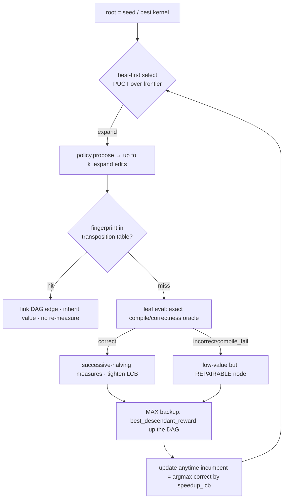
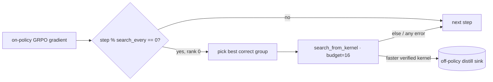

# `kore/search` - AlphaKernel value-guided test-time search

AlphaKernel (paradigm-v2 **P1**) treats the verified environment ([`kore/env`](../env/README.md)) as a **perfect but expensive simulator**: every leaf is *exactly* labeled correct/incorrect by the oracle and, when correct, *measured* by the timing harness. On top of that oracle it runs an AlphaZero-style **best-first search** whose "moves" are kernel *transformations* (the verified calculus in [`kore/transform`](../transform/README.md)) and whose "value" is the **pessimistic (LCB) measured speedup**. Pure CPU orchestration; all GPU work is injected via `env`, so the whole thing is exercisable with scripted fakes.

In the flagship 14B run it is **wired + on** (`use_search: true`, `search_budget: 16`, `search_every: 50`), but as a **throttled, fail-safe, off-policy search-then-distill hook that runs *after* the on-policy GRPO gradient** - it produces distillation targets, never on-policy credit (see [Wiring into GRPO](#wiring-into-grpo-throttled--off-policy) and the honest limits below).

---

## Files

| File | Purpose |
| --- | --- |
| `alphakernel.py` | The search engine: `Node`/DAG, PUCT best-first selection, **MAX** backup, transposition table, anytime incumbent, **admissible roofline branch-and-bound** (wireable via `make_roofline_ub_fn` / `RooflineCeiling`), and the top-level `search()` |
| `bandit.py` | Measurement allocation: `Budget` (hard verifier-call cap), `MeasureStats` (streaming mean/var + pessimistic **LCB**), `successive_halving` (Hyperband/SHA rung schedule) |
| `propose.py` | The **production** `ProposePolicy`: `TransformProposePolicy` turns [`kore/transform`](../transform/README.md) into the move generator; `search_from_kernel` is the one-call wiring used by GRPO |
| `__init__.py` | Public API (`search`, `AlphaKernelConfig`, `Edit`, `ProposeContext`, `Budget`, `MeasureStats`, `successive_halving`, ...) |
| `tests/` | `test_alphakernel.py` (fingerprint/transposition, budget/LCB/SHA, MAX-backup, roofline pruning *with* a supplied bound, LCB variance discipline, monotone incumbent, budget respected, repairable-incorrect nodes) + `test_propose.py` (transform move generator + fail-safe on an untransformable source) |

---

## The algorithm



- **Node = a kernel state** with a semantic `fingerprint` (canonicalized source + IO signature, so cosmetically-different-but-equivalent kernels dedup), a `status` (`correct`/`incorrect`/`compile_fail`/`infra`/`pruned`), streaming `MeasureStats`, a value-model `prior`, and a `roofline_ub` ceiling.
- **Selection** is best-first with a PUCT acquisition over the *whole* frontier: pessimistic value (`best_descendant_reward`, backed up from measured `speedup_lcb`) + a value-prior exploration term + a structural **novelty** bonus.
- **Expansion** asks the policy for up to `k_expand` edits, scores them with the value model to set priors, and creates children - **deduplicating by fingerprint against a transposition table**, so an equivalent kernel reached by another path is *linked* (a DAG) and inherits the exact measured value with no re-measurement.
- **Leaf eval** runs the exact oracle (compile/correctness, no timing). An incorrect kernel is a low-value but **repairable** node (not dead); a correct kernel is then measured.
- **Backup is MAX**, not mean: a node's value is the best value anywhere in its subtree, so the search commits to the single best kernel it can reach (test-time search, not policy averaging).
- **Measurement allocation is Successive Halving** ([`bandit.py`](bandit.py)): every correct candidate gets a cheap first look (`sh_min_measures=2`), survivors get more to tighten the LCB (`sh_max_measures=4`). AlphaKernel **ranks and commits by the LCB, not the mean**, so a fast-but-noisy kernel never beats a slightly-slower-but-stable one.
- **Budget** is a hard global cap on verifier (`env.step`) calls; the anytime **incumbent** is `argmax` over correct nodes by `speedup_lcb`.

```python
from kore.search.propose import search_from_kernel
res = search_from_kernel(best_kernel_src, task, env, budget=16, reward_mode="speedup")
res["best_source"], res["best_speedup_lcb"], res["tree_stats"]   # incumbent + counters

# Deep, value-guided, roofline-pruned search (what the orchestrator opts into):
from kore.search import make_roofline_ub_fn
from kore.value.rerank import score_candidates
res = search_from_kernel(
    best_kernel_src, task, env,
    budget=256, k_expand=6, max_depth=6,          # item 3: deeper
    value_fn=lambda srcs, t: score_candidates(srcs, task=t, model=value_model),  # item 4
    incumbent_min_measures=2,                     # item 2: sound floor
    # item 1: admissible bound. ceiling_dtype = the FASTEST precision the task's
    # epsilon budget can reach (so a downcast_dtype descendant can never beat it);
    # use task.dtype if precision-lowering moves are disabled in the library.
    roofline_ub_fn=make_roofline_ub_fn(ceiling_dtype="fp8", safety_margin=0.25),
)
```

---

## Engine fixes (expert audit) + remaining opt-in

An expert audit found four engine-level defects; all are now **fixed in `kore/search`** (see `tests/test_search_fixes.py`). None ever corrupted training (the search only emits *off-policy distillation candidates* that the env re-verifies), but they capped efficacy. Every fix is **OFF by default** (defaults reproduce the prior behavior exactly); the orchestrator opts in from `grpo.py` by passing the new arguments.

1. **Roofline branch-and-bound is now wireable + admissible.** The pruning (`_admissible`: a node whose `roofline_ub ≤` the incumbent floor is dominated and skipped) was implemented but **un-wireable**: the helper `roofline_speedup_ceiling(task, baseline_ms, ...)` had a **different signature** than the `(source, task)` call site, and no bound was passed in production (`roofline_ub = +inf` everywhere ⇒ nothing pruned). Fixed by `RooflineCeiling` / `make_roofline_ub_fn(...)`, a callable with the **canonical `(source, task)` signature** that (a) computes the admissible physical ceiling `baseline_ms / T_min` and (b) discovers the env-measured `baseline_ms` at runtime via `observe_baseline`. **Admissibility:** `T_min` bounds *every* kernel that solves the task, hence a node **and its whole transform subtree**, so pruning against the incumbent floor can never discard the branch that holds the optimum. Precision-lowering moves (`downcast_dtype`) are handled by `ceiling_dtype` + a `safety_margin` (default 25% headroom). Default `roofline_ub_fn=None` ⇒ pruning stays OFF.
2. **Deeper search is exposed.** `search_from_kernel` / `AlphaKernelConfig` now take `budget`, `k_expand`, and `max_depth` (depth cap; `None` ⇒ unbounded, the prior behavior), so grpo can dial a deeper search than the historical `budget≈16`, `k_expand≈4`.
3. **Stale-incumbent bug fixed.** Previously `incumbent_lcb` was a running **max** advanced independently of the (never-demoted) `incumbent` pointer, while a node's LCB is *non-monotone in sample count* - so a lucky-early node could hold the slot after its LCB decayed and pruning could become **unsound**. `_update_incumbent` now recomputes the **true argmax** every call (single source of truth for the reported best) and keeps a **separate monotone `_prune_floor`** (the running max of achieved LCBs) that B&B prunes against - so a prune decided at one step stays sound even if a later re-measurement lowers a node's LCB. `incumbent_min_measures` gates eligibility on sufficient samples.
4. **Value model is a clean hook.** `search(..., value_fn=...)` (and `value_model=`) drive the PUCT priors from a trained `kore.value.model.ValueModel` (via `kore.value.rerank`) when supplied - `value_fn` takes precedence and defaults to the rerank heuristic. `value_leaf_weight > 0` additionally uses the value model as a bounded **leaf** prior for correct-but-unmeasured nodes (default `0.0` ⇒ off).

**Remaining limitation — Triton-only action space.** The moves are regex/AST-lite rewrites of **Triton** source ([`kore/transform`](../transform/README.md)). A **non-Triton root yields ~0 children** - e.g. a minted task whose seed is the torch reference (see [`kore/openended`](../openended/README.md)) - so `TransformProposePolicy.propose` returns `[]` and the root is never expanded. `test_propose.py` covers this fail-safe.

---

## Wiring into GRPO (throttled + off-policy)

`kore.policy.grpo._maybe_search_then_distill` is the only production entry point, and it is sound + cheap by construction:

- **Post-gradient, off-policy.** It runs *after* the on-policy update is built and banks any faster verified kernel as an **off-policy distillation target** (for later expert-iteration/RFT) - the search result is **never attributed to the on-policy gradient**, so there is no credit-assignment corruption.
- **Throttled + bounded.** Fires once every `search_every` (=50) steps, on the **single best correct group only**, with `budget=search_budget` (=16) benches - so the extra verifier cost is bounded (`≈ steps/50 × 16` benches over the run), not multiplied across every rollout. Runs **rank-0 only** (rank 0 owns the distill sink; other ranks wait at the next all-gather, well under the collective timeout).
- **Fully fail-safe.** `use_search` off, no distill sink, or any exception → a silent no-op. The env verifies every result, so a bad search can never bank an incorrect kernel.



---

## Closest prior art (honest)

AlphaKernel is a **novel combination** of established ideas against a *perfectly-verified* kernel oracle; the individual pieces are well known:

- **AlphaDev / AlphaZero-for-code** - MCTS/best-first search over program edits guided by a learned value, committing to the single best program (vs. our MAX-backup + LCB commit).
- **Ansor / cost-model-guided schedule search** (TVM) and classic autotuning - search a schedule space with a surrogate ranker (our value-model PUCT prior).
- **Hyperband / Successive-Halving** - budgeted measurement allocation under noise (our `bandit.py`).

The specific contribution is using the **verified env as a perfect simulator** (exact correctness + LCB-pessimistic measured speedup) over a **bounded, in-contract transform action space**, so the search cannot reward-hack and every leaf is ground-truth graded.

See also: [`kore/transform`](../transform/README.md) (the action space), [`kore/openended`](../openended/README.md) (why minted seeds yield no moves), [`kore/policy`](../policy/README.md) (the GRPO hook), [`kore/value`](../value/README.md) (PUCT priors), [`kore/analysis`](../analysis/README.md) (rooflines), [`kore/env`](../env/README.md), [`kore/reward`](../reward/README.md).
