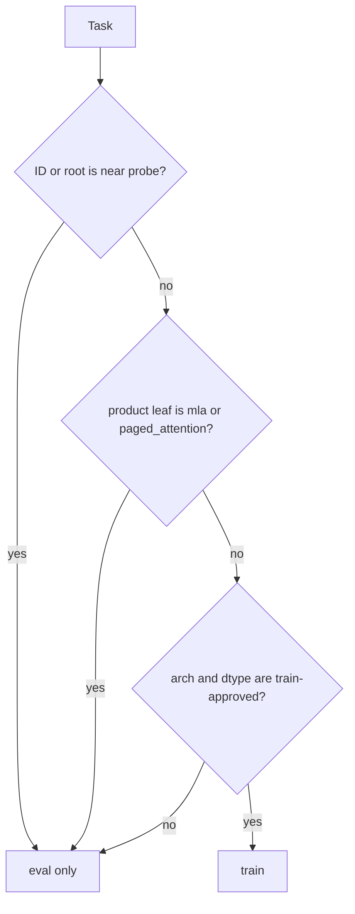
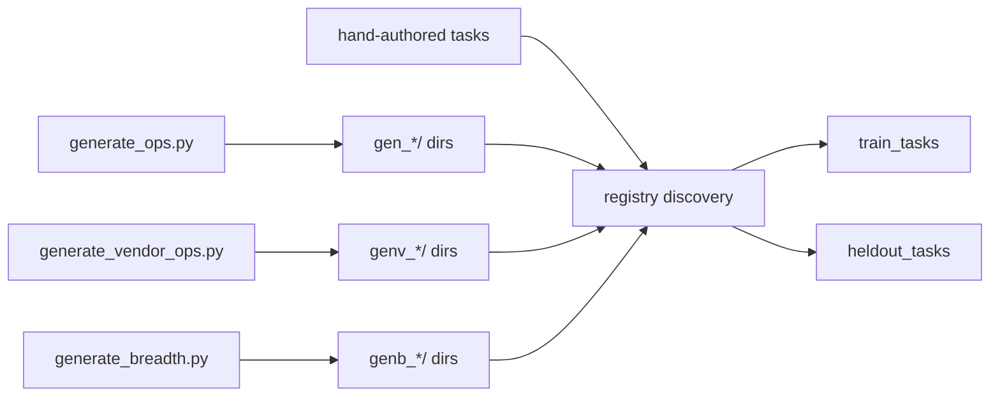

# `kore/tasks` — kernel task registry

Every RL "environment instance" is a **kernel-optimization task**: a Triton kernel to make fast, an fp32 **reference oracle** for correctness, a **production vendor baseline** to beat (AITER / hipBLASLt / framework), a set of evaluation **shapes**, and a driver contract the verifier speaks. Tasks are discovered from `<task_id>/task.yaml` directories.

Counts, families, split reasons, and the taxonomy digest are machine-derived from
the strict registry. At taxonomy v1.0.0 the pinned whole-registry test covers
1,334 tasks (1,289 train / 45 eval), including the materialized `genb_*` breadth
suite. Re-derive the complete live description instead of copying counts into
another document:

```bash
python -c "from pprint import pprint; from kore.tasks.registry import taxonomy_description; pprint(taxonomy_description())"
```

Discovery is fail-closed: malformed YAML/artifacts, duplicate or case-colliding
IDs, directory/ID collisions, unknown generator families, and conflicting
operation assignments abort registry load rather than being printed and skipped.

---

## Files

| File | Purpose |
| --- | --- |
| `base.py` | Task ABI: `Shape`, `Task`, `Task.from_dir()` — parses `task.yaml` |
| `taxonomy.py` | Versioned product-family leaves, analysis hierarchy, source mappings, split policy |
| `registry.py` | Strict discovery, immutable split manifest, record/task split adapters |
| `augment.py` | Deterministic shape augmentation (scale factors + an odd non-aligned shape) |
| `audit.py` | Live data-scale audit from the registry |
| `_genops.py` | Operator spec registry + `make_reference`, `seed_source`, generic `driver_main` |
| `generate_ops.py` | Writes `gen_<op>_<dtype>/` tasks (framework/torch baseline) |
| `vendor_ops.py` | Vendor-baselined op templates vs. real AITER kernels |
| `generate_vendor_ops.py` | Writes `genv_<op>_<dtype>/` tasks |
| `generate_breadth.py` | Writes `genb_<op>_<dtype>/` tasks from the `breadth/` engines |
| `breadth/` | 16 op-class authoring engines (+ CPU tests) for the `genb_*` expansion |
| `aiter_ref.py`, `aiter_ref_attn.py` | Shared AITER / hipBLASLt / framework baseline wrappers |
| `<task_id>/` | Per-task dir: `task.yaml`, `reference.py`, `seed_triton.py`, `driver.py` |

---

## The task contract

A task directory contains:

| File | Role |
| --- | --- |
| `task.yaml` | metadata + shapes (`minimal` / `primary` / `validation[]`), `snr_threshold`, `comparison_baseline` |
| `reference.py` | `parse_shape`, `get_inputs`, `ref_fn` (fp32 oracle), `baseline_fn` (production bar) |
| `seed_triton.py` | a compiling Triton starter the policy edits |
| `driver.py` | prints `SNR:`, `allclose:`, `median_ms:` — hand-authored or a shim to `_genops.driver_main` |

```python
@dataclass(frozen=True)
class Shape:
    name: str
    dims: dict[str, int]          # e.g. {"M": 4096, "N": 4096, "K": 4096}

@dataclass
class Task:
    task_id: str; operation: str; dtype: str; backend: str; gpu_target: str
    seed_kernel_name: str; snr_threshold: float; comparison_baseline: str
    shapes: list[Shape]; raw: dict
    @classmethod
    def from_dir(cls, d: Path) -> "Task"
```

---

## Train / held-out split

```python
TRAIN_ARCH  = "gfx950"                          # primary target: CDNA4 (MI350X / MI355X)
TRAIN_ARCHS = {"gfx950", "gfx942"}              # accepted hardware lineage
HELDOUT_FAMILIES = ("mla", "paged_attention")
NEAR_GENERALIZATION_TASKS = {...43 exact genb task IDs...}
```

A task is eval-only if **any** of these hold (`registry.split_decision`):

1. its ID or provenance root is one of the explicit near-generalization probes;
2. its product-family leaf is `mla` or `paged_attention`;
3. its architecture is outside `TRAIN_ARCHS`; or
4. its dtype is outside the reviewed `TRAIN_DTYPES`.

Unclassified external records are also eval-only. `build_split_manifest()` freezes
sorted train/eval ID tuples, per-ID provenance roots, taxonomy version/digest, and
the architecture/dtype policy. Resume rejects stale or malformed manifests.



**Core attention is trained, not held out.** Flash-attention prefill / decode / sliding-window / varlen / fp8 all train, so the product model is strong at attention. Only the two *structurally distinct* families are withheld to measure genuine cross-family transfer: **MLA** (DeepSeek latent attention) and **paged-KV decode** (a different KV-cache mechanism).

**Whole-family and task-level probes are distinct.** Any generated or mined
MLA/paged variant stays out by product leaf. The 43 stratified near probes are
exact task/provenance-root reservations: the rest of their families still train,
so their presence does not falsely declare the whole `attention` rollup held out.

**Why deterministic.** Assignment is a pure function of the versioned taxonomy,
task metadata, and provenance root. `split_tasks(seed)` only reorders within the
immutable manifest; it never moves an ID across the boundary.

**Why gfx942 stays in train.** gfx942/CDNA3 shares the hardware lineage with the gfx950/CDNA4 target and runs correctly on-node, so previous-gen-tagged tasks and any in-flight gfx942 datagen keep training instead of being retroactively held out when the primary arch advanced to gfx950. A truly foreign arch (gfx1100, NVIDIA) is still held out.

> **One hierarchy, two views.** `registry.operator_family` returns the product
> leaf used by the split. `taxonomy.analysis_family` returns its reporting/LOFO
> parent. Thus `attention`, `mla`, and `paged_attention` are separate product
> leaves but all roll up to the analysis family `attention`; consumers do not
> maintain independent first-match rules.

---

## Authoring new tasks



- `_genops.py` defines 67 operators across the `unary`, `binary`, `reduce`, `fusion` (multi-kernel headroom), and `gemm_fusion` (hipBLASLt + epilogue headroom) families.
- `generate_ops.py` emits `gen_<op>_<dtype>/` tasks with a torch/framework baseline, expanding each operator across `bf16`/`fp16`/`fp32` (67 × 3 = 201 tasks).
- `generate_vendor_ops.py` emits the 26 `genv_<op>_<dtype>/` tasks (14 vendor ops × their dtype sweeps) graded against real AITER kernels with LLM-realistic shape tables.

---

## Breadth op-class generators

`kore/tasks/breadth/` holds **16 op-class authoring engines** — attention, MoE, GEMM, norm, quant, reduction, convolution, scan/SSM, sequence, sort/sparse, sampling, and training-op families. Each engine exposes the shared ABI (`OPS`, `SHAPES`, `make_reference`, `seed_source`) and ships CPU-side tests under `breadth/tests/`.

`generate_breadth.py` auto-discovers every conformant engine and writes
`genb_<op>_<dtype>/` dirs, each with a `task.yaml`, a naive-but-correct Triton
seed, and thin `reference.py`/`driver.py` shims. The checked-in registry already
contains the materialized breadth suite; use `taxonomy_description()` for its
current count:

```bash
python -m kore.tasks.generate_breadth --list   # dry-run: list the genb_* ids
python -m kore.tasks.generate_breadth          # write the dirs into this checkout
```

Generation is opt-in and idempotent. Registry discovery globs `*/task.yaml`;
new operations must have a source-module family assignment and change the taxonomy
digest. Most breadth tasks train, while the explicit 43-ID stratified probe remains
eval-only. Never regenerate an in-flight run's frozen task set.

---

## Baselines

Baselines are **production vendor kernels**, not torch-eager. `aiter_ref.py` / `aiter_ref_attn.py` wrap AITER (`aiter_rms_norm`, `aiter_fused_add_rms_norm`, `flash_attn_func`, `fused_moe`, `paged_attention_rocm`, …), hipBLASLt for GEMM, and torch only where AITER has no standalone op — always labeled via a `KORE_BASELINE_IMPL:<impl>` stderr sentinel, so "correct-but-slow vs. production" is never mistaken for "beats torch".

> fp8 e4m3 is arch-selected by `aiter_ref.FP8_DTYPE`: OCP `e4m3fn` on gfx950/CDNA4 (MI350X/MI355X — the native format and this node's default), FNUZ `e4m3fnuz` on gfx942/CDNA3. Override with `KORE_FP8_ENCODING=ocp|fnuz`.

---

## Environment variables

| Variable | Effect |
| --- | --- |
| `KORE_SHAPE_AUGMENT` | expand shapes via `augment_shapes` |
| `KORE_COMPILE_BASELINE` | `torch.compile`-fused baseline for fusion / gemm_fusion families |
| `KORE_VERIFIED_CORRECTNESS` | enable the adversarial input battery in the driver |
| `KORE_CORRECTNESS_TRIALS` | min reseeded correctness trials (default 5) |
| `KORE_BENCH_COLD` | L2-flush between timed iters (default 1) |
| `GPU_TARGET` | arch for Triton/HIP compilation |

---

## Gotchas

- `minimal` shapes are **correctness-only** — they are launch-overhead-bound, so the roofline analysis excludes them from `η` correlation.
- Registry discovery is **lazy-import-safe**: AITER/torch are imported only inside wrappers, so listing tasks never needs a GPU.
- `mutates_input` ops (e.g. `fused_add_rmsnorm`) clone inputs each bench call for fair timing.

See also: [`env`](../env/README.md) (how tasks are executed), [`analysis`](../analysis/README.md) (roofline over `task.operation`), [`reward`](../reward/README.md).
