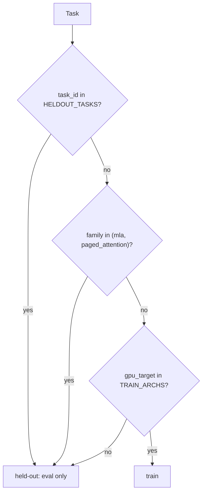
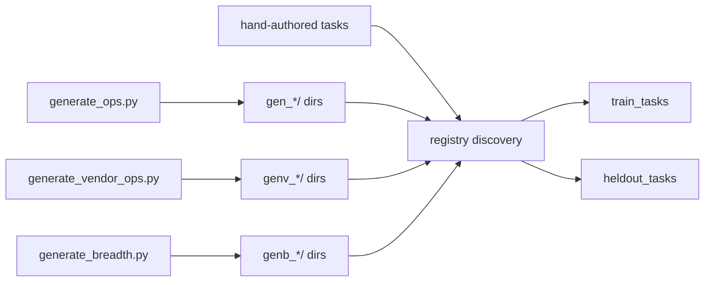

# `kore/tasks` — kernel task registry

Every RL "environment instance" is a **kernel-optimization task**: a Triton kernel to make fast, an fp32 **reference oracle** for correctness, a **production vendor baseline** to beat (AITER / hipBLASLt / framework), a set of evaluation **shapes**, and a driver contract the verifier speaks. Tasks are discovered from `<task_id>/task.yaml` directories. Hand-authored, `gen_*`, `genv_*`, and `genb_*` task assets are all checked in and ship in release artifacts.

`registry.all_tasks()` is the source of truth. Derive the live totals and group
breakdown directly from the generated registry:

```bash
python - <<'PY'
from collections import Counter
from kore.tasks import registry

tasks = registry.all_tasks()
group = lambda t: next((p for p in ("genb_", "genv_", "gen_") if t.task_id.startswith(p)), "hand")
print("registry:", len(tasks), Counter(group(task) for task in tasks))
print("split:", {"train": len(registry.train_tasks()), "heldout": len(registry.heldout_tasks())})
PY
```

The registry also defines the **authoritative train / held-out split** by operator family and architecture, so generalization can never be leaked.

---

## Files

| File | Purpose |
| --- | --- |
| `base.py` | Task ABI: `Shape`, `Task`, `Task.from_dir()` — parses `task.yaml` |
| `registry.py` | Discovery, `operator_family`, `is_heldout`, `split_tasks`, `all_tasks`, `get_task` |
| `augment.py` | Deterministic shape augmentation (scale factors + an odd non-aligned shape) |
| `audit.py` | Live data-scale audit from the registry |
| `_genops.py` | Operator spec registry + `make_reference`, `seed_source`, generic `driver_main` |
| `generate_ops.py` | Writes `gen_<op>_<dtype>/` tasks (framework/torch baseline) |
| `vendor_ops.py` | Vendor-baselined op templates vs. real AITER kernels |
| `generate_vendor_ops.py` | Writes `genv_<op>_<dtype>/` tasks |
| `generate_breadth.py` | Writes `genb_<op>_<dtype>/` tasks from the `breadth/` engines |
| `breadth/` | Auto-discovered op-class authoring engines (+ CPU tests) for the `genb_*` expansion |
| `aiter_ref.py`, `aiter_ref_attn.py` | Shared AITER / hipBLASLt / framework baseline wrappers |
| `<task_id>/` | Per-task dir: `task.yaml`, `reference.py`, `seed_triton.py`, `driver.py` |

---

## The task contract

A task directory contains:

| File | Role |
| --- | --- |
| `task.yaml` | metadata + shapes (`minimal` / `primary` / `validation[]`), `snr_threshold`, `comparison_baseline` |
| `reference.py` | `parse_shape`, `get_inputs`, `ref_fn` (fp32 oracle), `baseline_fn` (production bar) |
| `seed_triton.py` | a compiling Triton starter the policy edits |
| `driver.py` | prints `SNR:`, `allclose:`, `median_ms:` — hand-authored or a shim to `_genops.driver_main` |

```python
@dataclass(frozen=True)
class Shape:
    name: str
    dims: dict[str, int]          # e.g. {"M": 4096, "N": 4096, "K": 4096}

@dataclass
class Task:
    task_id: str; operation: str; dtype: str; backend: str; gpu_target: str
    seed_kernel_name: str; snr_threshold: float; comparison_baseline: str
    shapes: list[Shape]; raw: dict
    @classmethod
    def from_dir(cls, d: Path) -> "Task"
```

---

## Train / held-out split

```python
TRAIN_ARCH  = "gfx950"                          # primary target: CDNA4 (MI350X / MI355X)
TRAIN_ARCHS = {"gfx950", "gfx942"}              # arches accepted into train (override: KORE_TRAIN_ARCHS)
HELDOUT_FAMILIES = ("mla", "paged_attention")
HELDOUT_TASKS    = {"mla_decode_bf16", "paged_attn_decode_bf16"}
```

A task is held out if **any** of these hold (`registry.is_heldout`):

1. its `task_id` is in `HELDOUT_TASKS`, **or**
2. its `operator_family()` is in `HELDOUT_FAMILIES` (`mla` or `paged_attention`), **or**
3. it targets a **foreign arch** (a `gpu_target` outside `TRAIN_ARCHS`).

This is the single source of truth used by both datagen (never trains on held-out) and eval (measures zero-shot transfer to the held-out families).



**Core attention is trained, not held out.** Flash-attention prefill / decode / sliding-window / varlen / fp8 all train, so the product model is strong at attention. Only the two *structurally distinct* families are withheld to measure genuine cross-family transfer: **MLA** (DeepSeek latent attention) and **paged-KV decode** (a different KV-cache mechanism).

**Why family-level, not task-level.** Reserving whole families (not just the two seed task ids) keeps any generated or mined MLA/paged variant out of training by its family, closing the last leakage path. `operator_family` therefore classifies `mla`/`paged` **before** the generic `attn` catch, so those variants never fall through into the trained `attention` bucket.

**Why deterministic.** The held-out set is a pure function of family + arch, independent of any seed, so datagen can exclude it with no seed coordination. `split_tasks(seed)` returns `{"train", "heldout", "seed"}`; `seed` only reorders *within* a split (for sharding / CV folds) and never moves a task across the boundary.

**Why gfx942 stays in train.** gfx942/CDNA3 shares the hardware lineage with the gfx950/CDNA4 target and runs correctly on-node, so previous-gen-tagged tasks and any in-flight gfx942 datagen keep training instead of being retroactively held out when the primary arch advanced to gfx950. A truly foreign arch (gfx1100, NVIDIA) is still held out.

> **Two family taxonomies exist by design.** `registry.operator_family` is the coarse split authority (the `mla` / `paged_attention` / `attention` / … buckets above). `kore.eval.generalization.family_of` is a richer 8-family classifier (attention, moe, gemm, norm, positional, quant, reduction, activation) used for offline leave-one-family-out analysis. The two are distinct; do not conflate them.

---

## Authoring new tasks



- `_genops.py` defines operators across the `unary`, `binary`, `reduce`, `fusion` (multi-kernel headroom), and `gemm_fusion` (hipBLASLt + epilogue headroom) families.
- `generate_ops.py` emits `gen_<op>_<dtype>/` tasks with a torch/framework baseline, expanding supported operators across `bf16`/`fp16`/`fp32`.
- `generate_vendor_ops.py` emits `genv_<op>_<dtype>/` tasks graded against real AITER kernels with LLM-realistic shape tables.

---

## Breadth op-class generators

`kore/tasks/breadth/` holds auto-discovered op-class authoring engines for attention, MoE, GEMM, norm, quant, reduction, convolution, scan/SSM, sequence, sort/sparse, sampling, and training-op families. Each engine exposes the shared ABI (`OPS`, `SHAPES`, `make_reference`, `seed_source`) and ships CPU-side tests under `breadth/tests/`.

`generate_breadth.py` auto-discovers every conformant engine and writes `genb_<op>_<dtype>/` dirs, each with a `task.yaml`, a naive-but-correct Triton seed, and thin `reference.py`/`driver.py` shims. Ask the generator for the current breadth instead of copying a count into documentation:

```bash
python -m kore.tasks.generate_breadth --list   # dry-run: list the genb_* ids
python -m kore.tasks.generate_breadth          # write the dirs into this checkout
```

Generation is idempotent and its current outputs are checked in. Registry discovery globs `*/task.yaml`, so regenerated `genb_*` dirs are picked up with no code edits. Only run it on a node whose task suite you intend to update — never on a node whose in-flight run must keep a frozen task set.

---

## Baselines

Baselines are **production vendor kernels**, not torch-eager. `aiter_ref.py` / `aiter_ref_attn.py` wrap AITER (`aiter_rms_norm`, `aiter_fused_add_rms_norm`, `flash_attn_func`, `fused_moe`, `paged_attention_rocm`, …), hipBLASLt for GEMM, and torch only where AITER has no standalone op — always labeled via a `KORE_BASELINE_IMPL:<impl>` stderr sentinel, so "correct-but-slow vs. production" is never mistaken for "beats torch".

> fp8 e4m3 is arch-selected by `aiter_ref.FP8_DTYPE`: OCP `e4m3fn` on gfx950/CDNA4 (MI350X/MI355X — the native format and this node's default), FNUZ `e4m3fnuz` on gfx942/CDNA3. Override with `KORE_FP8_ENCODING=ocp|fnuz`.

---

## Environment variables

| Variable | Effect |
| --- | --- |
| `KORE_SHAPE_AUGMENT` | expand shapes via `augment_shapes` |
| `KORE_COMPILE_BASELINE` | `torch.compile`-fused baseline for fusion / gemm_fusion families |
| `KORE_VERIFIED_CORRECTNESS` | enable the adversarial input battery in the driver |
| `KORE_CORRECTNESS_TRIALS` | min reseeded correctness trials (default 5) |
| `KORE_BENCH_COLD` | L2-flush between timed iters (default 1) |
| `GPU_TARGET` | arch for Triton/HIP compilation |

---

## Gotchas

- `minimal` shapes are **correctness-only** — they are launch-overhead-bound, so the roofline analysis excludes them from `η` correlation.
- Registry discovery is **lazy-import-safe**: AITER/torch are imported only inside wrappers, so listing tasks never needs a GPU.
- `mutates_input` ops (e.g. `fused_add_rmsnorm`) clone inputs each bench call for fair timing.

See also: [`env`](../env/README.md) (how tasks are executed), [`analysis`](../analysis/README.md) (roofline over `task.operation`), [`reward`](../reward/README.md).
