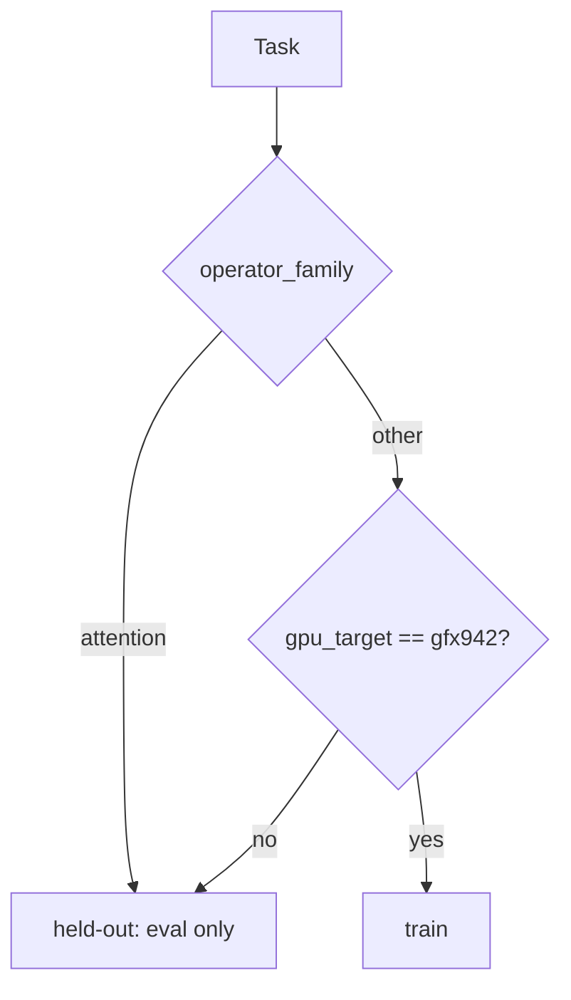
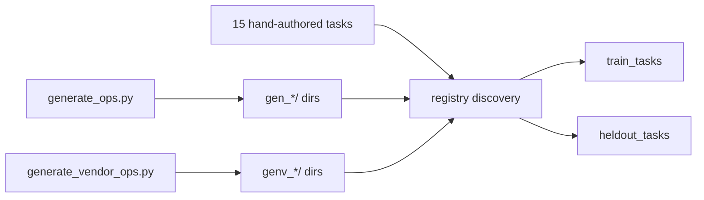

# `kore/tasks` - kernel task registry

Every RL "environment instance" is a **kernel-optimization task**: a Triton kernel to make fast, an fp32 **reference oracle** for correctness, a **production vendor baseline** to beat (AITER / hipBLASLt / framework), a set of evaluation **shapes**, and a driver contract the verifier speaks. Tasks are discovered from `<task_id>/task.yaml` directories. Today the registry holds **~181 operators**: 15 hand-authored, ~151 generated (`gen_*`), 20 vendor-baselined (`genv_*`).

The registry also defines the **authoritative train / held-out split** by operator family and architecture, so generalization can never be leaked.

---

## Files

| File | Purpose |
| --- | --- |
| `base.py` | Task ABI: `Shape`, `Task`, `Task.from_dir()` - parses `task.yaml` |
| `registry.py` | Discovery, `operator_family`, `is_heldout`, `split_tasks`, `all_tasks`, `get_task` |
| `augment.py` | Deterministic shape augmentation (scale factors + an odd non-aligned shape) |
| `audit.py` | Live data-scale audit from the registry |
| `_genops.py` | Operator spec registry + `make_reference`, `seed_source`, generic `driver_main` |
| `generate_ops.py` | Writes `gen_<op>_<dtype>/` tasks (framework/torch baseline) |
| `vendor_ops.py` | Vendor-baselined op templates vs. real AITER kernels |
| `generate_vendor_ops.py` | Writes `genv_<op>_<dtype>/` tasks |
| `aiter_ref.py`, `aiter_ref_attn.py` | Shared AITER / hipBLASLt / framework baseline wrappers |
| `<task_id>/` | Per-task dir: `task.yaml`, `reference.py`, `seed_triton.py`, `driver.py` |

---

## The task contract

A task directory contains:

| File | Role |
| --- | --- |
| `task.yaml` | metadata + shapes (`minimal` / `primary` / `validation[]`), `snr_threshold`, `comparison_baseline` |
| `reference.py` | `parse_shape`, `get_inputs`, `ref_fn` (fp32 oracle), `baseline_fn` (production bar) |
| `seed_triton.py` | a compiling Triton starter the policy edits |
| `driver.py` | prints `SNR:`, `allclose:`, `median_ms:` - hand-authored or a shim to `_genops.driver_main` |

```python
@dataclass(frozen=True)
class Shape:
    name: str
    dims: dict[str, int]          # e.g. {"M": 4096, "N": 4096, "K": 4096}

@dataclass
class Task:
    task_id: str; operation: str; dtype: str; backend: str; gpu_target: str
    seed_kernel_name: str; snr_threshold: float; comparison_baseline: str
    shapes: list[Shape]; raw: dict
    @classmethod
    def from_dir(cls, d: Path) -> "Task"
```

---

## Train / held-out split

```python
TRAIN_ARCH = "gfx942"
HELDOUT_FAMILIES = ("attention",)
```

A task is held out iff its **operator family is reserved** (today: `attention`) **or** its `gpu_target != gfx942`. This is the single source of truth used by both datagen (never trains on held-out) and eval (measures zero-shot transfer to held-out).



`split_tasks(seed)` returns `{"train", "heldout", "seed"}`; the seed only reorders *within* a split - the held-out set is a fixed function of family + arch, never seed-dependent.

> **Two family taxonomies exist by design.** `registry.operator_family` is the coarse split authority. `kore.eval.generalization.family_of` is a richer 8-family classifier used for analysis/LOFO. Don't conflate them in write-ups.

---

## Authoring new tasks



- `_genops.py` defines ~70 operators across `unary`, `binary`, `reduce`, `fusion` (multi-kernel headroom), and `gemm_fusion` (hipBLASLt + epilogue headroom) families.
- `generate_ops.py` emits `gen_<op>_<dtype>/` tasks with a torch/framework baseline; `generate_vendor_ops.py` emits `genv_<op>_<dtype>/` graded against real AITER kernels with LLM-realistic shape tables.

---

## Baseline honesty

Baselines are **production vendor kernels**, not torch-eager. `aiter_ref.py` / `aiter_ref_attn.py` wrap AITER (`aiter_rms_norm`, `aiter_fused_add_rms_norm`, `flash_attn_func`, `fused_moe`, `paged_attention_rocm`, …), hipBLASLt for GEMM, and torch only where AITER has no standalone op - always labeled via a `KORE_BASELINE_IMPL:<impl>` stderr sentinel so "correct-but-slow vs. production" is never mistaken for "beats torch".

> fp8 e4m3 is arch-selected by `aiter_ref.FP8_DTYPE`: OCP `e4m3fn` on gfx950/CDNA4 (MI350X/MI355X - the native format + this node's default), FNUZ `e4m3fnuz` on gfx942/CDNA3. Override with `KORE_FP8_ENCODING=ocp|fnuz`.

---

## Environment variables

| Variable | Effect |
| --- | --- |
| `KORE_SHAPE_AUGMENT` | expand shapes via `augment_shapes` |
| `KORE_COMPILE_BASELINE` | `torch.compile`-fused baseline for fusion / gemm_fusion families |
| `KORE_VERIFIED_CORRECTNESS` | enable the adversarial input battery in the driver |
| `KORE_CORRECTNESS_TRIALS` | min reseeded correctness trials (default 5) |
| `KORE_BENCH_COLD` | L2-flush between timed iters (default 1) |
| `GPU_TARGET` | arch for Triton/HIP compilation |

---

## Gotchas

- `minimal` shapes are **correctness-only** - they are launch-overhead-bound, so the roofline analysis excludes them from `η` correlation.
- Registry discovery is **lazy-import-safe**: AITER/torch are imported only inside wrappers, so listing tasks never needs a GPU.
- `mutates_input` ops (e.g. `fused_add_rmsnorm`) clone inputs each bench call for fair timing.

See also: [`env`](../env/README.md) (how tasks are executed), [`analysis`](../analysis/README.md) (roofline over `task.operation`), [`reward`](../reward/README.md).
