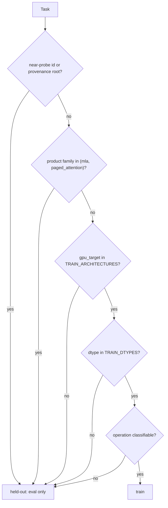
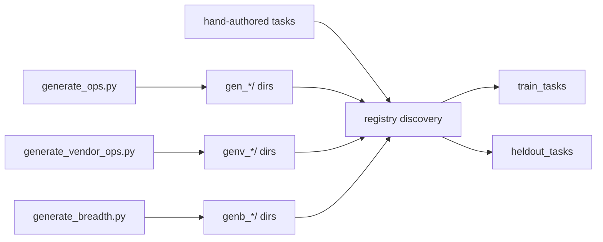

# `kore/tasks` — kernel task registry

Every RL "environment instance" is a **kernel-optimization task**: a Triton kernel to make fast, an fp32 **reference oracle** for correctness, a declared **comparison baseline** to beat (a production vendor kernel for ~100 tasks, torch for the rest — see [Baselines](#baselines)), a set of evaluation **shapes**, and a driver contract the verifier speaks. Tasks are discovered from `<task_id>/task.yaml` directories. Hand-authored, `gen_*`, `genv_*`, and `genb_*` task assets are all checked in and ship in release artifacts.

`registry.all_tasks()` is the source of truth. Derive the live totals and group
breakdown directly from the generated registry:

```bash
python - <<'PY'
from collections import Counter
from kore.tasks import registry

tasks = registry.all_tasks()
group = lambda t: next((p for p in ("genb_", "genv_", "gen_") if t.task_id.startswith(p)), "hand")
print("registry:", len(tasks), Counter(group(task) for task in tasks))
print("split:", {"train": len(registry.train_tasks()), "heldout": len(registry.heldout_tasks())})
PY
```

The registry also defines the **authoritative train / held-out split** by operator family and architecture, so generalization can never be leaked.

The registry is not the full datagen universe. `external.py` and
`scripts/build_task_pool.py` construct a separate, static task pool with the
same ABI, without mutating `registry.all_tasks()` or its taxonomy digest. The
current pool has 14,859 plannable tasks and 14,461 eligible tasks after
held-out screening; 13,570 are external, and 398 registry seeds are excluded as
seed-contaminated. Keeping the pool separate prevents a data-scale expansion
from silently changing the fixed evaluation split.

---

## Files

| File | Purpose |
| --- | --- |
| `base.py` | Task ABI: `Shape`, `Task`, `Task.from_dir()` — parses `task.yaml` |
| `registry.py` | Discovery, `operator_family`, `is_heldout`, `split_tasks`, `all_tasks`, `get_task` |
| `augment.py` | Deterministic shape augmentation (scale factors + an odd non-aligned shape) |
| `audit.py` | Live data-scale audit from the registry |
| `_genops.py` | Operator spec registry + `make_reference`, `seed_source`, generic `driver_main` |
| `generate_ops.py` | Writes `gen_<op>_<dtype>/` tasks (framework/torch baseline) |
| `vendor_ops.py` | Vendor-baselined op templates vs. real AITER kernels |
| `generate_vendor_ops.py` | Writes `genv_<op>_<dtype>/` tasks |
| `generate_breadth.py` | Writes `genb_<op>_<dtype>/` tasks from the `breadth/` engines |
| `breadth/` | Auto-discovered op-class authoring engines (+ CPU tests) for the `genb_*` expansion |
| `aiter_ref.py`, `aiter_ref_attn.py` | Shared AITER / hipBLASLt / framework baseline wrappers |
| `<task_id>/` | Per-task dir: `task.yaml`, `reference.py`, `seed_triton.py`, `driver.py` |

---

## The task contract

A task directory contains:

| File | Role |
| --- | --- |
| `task.yaml` | metadata + shapes (`minimal` / `primary` / `validation[]`), `snr_threshold`, `comparison_baseline` |
| `reference.py` | `parse_shape`, `get_inputs`, `ref_fn` (fp32 oracle), `baseline_fn` (production bar) |
| `seed_triton.py` | a compiling Triton starter the policy edits |
| `driver.py` | prints `SNR:`, `allclose:`, `median_ms:` — hand-authored or a shim to `_genops.driver_main` |

```python
@dataclass(frozen=True)
class Shape:
    name: str
    dims: dict[str, int]          # e.g. {"M": 4096, "N": 4096, "K": 4096}

@dataclass
class Task:
    task_id: str; operation: str; dtype: str; backend: str; gpu_target: str
    seed_kernel_name: str; snr_threshold: float; comparison_baseline: str
    shapes: list[Shape]; raw: dict
    @classmethod
    def from_dir(cls, d: Path) -> "Task"
```

---

## Train / held-out split

The sole authority is [`kore/tasks/taxonomy.py`](taxonomy.py). It is deliberately **not**
environment-overridable, so a manifest means the same thing in every process.

```python
TRAIN_ARCHITECTURES        = {"gfx950", "gfx942"}          # no env override
WHOLE_FAMILY_HOLDOUTS      = frozenset({"mla", "paged_attention"})
NEAR_GENERALIZATION_TASK_IDS = {...}                       # 43 stratified probes
```

Live split: **1,477 train / 45 eval** of 1,522 registered tasks — 43 `near_probe` plus the
2 `whole_family` members. `taxonomy_version = 1.0.0`.

`split_decision` evaluates six conditions **in precedence order**; the first match wins:

1. `task_id` is a near-generalization probe → eval, reason `near_probe`
2. its `provenance_root` is a probe → eval, reason `heldout_lineage`
3. its product family is in `WHOLE_FAMILY_HOLDOUTS` → eval, reason `whole_family`
4. `gpu_target` outside `TRAIN_ARCHITECTURES` → eval, reason `foreign_arch`
5. `dtype` outside `TRAIN_DTYPES` → eval, reason `foreign_dtype`
6. unclassifiable operation → eval, reason `unclassified_operation`

otherwise train. Order matters: the lineage and reserved-family checks precede arch and dtype, so a
held-out task cannot be relabelled by editing its arch tag. Unknown identity always resolves to
eval, never train.


```mermaid
flowchart TD
  T[Task] --> P{near-probe id or provenance root?}
  P -->|yes| HO[held-out: eval only]
  P -->|no| F{"product family in (mla, paged_attention)?"}
  F -->|yes| HO
  F -->|no| A{"gpu_target in TRAIN_ARCHITECTURES?"}
  A -->|no| HO
  A -->|yes| D{"dtype in TRAIN_DTYPES?"}
  D -->|no| HO
  D -->|yes| C{operation classifiable?}
  C -->|no| HO
  C -->|yes| TR[train]
```

**The split is content-addressed.** `taxonomy_digest` is a SHA-256 over a canonical payload
containing every live task's `(operation, dtype, architecture, product_family, analysis_family,
split, reason, provenance_root)`. Adding, removing, or reclassifying any single task changes the
digest, and `validate_split_manifest` raises `StaleSplitManifestError` on any drift.

> **Conditions 4–6 are currently unreachable in practice.** All 1,522 tasks are `gfx950` and every
> live dtype is in `TRAIN_DTYPES`, and the registry raises on an unclassifiable operation before the
> branch is reached. `provenance_root` likewise defaults to `task_id` for every task, so condition 2
> is correct-by-vacuity rather than exercised. They are retained as fail-closed guards.

**Core attention is trained, not held out.** Flash-attention prefill / decode / sliding-window / varlen / fp8 all train, so the product model is strong at attention. Only the two *structurally distinct* families are withheld to measure genuine cross-family transfer: **MLA** (DeepSeek latent attention) and **paged-KV decode** (a different KV-cache mechanism).

**Why family-level, not task-level.** Reserving whole families (not just the two seed task ids) keeps any generated or mined MLA/paged variant out of training by its family, closing the last leakage path. `operator_family` therefore classifies `mla`/`paged` **before** the generic `attn` catch, so those variants never fall through into the trained `attention` bucket.

**Why deterministic.** The held-out set is a pure function of family + arch, independent of any seed, so datagen can exclude it with no seed coordination. `split_tasks(seed)` returns `{"train", "heldout", "seed"}`; `seed` only reorders *within* a split (for sharding / CV folds) and never moves a task across the boundary.

**Why gfx942 stays in train.** gfx942/CDNA3 shares the hardware lineage with the gfx950/CDNA4 target and runs correctly on-node, so previous-gen-tagged tasks and any in-flight gfx942 datagen keep training instead of being retroactively held out when the primary arch advanced to gfx950. A truly foreign arch (gfx1100, NVIDIA) is still held out.

> **One authority, two levels.** `taxonomy.py` defines 18 `product_family` leaves (the split
> authority) which roll up to 14 `analysis_family` parents (reporting and leave-one-family-out),
> plus a third `mutation_family` axis for `kore/data/mutate.py`. `kore.eval.generalization.classify`
> now *delegates* to the same authority rather than maintaining its own classifier, so the two can
> no longer drift. The only remaining independent classifier is a coarse 3-bucket substring match in
> `scripts/spur_partition.py` used solely for cost biasing; it is non-authoritative.

---

## Authoring new tasks


```mermaid
flowchart LR
  GO[generate_ops.py] --> GEN["gen_*/ dirs"]
  GVO[generate_vendor_ops.py] --> GENV["genv_*/ dirs"]
  GB[generate_breadth.py] --> GENB["genb_*/ dirs"]
  HAND[hand-authored tasks] --> REG
  GEN --> REG[registry discovery]
  GENV --> REG
  GENB --> REG
  REG --> TRAIN[train_tasks]
  REG --> HOLD[heldout_tasks]
```

- `_genops.py` defines operators across the `unary`, `binary`, `reduce`, `fusion` (multi-kernel headroom), and `gemm_fusion` (hipBLASLt + epilogue headroom) families.
- `generate_ops.py` emits `gen_<op>_<dtype>/` tasks with a torch/framework baseline, expanding supported operators across `bf16`/`fp16`/`fp32`.
- `generate_vendor_ops.py` emits `genv_<op>_<dtype>/` tasks graded against real AITER kernels with LLM-realistic shape tables.

---

## Breadth op-class generators

`kore/tasks/breadth/` holds auto-discovered op-class authoring engines for attention, MoE, GEMM, norm, quant, reduction, convolution, scan/SSM, sequence, sort/sparse, sampling, and training-op families. Each engine exposes the shared ABI (`OPS`, `SHAPES`, `make_reference`, `seed_source`) and ships CPU-side tests under `breadth/tests/`.

`generate_breadth.py` auto-discovers every conformant engine and writes `genb_<op>_<dtype>/` dirs, each with a `task.yaml`, a naive-but-correct Triton seed, and thin `reference.py`/`driver.py` shims. Ask the generator for the current breadth instead of copying a count into documentation:

```bash
python -m kore.tasks.generate_breadth --list   # dry-run: list the genb_* ids
python -m kore.tasks.generate_breadth          # write the dirs into this checkout
```

Generation is idempotent and its current outputs are checked in. Registry discovery globs `*/task.yaml`, so regenerated `genb_*` dirs are picked up with no code edits. Only run it on a node whose task suite you intend to update — never on a node whose in-flight run must keep a frozen task set.

---

## HIP C++ tasks (`backend: hip`)

Triton has a measured codegen ceiling on AMD: HipKittens (MLSys 2026, arXiv 2511.08083) reports it 1.3–3.0x behind C++ tile primitives on BF16 GEMM, and both HIP bars in AgentKernelArena (`hip2hip` 6.69x, `torch2hip` 6.89x) are C++ targets. `kore/tasks/hip_ops.py` defines the operators and their seeds; `generate_hip.py` materializes `hip_<op>_<dtype>/` dirs.

A HIP task is structurally a normal task — same `task.yaml` schema, same Python `reference.py` oracle, same `driver.py` shim into `_genops.driver_main`, so it inherits the full paired publication timing protocol and the whole anti-hack battery. Only three things differ:

| | Triton task | HIP task |
|---|---|---|
| `backend` | `triton` | `hip` |
| `seed_kernel_name` | `seed_triton.py` | `seed_hip.hip` |
| candidate staged as | `kernel.py` | `kernel.hip` |

The candidate ABI is AgentKernelArena's, because it is already validated on this hardware: a `.hip` file that binds `forward` via `PYBIND11_MODULE(TORCH_EXTENSION_NAME, m)` and takes/returns `torch::Tensor`. Compilation goes through `kore/env/hip_toolchain.py`, which pins `PYTORCH_ROCM_ARCH` from the task's `gpu_target` (15.4s vs 114.6s per compile), puts `ninja` on `PATH`, and content-addresses the extension name so two workers cannot share a build directory.

```bash
python -m kore.tasks.generate_hip --list                     # dry-run
PYTHONPATH=. python scripts/verify_hip_seeds.py --gpu 0 --adversarial
PYTHONPATH=. python scripts/verify_hip_tasks_e2e.py --gpu 0   # through the real env
PYTHONPATH=. python scripts/audit_hip_tasks.py                # dedup + decontam
```

Three constraints that were measured, not assumed, and that will bite anyone adding to this family:

* **Every declared shape is benched and CV-gated**, so `minimal` is not a free smoke lane. Lanes are sized so the vendor baseline runs 75–90 µs; smaller lanes measured 3–5% paired-ratio CV against the 3% publication gate. A lane where candidate *and* baseline both sit at kernel-launch latency reports a flat 1.000x for any kernel — it looks like a passing task and teaches nothing.
* **An op whose seed is far slower than its baseline may not be timeable at all.** `gemm` is defined but `timing_admissible=False` and is not generated: it verifies at 85–130 dB, but its ~30 µs hipBLASLt baseline is measured right after milliseconds of candidate work and the baseline's own CV lands at 3.4–5.6%. See its `timing_note` for the measurement and what would fix it.
* **Representation constraints are enforced over all lanes.** MXFP4 needs `N % 32 == 0`; `dim_multiples` on the op spec makes an illegal lane a generation-time error rather than a datagen-time crash on a validation shape.

Low precision (`fp8_e4m3fn`, `mxfp4`) is where MI355X's lead is largest — 10.1 PFLOPs MXFP4/MXFP6 against 2.5 BF16. There is deliberately **no MXFP6 task**: `torch.float6_e2m3fn`/`float6_e3m2fn` do not exist in this stack, and `torch.float4_e2m1fn_x2` exists but cannot be cast, so MXFP4 uses packed uint8 nibbles plus E8M0 exponents like `gemm_mxfp4`.

---

## Baselines

**There are two baseline lanes, and a speedup means different things in each.** Measured across all
1,522 `task.yaml` files: **1,447 declare a `torch_*` baseline**, 63 declare AITER, 4 declare
hipBLASLt, and 8 declare something else. At runtime `_genops._vendor_baseline` additionally upgrades
55 more when `KORE_USE_VENDOR_BASELINE=1` (the default): 33 `gemm_fusion` tasks to hipBLASLt (via
`torch.matmul` / `torch._scaled_mm`), 6 gated activations to AITER, and 16 breadth MoE and
block-sparse-matmul tasks.

Count the lane by what the resolver *returns*, not by what the YAML declares — 55 of the 122 are
runtime upgrades and are invisible in `task.yaml`:

```python
from kore.tasks.registry import all_tasks
from kore.data.schemas import resolve_baseline_identity
sum(resolve_baseline_identity(t)["baseline_kind"] == "vendor" for t in all_tasks())  # 122
```

| Lane | Tasks | Baseline | What a >1× result means |
| --- | ---: | --- | --- |
| Vendor | 122 | AITER / hipBLASLt CK kernels | beats the state of practice — citable |
| Breadth | 1,164 | torch (eager), or 42 `torch_compile`-fused when `KORE_COMPILE_BASELINE=1` | beats PyTorch — not a vendor claim |

`aiter_ref.py` / `aiter_ref_attn.py` wrap the AITER ops (`aiter_rms_norm`, `flash_attn_func`,
`fused_moe`, `paged_attention_rocm`, …) and hipBLASLt for GEMM.

> **Every AITER wrapper silently degrades to torch on import or signature failure**, emitting a
> one-time `KORE_BASELINE_IMPL:<impl>` stderr sentinel. That sentinel is consumed only by the offline
> analysis harness (`kore/analysis/p0_sol.py`) — **not** by the env or reward path. On a node where
> the AITER JIT build fails, a task declaring a vendor baseline is therefore graded against torch.
> `WinRecord.baseline_type` is the field that records which baseline actually produced a stored win;
> read it before pooling numbers across lanes.

> **The 80 `genb_ssm_*` tasks once declared a baseline that was an eager Python `for t in range(L)`
> recurrence** over 2,048–8,192 timesteps. A correct fused Triton kernel beats that by orders of
> magnitude, so those ratios were real as measured and meaningless as claims. They have since been
> replaced with parallel and chunked scans: the seed's median measured speedup over the family fell
> from 73.7x to 0.41x, and the count above 10x fell from 88 to 4. The residual is the Mamba-1
> selective-scan family (3.5–10.9x), where a per-(channel, state) decay admits no efficient torch
> formulation — which is precisely why `mamba_ssm` ships a CUDA kernel. Treat that family, and only
> it, as a still-weak bar.

> fp8 e4m3 is arch-selected by `aiter_ref.FP8_DTYPE`: OCP `e4m3fn` on gfx950/CDNA4 (MI350X/MI355X — the native format and this node's default), FNUZ `e4m3fnuz` on gfx942/CDNA3. Override with `KORE_FP8_ENCODING=ocp|fnuz`.

---

## Hardware verification status

Until 2026-08-01 no `genb_*` task had ever had a kernel compiled against it on the
target architecture — the 1,052 generated breadth tasks were admitted by a CPU-side
AST and anti-hack scan only. `scripts/verify_tasks_gpu.py` now executes every task's
committed seed through its own `driver.py` on real hardware and records a per-task
verdict in `data/gfx950_task_verification.json`.

Current sweep (MI350X / gfx950, 1,052 tasks):

| Verdict | Tasks | Share |
| --- | ---: | ---: |
| `PASS` — seed correct at its declared SNR gate | 1,052 | 100% |
| `FAIL_CORRECTNESS` | 0 | — |
| `INFRA` — resource fault, **not** a task defect | 0 | — |

### How the corpus got clean

An earlier sweep read 948 `PASS` / 100 `FAIL_CORRECTNESS` / 4 `INFRA`. Those 104 were
three unrelated problems, and only one of them was about tolerance.

**73 correct kernels rejected by a mis-calibrated tolerance.** The driver hard-coded
`atol = rtol = 1e-2` — an fp32 number applied to every output format. It demands 1%
relative agreement from `fp8_e4m3`, whose own relative resolution is 12.5%, so *no*
fp8 kernel could ever satisfy it; and 0.01 absolute agreement from an int8 code, where
the quantizer's own rounding boundary moves a code by a full LSB. The check is now
derived from the arithmetic instead (`kore/tasks/_genops.py`,
`correctness_tolerance`): two results may differ by `CORRECTNESS_ULP_STEPS` (2)
representable steps of the *output format*, scaled by the oracle's peak magnitude.
Peak rather than RMS because the error of a reduction is bounded by the magnitude of
the **accumulation**, not of the result — an element that is small only because its
terms cancelled still carries the full absolute error, so a relative `rtol·|r|`
tolerance shrinks exactly where the error does not. Integer *codes* must match
exactly unless the op declares that its quantizer consumes a computed value;
integer *indices* must match exactly unless the op declares a monotone-CDF selection
boundary. Measured across this corpus, correct seeds sit at 0.0–0.8 steps.

**31 real defects, each fixed in the generator** (not in a threshold):

| Root cause | Where | Tasks |
| --- | --- | ---: |
| `-inf - (-inf) = NaN` in the online-softmax rescale when a query row's first key block is entirely outside its window | `attn_ext.py`, `attn2_ext.py` | 12 |
| Same NaN in the streaming softmax when the top-k mask leaves the first block empty | `sample_ext.py` | 6 |
| Streaming top-k emitted DISTINCT values, not the top-k **with multiplicity** | `reduce_ext.py` | 8 |
| MoE router renormalized through a global-memory round trip that raced its own scalar stores | `moe_ext.py` | 4 |
| Gumbel-max rounded the perturbed logits to the task dtype before `argmax`, tying the top candidates | `sample_ext.py` | 2 |
| LRU recurrence coefficient built in bf16, then amplified by `|λ|/(1−|λ|)` over 2,048 steps | `ssm_ext.py` | 2 |
| Quantizer seeds rounded ties **away from zero** and scaled by a **reciprocal**; the oracle rounds to even and divides | `quant_ext.py`, `norm_ext.py`, `fused_ext.py` | 17 |
| GroupNorm **oracle** inherited a wrong `dweight`/`dbias` from `torch.native_group_norm_backward` | `norm_ext.py` | 2 |

The GroupNorm one is worth stating plainly: the seed was right and the *oracle* was
wrong. On ROCm 7.0 / torch 2.10 / gfx950, `native_group_norm_backward` returns
incorrect `dweight` and `dbias` whenever the batch dimension exceeds 128 — verified
against the CPU kernel and against the closed form `dbias = dy.sum(0)`, with the error
jumping from 1e-5 at M=128 to O(30) at M=129 and scaling with the tensor. `dx` is
unaffected. The oracle now differentiates a composed fp32 forward, which keeps it
autograd-derived while routing around the broken fused kernel.

After these fixes, every quantizer task is **bit-exact** (SNR 999 dB), and the top-k,
Gumbel-max and top-k-sampling tasks return **identical** values and indices.

**4 `INFRA` from a harness sizing defect.** The 256-expert MoE shapes crossed
`E=256` with `I=14336`, giving 90 GiB of expert weights — and the paired-timing
protocol needs two disjoint copies while the fp32 oracle upcasts both tensors, so peak
was ~360 GiB against a 252 GiB device. That pairing is not a configuration any model
ships: a 256-expert MoE has *small* experts (DeepSeek-V3 runs 256 routed experts at
`moe_intermediate_size = 2048`), while 14336 belongs to an 8-expert Mixtral. Expert
width is now capped by a byte budget (`_expert_intermediate` in `moe_ext.py`) that
binds only at `E ≥ 128`, so every shape that already ran is untouched, and `E=256`
resolves to `I=3584`. Chunking the oracle was the alternative and was rejected: the
weights themselves, not the upcast, are the floor, and two disjoint copies are a
protocol requirement.

### What the gate does and does not catch

Correctness is the conjunction of two measurements, and neither is redundant. The
**SNR gate** the task declares is a global L2 measure that a sparse defect barely
moves; the **elementwise gate** is a max-norm measure that a small broad-spectrum bias
barely moves. Against deliberately mutated kernels on real hardware: dropping the
causal mask is rejected at 137 steps, dropping one block of a reduction at 27,101
steps, skipping the router renormalization at 29,303, corrupting a *single element* of
a 16.7M-element tensor at 128 — while the unmutated seed sits at 0.14. Re-introducing
any of the eight defects above is rejected.

The known limit: a kernel that uniformly *degrades precision* without changing the
math — a bf16 softmax accumulator, say — lands at 49 dB SNR and 0.55 format steps, and
the task's own declared 30 dB gate admits it. That is the SNR threshold's decision, not
the tolerance's, and raising per-task gates is a separate change.

Every record now carries `format_steps` and `format_steps_limit`: the disagreement and
the bound it was judged against, both in the same unit (one representable step of the
output format, or one index position), taken from whichever output was most binding. So
the headroom is readable straight off the artifact. Across the corpus, 245 tasks are
bit-exact and 1,045 of 1,052 sit at or below 1.0 step against a limit of 2.0. The only
records above 2.0 are the five top-p / typical-mass / inverse-CDF-sampling ops, and for
those the recorded limit is the declared selection-boundary allowance, so no record
exceeds the bound it was judged against.

**Treat a task's verdict as evidence, then opt in to eligibility.**
`kore/tasks/verification.py` turns the artifact into a policy; the default excludes the
`broken` and `shortfall` bands, both of which are empty today, so all 1,289 train tasks
are currently eligible. 280 train tasks (`gen_*`, `genv_*`, hand-authored) carry no
record at all and read `UNKNOWN` — admitted, but never counted as verified.

Reproduce:

```bash
python scripts/verify_tasks_gpu.py --out report.json --gpus 0,1,2,3 --prefix genb_
```

~13 minutes on four MI350X. It exits non-zero on task defects only — an infra fault
cannot launder a broken corpus into a green verification. Note that the memory-heavy
MoE shapes can still record `INFRA` if the node is shared; those verdicts are a
statement about the node, not the task, and re-running them serially clears them.

---

## Environment variables

| Variable | Effect |
| --- | --- |
| `KORE_SHAPE_AUGMENT` | expand shapes via `augment_shapes` |
| `KORE_COMPILE_BASELINE` | `torch.compile`-fused baseline for fusion / gemm_fusion families |
| `KORE_VERIFIED_CORRECTNESS` | enable the adversarial input battery in the driver |
| `KORE_CORRECTNESS_TRIALS` | min reseeded correctness trials (default 5) |
| `KORE_BENCH_COLD` | L2-flush between timed iters (default 1) |
| `GPU_TARGET` | arch for Triton/HIP compilation |

---

## Gotchas

- `minimal` shapes are **correctness-only** — they are launch-overhead-bound, so the roofline analysis excludes them from `η` correlation.
- Registry discovery is **lazy-import-safe**: AITER/torch are imported only inside wrappers, so listing tasks never needs a GPU.
- `mutates_input` ops (e.g. `fused_add_rmsnorm`) clone inputs each bench call for fair timing.

See also: [`env`](../env/README.md) (how tasks are executed), [`analysis`](../analysis/README.md) (roofline over `task.operation`), [`reward`](../reward/README.md).
