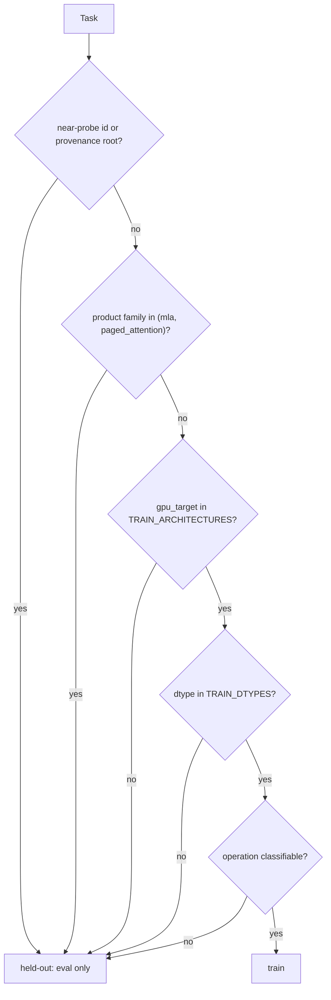
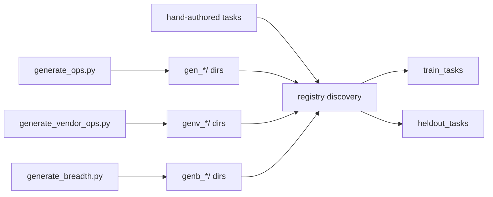

# `kore/tasks` — kernel task registry

Every RL "environment instance" is a **kernel-optimization task**: a Triton kernel to make fast, an fp32 **reference oracle** for correctness, a declared **comparison baseline** to beat (a production vendor kernel for ~100 tasks, torch for the rest — see [Baselines](#baselines)), a set of evaluation **shapes**, and a driver contract the verifier speaks. Tasks are discovered from `<task_id>/task.yaml` directories. Hand-authored, `gen_*`, `genv_*`, and `genb_*` task assets are all checked in and ship in release artifacts.

`registry.all_tasks()` is the source of truth. Derive the live totals and group
breakdown directly from the generated registry:

```bash
python - <<'PY'
from collections import Counter
from kore.tasks import registry

tasks = registry.all_tasks()
group = lambda t: next((p for p in ("genb_", "genv_", "gen_") if t.task_id.startswith(p)), "hand")
print("registry:", len(tasks), Counter(group(task) for task in tasks))
print("split:", {"train": len(registry.train_tasks()), "heldout": len(registry.heldout_tasks())})
PY
```

The registry also defines the **authoritative train / held-out split** by operator family and architecture, so generalization can never be leaked.

---

## Files

| File | Purpose |
| --- | --- |
| `base.py` | Task ABI: `Shape`, `Task`, `Task.from_dir()` — parses `task.yaml` |
| `registry.py` | Discovery, `operator_family`, `is_heldout`, `split_tasks`, `all_tasks`, `get_task` |
| `augment.py` | Deterministic shape augmentation (scale factors + an odd non-aligned shape) |
| `audit.py` | Live data-scale audit from the registry |
| `_genops.py` | Operator spec registry + `make_reference`, `seed_source`, generic `driver_main` |
| `generate_ops.py` | Writes `gen_<op>_<dtype>/` tasks (framework/torch baseline) |
| `vendor_ops.py` | Vendor-baselined op templates vs. real AITER kernels |
| `generate_vendor_ops.py` | Writes `genv_<op>_<dtype>/` tasks |
| `generate_breadth.py` | Writes `genb_<op>_<dtype>/` tasks from the `breadth/` engines |
| `breadth/` | Auto-discovered op-class authoring engines (+ CPU tests) for the `genb_*` expansion |
| `aiter_ref.py`, `aiter_ref_attn.py` | Shared AITER / hipBLASLt / framework baseline wrappers |
| `<task_id>/` | Per-task dir: `task.yaml`, `reference.py`, `seed_triton.py`, `driver.py` |

---

## The task contract

A task directory contains:

| File | Role |
| --- | --- |
| `task.yaml` | metadata + shapes (`minimal` / `primary` / `validation[]`), `snr_threshold`, `comparison_baseline` |
| `reference.py` | `parse_shape`, `get_inputs`, `ref_fn` (fp32 oracle), `baseline_fn` (production bar) |
| `seed_triton.py` | a compiling Triton starter the policy edits |
| `driver.py` | prints `SNR:`, `allclose:`, `median_ms:` — hand-authored or a shim to `_genops.driver_main` |

```python
@dataclass(frozen=True)
class Shape:
    name: str
    dims: dict[str, int]          # e.g. {"M": 4096, "N": 4096, "K": 4096}

@dataclass
class Task:
    task_id: str; operation: str; dtype: str; backend: str; gpu_target: str
    seed_kernel_name: str; snr_threshold: float; comparison_baseline: str
    shapes: list[Shape]; raw: dict
    @classmethod
    def from_dir(cls, d: Path) -> "Task"
```

---

## Train / held-out split

The sole authority is [`kore/tasks/taxonomy.py`](taxonomy.py). It is deliberately **not**
environment-overridable, so a manifest means the same thing in every process.

```python
TRAIN_ARCHITECTURES        = {"gfx950", "gfx942"}          # no env override
WHOLE_FAMILY_HOLDOUTS      = frozenset({"mla", "paged_attention"})
NEAR_GENERALIZATION_TASK_IDS = {...}                       # 43 stratified probes
```

Live split: **1,289 train / 45 eval** of 1,334 registered tasks — 43 `near_probe` plus the
2 `whole_family` members. `taxonomy_version = 1.0.0`.

`split_decision` evaluates six conditions **in precedence order**; the first match wins:

1. `task_id` is a near-generalization probe → eval, reason `near_probe`
2. its `provenance_root` is a probe → eval, reason `heldout_lineage`
3. its product family is in `WHOLE_FAMILY_HOLDOUTS` → eval, reason `whole_family`
4. `gpu_target` outside `TRAIN_ARCHITECTURES` → eval, reason `foreign_arch`
5. `dtype` outside `TRAIN_DTYPES` → eval, reason `foreign_dtype`
6. unclassifiable operation → eval, reason `unclassified_operation`

otherwise train. Order matters: the lineage and reserved-family checks precede arch and dtype, so a
held-out task cannot be relabelled by editing its arch tag. Unknown identity always resolves to
eval, never train.


```mermaid
flowchart TD
  T[Task] --> P{near-probe id or provenance root?}
  P -->|yes| HO[held-out: eval only]
  P -->|no| F{"product family in (mla, paged_attention)?"}
  F -->|yes| HO
  F -->|no| A{"gpu_target in TRAIN_ARCHITECTURES?"}
  A -->|no| HO
  A -->|yes| D{"dtype in TRAIN_DTYPES?"}
  D -->|no| HO
  D -->|yes| C{operation classifiable?}
  C -->|no| HO
  C -->|yes| TR[train]
```

**The split is content-addressed.** `taxonomy_digest` is a SHA-256 over a canonical payload
containing every live task's `(operation, dtype, architecture, product_family, analysis_family,
split, reason, provenance_root)`. Adding, removing, or reclassifying any single task changes the
digest, and `validate_split_manifest` raises `StaleSplitManifestError` on any drift.

> **Conditions 4–6 are currently unreachable in practice.** All 1,334 tasks are `gfx950` and every
> live dtype is in `TRAIN_DTYPES`, and the registry raises on an unclassifiable operation before the
> branch is reached. `provenance_root` likewise defaults to `task_id` for every task, so condition 2
> is correct-by-vacuity rather than exercised. They are retained as fail-closed guards.

**Core attention is trained, not held out.** Flash-attention prefill / decode / sliding-window / varlen / fp8 all train, so the product model is strong at attention. Only the two *structurally distinct* families are withheld to measure genuine cross-family transfer: **MLA** (DeepSeek latent attention) and **paged-KV decode** (a different KV-cache mechanism).

**Why family-level, not task-level.** Reserving whole families (not just the two seed task ids) keeps any generated or mined MLA/paged variant out of training by its family, closing the last leakage path. `operator_family` therefore classifies `mla`/`paged` **before** the generic `attn` catch, so those variants never fall through into the trained `attention` bucket.

**Why deterministic.** The held-out set is a pure function of family + arch, independent of any seed, so datagen can exclude it with no seed coordination. `split_tasks(seed)` returns `{"train", "heldout", "seed"}`; `seed` only reorders *within* a split (for sharding / CV folds) and never moves a task across the boundary.

**Why gfx942 stays in train.** gfx942/CDNA3 shares the hardware lineage with the gfx950/CDNA4 target and runs correctly on-node, so previous-gen-tagged tasks and any in-flight gfx942 datagen keep training instead of being retroactively held out when the primary arch advanced to gfx950. A truly foreign arch (gfx1100, NVIDIA) is still held out.

> **One authority, two levels.** `taxonomy.py` defines 18 `product_family` leaves (the split
> authority) which roll up to 14 `analysis_family` parents (reporting and leave-one-family-out),
> plus a third `mutation_family` axis for `kore/data/mutate.py`. `kore.eval.generalization.classify`
> now *delegates* to the same authority rather than maintaining its own classifier, so the two can
> no longer drift. The only remaining independent classifier is a coarse 3-bucket substring match in
> `scripts/spur_partition.py` used solely for cost biasing; it is non-authoritative.

---

## Authoring new tasks


```mermaid
flowchart LR
  GO[generate_ops.py] --> GEN["gen_*/ dirs"]
  GVO[generate_vendor_ops.py] --> GENV["genv_*/ dirs"]
  GB[generate_breadth.py] --> GENB["genb_*/ dirs"]
  HAND[hand-authored tasks] --> REG
  GEN --> REG[registry discovery]
  GENV --> REG
  GENB --> REG
  REG --> TRAIN[train_tasks]
  REG --> HOLD[heldout_tasks]
```

- `_genops.py` defines operators across the `unary`, `binary`, `reduce`, `fusion` (multi-kernel headroom), and `gemm_fusion` (hipBLASLt + epilogue headroom) families.
- `generate_ops.py` emits `gen_<op>_<dtype>/` tasks with a torch/framework baseline, expanding supported operators across `bf16`/`fp16`/`fp32`.
- `generate_vendor_ops.py` emits `genv_<op>_<dtype>/` tasks graded against real AITER kernels with LLM-realistic shape tables.

---

## Breadth op-class generators

`kore/tasks/breadth/` holds auto-discovered op-class authoring engines for attention, MoE, GEMM, norm, quant, reduction, convolution, scan/SSM, sequence, sort/sparse, sampling, and training-op families. Each engine exposes the shared ABI (`OPS`, `SHAPES`, `make_reference`, `seed_source`) and ships CPU-side tests under `breadth/tests/`.

`generate_breadth.py` auto-discovers every conformant engine and writes `genb_<op>_<dtype>/` dirs, each with a `task.yaml`, a naive-but-correct Triton seed, and thin `reference.py`/`driver.py` shims. Ask the generator for the current breadth instead of copying a count into documentation:

```bash
python -m kore.tasks.generate_breadth --list   # dry-run: list the genb_* ids
python -m kore.tasks.generate_breadth          # write the dirs into this checkout
```

Generation is idempotent and its current outputs are checked in. Registry discovery globs `*/task.yaml`, so regenerated `genb_*` dirs are picked up with no code edits. Only run it on a node whose task suite you intend to update — never on a node whose in-flight run must keep a frozen task set.

---

## Baselines

**There are two baseline lanes, and a speedup means different things in each.** Measured across all
1,334 `task.yaml` files: **1,259 declare a `torch_*` baseline**, 64 declare AITER, 3 declare
hipBLASLt, and 8 declare something else. At runtime `_genops._vendor_baseline` additionally upgrades
33 `gemm_fusion` tasks to hipBLASLt (via `torch.matmul` / `torch._scaled_mm`) and 2 gated activations
to AITER when `KORE_USE_VENDOR_BASELINE=1` (the default).

| Lane | Tasks | Baseline | What a >1× result means |
| --- | ---: | --- | --- |
| Vendor | ~100 | AITER / hipBLASLt CK kernels | beats the state of practice — citable |
| Breadth | ~1,234 | torch (`torch.compile`-fused if `KORE_COMPILE_BASELINE=1`, else eager) | beats PyTorch — not a vendor claim |

`aiter_ref.py` / `aiter_ref_attn.py` wrap the AITER ops (`aiter_rms_norm`, `flash_attn_func`,
`fused_moe`, `paged_attention_rocm`, …) and hipBLASLt for GEMM.

> **Every AITER wrapper silently degrades to torch on import or signature failure**, emitting a
> one-time `KORE_BASELINE_IMPL:<impl>` stderr sentinel. That sentinel is consumed only by the offline
> analysis harness (`kore/analysis/p0_sol.py`) — **not** by the env or reward path. On a node where
> the AITER JIT build fails, a task declaring a vendor baseline is therefore graded against torch.
> `WinRecord.baseline_type` is the field that records which baseline actually produced a stored win;
> read it before pooling numbers across lanes.

> **~94 sequence/SSM tasks declare a baseline that is an eager Python `for t in range(L)` recurrence**
> over 2,048–8,192 timesteps. A correct fused Triton kernel beats that by orders of magnitude. Those
> ratios are real as measured and meaningless as claims.

> fp8 e4m3 is arch-selected by `aiter_ref.FP8_DTYPE`: OCP `e4m3fn` on gfx950/CDNA4 (MI350X/MI355X — the native format and this node's default), FNUZ `e4m3fnuz` on gfx942/CDNA3. Override with `KORE_FP8_ENCODING=ocp|fnuz`.

---

## Hardware verification status

Until 2026-08-01 no `genb_*` task had ever had a kernel compiled against it on the
target architecture — the 1,052 generated breadth tasks were admitted by a CPU-side
AST and anti-hack scan only. `scripts/verify_tasks_gpu.py` now executes every task's
committed seed through its own `driver.py` on real hardware and records a per-task
verdict in `data/gfx950_task_verification.json`.

Current sweep (MI350X / gfx950, 1,052 tasks):

| Verdict | Tasks | Share |
| --- | ---: | ---: |
| `PASS` — seed correct at its declared SNR gate | 948 | 90.1% |
| `FAIL_CORRECTNESS` | 100 | 9.5% |
| `INFRA` — resource fault, **not** a task defect | 4 | 0.4% |

The 100 correctness failures are not uniform, and the split is what matters:

- **73 have SNR at or ABOVE their declared gate** (30.2–92.0 dB) and fail only
  `torch.allclose`'s elementwise tolerance. The drivers hard-code `atol=rtol=1e-2`,
  which is fp32-calibrated; applied to bf16/fp16/fp8 outputs it rejects kernels the
  SNR gate accepts (e.g. a bf16 attention-backward at 57.9 dB failing on
  `max_diff 0.03125`). This is a tolerance-calibration defect, not wrong math.
- **15 report −999 dB** (zero signal: structurally broken), concentrated in
  sliding-window attention (`genb_attn2_window*`). All 15 are `max_diff: inf`.
- **11 fall short of their gate** by more than 5 dB (4.7–24.6 dB against 30/40 dB
  gates) and are genuinely incorrect.
- **1 sits within 5 dB of its gate** (`genb_red_topk256_fp16`, 29.67 dB vs 30.0).

A previous sweep recorded 937 pass / 111 fail. Twelve of those failures were an
`AttributeError` on `tl.math.tanh`, which Triton 3.6 removed — a toolchain break,
not a task defect. Replacing it with the repo's libdevice-free `2·sigmoid(2x) − 1`
form (max abs error 1.79e-07 vs `torch.tanh`) recovered **11 tasks with zero
regressions**.

The 4 `INFRA` cases are all 256-expert MoE at `D=4096, I=14336`. Their expert weights
are ~60 GB per tensor in bf16, and `_randn` stages an fp32 buffer (plus a second for
`* scale`) before downcasting — ~240 GB transient on a 252 GiB card. This is a
shape-authoring defect, not a node fault; `_fused_moe_fp32` was fixed to cast one
expert at a time (bit-identical, 168 GB → 84 GB) but the input-generation staging
remains. Chunking `_randn` would change the seeded RNG stream for every task in the
suite, so it needs deliberate treatment.

**Treat a task's verdict as evidence, not as eligibility.** Nothing yet gates training
on this artifact; the registry still admits all 1,289 train tasks. Wiring the verdict
into eligibility is tracked work.

Reproduce:

```bash
python scripts/verify_tasks_gpu.py --out report.json --gpus 0,1,2,3,4,5 --prefix genb_
```

It exits non-zero on task defects only — an infra fault cannot launder a broken corpus
into a green verification.

---

## Environment variables

| Variable | Effect |
| --- | --- |
| `KORE_SHAPE_AUGMENT` | expand shapes via `augment_shapes` |
| `KORE_COMPILE_BASELINE` | `torch.compile`-fused baseline for fusion / gemm_fusion families |
| `KORE_VERIFIED_CORRECTNESS` | enable the adversarial input battery in the driver |
| `KORE_CORRECTNESS_TRIALS` | min reseeded correctness trials (default 5) |
| `KORE_BENCH_COLD` | L2-flush between timed iters (default 1) |
| `GPU_TARGET` | arch for Triton/HIP compilation |

---

## Gotchas

- `minimal` shapes are **correctness-only** — they are launch-overhead-bound, so the roofline analysis excludes them from `η` correlation.
- Registry discovery is **lazy-import-safe**: AITER/torch are imported only inside wrappers, so listing tasks never needs a GPU.
- `mutates_input` ops (e.g. `fused_add_rmsnorm`) clone inputs each bench call for fair timing.

See also: [`env`](../env/README.md) (how tasks are executed), [`analysis`](../analysis/README.md) (roofline over `task.operation`), [`reward`](../reward/README.md).
