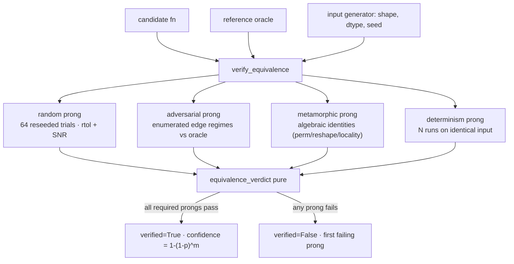

# `kore/verify` — the correctness oracle

The "verifiable" half of KORE's verifiably-grounded reward. Random-input checking has **lucky passes**: a kernel wrong only on a measure-zero slice of the input domain (exact zeros, denormals, inf-adjacent saturation, all-equal rows, activation kinks) sails through `torch.randn` trials. This package replaces that with a **four-prong equivalence oracle** that is far harder to reward-hack.

---

## Files

| File | Purpose |
| --- | --- |
| `equivalence.py` | The oracle: `verify_equivalence` (orchestration) + `equivalence_verdict` (pure) + `Tolerance` |
| `adversarial.py` | Deterministic structured-input battery (the provable half) |
| `metamorphic.py` | Algebraic self-consistency relations (structural cheat detection) |
| `__init__.py` | Public API re-exports |

---

## Four prongs



| Prong | Kind | What it catches |
| --- | --- | --- |
| Random | statistical | typical-input errors; false-accept bounded by `(1-p)^m` |
| **Adversarial** | **provable** | wrong on zeros/denormals/overflow/activation-knots/sparse-spikes |
| **Metamorphic** | **provable** | structural cheats (e.g. a "pointwise" kernel that secretly reduces) |
| **Determinism** | **provable** | race conditions / nondeterministic output |

"Provable" = fixed, enumerated inputs → a kernel wrong on any enumerated regime is rejected with certainty ("no lucky pass") for the checkable op class.

---

## API

```python
@dataclass(frozen=True)
class Tolerance:
    rtol=3e-3; atol=1e-4; snr_db_min=50.0
    determinism_rtol=1e-5; determinism_snr_db_min=80.0
    metamorphic_rtol=6e-3; metamorphic_snr_db_min=46.0
    reference_defect_fraction=1e-4

def verify_equivalence(candidate_fn, reference_fn, input_gen, dtype="fp32", *,
                       op_class="elementwise", n_random=64, n_determinism=3,
                       adversarial=True, metamorphic=True, seed0=0) -> VerificationResult
def equivalence_verdict(prong_results, tol) -> VerificationResult          # pure, CPU-testable
def false_accept_probability(defect_fraction, n_elements) -> float          # (1-p)^m
```

**Adversarial patterns** (`adversarial.py`): `zeros`, `ones`, `neg_ones`, `all_equal_const`, `large_pos/neg`, `small_pos`, `denormal`, `signed_ramp`, `sign_alternating`, `sparse_spikes`, `inf_adjacent_pos/neg`, `activation_knots` (0, ±1, ±3, ±6, ±0.5, 2.0), `mixed_magnitude` — emitted per operand slot for multi-arg ops.

**Metamorphic relations** (`metamorphic.py`): elementwise → row/col permutation, locality, reshape invariance; reduction → permutation invariance/equivariance, locality; generic → none (no safe identity).

---

## Production wiring

The full 64-trial + metamorphic oracle in this package is the strongest path. In production the driver activates the enumerated adversarial battery via `KORE_VERIFIED_CORRECTNESS=1` (see [`kore/tasks`](../tasks/README.md) `_genops.py`); the champion re-eval gate ([`kore/eval`](../eval/README.md)) turns it on at maximum scrutiny. `equivalence_verdict` is a pure function over arrays, so the decision logic is unit-tested without a GPU.

See also: [`env`](../env/README.md) (where correctness gates reward), [`reward`](../reward/README.md).
