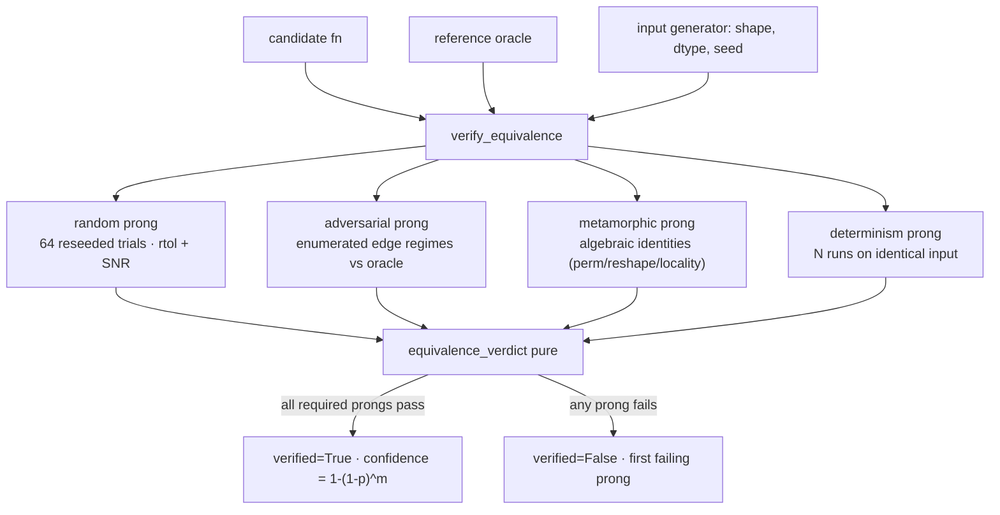

# `kore/verify` — the correctness oracle

The verifiable half of KORE's reward. A single random-input SNR check admits **lucky passes**: a kernel that is wrong only on a measure-zero slice of the input domain — exact zeros, denormals, inf-adjacent saturation, all-equal rows, activation kinks — sails through `torch.randn` trials. This package replaces that check with a **four-prong equivalence oracle**: a kernel wrong on any enumerated regime is rejected with certainty.

The decision logic (`equivalence_verdict`) is a pure function over candidate/reference output arrays, so the entire accept/reject behavior is unit-tested on CPU with numpy. `torch` is imported lazily, only on the GPU-facing orchestration paths.

---

## Files

| File | Purpose |
| --- | --- |
| `equivalence.py` | The oracle: `verify_equivalence` (orchestration) + `equivalence_verdict` (pure verdict) + `Tolerance` + the `(1-p)^m` false-accept bound |
| `adversarial.py` | Deterministic structured-input battery, plus the optional co-evolutionary search that grows it |
| `metamorphic.py` | Algebraic self-consistency relations per operator class |
| `adversarial_hook.py` | Throttled GRPO-loop bridge + per-`(op, dtype)` accumulated-battery registry (opt-in) |
| `__init__.py` | Public API re-exports |

---

## Four prongs



| Prong | Kind | What it catches |
| --- | --- | --- |
| **Random** | statistical | typical-input errors; residual false-accept bounded by `(1-p)^m` |
| **Adversarial** | deterministic | wrong on zeros / denormals / overflow / activation knots / sparse spikes |
| **Metamorphic** | deterministic | structural cheats (e.g. a "pointwise" kernel that secretly reduces) |
| **Determinism** | deterministic | race conditions / nondeterministic output |

**Provable vs statistical.** For the checkable op class — pure elementwise unary/binary maps and order-invariant per-row reductions — the three deterministic prongs re-run the same fixed inputs every time, so a kernel that is wrong on any enumerated regime, violates any metamorphic identity, or is nondeterministic is rejected **with certainty**. This closes the lucky-pass class on those regimes. For value-dependent defects that survive every deterministic prong, the random prong bounds the residual statistical false-accept at `(1-p)^m` over `m` in-tolerance element comparisons (millions of comparisons across 64 trials), so even a `p = 1e-4` defect is caught with overwhelming probability. Floating-point kernels are not bit-exact against an fp64 oracle, so the verdict is tolerance-based, not a formal proof of functional equality.

---

## API

```python
@dataclass(frozen=True)
class Tolerance:
    rtol=3e-3; atol=1e-4; snr_db_min=50.0
    determinism_rtol=1e-5; determinism_snr_db_min=80.0
    metamorphic_rtol=6e-3; metamorphic_snr_db_min=46.0
    reference_defect_fraction=1e-4

def tolerance_for(dtype) -> Tolerance          # relaxes bounds for bf16 / fp16 / fp8 / fp4 storage

def verify_equivalence(candidate_fn, reference_fn, input_gen, dtype="fp32", *,
                       shape=None, op_class="elementwise", arity=None,
                       n_random=64, n_determinism=3, device="cpu", tol=None,
                       adversarial=True, metamorphic=True,
                       adversarial_inputs_fn=None, seed0=0) -> VerificationResult
def equivalence_verdict(prong_results, tol) -> VerificationResult   # pure, CPU-testable
def false_accept_probability(defect_fraction, n_elements) -> float  # (1-p)^m
```

`VerificationResult` carries the headline `verified` flag, a `confidence = 1 - false_accept_bound`, the worst per-element relative error and worst SNR, per-prong verdicts, and the first failing prong on rejection. Comparison is strict on non-finite values: a candidate must reproduce the reference's `nan` / `±inf` positions (and inf signs) exactly.

**Adversarial patterns** (`adversarial.py`): `zeros`, `ones`, `neg_ones`, `all_equal_const`, `large_pos/neg`, `small_pos`, `denormal`, `signed_ramp`, `sign_alternating`, `sparse_spikes`, `inf_adjacent_pos/neg`, `activation_knots` (`0, ±1, ±3, ±6, ±0.5, 2.0`), `mixed_magnitude` — emitted per operand slot for multi-arg ops, with dtype-aware magnitudes so the "big" regime stresses without gratuitously overflowing a correct kernel.

**Metamorphic relations** (`metamorphic.py`): elementwise → row/column permutation equivariance, locality, reshape invariance; reduction → column-permutation invariance, row-permutation equivariance, row locality; generic → none (no safe structural identity assumed).

---

## Adaptive adversarial battery (optional)

The hand-curated battery can only reject a kernel that is wrong on a regime someone enumerated. `adversarial.py` adds a minimal-criterion co-evolution (`coevolve_tests`) that evolves parametric test-case genomes to **break** currently-passing kernels, escalating into thin regimes a fixed prior never samples (kink neighborhoods, deep subnormals, extreme magnitudes, near-ties, sparse spikes). Discovered breaks are folded back into the deterministic battery (`fold_breaking_cases` → `verify_equivalence(..., adversarial_inputs_fn=...)`), after which the oracle rejects that defect with certainty. `random_search` is the undirected control for quantifying the search's advantage at equal budget.

`adversarial_hook.py` bridges this into the GRPO loop as a throttled, fail-safe hook (opt-in via `KORE_ADVERSARIAL_COEVOLVE=1`) backed by a per-`(op, dtype)` registry that accumulates discovered regimes across steps. The whole search is pure CPU data — the caller injects how a candidate is run — so it never touches a GPU or the environment itself.

---

## Production wiring

`equivalence_verdict` is a pure function over arrays, so the decision logic is unit-tested without a GPU. In production the driver activates the enumerated adversarial battery via `KORE_VERIFIED_CORRECTNESS=1` (`kore/tasks/_genops.py`), which rejects a kernel that is correct on random inputs but wrong at an enumerated regime such as `x == 0`. The champion re-eval gate ([`kore/eval`](../eval/README.md)) turns it on at maximum scrutiny, with the determinism re-check and extra reseeded trials.

See also: [`env`](../env/README.md) (where correctness gates reward), [`reward`](../reward/README.md), [`tasks`](../tasks/README.md).
