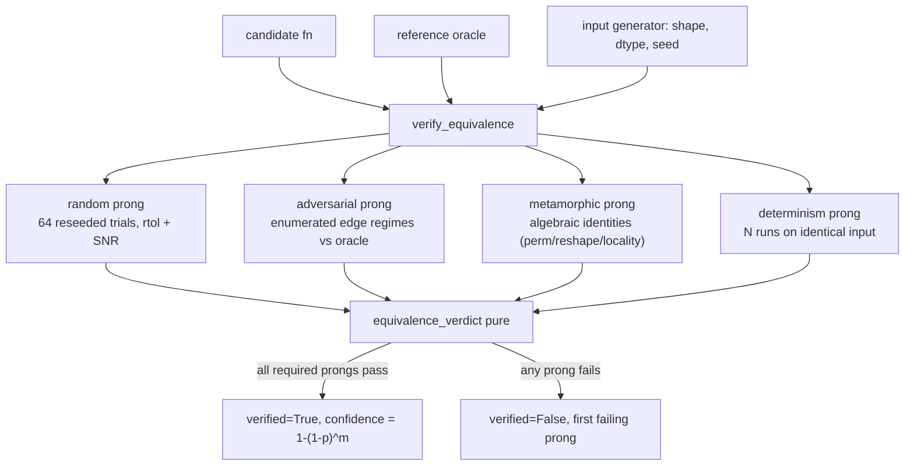

# `kore/verify`: the correctness oracle

This package is the verifiable half of KORE's reward. The shipped correctness gate
(`kore/reward/reward.py` plus `kore/env/kore_env.py`) accepts a candidate kernel
once it clears an SNR threshold on a handful of reseeded random trials plus a
determinism re-check. That gate is cheap and effective, but a single random-input
check admits two classes of reward hack:

* **Lucky pass.** A kernel that is wrong only on a measure-zero slice of the input
  domain (exact zeros, denormals, inf-adjacent saturation, all-equal rows,
  activation kinks) sails through `torch.randn` trials that essentially never land
  in that slice.
* **Structural cheat.** A kernel whose output depends on where an element sits
  rather than only on its value agrees with the oracle on every sampled value,
  because random sampling never varies the layout.

This package answers both with a **four-prong equivalence oracle**: many reseeded
random trials, a deterministic adversarial battery, deterministic metamorphic
identities, and a determinism check.

The decision logic (`equivalence_verdict`) is a pure function over candidate and
reference output arrays, so the entire accept/reject behavior is unit-tested on
CPU with numpy. `torch` is imported lazily, only on the GPU-facing orchestration
paths, so importing this package never requires a GPU.

All four prongs run in production. See [Production wiring](#production-wiring)
for exactly where each one executes, what gates it, and which task families the
metamorphic prong is allowed to judge (it is deliberately not every task). A
fifth mechanism, the coevolutionary adversarial search, is implemented and
unit-tested but is not currently invoked by the training loop; see
[Coevolutionary adversarial search](#coevolutionary-adversarial-search)
for its actual status.

---

## Files

| File | Purpose |
| --- | --- |
| `equivalence.py` | The oracle: `verify_equivalence` (orchestration) plus `equivalence_verdict` (pure verdict), `Tolerance`, and the `(1-p)^m` false-accept bound |
| `adversarial.py` | Deterministic structured-input battery, plus the optional coevolutionary search that grows it |
| `metamorphic.py` | Algebraic self-consistency relations per operator class |
| `production.py` | Production wiring: which task families have a proven relation set, the runner wire protocol, and the consumer-visible `OracleReport` |
| `runner.py` | Production wiring: the GPU-side metamorphic prong that `KoreEnv` executes per candidate |
| `adversarial_hook.py` | Throttled, fail-safe bridge for the coevolutionary search plus a per-`(op, dtype)` accumulated-battery registry (built and tested, not yet called by the training loop) |
| `__init__.py` | Public API re-exports |

---

## Four prongs


```mermaid
flowchart TD
  A[candidate fn] --> B[verify_equivalence]
  R[reference oracle] --> B
  IG[input generator: shape, dtype, seed] --> B
  B --> P1["random prong<br/>64 reseeded trials, rtol + SNR"]
  B --> P2["adversarial prong<br/>enumerated edge regimes vs oracle"]
  B --> P3["metamorphic prong<br/>algebraic identities (perm/reshape/locality)"]
  B --> P4["determinism prong<br/>N runs on identical input"]
  P1 & P2 & P3 & P4 --> V[equivalence_verdict pure]
  V -->|all required prongs pass| OK["verified=True, confidence = 1-(1-p)^m"]
  V -->|any prong fails| REJ["verified=False, first failing prong"]
```

| Prong | Kind | What it catches |
| --- | --- | --- |
| **Random** | statistical | typical-input errors; residual false-accept bounded by `(1-p)^m` |
| **Adversarial** | deterministic | wrong on zeros, denormals, overflow, activation knots, sparse spikes |
| **Metamorphic** | deterministic | structural cheats (for example a "pointwise" kernel that secretly reduces) |
| **Determinism** | deterministic | race conditions or nondeterministic output |

**Provable versus statistical.** For the checkable op class (pure elementwise
unary/binary maps and order-invariant per-row reductions), the three
deterministic prongs re-run the same fixed inputs every time, so a kernel that is
wrong on any enumerated regime, violates any metamorphic identity, or is
nondeterministic is rejected with certainty. This closes the lucky-pass class on
those regimes. For value-dependent defects that survive every deterministic
prong, the random prong bounds the residual statistical false-accept at
`(1-p)^m` over `m` in-tolerance element comparisons (millions of comparisons
across 64 trials), so even a `p = 1e-4` defect is caught with overwhelming
probability. Floating-point kernels are not bit-exact against an fp64 oracle, so
the verdict is tolerance-based, not a formal proof of functional equality.

---

## API

```python
@dataclass(frozen=True)
class Tolerance:
    rtol=3e-3; atol=1e-4; snr_db_min=50.0
    determinism_rtol=1e-5; determinism_snr_db_min=80.0
    metamorphic_rtol=6e-3; metamorphic_snr_db_min=46.0
    reference_defect_fraction=1e-4

def tolerance_for(dtype) -> Tolerance          # relaxes bounds for bf16 / fp16 / fp8 / fp4 storage

def verify_equivalence(candidate_fn, reference_fn, input_gen, dtype="fp32", *,
                       shape=None, op_class="elementwise", arity=None,
                       n_random=64, n_determinism=3, device="cpu", tol=None,
                       adversarial=True, metamorphic=True,
                       adversarial_inputs_fn=None, seed0=0) -> VerificationResult
def equivalence_verdict(prong_results, tol) -> VerificationResult   # pure, CPU-testable
def false_accept_probability(defect_fraction, n_elements) -> float  # (1-p)^m
```

`VerificationResult` carries the headline `verified` flag, a
`confidence = 1 - false_accept_bound`, the worst per-element relative error and
worst SNR, per-prong verdicts, and the first failing prong on rejection.
Comparison is strict on non-finite values: a candidate must reproduce the
reference's `nan` and `+/-inf` positions (and inf signs) exactly.

**Adversarial patterns** (`adversarial.py`): `zeros`, `ones`, `neg_ones`,
`all_equal_const`, `large_pos`/`large_neg`, `small_pos`, `denormal`,
`signed_ramp`, `sign_alternating`, `sparse_spikes`, `inf_adjacent_pos`/`neg`,
`activation_knots` (`0, +-1, +-3, +-6, +-0.5, 2.0`), `mixed_magnitude`, emitted
per operand slot for multi-arg ops, with dtype-aware magnitudes so the "big"
regime stresses without gratuitously overflowing a correct kernel.

**Metamorphic relations** (`metamorphic.py`): elementwise maps to row/column
permutation equivariance, locality, and reshape invariance; reductions map to
column-permutation invariance, row-permutation equivariance, and row locality;
generic maps to no relations (no safe structural identity assumed).

---

## Coevolutionary adversarial search

The hand-curated battery can only reject a kernel that is wrong on a regime
someone enumerated. `adversarial.py` adds a minimal-criterion coevolution
(`coevolve_tests`) that evolves parametric test-case genomes to break
currently-passing kernels, escalating into thin regimes a fixed prior never
samples (kink neighborhoods, deep subnormals, extreme magnitudes, near-ties,
sparse spikes). Discovered breaks are folded back into the deterministic battery
(`fold_breaking_cases` feeding `verify_equivalence(..., adversarial_inputs_fn=...)`),
after which the oracle rejects that defect with certainty. `random_search` is the
undirected control for quantifying the search's advantage at equal budget.

`adversarial_hook.py` implements a throttled, fail-safe bridge for this search
(gated by `KORE_ADVERSARIAL_COEVOLVE=1`) backed by a per-`(op, dtype)` registry
that accumulates discovered regimes across calls, and it is fully unit-tested
(`kore/verify/tests/test_adversarial_hook.py`). It is not, however, called from
anywhere in `kore.policy.grpo` or `kore.env.kore_env` as of this reading: the
GRPO config carries an `adversarial_coevolve` flag that is recorded as an
"invoked feature" for telemetry, and every shipped recipe sets it `false` with
a comment noting the hot-path cost. Turning the flag on today does not run any
coevolution; an orchestrator would need to call `maybe_coevolve(...)` per
rollout group and thread `get_adversarial_inputs_fn(op, dtype)` into the
verifier's `adversarial_inputs_fn=` argument. Until that wiring exists, the
production correctness gate runs on the fixed enumerated battery only. The
search itself is pure CPU data (the caller injects how a candidate is run), so
wiring it in would never touch a GPU or the environment directly.

---

## Production wiring

`verify_equivalence` above is the *reference* oracle: it owns the four prongs end
to end and is the surface the CPU unit tests drive. Production does not call it,
because production already has its own random/adversarial/determinism machinery
inside the task driver and the environment. What production consumes from this
package is the decision logic (`equivalence_verdict`, `compare_pair`,
`Tolerance`), the metamorphic relations, and the false-accept bound.

### Where each prong actually runs

| Prong | Runs in | Gate | Evidence the environment reads |
| --- | --- | --- | --- |
| **Random** | task driver (`kore/tasks/_genops.py::_run_correctness`) | always | `SNR:` / `allclose:` on driver stdout, last match |
| **Adversarial** | task driver, same verdict line | `KORE_VERIFIED_CORRECTNESS=1` | same verdict line; `ADVERSARIAL_FAIL[<regime>]` names a failing regime |
| **Metamorphic** | `kore.verify.runner`, a separate subprocess in the environment's staged workdir | `KORE_VERIFIED_CORRECTNESS=1` (override: `KORE_METAMORPHIC=0/1`) | `SNR:` / `allclose:` on the runner's stdout, last match; `KORE_METAMORPHIC: {...}` for diagnostics |
| **Determinism** | `KoreEnv._run` (identical-input re-run) plus the driver's post-timing re-verification | `CONFIG.verifier_determinism_check` | SNR drift versus `determinism_snr_tol_db` |

`KoreEnv.last_oracle_report` publishes one `ProngStatus` per prong (`pass`,
`fail`, `off`, `not-applicable`, `inconclusive`, or `unknown`) with the exact
evidence source for each, plus the `(1-p)^m` bound. The same payload is emitted
as an `oracle_report` JSONL event. Only `pass`/`fail` count as evidence:
`OracleReport.live_prongs()` is how a consumer checks that a verdict really was
four-pronged for a given candidate.

### Where the metamorphic prong is allowed to judge

A relation that is not implied by the operator contract would false-reject
honest kernels, which is strictly worse than not running, so
`metamorphic_plan_for_task` is fail-closed. It only plans the
`kore/tasks/_genops` generator source families, whose semantics are fixed by the
generator spec rather than inferred from a name, and it cross-checks the family
against the versioned taxonomy authority (`kore/tasks/taxonomy.py`) so a
taxonomy change disables the prong rather than silently repurposing it:

| genops family | op class | why |
| --- | --- | --- |
| `unary`, `binary`, `fusion` | `elementwise` | `[M,N] -> [M,N]` applied independently per element |
| `reduce` | `reduction` | `[M,N] -> [M]`, order-invariant per row |
| `gemm_fusion` | none | a K-contraction satisfies none of the generic relations |
| everything else (`genb_*`, `genv_*`, hand-authored) | none | arbitrary layouts (attention, conv, MoE, SSM); no proven identity |

Storage dtypes are limited to `fp32`/`fp16`/`bf16` (quantized operands carry
scale/packing structure the plain float relations do not respect). That covers
168 of the registered generated tasks, verified directly against the live
registry: `sum(metamorphic_plan_for_task(t).applicable for t in
registry.all_tasks())`. The prong runs on the smallest requested shape (the
relations are structural, so the cheapest shape is as much evidence as the
largest) and row-caps anything above `DEFAULT_MAX_ELEMENTS`, reporting the
substitution.

### Fail-closed, and unforgeable

* A prong that was supposed to run and produced no verdict (crash, timeout,
  missing verdict line) is never a pass: the evaluation is marked
  `infra_error`, so the candidate earns no correctness credit and the turn is
  dropped from training rather than scored on incomplete evidence.
* A task family with no proven relation is reported `not-applicable`, not
  `pass`. Such a candidate got a three-prong oracle and the report says so.
* The runner publishes its verdict on the driver's own `SNR:` / `allclose:`
  literals. `kore.reward.scan_for_hacks` already rejects any candidate source
  containing them (and the `atexit`/`threading`/`sys` post-verdict channels),
  and the environment takes the last match, printed after the candidate has
  finished. The `KORE_METAMORPHIC:` JSON line is diagnostic only and is
  discarded whenever it disagrees with the protected verdict, so forging it
  cannot turn a rejection into an acceptance.
* `KORE_METAMORPHIC` is not part of the replay contract. When it disagrees with
  the contract-recorded `KORE_VERIFIED_CORRECTNESS` gate, the evaluation is
  neither read from nor written to the replay cache, so a three-prong and a
  four-prong verdict can never share a cache key.

### Cost

One extra candidate-only subprocess per correct candidate (rejected candidates
never reach it), on the smallest shape, with no reference evaluation. This
package's own measurement, taken on MI350X/gfx950 with warm Triton caches,
reports +1.3 to +1.8 seconds per candidate (9.6 to 13.4% on the full
correctness-and-timing path, 15.5 to 16.1% on the correctness-only path) and
zero false rejections over all 168 planned tasks' committed seed kernels, at
both the minimal and the primary shape. This document could not independently
reproduce that measurement (no GPU access from this review); treat it as a
reported, not re-verified, figure until it is re-run.

Essentially all of that cost is the extra process (interpreter start, `import
torch`, a Triton cache hit); the relations themselves are a handful of kernel
launches. The prong lives in the environment rather than the driver only
because `kore/tasks/_genops.py` is owned elsewhere. Moving it into the driver's
existing correctness process removes the whole cost, and `metamorphic_check` is
factored so that is a small change with no logic outside this package. Inside
`_run_correctness`, after the adversarial block and before the verdict is
printed:

```python
    # Prong 3: metamorphic self-consistency. Same gate as the adversarial
    # battery; candidate-only, so it adds no reference evaluation.
    if os.environ.get("KORE_VERIFIED_CORRECTNESS") == "1":
        from kore.verify.production import op_class_for_reference
        from kore.verify.runner import metamorphic_check

        op_class = op_class_for_reference(ref)
        if op_class != "generic":
            mm = metamorphic_check(
                ref, fn, shape_spec=",".join(f"{k}={v}" for k, v in shape.items()),
                op_class=op_class, dtype=str(getattr(ref, "dtype_name", "fp32")),
                source_family=str(getattr(ref, "family", "")))
            if not mm.conclusive:
                # Fail-closed: no verdict is not a pass.
                print(f"METAMORPHIC_INCONCLUSIVE: {mm.reason}")
                ok = False
            elif not mm.verified:
                print(f"METAMORPHIC_FAIL: {mm.detail()}")
                ok = False
```

`ok` is the same flag the existing `allclose:` line is printed from, so no new
verdict channel is needed. With that in place, `KoreEnv` should skip its own
subprocess (its `_metamorphic_prong` would report `metamorphic` from the
driver's `METAMORPHIC_FAIL` marker exactly as it already does for
`ADVERSARIAL_FAIL`).

### Reading the bound

`false_accept_bound` is `(1-p)^m` at `p = 1e-4` over the `m` element comparisons
the random prong performed (trials times the summed reference-output element
count over every shape). It bounds lucky random misses only (the deterministic
prongs contribute certainty on the regimes they enumerate, not probability), and
it is `None`, with `bound_basis` saying why, whenever `m` is not known exactly.
It is worth reading: a pointwise op at the primary shape compares roughly `10^8`
values (`bound < 10^-1000`), while a per-row reduction compares only `M` values
per trial and lands near `10^-4`, which is the honest signal that its verdict
rests on the deterministic prongs rather than on sampling.

---

## Known limitations

* The metamorphic prong (168 of 1,546 registered tasks) and the four-prong
  oracle in general only cover the `_genops` elementwise/reduction families
  with a proven algebraic identity. Attention, MoE, convolution, SSM, and every
  hand-authored task run three prongs, not four, and the `OracleReport` says so
  explicitly rather than defaulting to a pass.
* The coevolutionary adversarial search is unwired: see
  [Coevolutionary adversarial search](#coevolutionary-adversarial-search).
* The on-hardware cost measurement in [Cost](#cost) is quoted from the module's
  own documentation and could not be independently re-run in this review.

See also: [`env`](../env/README.md) (where correctness gates reward),
[`reward`](../reward/README.md), [`tasks`](../tasks/README.md).
