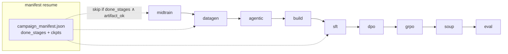
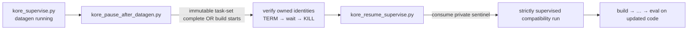

# `scripts/` — campaign orchestration and launchers

Everything needed to run KORE end to end: the campaign orchestrator, the portable conductor and tmux launchers, the FSDP launch helper, the supervision and monitoring tools, and the smoke / proof harnesses.

## Operational safety and supported entrypoints

[`operations_registry.json`](operations_registry.json) is the machine-readable
authority for script classification. It labels each entrypoint `active`,
`diagnostic`, `deprecated`, or `destructive`, and records replacements.

Production datagen uses `spur_supervise_datagen.py` →
`spur_submit_datagen.sh` → `spur_datagen_array.sbatch`. Those active SPUR files
are intentionally unchanged by the legacy safety quarantine. `complete_base.py`
and `deepen_wins.py` remain the active workers.

Retired b05, SSH, dynamic-GPU, tmux, and direct-14B wrappers refuse real
execution by default. `--help` and `--dry-run` are side-effect free. A
compatibility run requires `KORE_ALLOW_DEPRECATED_DEV=1`; destructive
`logs/reli.sh` additionally requires `KORE_ALLOW_DESTRUCTIVE_DEV=1`.

Legacy compatibility processes are tracked below a private 0700 runtime
directory (`$KORE_RUNTIME_DIR`, `$XDG_RUNTIME_DIR/kore-ops`, or
`/tmp/kore-ops-$UID`). Control state records a run ID, PID, Linux start time,
process group, uid, and cgroup. A stop verifies that complete identity, sends
TERM, waits for a bounded interval, and only then sends KILL to the same owned
group. No command-line substring process discovery is used.

---

## Files

### Orchestration and launch

| Script | Purpose |
| --- | --- |
| `run_campaign.py` | The orchestrator: 9 default stages (plus 2 opt-in, `reverify` and `evolve`), manifest resume, retention gates, and the full CLI |
| `launch_distributed.sh` | `accelerate launch` wrapper for a single FSDP stage (`midtrain` / `sft` / `dpo` / `grpo`); selects `accelerate_fsdp_grpo.yaml` for GRPO and `accelerate_fsdp.yaml` otherwise |
| `run_conductor_14b.sh` | Portable full-14B launcher — resolves the repo root from its own path, uses the project venv, and loads `.env.local` |
| `tmux_campaign.sh` | Run the conductor launcher in a durable detached tmux session (`kore14b`) |
| `run_e2e_14b.sh` | Bounded end-to-end validation run over a representative task set |
| `run_full_14b.sh` | Full-14B launcher with hardcoded dev-node paths (`/root/Kore-rl/kore`); not portable — use `run_conductor_14b.sh` |
| `run_v2_reuse_14b.sh` | Rerun that reuses existing verified kernels instead of regenerating: `reverify` (re-measure, no teacher) → `datagen` (coverage holes only) → `build` → `midtrain … eval`, pinned to specific GPUs |
| `run_grpo_resilient.sh` | GRPO launcher for a heavily shared node: selects the GPUs free right now and retries across transient VRAM spikes from other users' jobs |

### Supervision and monitoring

| Script | Purpose |
| --- | --- |
| `kore_monitor.py` | Read-only stage/health monitor: tails the live log and emits `ALERT` lines (never launches) |
| `kore_supervise.py` | Keep a `run_campaign.py --full-ft` invocation alive across transient deaths (relaunch, resume via the manifest, sparse `ALERT`s) |
| `kore_pause_after_datagen.py` | Halt the run cleanly at the `datagen → build` boundary so updated code can land before the training stages |
| `kore_resume_supervise.py` | Wait for the pause sentinel, then relaunch `build → eval` on the updated code and supervise |

### Shared-node SFT gate

| Script | Purpose |
| --- | --- |
| `run_sft_gate.py` | Standalone SFT retention gate — score the base model vs. the finished SFT checkpoint and apply the gate, with no (re)training; on PASS, mark `sft` done in the manifest |
| `run_sft_gate_dynamic.sh` | Co-tenant-safe wrapper that runs `run_sft_gate.py` on currently-idle GPUs and resumes via the per-benchmark score cache |
| `sft_finish_dynamic.sh` | Finish the campaign's `build,sft` stages on the idle GPUs of a shared node, masking to those GPUs and resuming on any death |
| `gpu_pick_hip.py` | Pick idle GPUs and report them as HIP/torch indices (rocm-smi physical order and HIP index order differ on this node) |

### Smokes and proofs

| Script | Purpose |
| --- | --- |
| `smoke_env.py` | Run every registered task's seed kernel through `KoreEnv.step` and print the verified observation + reward |
| `grpo_smoke.py` | A few real GRPO steps on one task to exercise rollout → verified reward → policy gradient |
| `sft_smoke.py` | Tiny real SFT (LoRA) run to prove the training path end to end |
| `test_amd_gateway.py` | One-call check that the Claude gateway key works |
| `_repro_grpo_step.py` | Isolated multi-process reproduction of a distributed GRPO training step (ragged per-rank samples under FSDP `SHARD_GRAD_OP`) |
| `_maxed_smoke.py` | Reduced GRPO run on one GPU that forces the search / mint / transform-discovery paths to execute |
| `eval_bakeoff_multi.py` | Matched-budget bake-off across the ladder (seed → base → midtrain → SFT → DPO, optionally vs. Opus): `fast_p`, correctness rate, geomean speedup |
| `prove_dense_reward.py` | Exercise the dense hardware-counter reward path (`env.collect_counters → roofline_dense_score`) on a real compute-bound kernel via rocprofv3 |
| `prove_new_ops.py` | GPU-prove a batch of new task seeds: compile + rigorous correctness + beat baseline; exits non-zero on any failure (a gate before registering new tasks) |
| `verify_breadth.py` | On-GPU verification for the `genb_*` breadth tasks: the seed compiles and is correct, and the baseline runs |
| `_validate_benchboth.py` | A/B check that the batched timing path (`--bench-both`) reproduces the per-impl timing's speedup distribution within run-to-run variance |

---

## The campaign orchestrator



`DEFAULT_STAGES` (9 stages, run in this order when `--stages` is omitted) is `midtrain, datagen, agentic, build, sft, dpo, grpo, soup, eval`. Midtrain runs first because continued pretraining trains on a general Triton/HIP corpus rather than the task-specific datagen output, so it has no dependency on `datagen` / `agentic` / `build`. An explicit `--stages` list is executed in the order you give it — e.g. `--stages midtrain,build,sft,dpo,grpo,soup,eval` skips `datagen` / `agentic` to reuse data generated in a prior run. The full ordered set (`ALL_STAGES`) also includes the two opt-in stages: `reverify, datagen, evolve, agentic, build, midtrain, sft, dpo, grpo, soup, eval`.

**Resume logic.** After each stage the manifest records `done_stages` and the real checkpoint path (atomic write). On restart a stage is skipped only if it is in `done_stages` **and** `_artifact_ok(stage)` finds its on-disk artifact, so a stale "done" flag with a missing checkpoint re-runs correctly. `--force --stages <s>` re-runs regardless. Datagen additionally resumes at shard level (see [`kore/data`](../kore/data/README.md)).

**Retention gates** run after `midtrain` / `sft` / `dpo` / `grpo`; a failure hard-stops the campaign (see [`kore/eval`](../kore/eval/README.md)).

**Full-FT dispatch.** Under `--full-ft`, each of `midtrain` / `sft` / `dpo` / `grpo` is rendered into a resolved JSON and shelled out to `scripts/launch_distributed.sh <stage> <resolved.json>` (`accelerate launch`); see [`configs/README.md`](../configs/README.md) for how the resolved config is built (`_launch_distributed`) and where it is written under `<data_root>/launch/`.

### Key CLI flags (defaults)

| Flag | Default | Meaning |
| --- | --- | --- |
| `--model` | `Qwen/Qwen3-14B` | base model |
| `--stages` | 9 defaults | comma-list subset of `reverify,datagen,evolve,agentic,build,midtrain,sft,dpo,grpo,soup,eval`; the default omits the opt-in `reverify` and `evolve` |
| `--dry-run` | off | import-check + print plan, no GPU / side effects |
| `--force` | off | re-run requested stages ignoring the manifest |
| `--full-ft` / `--lora` | `--lora` | full-parameter FSDP vs. LoRA bring-up |
| `--teacher` | `claude` | teacher backend |
| `--data-root` | `data` | shard + manifest root |
| `--datagen-workers` | `0` (=1/GPU) | parallel datagen concurrency |
| `--dpo-rounds` | `2` | iterative on-policy DPO rounds (>1 enables DAgger) |
| `--grpo-curriculum` | on | correctness → latency two-phase GRPO |
| `--adaptive-steps` | off | plateau early-stop for GRPO |
| `--use-hf` | off | real HF retention benches + general replay |
| `--sft-total` | `20000` | SFT mix cap |
| `--split-seed` | `0` | reorders within train / held-out (the split itself is fixed) |
| `--gpu-ids` | `""` (auto-free) | pin all GPU work to specific physical GPU ids on a shared node |
| `--profile-reward` | `0.0` | hardware-counter dense reward weight (≈`0.15` to enable) |
| `--evolve` | off | splice the evolutionary datagen stage in after `datagen` |

---

## Production datagen

Use the SPUR supervisor for resumable production data generation:

```bash
python scripts/spur_supervise_datagen.py --repo "$PWD" --python "$VIRTUAL_ENV/bin/python"
```

It submits one immutable partitioned wave at a time and returns nonzero on
scheduler failure, stalled progress, or exhausted waves. Completion is accepted
only after `_kf_verify.py` reports no remaining work.

## Deprecated direct 14B compatibility path

```bash
bash scripts/tmux_campaign.sh --help
bash scripts/tmux_campaign.sh --dry-run
```

The tmux wrapper now uses a unique run-owned session and exits its pane when the
launcher exits. Persistent result state distinguishes a completed run from a
live session; an old fixed-name shell is reported as unowned stale state and is
never killed or mistaken for training.

---

## Deprecated supervision compatibility

The legacy Python helpers remain available only for development compatibility.
They emit sparse `ALERT` and `HEARTBEAT` lines, append logs, and read only newly
appended bytes. Supervisors own one process group per run and never search for or
reap processes by username or command text.

| Script | Launches? | Scope | Role |
| --- | --- | --- | --- |
| `kore_monitor.py` | no (read-only) | any live campaign | Observe + alert only |
| `kore_supervise.py` | yes | `build..eval` by default (`KORE_SUP_STAGES` extends it, e.g. to `midtrain,datagen,...`) | Keep the run alive across deaths |
| `kore_pause_after_datagen.py` | no (stops procs) | at `datagen → build` | Halt cleanly so updated code can land |
| `kore_resume_supervise.py` | yes | `build..eval` | Resume on the updated code + supervise |

**`kore_monitor.py`** is a read-only watcher. It reads the private active-run
record, verifies PID/start-time/run-ID identity, and incrementally consumes the
owned log. It never launches or signals a process.

**`kore_supervise.py`** retries a bounded number of owned attempts. Exit code
zero alone is insufficient: the requested stages must be in the manifest and
their final artifacts must pass strict validation. Give-up, gate failure,
missing dependencies, and incomplete artifacts return nonzero.

### Swapping in updated code at the datagen → build boundary

Code changes must land **before** the build and training stages, which shell out to fresh processes that re-import the package. `kore_pause_after_datagen.py` and `kore_resume_supervise.py` pause the run at the `datagen → build` boundary and resume it on the updated code without losing datagen work:



- **`kore_pause_after_datagen.py`** derives the train-task set from the registry,
  freezes its sorted IDs/count/SHA-256 under the owned run directory, and requires
  every expected group shard to be valid. It only signals identities recorded by
  that run. The pause sentinel is private JSON, never a shared `/tmp` pathname.
- **`kore_resume_supervise.py`** atomically consumes and removes that sentinel.
  An absent sentinel has a bounded timeout and returns nonzero.

---

## Shared-node SFT gate

On a shared node the campaign's `sft` stage couples (re)training with the retention gate. To gate an already-finished SFT checkpoint without re-training, `run_sft_gate.py` scores the base model against the checkpoint on the retention suite (`mmlu`, `humaneval`, `ifeval`, `bfcl`, `livecodebench`; `mtbench` is advisory), applies the gate, and on PASS marks `sft` done in the manifest so a later resume proceeds straight to DPO. `run_sft_gate_dynamic.sh` wraps it to run on currently-idle GPUs and resume via the per-benchmark score cache; `gpu_pick_hip.py` maps idle physical GPUs to the HIP indices `HIP_VISIBLE_DEVICES` expects (the two orders differ on this node).

---

## Ephemeral-node resume playbook

Files persist under your account, and the campaign is manifest- and shard-resumable. If a reservation ends mid-run, re-reserve the node and re-run `bash scripts/tmux_campaign.sh` — it continues from where it stopped.

---

## Smoke and proof harnesses

```bash
PYTHONPATH=. python scripts/smoke_env.py                          # GPU/env sanity
PYTHONPATH=. python scripts/test_amd_gateway.py                   # teacher gateway key
PYTHONPATH=. python scripts/grpo_smoke.py --task rmsnorm_aiter    # a few real GRPO steps
bash scripts/launch_distributed.sh sft configs/sft_14b_full.json --dry-run
```

See also: [`configs/`](../configs/README.md), [`docs/DISTRIBUTED.md`](../docs/DISTRIBUTED.md).
