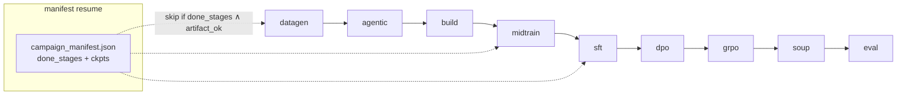
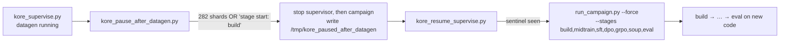

# `scripts/` - campaign orchestration & launchers

Everything needed to run KORE end-to-end: the campaign orchestrator, the portable conductor + tmux launchers, the FSDP launch helper, and smoke tests.

---

## Files

| Script | Purpose |
| --- | --- |
| `run_campaign.py` | The orchestrator: 9 default stages (plus 2 opt-in, `reverify` and `evolve`), manifest resume, retention gates, CLI |
| `run_conductor_14b.sh` | **Portable** full-14B launcher (repo-root-relative, loads `.env.local`, project venv) |
| `tmux_campaign.sh` | Run the conductor launcher in a durable detached tmux session |
| `run_full_14b.sh` | Legacy full-14B launcher with **hardcoded** dev-node paths (`/root/Kore-rl/kore`) |
| `run_e2e_14b.sh` | Bounded end-to-end validation run |
| `launch_distributed.sh` | `accelerate launch` wrapper for a single FSDP stage |
| `kore_supervise.py` | Keep the full `datagen..eval` campaign alive across transient deaths (relaunch + `--force` resume, sparse ALERTs) |
| `kore_monitor.py` | **Read-only** stage/health monitor: tails the live log, emits ALERT lines (no launching) |
| `kore_pause_after_datagen.py` | Halt the run cleanly at the **datagen→build boundary** so new code can land before the training stages |
| `kore_resume_supervise.py` | Wait for the pause sentinel, then auto-relaunch **build→eval** on the new code + supervise |
| `grpo_smoke.py`, `sft_smoke.py`, `smoke_env.py` | Tiny real runs to prove a subsystem works |
| `test_amd_gateway.py` | One-call check that the Claude gateway key works |
| `_repro_grpo_step.py` | Minimal GRPO-step reproduction harness |

---

## The campaign orchestrator



**Resume logic.** After each stage the manifest records `done_stages` and the real checkpoint path (atomic write). On restart a stage is skipped only if it is in `done_stages` **and** `_artifact_ok(stage)` finds its on-disk artifact - so a stale "done" flag with a missing checkpoint correctly re-runs. `--force --stages <s>` re-runs regardless. Datagen additionally resumes at shard level (see [`kore/data`](../kore/data/README.md)).

**Retention gates** run after midtrain/sft/dpo/grpo; a FAIL hard-stops the campaign (see [`kore/eval`](../kore/eval/README.md)).

### Key CLI flags (defaults)

| Flag | Default | Meaning |
| --- | --- | --- |
| `--model` | `Qwen/Qwen3-14B` | base model |
| `--stages` | 9 defaults | comma-list subset of `reverify,datagen,evolve,agentic,build,midtrain,sft,dpo,grpo,soup,eval`; the default omits the opt-in `reverify` and `evolve` |
| `--dry-run` | off | import-check + print plan, no GPU/side effects |
| `--force` | off | re-run requested stages ignoring the manifest |
| `--full-ft` / `--lora` | `--lora` | full-parameter FSDP vs. LoRA bring-up |
| `--teacher` | `claude` | teacher backend |
| `--data-root` | `data` | shard + manifest root |
| `--datagen-workers` | 0 (=1/GPU) | parallel datagen concurrency |
| `--dpo-rounds` | 2 | iterative on-policy DPO rounds (>1 enables DAgger) |
| `--grpo-curriculum` | on | correctness→latency two-phase GRPO |
| `--adaptive-steps` | off | plateau early-stop for GRPO |
| `--use-hf` | off | real HF retention benches + general replay |
| `--sft-total` | 20000 | SFT mix cap |
| `--split-seed` | 0 | reorders within train/held-out (split itself is fixed) |

---

## Running the full campaign (recommended path)

```bash
bash scripts/tmux_campaign.sh              # start in a durable tmux session 'kore14b'
tmux attach -t kore14b                     # watch (Ctrl-b d to detach)
tail -f runs/full/logs/campaign_*.log      # follow the log
bash scripts/tmux_campaign.sh --status     # status without attaching
```

`run_conductor_14b.sh` is portable (resolves the repo root from its own path, uses `~/kore-venv`, sources `.env.local`, prepends the venv `bin` to `PATH` so `accelerate` resolves for FSDP) and overridable via env: `KORE_STAGES`, `KORE_DATAGEN_WORKERS` (default 32), `KORE_PY`, `KORE_TMUX`. Datagen/agentic are teacher-API-bound, so they oversubscribe the 8 GPUs (~4×) for throughput; training stages use full-parameter FSDP.

> Use `run_conductor_14b.sh` everywhere. `run_full_14b.sh` hardcodes dev-node paths and will not run on conductor.

---

## Supervision, monitoring & the datagen→build pause

Four Python helpers wrap a live, multi-day campaign. They all emit sparse `ALERT ` lines (plus periodic `HEARTBEAT` lines) so a `tail -F` with notify-on-output on `"ALERT "` pings the operator only on events that matter: **stage transitions**, real **errors** (`Traceback` / `ERROR` / OOM / `CUDA|HIP error`), **retention-gate** failures/hard-stops, and completion/death. Each reaps **only `shasriva`-owned** processes - root's shared workers are never touched.

| Script | Launches? | Scope | Role |
| --- | --- | --- | --- |
| `kore_monitor.py` | no (read-only) | any live campaign | Observe + alert only |
| `kore_supervise.py` | yes | full `datagen..eval` | Keep the run alive across deaths |
| `kore_pause_after_datagen.py` | no (stops procs) | at `datagen→build` | Halt cleanly so new code can land |
| `kore_resume_supervise.py` | yes | `build..eval` | Auto-resume on the new code + supervise |

**`kore_monitor.py`** - a **read-only** watcher. It polls the newest campaign log (from `/tmp/kore_foldin_logpath.txt`, else the newest `runs/full/logs/campaign_foldin_*.log`) and the campaign pid every `KORE_MONITOR_POLL_S` (default 180s), and additionally alerts on a **429 rate-limit *storm*** (a big jump, not the odd retry). It self-terminates on `campaign complete` or a confirmed death (pid gone two consecutive polls). It never launches or kills the campaign.

**`kore_supervise.py`** - owns the **full** `datagen,build,midtrain,sft,dpo,grpo,soup,eval` lifecycle. Each attempt: reap our stale workers → (re)launch `run_campaign.py --full-ft --force …` (which resumes via `shard_done` + the manifest) → poll its log, alerting on the events above. On a non-completion exit it relaunches with bounded retries (`KORE_SUP_MAX_RETRIES`, default 12) + cooldown (`KORE_SUP_COOLDOWN_S`, default 90s); it stops on completion or exhausted retries. Writes the active log path to `/tmp/kore_foldin_logpath.txt`.

### The paradigm-v2 fold-in (pause → resume)

The new code must land **before** the build/train stages (they shell out to fresh processes that re-import the changed code), but datagen was already running. `kore_pause_after_datagen.py` + `kore_resume_supervise.py` are the paired mechanism to swap in the new code at the `datagen→build` boundary without losing datagen work:



- **`kore_pause_after_datagen.py`** polls every 30s for the boundary - trigger = **all 282 group shards** present in `data/full14b/groups/` **OR** the log shows `stage start: build`. On trigger it stops the **supervisor first** (so it can't relaunch into build), then the campaign + spawn workers, and writes the sentinel `/tmp/kore_paused_after_datagen`. Datagen shards are on disk, so nothing is lost; build is re-run fresh from the new code on resume.
- **`kore_resume_supervise.py`** waits for that sentinel, reaps stale procs, then relaunches with `--stages build,midtrain,sft,dpo,grpo,soup,eval --force` (datagen is done and skipped; `--force` re-runs **build** on the new code, which a fresh process picks up via the editable install) and supervises `build→eval` across transient deaths (same bounded-retry + ALERT machinery as `kore_supervise.py`). Writes its log path to `/tmp/kore_resume_logpath.txt`.

---

## Ephemeral-node resume playbook

Files persist under your account, and the campaign is manifest + shard resumable. If a reservation ends mid-run: re-reserve the node, then re-run `bash scripts/tmux_campaign.sh` - it continues from where it stopped.

---

## Smoke tests

```bash
PYTHONPATH=. python scripts/smoke_env.py          # GPU/env sanity
PYTHONPATH=. python scripts/test_amd_gateway.py   # teacher gateway key
PYTHONPATH=. python scripts/grpo_smoke.py --task rmsnorm_aiter   # a few real GRPO steps
bash scripts/launch_distributed.sh sft configs/sft_14b_full.json --dry-run
```

See also: [`configs/`](../configs/README.md), [`docs/DISTRIBUTED.md`](../docs/DISTRIBUTED.md).
