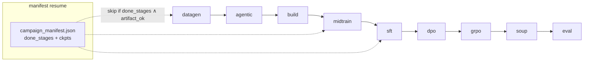

# `scripts/` - campaign orchestration & launchers

Everything needed to run KORE end-to-end: the campaign orchestrator, the portable conductor + tmux launchers, the FSDP launch helper, and smoke tests.

---

## Files

| Script | Purpose |
| --- | --- |
| `run_campaign.py` | The orchestrator - 9 stages, manifest resume, retention gates, CLI |
| `run_conductor_14b.sh` | **Portable** full-14B launcher (repo-root-relative, loads `.env.local`, project venv) |
| `tmux_campaign.sh` | Run the conductor launcher in a durable detached tmux session |
| `run_full_14b.sh` | Legacy full-14B launcher with **hardcoded** dev-node paths (`/root/Kore-rl/kore`) |
| `run_e2e_14b.sh` | Bounded end-to-end validation run |
| `launch_distributed.sh` | `accelerate launch` wrapper for a single FSDP stage |
| `grpo_smoke.py`, `sft_smoke.py`, `smoke_env.py` | Tiny real runs to prove a subsystem works |
| `test_amd_gateway.py` | One-call check that the Claude gateway key works |
| `_repro_grpo_step.py` | Minimal GRPO-step reproduction harness |

---

## The campaign orchestrator



**Resume logic.** After each stage the manifest records `done_stages` and the real checkpoint path (atomic write). On restart a stage is skipped only if it is in `done_stages` **and** `_artifact_ok(stage)` finds its on-disk artifact - so a stale "done" flag with a missing checkpoint correctly re-runs. `--force --stages <s>` re-runs regardless. Datagen additionally resumes at shard level (see [`kore/data`](../kore/data/README.md)).

**Retention gates** run after midtrain/sft/dpo/grpo; a FAIL hard-stops the campaign (see [`kore/eval`](../kore/eval/README.md)).

### Key CLI flags (defaults)

| Flag | Default | Meaning |
| --- | --- | --- |
| `--model` | `Qwen/Qwen3-14B` | base model |
| `--stages` | all | comma-list subset of `datagen,evolve,agentic,build,midtrain,sft,dpo,grpo,soup,eval` |
| `--dry-run` | off | import-check + print plan, no GPU/side effects |
| `--force` | off | re-run requested stages ignoring the manifest |
| `--full-ft` / `--lora` | `--lora` | full-parameter FSDP vs. LoRA bring-up |
| `--teacher` | `claude` | teacher backend |
| `--data-root` | `data` | shard + manifest root |
| `--datagen-workers` | 0 (=1/GPU) | parallel datagen concurrency |
| `--dpo-rounds` | 2 | iterative on-policy DPO rounds (>1 enables DAgger) |
| `--grpo-curriculum` | on | correctness→latency two-phase GRPO |
| `--adaptive-steps` | off | plateau early-stop for GRPO |
| `--use-hf` | off | real HF retention benches + general replay |
| `--sft-total` | 20000 | SFT mix cap |
| `--split-seed` | 0 | reorders within train/held-out (split itself is fixed) |

---

## Running the full campaign (recommended path)

```bash
bash scripts/tmux_campaign.sh              # start in a durable tmux session 'kore14b'
tmux attach -t kore14b                     # watch (Ctrl-b d to detach)
tail -f runs/full/logs/campaign_*.log      # follow the log
bash scripts/tmux_campaign.sh --status     # status without attaching
```

`run_conductor_14b.sh` is portable (resolves the repo root from its own path, uses `~/kore-venv`, sources `.env.local`, prepends the venv `bin` to `PATH` so `accelerate` resolves for FSDP) and overridable via env: `KORE_STAGES`, `KORE_DATAGEN_WORKERS` (default 32), `KORE_PY`, `KORE_TMUX`. Datagen/agentic are teacher-API-bound, so they oversubscribe the 8 GPUs (~4×) for throughput; training stages use full-parameter FSDP.

> Use `run_conductor_14b.sh` everywhere. `run_full_14b.sh` hardcodes dev-node paths and will not run on conductor.

---

## Ephemeral-node resume playbook

Files persist under your account, and the campaign is manifest + shard resumable. If a reservation ends mid-run: re-reserve the node, then re-run `bash scripts/tmux_campaign.sh` - it continues from where it stopped.

---

## Smoke tests

```bash
PYTHONPATH=. python scripts/smoke_env.py          # GPU/env sanity
PYTHONPATH=. python scripts/test_amd_gateway.py   # teacher gateway key
PYTHONPATH=. python scripts/grpo_smoke.py --task rmsnorm_aiter   # a few real GRPO steps
bash scripts/launch_distributed.sh sft configs/sft_14b_full.json --dry-run
```

See also: [`configs/`](../configs/README.md), [`docs/DISTRIBUTED.md`](../docs/DISTRIBUTED.md).
