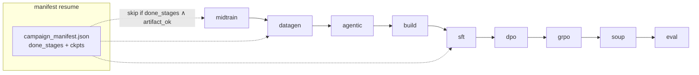
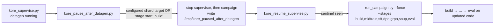

# `scripts/` — campaign orchestration and launchers

Everything needed to run KORE end to end: the campaign orchestrator, the portable conductor and tmux launchers, the FSDP launch helper, the supervision and monitoring tools, and the smoke / proof harnesses.

---

## Files

### Orchestration and launch

| Script | Purpose |
| --- | --- |
| `run_campaign.py` | The orchestrator: 9 default stages (plus 2 opt-in, `reverify` and `evolve`), manifest resume, retention gates, and the full CLI |
| `launch_distributed.sh` | `accelerate launch` wrapper for a single FSDP stage (`midtrain` / `sft` / `dpo` / `grpo`); selects `accelerate_fsdp_grpo.yaml` for GRPO and `accelerate_fsdp.yaml` otherwise |
| `run_conductor_14b.sh` | Portable full-14B launcher — resolves the repo root from its own path, uses the project venv, and loads `.env.local` |
| `tmux_campaign.sh` | Run the conductor launcher in a durable detached tmux session (`kore14b`) |
| `run_e2e_14b.sh` | Bounded end-to-end validation run over a representative task set |
| `run_full_14b.sh` | Full-14B launcher with hardcoded dev-node paths (`/root/Kore-rl/kore`); not portable — use `run_conductor_14b.sh` |
| `run_v2_reuse_14b.sh` | Rerun that reuses existing verified kernels instead of regenerating: `reverify` (re-measure, no teacher) → `datagen` (coverage holes only) → `build` → `midtrain … eval`, pinned to specific GPUs |
| `run_grpo_resilient.sh` | GRPO launcher for a heavily shared node: selects the GPUs free right now and retries across transient VRAM spikes from other users' jobs |

### Supervision and monitoring

| Script | Purpose |
| --- | --- |
| `kore_monitor.py` | Read-only stage/health monitor: tails the live log and emits `ALERT` lines (never launches) |
| `kore_supervise.py` | Keep a `run_campaign.py --full-ft` invocation alive across transient deaths (relaunch, resume via the manifest, sparse `ALERT`s) |
| `kore_pause_after_datagen.py` | Halt the run cleanly at the `datagen → build` boundary so updated code can land before the training stages |
| `kore_resume_supervise.py` | Wait for the pause sentinel, then relaunch `build → eval` on the updated code and supervise |

### Shared-node SFT gate

| Script | Purpose |
| --- | --- |
| `run_sft_gate.py` | Standalone SFT retention gate — score the base model vs. the finished SFT checkpoint and apply the gate, with no (re)training; on PASS, mark `sft` done in the manifest |
| `run_sft_gate_dynamic.sh` | Co-tenant-safe wrapper that runs `run_sft_gate.py` on currently-idle GPUs and resumes via the per-benchmark score cache |
| `sft_finish_dynamic.sh` | Finish the campaign's `build,sft` stages on the idle GPUs of a shared node, masking to those GPUs and resuming on any death |
| `gpu_pick_hip.py` | Pick idle GPUs and report them as HIP/torch indices (rocm-smi physical order and HIP index order differ on this node) |

### Smokes and proofs

| Script | Purpose |
| --- | --- |
| `smoke_env.py` | Run every registered task's seed kernel through `KoreEnv.step` and print the verified observation + reward |
| `grpo_smoke.py` | A few real GRPO steps on one task to exercise rollout → verified reward → policy gradient |
| `sft_smoke.py` | Tiny real SFT (LoRA) run to prove the training path end to end |
| `test_amd_gateway.py` | One-call check that the Claude gateway key works |
| `_repro_grpo_step.py` | Isolated multi-process reproduction of a distributed GRPO training step (ragged per-rank samples under FSDP `SHARD_GRAD_OP`) |
| `_maxed_smoke.py` | Reduced GRPO run on one GPU that forces the search / mint / transform-discovery paths to execute |
| `eval_bakeoff_multi.py` | Matched-budget bake-off across the ladder (seed → base → midtrain → SFT → DPO, optionally vs. Opus): `fast_p`, correctness rate, geomean speedup |
| `prove_dense_reward.py` | Exercise the dense hardware-counter reward path (`env.collect_counters → roofline_dense_score`) on a real compute-bound kernel via rocprofv3 |
| `prove_new_ops.py` | GPU-prove a batch of new task seeds: compile + rigorous correctness + beat baseline; exits non-zero on any failure (a gate before registering new tasks) |
| `verify_breadth.py` | On-GPU verification for the `genb_*` breadth tasks: the seed compiles and is correct, and the baseline runs |
| `_validate_benchboth.py` | A/B check that the batched timing path (`--bench-both`) reproduces the per-impl timing's speedup distribution within run-to-run variance |

---

## The campaign orchestrator



`DEFAULT_STAGES` (9 stages, run in this order when `--stages` is omitted) is `midtrain, datagen, agentic, build, sft, dpo, grpo, soup, eval`. Midtrain runs first because continued pretraining trains on a general Triton/HIP corpus rather than the task-specific datagen output, so it has no dependency on `datagen` / `agentic` / `build`. An explicit `--stages` list is executed in the order you give it — e.g. `--stages midtrain,build,sft,dpo,grpo,soup,eval` skips `datagen` / `agentic` to reuse data generated in a prior run. The full ordered set (`ALL_STAGES`) also includes the two opt-in stages: `reverify, datagen, evolve, agentic, build, midtrain, sft, dpo, grpo, soup, eval`.

**Resume logic.** After each stage the manifest records `done_stages` and the real checkpoint path (atomic write). On restart a stage is skipped only if it is in `done_stages` **and** `_artifact_ok(stage)` finds its on-disk artifact, so a stale "done" flag with a missing checkpoint re-runs correctly. `--force --stages <s>` re-runs regardless. Datagen additionally resumes at shard level (see [`kore/data`](../kore/data/README.md)).

**Retention gates** run after `midtrain` / `sft` / `dpo` / `grpo`; a failure hard-stops the campaign (see [`kore/eval`](../kore/eval/README.md)).

**Full-FT dispatch.** Under `--full-ft`, each of `midtrain` / `sft` / `dpo` / `grpo` is rendered into a resolved JSON and shelled out to `scripts/launch_distributed.sh <stage> <resolved.json>` (`accelerate launch`); see [`configs/README.md`](../configs/README.md) for how the resolved config is built (`_launch_distributed`) and where it is written under `<data_root>/launch/`.

### Key CLI flags (defaults)

| Flag | Default | Meaning |
| --- | --- | --- |
| `--model` | `Qwen/Qwen3-14B` | base model |
| `--stages` | 9 defaults | comma-list subset of `reverify,datagen,evolve,agentic,build,midtrain,sft,dpo,grpo,soup,eval`; the default omits the opt-in `reverify` and `evolve` |
| `--dry-run` | off | import-check + print plan, no GPU / side effects |
| `--force` | off | re-run requested stages ignoring the manifest |
| `--full-ft` / `--lora` | `--lora` | full-parameter FSDP vs. LoRA bring-up |
| `--teacher` | `claude` | teacher backend |
| `--data-root` | `data` | shard + manifest root |
| `--datagen-workers` | `0` (=1/GPU) | parallel datagen concurrency |
| `--dpo-rounds` | `2` | iterative on-policy DPO rounds (>1 enables DAgger) |
| `--grpo-curriculum` | on | correctness → latency two-phase GRPO |
| `--adaptive-steps` | off | plateau early-stop for GRPO |
| `--use-hf` | off | real HF retention benches + general replay |
| `--sft-total` | `20000` | SFT mix cap |
| `--split-seed` | `0` | reorders within train / held-out (the split itself is fixed) |
| `--gpu-ids` | `""` (auto-free) | pin all GPU work to specific physical GPU ids on a shared node |
| `--profile-reward` | `0.0` | hardware-counter dense reward weight (≈`0.15` to enable) |
| `--evolve` | off | splice the evolutionary datagen stage in after `datagen` |

---

## Running the full campaign (recommended path)

```bash
bash scripts/tmux_campaign.sh              # start in a durable tmux session 'kore14b'
tmux attach -t kore14b                     # watch (Ctrl-b d to detach)
tail -f runs/full/logs/campaign_*.log      # follow the log
bash scripts/tmux_campaign.sh --status     # status without attaching
```

`run_conductor_14b.sh` is portable (resolves the repo root from its own path, uses `~/kore-venv`, sources `.env.local`, and prepends the venv `bin` to `PATH` so `accelerate` resolves for FSDP) and overridable via env: `KORE_STAGES`, `KORE_DATAGEN_WORKERS` (default 64), `KORE_PY`, `KORE_TMUX`. Datagen and agentic are teacher-API-bound, so they oversubscribe the 8 GPUs (8 workers per GPU by default) for throughput; the training stages use full-parameter FSDP.

> Use `run_conductor_14b.sh` everywhere. `run_full_14b.sh` hardcodes dev-node paths and will not run on the conductor node.

---

## Supervision, monitoring, and the datagen → build pause

Four Python helpers wrap a live, multi-day campaign. They emit sparse `ALERT ` lines (plus periodic `HEARTBEAT` lines), so a `tail -F` with notify-on-output on `"ALERT "` pings the operator only on events that matter: stage transitions, real errors (`Traceback` / `ERROR` / OOM / `CUDA|HIP error`), retention-gate failures and hard-stops, and completion or death. Each reaps **only `shasriva`-owned** processes; shared root-owned workers are never touched.

| Script | Launches? | Scope | Role |
| --- | --- | --- | --- |
| `kore_monitor.py` | no (read-only) | any live campaign | Observe + alert only |
| `kore_supervise.py` | yes | `build..eval` by default (`KORE_SUP_STAGES` extends it, e.g. to `midtrain,datagen,...`) | Keep the run alive across deaths |
| `kore_pause_after_datagen.py` | no (stops procs) | at `datagen → build` | Halt cleanly so updated code can land |
| `kore_resume_supervise.py` | yes | `build..eval` | Resume on the updated code + supervise |

**`kore_monitor.py`** — a read-only watcher. It polls the newest campaign log (from `/tmp/kore_foldin_logpath.txt`, else the newest `runs/full/logs/campaign_foldin_*.log`) and the campaign pid every `KORE_MONITOR_POLL_S` (default 180s), and additionally alerts on a 429 rate-limit storm (a large jump, not the occasional retry). It self-terminates on `campaign complete` or a confirmed death, and never launches or kills the campaign.

**`kore_supervise.py`** — keeps a `run_campaign.py --full-ft` invocation alive across transient deaths. Its default `--stages` is `build,sft,dpo,grpo,soup,eval` (override via `KORE_SUP_STAGES`, e.g. to prepend `midtrain` and/or `datagen`); resume relies on the manifest + `shard_done`, so `--force` is appended only when `KORE_SUP_FORCE=1` (default off, so a relaunch resumes rather than re-running completed stages). Each attempt reaps our stale workers, (re)launches `run_campaign.py --full-ft --use-hf --teacher claude --adaptive-steps [--force] …`, and polls the log for the events above. On a non-completion exit it relaunches with bounded retries (`KORE_SUP_MAX_RETRIES`, default 12) and cooldown (`KORE_SUP_COOLDOWN_S`, default 90s), stopping on completion or exhausted retries. It writes the active log path to `/tmp/kore_foldin_logpath.txt`, defaults `KORE_DATAGEN_WORKERS` to 64, and hard-sets `KORE_VERIFIED_CORRECTNESS` / `KORE_COMPILE_BASELINE` / `KORE_SHAPE_AUGMENT` / `KORE_BENCH_COLD=1` (via `setdefault`, so an explicit env still wins) so every training subprocess inherits the verification gates.

### Swapping in updated code at the datagen → build boundary

Code changes must land **before** the build and training stages, which shell out to fresh processes that re-import the package. `kore_pause_after_datagen.py` and `kore_resume_supervise.py` pause the run at the `datagen → build` boundary and resume it on the updated code without losing datagen work:



- **`kore_pause_after_datagen.py`** polls every 30s for the boundary — trigger = its configured `TARGET_GROUPS` group shards present in `data/full14b/groups/` **or** the log shows `stage start: build`. Compare that configuration with the live registry using `python -c "from kore.tasks.registry import train_tasks; print(len(train_tasks()))"` before a campaign. On trigger it stops the supervisor first (so it cannot relaunch into build), then the campaign and its datagen workers, and writes the sentinel `/tmp/kore_paused_after_datagen`. Datagen shards are on disk, so nothing is lost; build re-runs fresh on resume.
- **`kore_resume_supervise.py`** waits for that sentinel, reaps stale processes, then relaunches with `--stages build,midtrain,sft,dpo,grpo,soup,eval --force` (datagen is done and skipped; `--force` re-runs `build` on the updated code, which a fresh process picks up via the editable install) and supervises `build → eval` with the same bounded-retry and `ALERT` machinery as `kore_supervise.py`. It writes its log path to `/tmp/kore_resume_logpath.txt`.

---

## Shared-node SFT gate

On a shared node the campaign's `sft` stage couples (re)training with the retention gate. To gate an already-finished SFT checkpoint without re-training, `run_sft_gate.py` scores the base model against the checkpoint on the retention suite (`mmlu`, `humaneval`, `ifeval`, `bfcl`, `livecodebench`; `mtbench` is advisory), applies the gate, and on PASS marks `sft` done in the manifest so a later resume proceeds straight to DPO. `run_sft_gate_dynamic.sh` wraps it to run on currently-idle GPUs and resume via the per-benchmark score cache; `gpu_pick_hip.py` maps idle physical GPUs to the HIP indices `HIP_VISIBLE_DEVICES` expects (the two orders differ on this node).

---

## Ephemeral-node resume playbook

Files persist under your account, and the campaign is manifest- and shard-resumable. If a reservation ends mid-run, re-reserve the node and re-run `bash scripts/tmux_campaign.sh` — it continues from where it stopped.

---

## Smoke and proof harnesses

```bash
PYTHONPATH=. python scripts/smoke_env.py                          # GPU/env sanity
PYTHONPATH=. python scripts/test_amd_gateway.py                   # teacher gateway key
PYTHONPATH=. python scripts/grpo_smoke.py --task rmsnorm_aiter    # a few real GRPO steps
bash scripts/launch_distributed.sh sft configs/sft_14b_full.json --dry-run
```

See also: [`configs/`](../configs/README.md), [`docs/DISTRIBUTED.md`](../docs/DISTRIBUTED.md).
